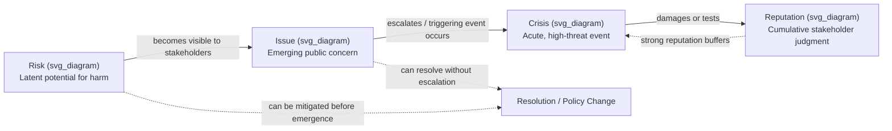

## Defining Crisis, Issue, Risk, and Reputation

### Overview

Crisis and reputation management rests on four distinct but interlocking constructs: **risk**, **issue**, **crisis**, and **reputation**. Practitioners and scholars frequently conflate these terms, but precise definitions matter operationally — they determine which team responds, what playbook activates, and what success looks like. This section establishes working definitions, boundary conditions, and the transitions between states.

### Risk

**Definition**

Risk is the potential for a future event or condition to cause harm to an organization's objectives, assets, operations, or stakeholders. Risk is prospective, probabilistic, and typically quantifiable to some degree (likelihood × impact).

**Key Points**

- Risk exists prior to any manifestation — it is latent and ongoing
- Risk management is primarily a preventive/anticipatory discipline (risk registers, heat maps, control frameworks like COSO ERM or ISO 31000)
- Risks can be categorized: operational, financial, strategic, compliance/legal, reputational, technological, environmental
- Reputational risk is a distinct subcategory: the risk that stakeholder perception will deteriorate as a *consequence* of another risk materializing (e.g., a data breach is an operational/security risk whose *reputational risk* is the possible loss of stakeholder trust)

**Example**

A pharmaceutical company manufacturing injectable drugs carries a standing risk of contamination during production. This risk exists every day regardless of whether contamination has ever occurred — it is documented in the company's risk register with an assigned likelihood and severity rating.

### Issue

**Definition**

An issue is a matter of public concern or organizational significance that has emerged into stakeholder or public awareness but has not (yet) escalated into an acute, high-intensity disruption. Issues are typically slower-moving, more visible than risks, and open to management through dialogue, policy adjustment, or proactive communication.

**Key Points**

- Issues are risks (or emerging conditions) that have become *visible* or *salient* to stakeholders
- Issue management (per Chase's original 1970s formulation and later Coombs/Heath frameworks) is anticipatory but reactive to early signals — it operates in the "gap" between latent risk and acute crisis
- Issues can persist for months or years without becoming a crisis if managed adequately (e.g., ongoing debates about a company's labor practices)
- Issues can also resolve, fade, or be absorbed into policy without any acute event ever occurring
- Issue Life Cycle stages commonly cited: origin/emergence → mediation/amplification → organization/crystallization (positions harden, coalitions form) → resolution

**Example**

Public concern about a fast-food chain's use of a specific food additive, circulating in advocacy reports and media coverage over an extended period, constitutes an issue. No acute event has occurred, but the company faces sustained scrutiny and reputational exposure if it does not respond.

### Crisis

**Definition**

A crisis is a specific, unexpected (or under-anticipated), non-routine event or sequence of events that creates high uncertainty, threatens high-priority goals, and demands urgent response, typically within a compressed timeframe. Crises represent the point at which risk or an unmanaged issue converts into acute organizational threat.

**Key Points**

- Three defining attributes (per Hermann, 1963, and widely adopted in crisis communication literature): **threat** to high-priority values/goals, **surprise/limited warning**, and **short decision time**
- Crises are discrete events (or tightly bounded event clusters) with identifiable onset, as opposed to issues, which are ongoing conditions
- Coombs' Situational Crisis Communication Theory (SCCT) classifies crises by attributed responsibility: victim cluster (low responsibility, e.g., natural disaster, rumor, workplace violence), accidental cluster (minimal responsibility, e.g., technical error), preventable cluster (high responsibility, e.g., human error misconduct, organizational misdeeds)
- Crises typically unfold in phases: pre-crisis (warning signals) → crisis event (acute phase) → post-crisis (recovery, learning, reputational repair)
- Not every issue becomes a crisis, but nearly every crisis has an issue or risk precursor that was inadequately mitigated

**Example**

A sudden explosion at a manufacturing plant that injures employees and halts production is a crisis: it is discrete, high-threat, low-warning, and demands an immediate, coordinated response (safety, legal, media, regulatory) within hours, not months.

### Reputation

**Definition**

Reputation is the aggregate perceptual judgment that stakeholders (customers, investors, employees, regulators, media, the public) hold about an organization's character, competence, and trustworthiness, formed over time through direct experience, communicated information, and social/media narratives.

**Key Points**

- Reputation is a *stock*, not a *flow* — it accumulates slowly through repeated behavior and communication, but can be depleted rapidly during a crisis (asymmetry: reputation is "hard to build, easy to lose")
- Reputation is stakeholder-specific: an organization may hold different reputations simultaneously among investors, customers, and regulators
- Common academic reputation dimensions (Fombrun's RepTrak model): products/services, innovation, workplace, governance, citizenship, leadership, financial performance
- Reputation functions as an economic and social asset: strong reputations are associated with customer loyalty, talent attraction, regulatory goodwill, and a "reservoir of goodwill" that can buffer the impact of a crisis
- Reputation is *not* the same as identity (how the organization defines itself) or image (a stakeholder's snapshot impression at one point in time) — reputation is the durable, cumulative judgment

**Example**

An airline with a decades-long record of safety and reliability enjoys a reputational reservoir. When a single flight delay occurs, stakeholders are less likely to interpret it as evidence of systemic failure, precisely because the accumulated reputation buffers the isolated incident.

### The Relationship Between the Four Constructs

The four constructs form a causal and temporal chain, though the chain is not strictly linear or unidirectional.

**Key Points on the Relationship**

- The chain can be interrupted at any stage through effective management: a risk can be mitigated before it becomes an issue; an issue can be resolved before it becomes a crisis
- Reputation acts bidirectionally: it is both an *outcome* (damaged by crises) and an *input* (a strong prior reputation shapes how stakeholders attribute responsibility and interpret a crisis, per SCCT's "reputational history" modifier)
- Not all crises originate from issues — some are exogenous shocks (natural disasters, third-party sabotage) with no prior issue phase
- [Inference] Organizations with mature issue management functions are likely to experience fewer issues escalating into full crises, though the causal strength of this relationship is difficult to isolate empirically from confounding factors such as industry volatility and organizational size

### Comparative Summary Table

| Construct | Temporal Nature | Visibility | Primary Management Discipline | Time Pressure |
| --- | --- | --- | --- | --- |
| Risk | Prospective, ongoing | Usually internal/latent | Risk management (ERM) | Low |
| Issue | Ongoing, emergent | Public/stakeholder-visible | Issue management, public affairs | Moderate |
| Crisis | Acute, event-bound | Highly public | Crisis management/communication | High/urgent |
| Reputation | Cumulative, enduring | Perceptual (varies by stakeholder) | Reputation management, corporate communication | Long-term |

### Common Misconceptions

- **"Every issue is a crisis in waiting."** Not necessarily — most issues are resolved or fade without escalating. Treating every issue as a pre-crisis can lead to alarm fatigue and misallocated resources.
- **"Reputation and brand are the same thing."** Brand is typically a marketing-controlled construct (promise, positioning); reputation is broader and shaped by all stakeholder experiences, including non-customers (employees, regulators, communities).
- **"A crisis always damages reputation."** [Inference] The direction and magnitude of reputational impact depends heavily on attributed responsibility, response quality, and pre-crisis reputation — a well-handled crisis can, in some documented cases, leave reputation neutral or even enhanced (the phenomenon sometimes labeled "renewal" in Ulmer, Sellnow, and Seeger's discourse of renewal framework).

### Related Topics

- Hermann's Crisis Typology and the Three Defining Attributes
- Coombs' Situational Crisis Communication Theory (SCCT) and Crisis Clusters
- Issue Life Cycle Models (Chase, Crable & Vibbert)
- Fombrun's RepTrak Reputation Dimensions
- Risk Registers and Enterprise Risk Management (ISO 31000, COSO ERM)
- The Discourse of Renewal Framework (Ulmer, Sellnow, Seeger)
- Stakeholder Theory and Reputation as a Multi-Audience Construct