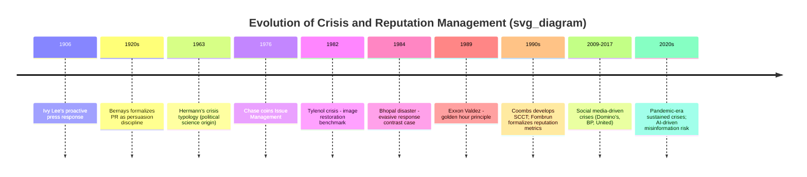

## Historical Evolution of the Discipline

### Overview

Crisis and reputation management as a formal discipline developed through distinct phases, each shaped by landmark incidents, evolving media technology, and shifts in academic theory. This section traces its evolution from early public relations practice through contemporary digital-era frameworks.

### Pre-Disciplinary Roots (Early 20th Century – 1950s)

**Key Points**

- Public relations as an organized practice emerged with figures like Ivy Lee, often cited for his response to the 1906 Atlantic City railroad accident, where he issued a proactive press statement rather than concealing information — an early precedent for transparency-based crisis response
- Edward Bernays formalized PR as a discipline grounded in social psychology and persuasion (1920s), though his focus was primarily promotional rather than crisis-specific
- Corporate communication in this era was largely one-directional (press-agentry and public-information models, per Grunig & Hunt's later four-models typology) with little theoretical framework for acute reputational threats
- No formal "crisis management" vocabulary existed yet; incidents were handled ad hoc by legal counsel or executive leadership

### Emergence of Issue Management (1960s–1970s)

**Key Points**

- W. Howard Chase coined the term "issue management" in 1976, formalizing the idea that organizations should proactively monitor and address emerging public issues before they escalate
- This period coincided with growing corporate accountability pressures: consumer advocacy (Ralph Nader), environmental movements, and civil rights-era scrutiny of institutional conduct
- Herbert Simon's and later crisis-decision theorists' work on bounded rationality and decision-making under uncertainty (originating in political/military crisis studies, e.g., the Cuban Missile Crisis) began influencing organizational crisis theory
- Charles Hermann's 1963 typology (threat, surprise, short response time) originated in international relations/political science but was later imported into organizational communication

### Formalization Through Landmark Corporate Crises (1980s)

This decade is widely regarded as the discipline's formative period, driven by several highly visible corporate crises that became recurring case studies.

**Key Points**

- **Johnson & Johnson's Tylenol crisis (1982)**: seven deaths from cyanide-laced capsules; J&J's rapid nationwide product recall, cooperation with media and the FDA, and introduction of tamper-evident packaging became the canonical example of "doing the right thing" as effective crisis response, heavily cited in nearly all subsequent crisis communication literature
- **Bhopal gas disaster (1984, Union Carbide)**: contrasted sharply with Tylenol as a case of perceived corporate evasiveness and slow, defensive communication, reinforcing the link between attributed responsibility and reputational consequence
- **Exxon Valdez oil spill (1989)**: widely cited as a case of delayed executive response and poor stakeholder communication, contributing to the codification of "golden hour" response-speed principles
- Academic crisis communication theory began to formalize during this decade: William Benoit's Image Restoration Theory (later Image Repair Theory) was developed, outlining strategies such as denial, evasion of responsibility, reducing offensiveness, corrective action, and mortification

### Theoretical Consolidation (1990s)

**Key Points**

- Timothy Coombs began developing Situational Crisis Communication Theory (SCCT) in this period, building on attribution theory (Weiner) to link crisis type, attributed responsibility, and recommended response strategy
- Crisis management became integrated into broader corporate risk and business continuity frameworks; crisis management plans (CMPs) and dark sites (pre-built crisis web pages) became standard practice recommendations
- Reputation was formally theorized as a measurable construct: Charles Fombrun's work culminated in the founding of the Reputation Institute (1997) and the development of reputation quotient/RepTrak-style measurement models
- The "stakeholder" concept (Freeman, 1984) became foundational, shifting crisis communication away from a narrow media-relations focus toward a multi-audience model (employees, regulators, investors, communities)

### The Digital and Social Media Era (2000s–2010s)

**Key Points**

- The 24-hour news cycle (accelerated by cable news) and later social media (Twitter/X, Facebook, YouTube) compressed crisis response windows from days to minutes/hours, invalidating older assumptions about available deliberation time
- Notable case studies from this era: Domino's Pizza YouTube video crisis (2009), BP Deepwater Horizon oil spill (2010, widely cited for tone-deaf executive statements amplified via social media), United Airlines passenger removal incident (2017, viral video-driven reputational damage)
- SCCT was refined (Coombs, multiple revisions through the 2000s–2010s) to account for crisis history and prior reputation as modifying variables, and to address "paracrisis" — public challenges that risk escalating into full crises via social media amplification
- The concept of "stealing thunder" (Arpan & Roskos-Ewoldsen; Claeys & Cauberghe) — an organization self-disclosing negative information before external sources do — was empirically validated as reducing reputational damage
- Social media monitoring, sentiment analysis tools, and real-time listening became integrated into crisis management operations as standard infrastructure

### Contemporary Developments (2020s–Present)

**Key Points**

- The COVID-19 pandemic (2020–2023) generated a large body of applied crisis communication research on sustained, long-duration crises (as opposed to the traditional discrete-event model), prompting reconsideration of crisis lifecycle models for prolonged, ambiguous-onset events
- Misinformation and disinformation management became a distinct crisis communication subdomain, particularly regarding coordinated inauthentic behavior and deepfakes
- Generative AI introduced both new crisis vectors (AI-generated deepfakes and synthetic misinformation targeting organizations or executives) and new response tools (AI-assisted monitoring, sentiment analysis, and drafting of holding statements)
- [Inference] The increasing speed and scale of AI-generated content is likely to further compress crisis response timelines and complicate source verification, though the discipline's formal theoretical response to this shift is still emerging and not yet as codified as SCCT or Image Repair Theory
- ESG (Environmental, Social, Governance) scrutiny has expanded reputational risk surfaces beyond traditional product/safety incidents into governance, labor, and climate-related disclosures

### Timeline Summary

### Key Theoretical Contributions by Era

| Era | Theorist/Contributor | Contribution |
| --- | --- | --- |
| 1900s–1920s | Ivy Lee, Edward Bernays | Foundational PR practice and persuasion theory |
| 1960s | Charles Hermann | Crisis typology (threat, surprise, time pressure) |
| 1970s | W. Howard Chase | Issue management framework |
| 1980s | William Benoit | Image Restoration/Repair Theory |
| 1990s | Timothy Coombs | Situational Crisis Communication Theory (SCCT) |
| 1990s | Charles Fombrun | Reputation measurement (RepTrak) |
| 2000s–2010s | Coombs, Arpan, Roskos-Ewoldsen | SCCT refinement, stealing thunder, paracrisis |
| 2010s–2020s | Multiple (applied/industry) | Social listening infrastructure, ESG-linked reputational risk |

### Next Steps

- Image Restoration Theory vs. Image Repair Theory: Terminological and Conceptual Differences
- Situational Crisis Communication Theory (SCCT) — Full Framework and Response Matrix
- Case Study Deep Dive: Tylenol (1982) as the Discipline's Founding Case
- Case Study Deep Dive: BP Deepwater Horizon and Social Media Amplification
- The Paracrisis Concept and Social Media Escalation Dynamics
- ESG and the Expansion of Reputational Risk Surfaces
- AI-Generated Misinformation as an Emerging Crisis Vector