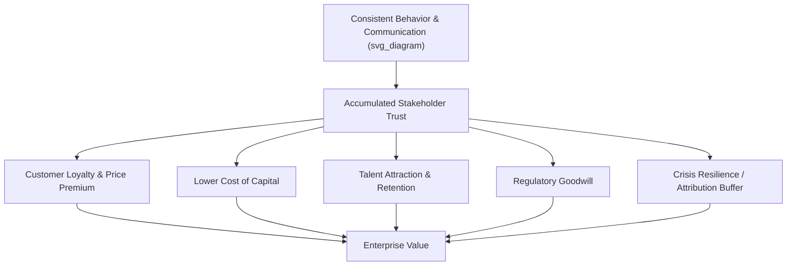

## Reputation as a Strategic and Financial Asset

### Overview

Reputation is increasingly treated not merely as a communications outcome but as a quantifiable strategic asset that affects enterprise value, cost of capital, customer behavior, and competitive positioning. This section examines the theoretical basis for treating reputation as an asset, the mechanisms through which it creates financial value, measurement approaches, and its treatment in risk and accounting frameworks.

### Conceptual Basis: Reputation as an Intangible Asset

**Key Points**

- Reputation meets several criteria commonly used to define an economic asset: it is a resource controlled (to a degree) by the organization, it arises from past events (accumulated behavior and communication), and it is expected to yield future economic benefit (customer loyalty, pricing power, investor confidence)
- Unlike physical or even most intangible assets (patents, trademarks), reputation is **not directly owned or controlled** by the organization — it exists in the minds of stakeholders and is therefore co-created, making it a "relational asset"
- Reputation is generally *not* recognized as a separate line item on financial statements under standard accounting frameworks (IFRS, US GAAP); it is instead subsumed within **goodwill** during acquisition accounting, where it is bundled with other unidentifiable intangibles
- [Inference] Because reputation cannot be separately identified and reliably measured under most accounting standards, its financial value is typically inferred indirectly (e.g., via event studies, brand valuation multiples, or goodwill impairment analysis) rather than reported directly

### Mechanisms of Value Creation

Reputation generates financial value through several distinct causal pathways, each supported by a body of empirical and theoretical work.

**Key Points**

- **Customer-side effects**: Strong reputations are associated with price premiums, higher customer retention, and reduced customer acquisition costs, because reputation functions as a quality/trust signal that reduces perceived purchase risk (rooted in signaling theory, Spence 1973)
- **Investor/capital-market effects**: Firms with stronger reputations have been associated in academic studies with lower perceived risk, which can translate into a lower cost of equity and debt capital, as investors demand a smaller risk premium
- **Talent effects**: Reputation influences an organization's ability to attract and retain employees, affecting recruitment costs and workforce quality (employer branding research)
- **Regulatory/goodwill effects**: Organizations with strong reputational reservoirs often receive more favorable treatment or benefit of the doubt from regulators and communities during ambiguous situations — sometimes termed a "reputational buffer" or "insurance effect"
- **Crisis resilience effect**: Per Coombs' SCCT and related work, prior reputation acts as a modifying variable that shapes stakeholder attribution of responsibility during a crisis, meaning firms with stronger pre-crisis reputations tend to experience comparatively less severe reputational and stock-price damage from a given crisis event, all else equal

### Reputation and Market Value: The Case for Financial Materiality

**Key Points**

- Event-study methodology is the dominant empirical technique for isolating reputational impact: researchers measure abnormal stock returns around the announcement of a reputation-relevant event (crisis, award, scandal, ranking change), controlling for market-wide movements
- Studies following major crises (e.g., product recalls, the Volkswagen emissions scandal, data breach announcements) have generally found statistically significant negative abnormal stock returns concentrated around the announcement window, consistent with the market pricing in reputational damage as a proxy for expected future cash flow impact
- [Unverified] Commonly cited claims that "reputation accounts for X% of market capitalization" (frequently attributed to various consulting studies) vary substantially in methodology and are not derived from a single agreed-upon standard; such figures should be treated as illustrative estimates rather than precise measurements
- Brand valuation firms (Interbrand, Brand Finance, Kantar BrandZ) publish annual brand value rankings using proprietary methodologies that combine financial analysis (royalty relief method, economic use method) with reputation/brand-strength scoring, though brand and reputation are conceptually distinct (brand is more marketing-controlled; reputation is broader stakeholder judgment)

### Measurement Frameworks

**Key Points**

- **RepTrak (Reputation Institute/RepTrak Company)**: Measures reputation across seven dimensions — products/services, innovation, workplace, governance, citizenship, leadership, performance — aggregated into a "Pulse" score reflecting overall trust, esteem, admiration, and good feeling
- **Fortune's "Most Admired Companies"**: Survey-based ranking using peer executive assessments across attributes like innovation, people management, and financial soundness
- **Axios Harris Poll Reputation Quotient**: Survey-based measure tracking public perception across multiple attributes, often segmented by demographic and political affiliation
- **Media sentiment/share-of-voice analytics**: Increasingly used as a real-time proxy for reputation trajectory, tracking volume and tone of earned media and social mentions
- **Employee Net Promoter Score / Glassdoor ratings**: Used as a proxy for internal reputation (employer brand), which correlates with recruitment and retention outcomes
- Limitations common to all measurement approaches: survey-based methods are subject to social desirability bias and limited respondent samples; sentiment analysis tools face challenges with sarcasm, context, and multi-language nuance; no single metric captures reputation across all stakeholder groups simultaneously

### Reputation in Risk Management Frameworks

**Key Points**

- Enterprise Risk Management standards (ISO 31000, COSO ERM) explicitly recognize reputational risk as a risk category to be identified, assessed, and mitigated alongside financial, operational, and strategic risks
- Reputational risk is often treated as a **consequence category** rather than a standalone risk source — i.e., a cyber breach, product defect, or governance failure is the risk *event*, while reputational damage is one of several potential *impacts*
- Board-level oversight of reputational risk has increased, with many corporate governance codes and institutional investor frameworks (e.g., proxy advisory firm guidelines) expecting boards to demonstrate reputational risk oversight, particularly regarding ESG-linked exposures
- Reputational risk insurance products exist in the market (crisis management and reputational damage riders within broader D&O or crisis PR expense coverage), though comprehensive standalone "reputation insurance" remains a developing and relatively niche product category

### Illustrative Value Chain

### Example

Two airlines experience an identical mechanical failure incident with comparable safety outcomes. Airline A has a decades-long reputation for safety, transparency, and operational reliability; Airline B has a history of unresolved customer complaints and prior safety citations. Empirically-grounded crisis communication theory (SCCT's reputational history modifier) predicts that Airline A is likely to experience a comparatively smaller reputational and stock-price impact than Airline B, holding the severity of the incident itself constant, because stakeholders attribute the event differently based on prior reputational context.

### Common Misconceptions

- **"Reputation value can be precisely calculated like a physical asset."** Reputation value is inferred through proxies (event studies, survey scores, goodwill) rather than directly measured; treat specific dollar-value claims with appropriate skepticism regarding methodology.
- **"Reputation and brand value are interchangeable."** Brand valuation methodologies (royalty relief, etc.) focus on marketing-controlled equity tied to products/trademarks; reputation is a broader, multi-stakeholder construct that includes governance, workplace, and citizenship dimensions not captured in brand valuation.
- **"A high reputation score guarantees crisis immunity."** Reputation functions as a *buffer* that shapes attribution and severity of impact, not a guarantee against reputational damage — severe or highly preventable crises can erode even strong reputational reservoirs.

### Related Topics

- Goodwill Impairment and Intangible Asset Accounting (IFRS 3 / ASC 350)
- Event Study Methodology for Measuring Reputational Impact
- RepTrak and Comparative Reputation Measurement Frameworks
- Signaling Theory and Its Application to Corporate Reputation
- ESG Integration into Reputational Risk Frameworks
- Reputational Risk Insurance and Crisis Expense Coverage Products
- The Reputational History Modifier in Situational Crisis Communication Theory (SCCT)