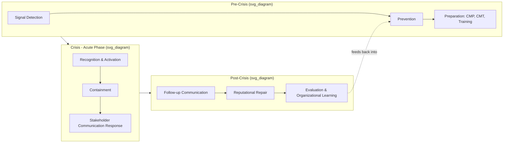

## The Crisis Lifecycle: Pre-Crisis, Crisis, Post-Crisis

### Overview

The crisis lifecycle model divides the temporal arc of a crisis into three principal phases — pre-crisis, crisis, and post-crisis — each with distinct objectives, activities, and communication demands. This staged framework, refined across multiple scholars (Fink, Coombs, Mitroff), underpins most modern crisis management planning and is foundational to structuring organizational response capability.

### Origins and Variants of the Model

**Key Points**

- Steven Fink's 1986 four-stage model (prodromal, acute, chronic, resolution) is one of the earliest formalized lifecycle frameworks, drawn from a medical/pathological metaphor
- Ian Mitroff's five-stage model (signal detection, probing/prevention, containment/damage limitation, recovery, learning) emphasizes organizational learning as a distinct terminal phase
- W. Timothy Coombs' three-stage model (pre-crisis, crisis, post-crisis) is the most widely taught simplified framework in contemporary crisis communication curricula and is used as the primary structure here, with finer-grained sub-stages noted within each phase
- [Inference] The specific number of stages across models is a matter of granularity rather than substantive disagreement — most frameworks agree on the same underlying activities, differing mainly in how finely they subdivide the timeline

### Phase 1: Pre-Crisis

The pre-crisis phase encompasses all activity before an acute crisis event, focused on prevention, preparation, and detection.

**Key Points**

- **Signal detection**: Monitoring internal and external environments (media, social listening, employee reporting channels, audits) for early warning signals — weak signals that, per Mitroff, are frequently present before major crises but go unrecognized or unescalated
- **Prevention**: Risk mitigation activities that reduce the likelihood of an issue escalating into a crisis (safety protocols, compliance programs, quality control)
- **Preparation**: Development of the Crisis Management Plan (CMP), formation and training of the Crisis Management Team (CMT), designation of spokespersons, pre-drafting of holding statements and dark site content, simulation exercises (tabletop exercises, full-scale drills)
- **Issue management overlap**: Pre-crisis activity substantially overlaps with issue management (see prior topic) — an unresolved issue is frequently the direct precursor to a crisis
- Coombs identifies three pre-crisis sub-tasks: signal detection, prevention, and crisis preparation

**Example**

A manufacturing company conducts quarterly tabletop simulations of a product recall scenario, maintains a pre-approved crisis communication template library, and monitors social media for early complaints about product defects. These are pre-crisis activities regardless of whether an actual recall ever occurs.

### Phase 2: Crisis (Acute Phase)

The crisis phase begins at the onset of the triggering event and continues through the period of active, high-intensity response.

**Key Points**

- **Recognition**: Formal acknowledgment that a crisis is occurring and activation of the Crisis Management Plan and CMT
- **Containment**: Actions to limit the scope and severity of the harm (operational containment — e.g., halting production, evacuating a site — as distinct from *communication* containment)
- **Communication response**: This is the most extensively theorized sub-phase, governed by frameworks including:
  - **Coombs' SCCT response strategies**, matched to crisis type/attributed responsibility: denial strategies (attack the accuser, denial, scapegoating), diminishment strategies (excuse, justification), rebuilding strategies (compensation, apology), and bolstering strategies (reminder, ingratiation, victimage) used as secondary reinforcement
  - **Benoit's Image Repair strategies**: denial, evading responsibility, reducing offensiveness, corrective action, mortification
  - **"Instructing information" and "adjusting information"** (Sturges, 1994): instructing information tells stakeholders how to protect themselves physically (evacuation routes, safety instructions); adjusting information helps stakeholders cope psychologically (expressions of concern, updates)
  - **Speed and consistency principles**: the "golden hour"/first-hours response window is widely emphasized as critical to controlling narrative framing before it is set by external sources or media
  - **Stealing thunder**: self-disclosure of negative information ahead of external revelation, empirically associated with reduced reputational damage
- **Stakeholder-specific communication**: Simultaneous, coordinated messaging across employees, customers, media, regulators, investors, and affected communities, each requiring tailored channels and content
- **Coombs' three crisis sub-tasks**: recognition, containment, and recovery activities that begin even during the acute phase (e.g., initiating support for victims)

**Example**

Following a data breach discovery, a company's CMT activates within hours: containing the breach (technical remediation), issuing an instructing-information notice to affected customers (password reset instructions), and issuing an adjusting-information statement expressing concern and outlining next steps — all coordinated through a single command structure to avoid conflicting messages.

### Phase 3: Post-Crisis

The post-crisis phase addresses recovery, reputational repair, and organizational learning after the acute threat has subsided.

**Key Points**

- **Follow-up communication**: Continued updates to stakeholders on remediation progress, corrective actions taken, and any residual obligations (compensation, regulatory settlements)
- **Reputational repair**: Extended application of image repair/SCCT rebuilding strategies (compensation, apology, corrective action) over a longer timeframe than the acute phase
- **Evaluation and learning**: Post-mortem analysis of the organization's response effectiveness, often called an "after-action review," assessing what worked, what failed, and what should change in the CMP
- **Discourse of Renewal** (Ulmer, Sellnow, Seeger): a distinct post-crisis communication approach emphasizing forward-looking, opportunity-oriented framing (rather than purely defensive repair), associated in some case studies with reputational outcomes that meet or exceed pre-crisis levels
- **Return to "new normal"**: Recognition that post-crisis organizational and stakeholder relationships may not return to their exact pre-crisis baseline — trust levels, regulatory scrutiny, or market position may be permanently altered
- Coombs' post-crisis sub-tasks: evaluation, learning, and follow-up

**Example**

After a resolved product safety recall, a company publishes a public after-action report detailing root-cause findings and new quality-control measures, continues to update affected customers over several months, and revises its crisis management plan based on identified gaps in its initial response speed.

### Lifecycle Diagram

### Comparative Stage Table

| Phase | Primary Objective | Key Activities | Governing Frameworks |
| --- | --- | --- | --- |
| Pre-Crisis | Prevent/prepare | Monitoring, CMP development, drills | Issue management, risk management |
| Crisis | Contain/respond | Activation, containment, stakeholder messaging | SCCT, Image Repair Theory, Sturges' instructing/adjusting information |
| Post-Crisis | Recover/learn | Follow-up, repair, after-action review | Discourse of Renewal, SCCT rebuilding strategies |

### Common Misconceptions

- **"The crisis lifecycle is strictly linear."** In practice, phases overlap — recovery communication often begins during the acute phase, and post-crisis learning should feed back into pre-crisis preparation, forming a cycle rather than a one-way sequence.
- **"Post-crisis work ends once media attention fades."** [Inference] Reduced media coverage does not necessarily indicate that stakeholder trust has been fully restored; reputational recovery timelines are often longer than the news cycle's attention span, and premature disengagement from follow-up communication can leave lingering stakeholder concerns unaddressed.
- **"Preparation guarantees a smooth crisis response."** Preparation improves response capability and speed but does not eliminate uncertainty; crisis plans are frequently adapted in real time as actual events diverge from simulated scenarios.

### Related Topics

- Steven Fink's Four-Stage Crisis Model vs. Coombs' Three-Stage Model
- Crisis Management Plan (CMP) Development and Components
- Sturges' Instructing vs. Adjusting Information Framework
- The "Golden Hour" and Response Speed Research
- Discourse of Renewal: Forward-Looking Post-Crisis Communication
- After-Action Reviews and Organizational Learning Loops
- Tabletop Exercises and Crisis Simulation Design