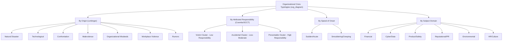

## Typologies of Organizational Crises

### Overview

Crisis typologies classify organizational crises according to shared characteristics — origin, attributed responsibility, speed of onset, or subject matter — enabling practitioners to match response strategy to crisis type rather than applying a one-size-fits-all approach. This section surveys the major typological frameworks used in crisis management theory and practice.

### Lerbinger's Crisis Typology

Otto Lerbinger's framework (1997) is one of the most widely cited foundational typologies, organizing crises by origin into seven categories.

**Key Points**

- **Natural disasters**: Earthquakes, hurricanes, floods — crises with no organizational culpability but requiring business continuity and stakeholder-care response
- **Technological crises**: System failures, industrial accidents (e.g., Bhopal), often involving complex technical causation and public fear of technology
- **Confrontation crises**: Boycotts, strikes, activist campaigns, or protests where external parties challenge organizational practices
- **Malevolence crises**: Sabotage, product tampering, extortion, terrorism — deliberate harm caused by external actors
- **Organizational misdeeds**: Subdivided by Lerbinger into crises of skewed management values, deception, and management misconduct — internally caused crises involving unethical or illegal organizational behavior
- **Workplace violence**: Incidents of violence involving employees, at or connected to the workplace
- **Rumors**: False or misleading information that damages reputation without a genuine underlying incident

### Coombs' Crisis Clusters (SCCT Framework)

Coombs' Situational Crisis Communication Theory groups crisis types into three clusters based on the level of **attributed organizational responsibility**, which is the primary determinant of recommended response strategy.

**Key Points**

- **Victim cluster** (minimal crisis responsibility attributed to the organization): natural disasters, rumors, workplace violence by a disgruntled former employee, product tampering by an external malicious actor
- **Accidental cluster** (low attributed responsibility, unintentional): technical-error accidents, technical-error product harm (equipment or process failure without negligence)
- **Preventable cluster** (high attributed responsibility): human-error accidents, human-error product harm, organizational misdeeds with no injuries, organizational misdeeds involving management malfeasance and known risk
- This clustering directly informs SCCT's prescribed response strategy: victim-cluster crises generally warrant only base response strategies (instructing/adjusting information) with minimal need for rebuilding strategies, whereas preventable-cluster crises typically require rebuilding strategies (compensation, apology) due to high attributed responsibility

### Crisis Typology by Speed of Onset

**Key Points**

- **Sudden/acute crises**: Sharp, unexpected onset with immediate high-intensity impact (explosions, plane crashes, cyberattacks) — closely matches Hermann's classic "surprise" and "short response time" attributes
- **Smouldering/creeping crises**: Slow-developing situations that begin as a minor internal problem or unaddressed issue and escalate gradually into public crisis (e.g., long-simmering workplace culture problems that erupt into a public scandal) — this category deliberately blurs the line between "issue" and "crisis" from the prior foundational topic, since escalation is gradual rather than a single discrete triggering event
- [Inference] Smouldering crises are often the most preventable in theory (there is more warning time) but frequently the most poorly managed in practice, because weak signals are dismissed or normalized over time (a pattern documented in Mitroff's writing on crisis signal detection failures)

### Crisis Typology by Subject Matter / Domain

**Key Points**

- **Financial crises**: Fraud, insolvency, accounting scandals, sudden stock collapse
- **Cyber/data crises**: Data breaches, ransomware attacks, system outages
- **Product/safety crises**: Recalls, contamination, defects causing injury
- **Reputational/PR crises (narrow sense)**: Executive misconduct, offensive public statements, viral social media backlash not necessarily tied to a physical or operational failure
- **Environmental crises**: Spills, emissions violations, ecological damage
- **Human resources/culture crises**: Harassment scandals, discrimination allegations, mass layoffs handled poorly
- **Geopolitical/regulatory crises**: Sanctions exposure, trade disputes, sudden regulatory action affecting operations
- This domain-based typology is less theoretically rigorous than Lerbinger's or Coombs' frameworks but is commonly used in practitioner contexts (e.g., organizing a crisis management plan's annexes by likely crisis domain)

### The Paracrisis: A Contemporary Addition

**Key Points**

- Coined and developed by Coombs and Holladay, the **paracrisis** refers to a public challenge to organizational practices that occurs in full public view (typically via social media) and carries the risk of escalating into a full crisis if mismanaged, even though it has not yet met the full threshold of a crisis
- Common paracrisis triggers: a challenge from an activist or aggrieved customer that goes viral, a misstep in a marketing campaign generating public backlash, a leaked internal document
- Distinguished from a true crisis by its lower initial severity and higher potential for self-inflicted escalation, meaning organizational response quality is unusually decisive in a paracrisis — a defensive or dismissive response can convert a paracrisis into a full-blown crisis, whereas an absent or over-reactive response are both cited as failure modes

### Typology Comparison Diagram

### Comparative Summary Table

| Typology | Classifying Dimension | Primary Use Case |
| --- | --- | --- |
| Lerbinger | Origin/source of crisis | General classification, CMP annex organization |
| Coombs/SCCT | Attributed responsibility | Selecting communication response strategy |
| Speed of onset | Rate of escalation | Signal detection and preparedness planning |
| Subject domain | Functional/operational area | Assigning internal ownership and expertise |
| Paracrisis (Coombs/Holladay) | Public visibility + escalation risk | Social media monitoring and rapid-response triage |

### Example

A company discovers that a mid-level manager falsified safety inspection reports over an extended period. Classified across typologies: by origin (Lerbinger), this is an *organizational misdeed*; by responsibility (SCCT), it falls in the *preventable cluster*, demanding rebuilding strategies (apology, corrective action); by speed of onset, it is a *smouldering crisis* that developed over time before public disclosure; by domain, it is simultaneously a *safety* and *governance/HR* crisis, requiring coordinated response across multiple functional teams.

### Common Misconceptions

- **"All typologies classify the same way."** Different typologies serve different diagnostic purposes — origin-based typologies (Lerbinger) help identify root cause, while responsibility-based typologies (SCCT) are specifically designed to prescribe communication strategy; conflating the two can lead to selecting an inappropriate response.
- **"A paracrisis is a lesser version of a crisis that can be safely ignored."** A paracrisis's defining risk is precisely that inattentive or dismissive handling can escalate it into a full crisis; the appropriate response is calibrated engagement, not disregard.
- **"Natural disasters never involve organizational responsibility."** [Inference] While natural disasters fall in Coombs' victim cluster by default, an organization's *response* to a natural disaster (e.g., inadequate business continuity planning, delayed customer communication) can independently generate a preventable-cluster reputational crisis layered on top of the original victim-cluster event.

### Related Topics

- Coombs' SCCT Response Strategy Matrix by Crisis Cluster
- The Paracrisis: Detection and De-escalation Tactics
- Mitroff's Signal Detection Failures in Smouldering Crises
- Crisis Management Plan Structuring by Domain-Specific Annexes
- Case Studies Mapped Across Multiple Typological Frameworks
- Attribution Theory (Weiner) as the Basis for SCCT Clusters