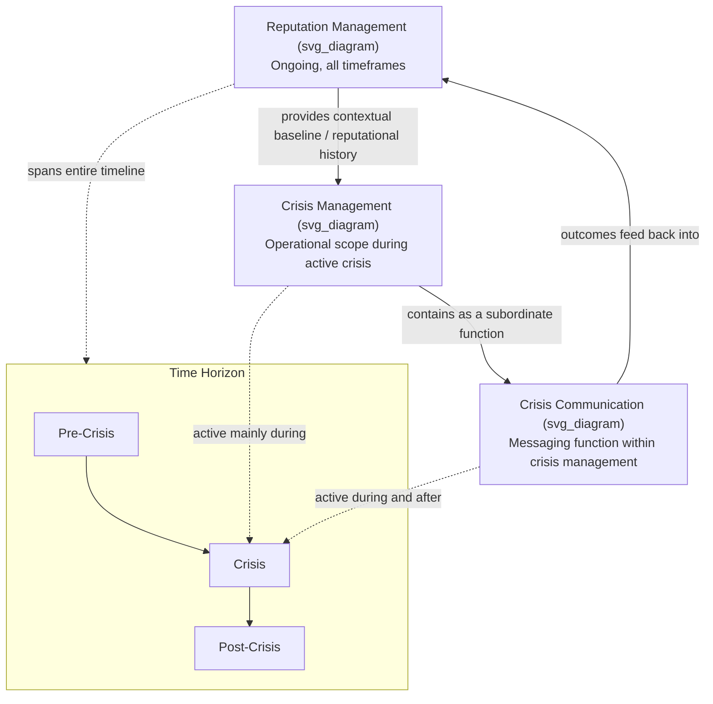

## Crisis Management vs Crisis Communication vs Reputation Management

### Overview

These three disciplines are closely related and frequently used interchangeably in practice, but each has a distinct scope, objective, and set of practitioners. This section defines the boundaries between them, clarifies their hierarchical and functional relationship, and addresses where overlaps and jurisdictional ambiguity typically occur in organizational practice.

### Crisis Management

**Definition**

Crisis management is the overarching organizational discipline concerned with the identification, containment, and resolution of a crisis across *all* operational dimensions — not communication alone. It encompasses decision-making, resource allocation, operational containment, legal risk mitigation, and stakeholder coordination.

**Key Points**

- Crisis management is the **superset** discipline; crisis communication is one function/subset within it
- Core activities: activating the Crisis Management Team (CMT), operational containment (e.g., halting a production line, isolating a compromised system), resource mobilization, legal and regulatory coordination, and decision authority over strategic response choices (e.g., whether to recall a product, whether to shut down a facility)
- Typically led by senior executives or a dedicated crisis manager, with legal counsel playing a central advisory role given liability exposure
- Draws on business continuity management (BCM) and enterprise risk management (ERM) frameworks for structural planning
- The **Crisis Management Plan (CMP)** is the documented artifact of this discipline — it specifies roles, escalation triggers, decision protocols, and resource allocation, of which the communication plan is one component/annex

### Crisis Communication

**Definition**

Crisis communication is the **communicative function within crisis management** — the practice of crafting, delivering, and managing messages to stakeholders during a crisis in order to inform, reassure, and shape perception and behavior.

**Key Points**

- Crisis communication is subordinate to and informed by crisis management decisions — communicators typically do not decide *whether* to recall a product, but they are responsible for *how that decision is communicated*
- Core theoretical frameworks: SCCT (Coombs), Image Repair Theory (Benoit), Sturges' instructing/adjusting information framework, stealing thunder
- Core activities: drafting and issuing statements, spokesperson training and media briefings, stakeholder-specific messaging (employees, customers, media, regulators, investors), social media monitoring and response, dark site activation
- Typically led by communications/PR/public affairs professionals, working in close coordination with legal counsel (message clearance) and operational leaders (factual accuracy)
- Time horizon is generally the acute crisis phase and the communicative elements of the post-crisis phase (follow-up messaging), though pre-crisis message-template preparation also falls under this function

### Reputation Management

**Definition**

Reputation management is the **long-term, ongoing discipline** concerned with monitoring, building, protecting, and repairing an organization's cumulative stakeholder perception — extending well beyond the boundaries of any single crisis event.

**Key Points**

- Reputation management operates on a continuous timeline (pre-crisis, during crisis, post-crisis, and entirely independent of any crisis event) — it is not crisis-contingent
- Core activities: ongoing reputation measurement and tracking (RepTrak, media sentiment analysis, employee/customer surveys), stakeholder relationship building, ESG and governance communication, thought leadership and corporate narrative development, and post-crisis reputational repair extending long after the acute crisis phase ends
- Typically owned by a Chief Communications Officer, corporate affairs function, or equivalent senior leadership role, often reporting to or closely advising the CEO given reputation's strategic and financial materiality (see prior topic)
- Reputation management provides the **contextual baseline** that crisis communication operates within — per SCCT's reputational history modifier, an organization's pre-existing reputation shapes how a given crisis response will be received by stakeholders

### Hierarchical and Functional Relationship

**Key Points**

- The three disciplines can be understood as **nested in scope** (reputation management is broadest in time horizon; crisis management is broadest in operational scope during an active crisis; crisis communication is the narrowest, most tactical function) but they are not simply subsets of one another in a single dimension — reputation management extends in *time* beyond any one crisis, while crisis management extends in *operational breadth* beyond communication alone
- During an active crisis, all three operate simultaneously: crisis management makes operational/strategic decisions, crisis communication executes the messaging of those decisions, and reputation management tracks the cumulative perceptual impact and informs longer-term repair strategy
- Governance overlap is common in practice: in smaller organizations, one person or team may perform all three functions; in larger organizations, jurisdictional friction can occur between legal (crisis management), communications (crisis communication), and corporate affairs (reputation management) over message control and decision authority

### Relationship Diagram

### Comparative Table

| Dimension | Crisis Management | Crisis Communication | Reputation Management |
| --- | --- | --- | --- |
| Scope | Operational, legal, strategic decision-making | Messaging and stakeholder communication | Perceptual/relational, cumulative |
| Time Horizon | Acute crisis + immediate preparation | Acute crisis + follow-up | Continuous, ongoing (pre/during/post/independent of crisis) |
| Typical Owner | Senior executives, legal counsel, dedicated crisis manager | PR/communications professionals | Chief Communications Officer, corporate affairs |
| Primary Output | Crisis Management Plan, containment decisions | Statements, briefings, stakeholder messaging | Reputation tracking, narrative strategy, long-term repair |
| Governing Frameworks | ERM, business continuity management | SCCT, Image Repair Theory, Sturges' framework | RepTrak, stakeholder theory, discourse of renewal |

### Example

A pharmaceutical company discovers a manufacturing defect in a batch of medication.

- **Crisis management** decides whether to issue a full recall, coordinates with regulators (FDA), and allocates legal and operational resources to contain the defect.
- **Crisis communication** drafts the recall notice, trains the spokesperson for media interviews, and issues instructing information to pharmacists and patients on returning the affected batch.
- **Reputation management** tracks how the recall affects the company's RepTrak score and media sentiment over the following months, and develops a longer-term narrative (e.g., emphasizing enhanced quality-control investments) to rebuild stakeholder trust well after the recall itself has concluded.

### Common Misconceptions

- **"Crisis communication and crisis management are the same thing."** Crisis communication is a *function within* crisis management; treating them as synonymous can lead to under-resourcing the operational/legal/decision-making dimensions of crisis response in favor of messaging alone.
- **"Reputation management only matters during a crisis."** Reputation management is a continuous discipline; organizations that only engage with it reactively during crises tend to lack the accumulated reputational reservoir that empirical research associates with better crisis outcomes.
- **"Good crisis communication can fully substitute for poor crisis management."** [Inference] Communication strategy cannot indefinitely compensate for inadequate underlying operational response (e.g., a slow or inadequate product recall) — SCCT and Image Repair scholarship generally treat communication as most effective when it accurately reflects substantive corrective action, not as a stand-alone remedy.

### Related Topics

- Crisis Management Plan (CMP) Structure and Core Components
- Roles and Responsibilities Within a Crisis Management Team (CMT)
- SCCT's Reputational History Modifier in Practice
- Governance Models for Legal, Communications, and Corporate Affairs Coordination
- Building a Continuous Reputation Measurement Program