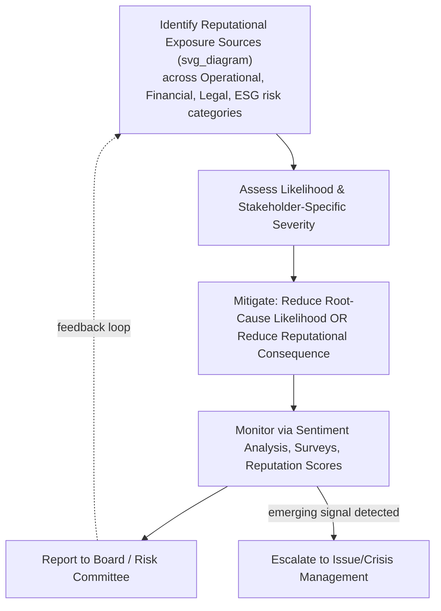

## Reputation Risk Management as a Discipline

### Overview

Reputation risk management is the specialized discipline that treats reputational exposure as a formally identified, assessed, and mitigated risk category within enterprise risk management (ERM), rather than as an incidental byproduct of other operational risks. This section examines its emergence as a discrete function, its methodological toolkit, its organizational placement, and its distinguishing challenges relative to other risk categories.

### Defining Reputational Risk Within ERM

**Key Points**

- Reputational risk is most precisely defined as a **consequence risk** — the risk that stakeholder perception will deteriorate as a downstream effect of another risk event materializing (operational failure, governance lapse, product defect, cyber incident), rather than a standalone risk source in itself
- The Basel Committee on Banking Supervision (an early formal adopter of reputational risk terminology in financial regulation) defines it broadly as the risk arising from negative perception on the part of stakeholders that can adversely affect capital, liquidity, or franchise value — this definition has been influential across industries beyond banking
- ISO 31000 and COSO ERM frameworks both explicitly list reputational risk as a category to be integrated into the broader risk register and risk appetite framework, rather than managed in isolation by the communications function alone
- [Inference] The formal recognition of reputational risk as an ERM category (rather than purely a communications concern) reflects an evolution in corporate governance thinking, driven substantially by post-2008 financial-crisis scrutiny of how reputational damage translated into tangible financial and regulatory consequences for banks

### Distinguishing Features Relative to Other Risk Categories

**Key Points**

- **Derivative nature**: Unlike credit risk or market risk, reputational risk rarely exists as a primary, independently originating risk — it is almost always a secondary consequence of an underlying operational, financial, legal, or ethical failure
- **Measurement difficulty**: Reputational risk lacks the mature quantitative modeling infrastructure available for financial risks (e.g., Value at Risk); it is typically assessed using qualitative/semi-quantitative scoring (likelihood × severity matrices) supplemented by proxy metrics (media sentiment, survey scores, stock price sensitivity)
- **Stakeholder-relativity**: The same event can constitute differing levels of reputational risk to different stakeholder groups simultaneously (e.g., a layoff may pose low reputational risk to investors but high reputational risk to the affected community and current employees), complicating unified risk scoring
- **Time lag and diffusion**: Reputational damage can manifest with a delay after the triggering event and can diffuse gradually through media and word-of-mouth channels, making the "risk event" harder to bound temporally compared to, for instance, a discrete financial loss
- **Asymmetric risk profile**: Reputational risk is frequently characterized as having limited upside and substantial downside (a "loss-dominant" risk), reflecting the empirical pattern that reputational damage tends to accrue faster than reputational gain

### The Reputational Risk Management Process

**Key Points**

- **Identification**: Systematically cataloging sources of reputational exposure across all major risk categories (operational, financial, legal/compliance, ESG, technological, geopolitical) rather than treating reputation as a separate silo — this typically requires cross-functional input from risk, legal, communications, HR, and operations
- **Assessment**: Scoring identified reputational exposures using likelihood and severity dimensions, often incorporating stakeholder-specific severity ratings (e.g., separate impact scores for customers, investors, regulators, employees)
- **Mitigation**: Implementing controls that reduce either the likelihood of the underlying risk event (e.g., strengthening quality control to reduce product-defect risk) or the reputational consequence given the event occurs (e.g., pre-established crisis communication protocols, stakeholder engagement programs)
- **Monitoring**: Ongoing tracking via reputation measurement tools (RepTrak, media sentiment analysis, social listening, employee/customer sentiment surveys) to detect emerging reputational risk signals before they escalate
- **Governance and reporting**: Escalation protocols for reputational risk exposures to board-level risk committees, increasingly expected under corporate governance codes and institutional investor stewardship guidelines, particularly for ESG-linked exposures

### Organizational Placement and Governance

**Key Points**

- Reputational risk management sits at the intersection of several functions, and organizational placement varies considerably: some organizations house it within the Chief Risk Officer's (CRO) ERM function; others place primary ownership with the Chief Communications Officer or corporate affairs; still others use a matrixed model with joint ownership
- Board-level oversight has increased, with audit and risk committees (or dedicated reputation/ESG committees in some organizations) expected to review reputational risk exposures alongside financial and operational risks
- [Inference] The lack of a single, universally adopted organizational model for reputational risk ownership likely reflects the discipline's relatively recent formalization compared to longer-established risk categories such as credit or market risk, which have had decades longer to converge on standard governance structures
- Cross-functional Reputational Risk Committees or working groups are an increasingly common practice, drawing representation from risk, legal, communications, HR, sustainability/ESG, and operations to ensure reputational considerations are assessed holistically rather than from a single functional lens

### Reputational Risk and ESG Integration

**Key Points**

- The expansion of Environmental, Social, and Governance (ESG) disclosure expectations has substantially broadened the surface area of reputational risk exposure, extending it into areas such as supply chain labor practices, climate-related disclosures, board diversity, and executive compensation
- "Greenwashing" (overstating environmental credentials) and "social washing" (overstating social commitments) have emerged as specific reputational risk sub-categories, carrying both reputational and increasingly regulatory/legal exposure (e.g., regulatory actions in several jurisdictions targeting misleading sustainability claims)
- Institutional investors and proxy advisory firms increasingly factor perceived reputational and ESG risk management maturity into voting recommendations and engagement priorities, linking reputational risk management directly to shareholder relations

### Reputational Risk Management Process Diagram

### Comparative Table: Reputational Risk vs. Traditional Risk Categories

| Attribute | Financial/Market Risk | Reputational Risk |
| --- | --- | --- |
| Origin | Often primary/direct | Almost always derivative/consequential |
| Quantification | Mature quantitative models (VaR, etc.) | Largely qualitative/proxy-based |
| Stakeholder Variance | Relatively uniform impact | Highly stakeholder-specific |
| Time Profile | Often immediate/bounded | Can be delayed and diffuse over time |
| Typical Owner | CFO / Treasury / Market Risk function | Varies: CRO, CCO, or matrixed ownership |

### Example

A financial services firm identifies, through its ERM process, that its call center's high customer complaint escalation rate constitutes an operational risk. Its reputational risk function separately assesses that this operational issue also carries meaningful reputational risk exposure among retail customers and could attract regulatory attention regarding treatment of vulnerable customers. This dual assessment — operational risk owned by operations, reputational risk overlay assessed by the risk/communications function — leads to a joint mitigation plan combining process improvement (operational) and proactive customer communication (reputational).

### Common Misconceptions

- **"Reputational risk management is just PR with a risk framework label."** The discipline is explicitly cross-functional and integrated into formal ERM governance structures, distinguishing it from communications-function activities alone.
- **"Reputational risk can be eliminated through good PR."** Because reputational risk is derivative of underlying operational/ethical/financial risk, sustainable mitigation requires addressing root-cause risks, not communication alone.
- **"All stakeholders perceive reputational risk the same way."** Stakeholder-relativity is a defining feature of reputational risk; a mitigation strategy calibrated for one stakeholder group (e.g., investors) may be inadequate or even counterproductive for another (e.g., affected communities or employees).

### Related Topics

- Basel Committee Framework and Reputational Risk in Financial Regulation
- Building a Cross-Functional Reputational Risk Committee
- Greenwashing and Social Washing as Reputational Risk Sub-Categories
- Reputational Risk Scoring Methodologies (Likelihood/Severity Matrices)
- ESG Disclosure Requirements and Their Reputational Risk Implications
- Integrating Reputational Risk into Board-Level Risk Reporting