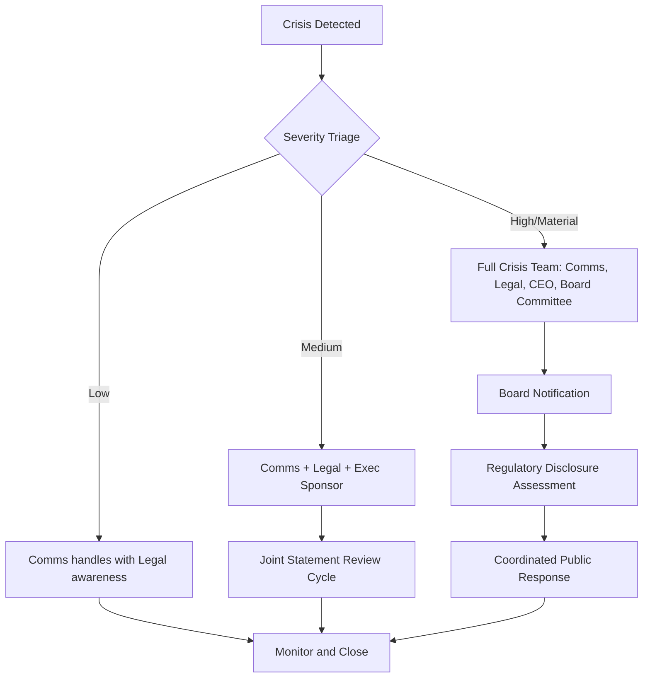

## Roles of Communicators, Legal, Executives, and Boards

### Overview

Effective crisis and reputation management depends on a clearly delineated division of labor among four core stakeholder groups: communications professionals, legal counsel, executive leadership, and the board of directors. Each group carries distinct authority, risk tolerance, and time horizon, and crises are frequently mismanaged not because any single function fails, but because handoffs between these functions are undefined, contested, or too slow relative to the news cycle.

### The Structural Tension

**Key Points**

- Legal is optimized to minimize litigation exposure and admissions of liability.
- Communications is optimized to preserve stakeholder trust and narrative control.
- Executives are optimized to protect operational continuity and strategic direction.
- The board is optimized to protect fiduciary duty, shareholder value, and long-term governance credibility.

These optimization targets frequently conflict during an active crisis. A legally cautious statement ("we are investigating and cannot comment further") often reads publicly as evasive, while a communications-preferred statement of empathy or accountability can be interpreted as an admission with legal consequences. [Inference] The degree of tension varies significantly by jurisdiction, industry regulation, and whether litigation or regulatory action is already underway.

### Role of Communicators (PR/Corporate Communications)

**Key Points**

- Own the narrative: message architecture, timing, channel selection, and stakeholder-specific framing (employees, customers, media, investors, regulators).
- Serve as the primary interface with journalists, social platforms, and public statements.
- Conduct or commission sentiment monitoring and media tracking during the crisis lifecycle.
- Draft holding statements, FAQs, spokesperson talking points, and internal messaging.
- Coordinate spokesperson selection and media training, typically recommending who should NOT speak publicly as much as who should.

**Typical Deliverables**

- Crisis communication plan and pre-approved holding statement templates
- Dark site / crisis microsite content (pre-built, unpublished pages ready for activation)
- Internal employee communication cascades
- Media monitoring dashboards and issue-severity assessments

**Example**

A product recall triggers the communications team to draft three tiers of messaging within the first 60–90 minutes: (1) an internal employee notice, (2) a customer-facing FAQ and hotline script, and (3) a media holding statement acknowledging awareness of the issue without assigning cause, pending legal review.

### Role of Legal (General Counsel / Outside Counsel)

**Key Points**

- Assess litigation exposure, regulatory reporting obligations, and privilege considerations for every external statement.
- Review and often materially edit communications drafts before release, particularly language implying fault, causation, or guaranteed remedies.
- Manage attorney-client privilege over internal investigations, including who can access findings and how they are documented.
- Advise on mandatory disclosures (e.g., securities law materiality thresholds, breach notification statutes, OSHA/EPA reporting).
- Interface with regulators, law enforcement, and opposing counsel.

**Common Friction Points**

- Legal's default instinct is often minimal disclosure ("say nothing beyond what is required"), which can accelerate reputational damage if the vacuum is filled by speculation or adversarial sources.
- Legal review cycles can introduce delay that communications and executives perceive as incompatible with a fast-moving news cycle.

[Unverified] Specific privilege protections, disclosure timelines, and statutory reporting windows vary by jurisdiction and industry; legal teams should confirm current requirements with jurisdiction-specific counsel rather than relying on general practice.

### Role of Executives (CEO, CFO, COO, Business Unit Leaders)

**Key Points**

- Set the overall response posture: apologize-and-fix, contest-and-clarify, or minimize-and-monitor.
- Serve as the most visible spokesperson in high-severity crises (executive presence signals the seriousness with which leadership treats the issue).
- Make resource allocation decisions in real time: budget for remediation, staffing for incident response, operational changes (e.g., halting production, pulling a product).
- Balance competing recommendations from legal and communications, ultimately owning the final decision and its consequences.
- Communicate with the board, major investors, and key customers/partners directly in severe scenarios.

**Decision Authority Matrix (Illustrative)**

| Decision | Typical Owner | Consulted |
| --- | --- | --- |
| Whether to issue a public statement | CEO/Communications lead | Legal, Board (if material) |
| Content and tone of statement | Communications | Legal (compliance review) |
| Whether to disclose to regulators | Legal | CFO, CEO |
| Product recall/operational halt | COO/CEO | Legal, Communications |
| Executive resignation/removal | Board | CEO, Legal, outside advisors |

### Role of the Board of Directors

**Key Points**

- Exercise fiduciary oversight, particularly around risk that is "material" to shareholders or triggers disclosure obligations.
- Approve or review crisis governance frameworks before a crisis occurs (many boards have a designated crisis committee or delegate this to the audit/risk committee).
- Evaluate CEO/executive performance during the crisis and, in severe cases, make leadership change decisions.
- Interface with institutional investors, proxy advisors, and, in publicly traded companies, may need to make or approve SEC-related disclosures (in the U.S. context) or equivalent regulatory filings elsewhere.
- Often engage independent outside advisors (crisis PR firms, forensic accountants, independent counsel) when management's own credibility is part of the crisis.

[Inference] Board involvement escalates in near-direct proportion to (a) whether the CEO or senior leadership is personally implicated, (b) the scale of financial/reputational materiality, and (c) whether regulatory or law enforcement scrutiny is involved — though exact escalation triggers are typically defined in a company's own crisis governance charter, which varies by organization.

### Coordination Model

### RACI Framework for Crisis Response

A common structuring tool is a RACI matrix (Responsible, Accountable, Consulted, Informed) established *before* a crisis, not during one.

**Example RACI (abbreviated)**

| Activity | Communications | Legal | CEO | Board |
| --- | --- | --- | --- | --- |
| Draft public statement | R | C | A | I |
| Determine litigation strategy | I | R/A | C | I |
| Decide on executive statement/apology | C | C | A | I |
| Materiality/disclosure determination | I | R | C | A |
| Post-crisis review | R | C | C | A |

R = Responsible (does the work), A = Accountable (owns the outcome), C = Consulted (input sought), I = Informed (kept updated)

### Escalation Protocol (svg_diagram)

<svg xmlns="http://www.w3.org/2000/svg" viewBox="0 0 760 320" font-family="Arial, sans-serif">
<text x="380" y="24" text-anchor="middle" font-size="16" font-weight="bold" fill="#1a1a1a">Crisis Escalation Path (svg_diagram)</text>
<rect x="20" y="60" width="160" height="60" rx="8" fill="#e8f0fe" stroke="#3367d6" stroke-width="1.5" />
<text x="100" y="85" text-anchor="middle" font-size="12" fill="#1a1a1a">Frontline / Support</text>
<text x="100" y="102" text-anchor="middle" font-size="11" fill="#444">Detects issue</text>
<rect x="220" y="60" width="160" height="60" rx="8" fill="#fef7e0" stroke="#c99a06" stroke-width="1.5" />
<text x="300" y="85" text-anchor="middle" font-size="12" fill="#1a1a1a">Communications Lead</text>
<text x="300" y="102" text-anchor="middle" font-size="11" fill="#444">Triages severity</text>
<rect x="420" y="60" width="160" height="60" rx="8" fill="#fce8e6" stroke="#c5221f" stroke-width="1.5" />
<text x="500" y="85" text-anchor="middle" font-size="12" fill="#1a1a1a">Legal Counsel</text>
<text x="500" y="102" text-anchor="middle" font-size="11" fill="#444">Assesses exposure</text>
<rect x="620" y="60" width="120" height="60" rx="8" fill="#e6f4ea" stroke="#188038" stroke-width="1.5" />
<text x="680" y="85" text-anchor="middle" font-size="12" fill="#1a1a1a">CEO</text>
<text x="680" y="102" text-anchor="middle" font-size="11" fill="#444">Sets posture</text>
<rect x="300" y="200" width="180" height="60" rx="8" fill="#f3e8fd" stroke="#8430ce" stroke-width="1.5" />
<text x="390" y="225" text-anchor="middle" font-size="12" fill="#1a1a1a">Board Crisis Committee</text>
<text x="390" y="242" text-anchor="middle" font-size="11" fill="#444">Material/high severity only</text>
<line x1="180" y1="90" x2="220" y2="90" stroke="#666" stroke-width="1.5" marker-end="url(#arrow)" />
<line x1="380" y1="90" x2="420" y2="90" stroke="#666" stroke-width="1.5" marker-end="url(#arrow)" />
<line x1="580" y1="90" x2="620" y2="90" stroke="#666" stroke-width="1.5" marker-end="url(#arrow)" />
<line x1="680" y1="120" x2="450" y2="200" stroke="#666" stroke-width="1.5" marker-end="url(#arrow)" />
</svg>

### Common Failure Modes

**Key Points**

- **Legal silence mistaken for stonewalling**: When legal blocks communication without offering an alternative approved statement, stakeholders perceive silence as guilt.
- **Executive freelancing**: A senior leader speaks publicly (or on social media) without clearance, creating statements legal and communications must retroactively manage.
- **Board surprise**: Board members learn of a material crisis through media rather than internal escalation, damaging governance credibility and potentially breaching disclosure duties.
- **Communications without legal literacy**: Communications teams unaware of discovery risk may create documents (e.g., internal emails admitting fault) that become evidence in litigation.
- **No pre-established decision rights**: Without a RACI or equivalent, precious early hours are lost negotiating who decides rather than executing a response.

### Pre-Crisis Preparation Checklist

- Establish a standing crisis committee with named individuals from communications, legal, and executive leadership, plus a board liaison.
- Pre-draft holding statement templates and legal-approved language banks for common scenario types (data breach, product safety, executive misconduct, financial restatement).
- Define materiality thresholds and disclosure triggers in advance, in consultation with legal and the board's audit/risk committee.
- Conduct joint tabletop simulations at least annually involving all four stakeholder groups together, not in isolation.
- Document a clear RACI matrix and escalation ladder, including after-hours contact protocols.

### Related Topics

- Crisis Communication Plans and Holding Statement Templates
- Materiality Assessment and Regulatory Disclosure Triggers
- Attorney-Client Privilege in Internal Investigations
- Spokesperson Selection and Media Training
- Board Governance Frameworks for Enterprise Risk
- Tabletop Exercises and Crisis Simulation Design
- Post-Crisis Review and Organizational Learning