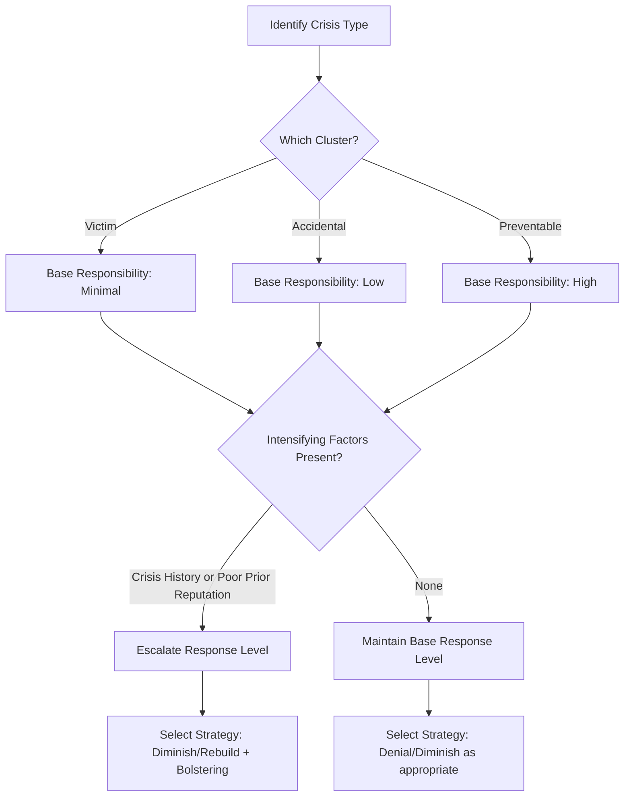

## Situational Crisis Communication Theory (SCCT)

### Overview

Situational Crisis Communication Theory (SCCT) is an evidence-based framework, developed primarily by W. Timothy Coombs, for matching crisis response strategies to the level of reputational threat a crisis poses. Its central premise is that the appropriate communication strategy is not a matter of style or preference but should be derived systematically from (1) how much responsibility stakeholders attribute to the organization and (2) contextual factors that intensify or diminish that attribution.

### Theoretical Foundations

**Key Points**

- SCCT is grounded in Attribution Theory, which holds that people naturally search for causes when negative events occur, and the cause they identify shapes their emotional and behavioral response.
- The core dependent variable in SCCT is organizational reputation, operationalized as stakeholder perception following the crisis response.
- SCCT treats crisis response strategy selection as a rational matching exercise: greater attributed responsibility requires a more accommodative response.

### Crisis Clusters and Attributed Responsibility

SCCT groups crises into three clusters based on the level of responsibility stakeholders are likely to attribute to the organization.

**Victim Cluster (Minimal Responsibility)**

- Natural disasters, workplace violence by an external actor, rumors, product tampering by an outside party.
- The organization is perceived as a victim of the crisis.

**Accidental Cluster (Low Responsibility)**

- Technical-error accidents, technical-error product harm (e.g., an unforeseen defect from a manufacturing process failure).
- The event was unintentional and largely uncontrollable.

**Preventable Cluster (High Responsibility)**

- Human-error accidents, human-error product harm, organizational misdeeds (management negligence, deception, or violation of law/regulation).
- The organization knowingly placed people at risk or acted improperly.

### Intensifying Factors

**Key Points**

- **Crisis history**: An organization with a track record of similar past crises faces amplified responsibility attribution, even for a currently low-responsibility cluster event.
- **Prior relational reputation**: Positive pre-crisis stakeholder relationships provide a reputational buffer ("halo effect"); negative prior reputation compounds damage.
- These factors can shift a crisis's effective severity up one cluster level even when the base cluster would otherwise suggest lower attributed responsibility.

[Inference] The magnitude of the shift caused by crisis history or prior reputation is context-dependent and not governed by a fixed numeric weighting in the original theory; practitioners typically apply it as a directional adjustment rather than a precise formula.

### Crisis Response Strategies

SCCT organizes response strategies along a continuum from denial to full accommodation.

| Strategy Category | Specific Tactics | Function |
| --- | --- | --- |
| Denial | Attack the accuser, Denial, Scapegoating | Reject any link between organization and crisis |
| Diminish | Excuse, Justification | Minimize organizational responsibility or perceived damage |
| Rebuild | Compensation, Apology | Improve organizational reputation, offer material/symbolic reparation |
| Bolstering | Reminder, Ingratiation, Victimage | Supplement primary strategy by reminding stakeholders of past good works or expressing the organization is also a victim |

**Example**

A pharmaceutical company facing a product recall due to a supplier's undisclosed ingredient substitution (accidental cluster, low base responsibility) would typically pair an "excuse" strategy (clarifying the substitution was concealed by the supplier) with "compensation" (refunds, replacement product) if the company has a prior crisis history that elevates stakeholder skepticism.

### The SCCT Decision Model

### Response Matching Guidelines

**Key Points**

- **Victim cluster crises**: Denial strategies are generally appropriate; the organization can also use bolstering to reinforce its victim status and prior positive reputation.
- **Accidental cluster crises**: Diminish strategies (excuse, justification) are typically sufficient, though compensation may be added if injury or damage occurred.
- **Preventable cluster crises**: Rebuild strategies (apology, compensation) are recommended regardless of intensifying factors, since high attributed responsibility leaves little room for denial or diminishment without further reputational harm.
- Bolstering strategies are never used alone; SCCT frames them as supplementary to a primary strategy.

### Reputational Threat Assessment Formula (Conceptual)

While SCCT is not typically expressed as a strict mathematical formula in Coombs' original work, it can be conceptually represented as a threat-level function combining base cluster severity and intensifying factors:

$$T = C_b + I_h + I_r$$

Where $T$ is total perceived reputational threat, $C_b$ is the base responsibility score of the crisis cluster, $I_h$ is the intensification from crisis history, and $I_r$ is the intensification from prior relational reputation. [Inference] This additive representation is a pedagogical simplification used to illustrate the theory's logic; it is not a validated psychometric instrument, and practitioners should not treat it as a precise predictive calculation.

### Applying SCCT: Worked Example

**Example**

*Scenario*: A regional airline experiences a mechanical failure causing an emergency landing with no fatalities.

1. **Cluster identification**: If investigation shows the failure stemmed from a known-but-unaddressed maintenance issue, this shifts from "accidental" (technical error) toward "preventable" (human-error accident, since maintenance oversight was a controllable factor).
2. **Intensifying factors check**: If the airline had two prior safety incidents in the past three years, crisis history significantly elevates attributed responsibility.
3. **Strategy selection**: Given elevated responsibility, a rebuild strategy (apology, compensation to passengers, transparent disclosure of corrective maintenance actions) is indicated rather than a diminish strategy.
4. **Bolstering**: The airline may supplement with reminders of its otherwise strong safety record, but only alongside — not instead of — the rebuild strategy.

### Common Critiques and Limitations

**Key Points**

- SCCT assumes stakeholders process attribution somewhat rationally and consistently; real-world audiences are influenced by media framing, political polarization, and social media amplification in ways the original model does not fully capture.
- The theory was developed and validated primarily through experimental studies using hypothetical crisis scenarios; [Unverified] the extent to which findings generalize to fast-moving, multi-platform digital crises is an active area of ongoing communication research rather than a settled conclusion.
- Cultural variation in responsibility attribution (e.g., collectivist vs. individualist stakeholder norms) is not deeply addressed in the foundational model, though later scholarship has extended SCCT cross-culturally.

### Practical Application Checklist

- Classify the crisis into victim, accidental, or preventable clusters before drafting any public statement.
- Audit organizational crisis history and current stakeholder sentiment to determine if intensifying factors apply.
- Select a primary strategy from the denial–diminish–rebuild continuum matched to assessed threat level.
- Layer bolstering tactics only as a supplement, never a substitute, for the primary strategy.
- Reassess strategy as new facts emerge; SCCT is not a one-time determination but should be revisited as attributed responsibility may shift during an unfolding crisis.

### Related Topics

- Image Repair Theory (Benoit) as a Comparative Framework
- Attribution Theory Foundations in Crisis Psychology
- Contingency Theory of Strategic Conflict Management
- Crisis History and Reputational "Halo Effect" Research
- Digital-Era Extensions of SCCT (Social Media Crisis Dynamics)
- Apology and Compensation Strategy Design in Practice