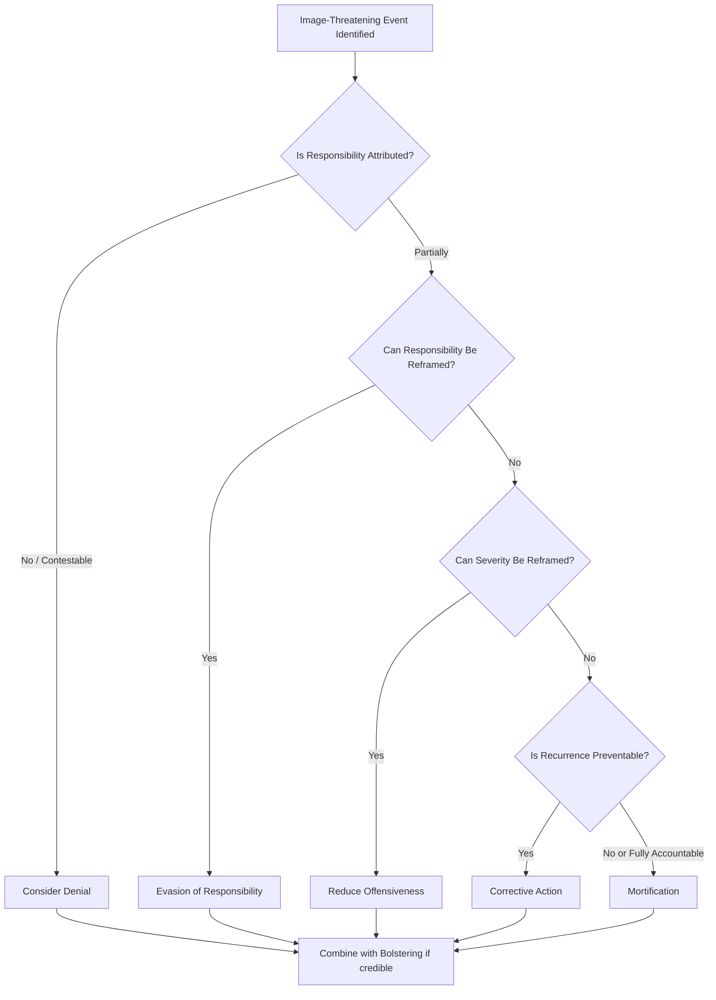

## Image Restoration and Image Repair Theory

### Overview

Image Repair Theory (originally termed Image Restoration Theory), developed by William L. Benoit, is a rhetorical framework for analyzing and constructing responses to attacks on an organization's or individual's reputation. Unlike Situational Crisis Communication Theory, which derives strategy from empirically measured attribution and threat level, Image Repair Theory is rooted in rhetorical criticism and focuses on the persuasive strategies available to a communicator once an image-threatening event has occurred.

### Theoretical Foundations

**Key Points**

- Image Repair Theory assumes two preconditions must both be present for image repair to be necessary: (1) the actor is held responsible, or believed to be responsible, for an action, and (2) that action is considered offensive or harmful by relevant audiences.
- The theory treats reputation as something actively constructed through communication ("image" as a rhetorical construct), not merely a passive reflection of behavior.
- It draws on classical rhetoric (apologia, the rhetoric of self-defense) rather than social-scientific attribution research, distinguishing it methodologically from SCCT.

### The Five Strategy Categories

Benoit's framework identifies five broad strategies, several with multiple sub-strategies, that a communicator can use alone or in combination.

**1. Denial**

- *Simple denial*: The act did not occur, or the accused did not perform it.
- *Shift the blame*: Another actor is responsible for the act.

**2. Evading Responsibility**

- *Provocation*: The act was a response to another's offensive action.
- *Defeasibility*: Lack of information or control over the situation.
- *Accident*: The act was unintentional.
- *Good intentions*: The actor meant well, even if the outcome was harmful.

**3. Reducing Offensiveness of the Event**

- *Bolstering*: Emphasizing positive traits or past good works to offset the negative act.
- *Minimization*: Arguing the act was not as harmful as portrayed.
- *Differentiation*: Distinguishing the act from other more offensive acts.
- *Transcendence*: Placing the act in a broader, more favorable context.
- *Attack accuser*: Reducing the credibility of the source of the accusation.
- *Compensation*: Offering reimbursement to offset the negative effect.

**4. Corrective Action**

- Promising to fix the problem and/or prevent its recurrence.

**5. Mortification**

- A full apology, accepting responsibility and asking for forgiveness.

### Strategy Selection Framework

### Comparative Positioning: Image Repair Theory vs. SCCT

| Dimension | Image Repair Theory | SCCT |
| --- | --- | --- |
| Origin | Rhetorical criticism (Benoit) | Attribution theory / social science (Coombs) |
| Unit of Analysis | Rhetorical text/discourse | Stakeholder perception and measured outcomes |
| Strategy Basis | Persuasive intent and message construction | Empirically matched to responsibility level |
| Typical Use | Post-hoc analysis of speeches, statements, apologies | Pre-emptive strategy selection during live crisis |
| Strength | Rich qualitative strategy taxonomy | Predictive, testable via experimental research |
| Limitation | Less predictive; descriptive of what was said, not what should optimally be said | Less granular in rhetorical nuance |

[Inference] The two theories are frequently used complementarily in practice: SCCT to determine the appropriate response posture given crisis severity, and Image Repair Theory to construct the specific rhetorical content of the chosen response.

### Worked Example: Applying Multiple Strategies

**Example**

*Scenario*: A university president is accused of mishandling a hazing incident that resulted in student injury.

A statement combining multiple Image Repair strategies might include:

1. **Corrective action**: Announcing an independent investigation and new oversight policy for student organizations.
2. **Bolstering**: Referencing the university's historical commitment to student safety and prior safety initiatives.
3. **Mortification** (partial): Acknowledging that existing oversight was insufficient and apologizing to the affected student and family.

Notably, mortification and denial are rhetorically incompatible; combining them (apologizing while also denying responsibility) tends to undermine credibility of both strategies. [Inference] This incompatibility is a widely observed practical pattern in applied crisis communication rather than a formally quantified rule within Benoit's original theory.

### Strategy Compatibility Matrix

**Key Points**

- Denial and mortification are generally mutually exclusive; using both simultaneously creates a credibility contradiction.
- Bolstering pairs well with nearly any other strategy category since it does not directly address the offensive act itself.
- Corrective action pairs naturally with mortification, forming a common "apology + fix" combined response.
- Attack-the-accuser is high-risk: if the accuser is later vindicated or gains sympathy, this strategy can significantly compound reputational damage.

### Case Study Domains Where Image Repair Theory Is Commonly Applied

- Political apologia (scandal responses, resignation speeches)
- Corporate executive misconduct statements
- Sports figure and celebrity public apologies
- Organizational responses to ethical or safety lapses distinct from pure product/technical failures

### Critiques and Limitations

**Key Points**

- The theory is primarily descriptive and taxonomic; it catalogs available strategies but offers comparatively less guidance on which strategy will be most effective in a given context, unlike SCCT's attribution-based matching logic.
- Because it emerged from rhetorical analysis of historical cases, [Unverified] its applicability to fast-moving, multi-stakeholder digital crises (where multiple audiences may require different strategies simultaneously) is not as extensively validated as more recent digital-crisis-specific frameworks.
- Overlap between sub-strategies (e.g., distinguishing "minimization" from "differentiation") can make rigorous coding of real-world statements methodologically challenging for researchers.

### Practical Application Checklist

- Confirm both preconditions are met (attributed responsibility + audience perception of harm) before selecting an image repair strategy.
- Avoid combining denial with mortification or corrective action, as this creates rhetorical inconsistency.
- Pair corrective action with mortification when responsibility is substantially attributed, to address both accountability and forward-looking reassurance.
- Use bolstering as a supporting layer, not a substitute, for addressing the core offensive act.
- Assess accuser credibility carefully before using an attack-the-accuser strategy, given its high reputational risk if misapplied.

### Related Topics

- Situational Crisis Communication Theory (SCCT) as a Comparative Framework
- Classical Apologia and the Rhetoric of Self-Defense
- Corporate Apology Design and Mortification Strategy Execution
- Attack-the-Accuser Strategy Risk Analysis
- Case Studies in Political and Corporate Image Repair
- Rhetorical Analysis Methods for Crisis Statement Coding