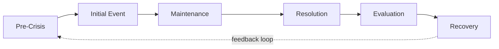

## Crisis and Emergency Risk Communication (CERC) Model

### Overview

The Crisis and Emergency Risk Communication (CERC) model was developed by the U.S. Centers for Disease Control and Prevention (CDC), drawing substantially on risk communication research by Reynolds and Seeger, to guide public health and emergency communication before, during, and after crises. Unlike SCCT or Image Repair Theory, which focus primarily on protecting organizational reputation, CERC is oriented around protecting public safety and wellbeing, with reputation management treated as a secondary but related outcome of effective, trustworthy communication.

### Theoretical Foundations

**Key Points**

- CERC integrates principles from psychology, risk perception research, and public health communication, emphasizing that people under acute stress process information differently than under normal conditions.
- The model assumes that in high-stress situations, audiences want to know they are being told the truth, that the communicator understands their concerns, and that honest information is being given as quickly as possible — even before all facts are confirmed.
- CERC treats communication as an ongoing, adaptive process rather than a single message event, structured around the natural life cycle of an emergency.

### The Six Stages of CERC

**1. Pre-Crisis**

- Risk messages, warnings, and preparations occur before a crisis manifests.
- Focus: building partnerships, pre-testing messages, establishing credible spokespeople and trusted channels in advance.

**2. Initial Event**

- The crisis begins; uncertainty is highest, and the priority is on reducing confusion and expressing empathy.
- Focus: acknowledge the event, express empathy, provide simple guidance for immediate self-protective action, commit to follow-up information.

**3. Maintenance**

- Ongoing crisis communication as more facts become available.
- Focus: continue correcting rumors and misinformation, provide deeper background, help audiences understand risk more accurately.

**4. Resolution**

- The immediate crisis subsides; communication shifts to updates on recovery status.
- Focus: provide information about resuming normal activities, discuss causes and future prevention if known.

**5. Evaluation**

- Post-crisis analysis of the communication response itself.
- Focus: assess what worked, what did not, and refine plans and materials.

**6. Recovery / Ongoing**

- Long-term communication regarding rebuilding, policy changes, and lessons learned.
- Focus: sustained engagement with affected communities as normalcy is restored.

### CERC Lifecycle Diagram

### The Six Principles of CERC Messaging

**Key Points**

- **Be First**: Information vacuums are quickly filled by speculation and rumor; timely communication, even if incomplete, is prioritized over waiting for complete certainty.
- **Be Right**: Accuracy must still be maintained even under time pressure; being first should not come at the cost of releasing verifiably false information.
- **Be Credible**: Honesty and transparency, including disclosing uncertainty, build long-term trust more effectively than false reassurance.
- **Express Empathy**: Acknowledging the emotional and psychological impact of the crisis on affected people is treated as a communication necessity, not a soft add-on.
- **Promote Action**: Give people concrete, actionable steps they can take to protect themselves or others, which reduces feelings of helplessness.
- **Show Respect**: Communicating respectfully with affected communities, regardless of their initial reaction, supports continued cooperation and message uptake.

[Inference] These six principles are frequently summarized this way across CDC training materials and public health communication literature, though exact wording and emphasis have varied slightly across different CDC CERC publications and training editions over time.

### Psychology of Crisis Audiences (CERC's Behavioral Basis)

**Key Points**

- Under high stress, audiences typically exhibit reduced capacity to process complex information, a phenomenon CERC training materials often describe using the general finding that stress narrows cognitive processing and simplifies message uptake.
- People under acute threat tend to seek out and trust information from sources perceived as caring and honest over sources perceived merely as technically authoritative.
- Rumor and misinformation proliferate rapidly in information vacuums, particularly in modern social media contexts, making "Be First" a practical necessity rather than a stylistic preference.

[Unverified] Specific percentages or cognitive processing statistics sometimes cited in secondary CERC training materials (e.g., claims about exact information retention rates under stress) vary across sources and should be verified against the current CDC CERC manual rather than assumed as fixed figures.

### CERC Message Construction Template

**Example**

A CERC-aligned initial statement during a public health emergency (e.g., a localized disease outbreak) typically follows this structure:

1. **Acknowledge**: "We are aware of [event] affecting [community/population]."
2. **Empathize**: "We understand this is frightening, especially for [affected group]."
3. **Action**: "At this time, we recommend [specific, simple action]."
4. **Commitment**: "We will update you [specific timeframe] as more information becomes available."
5. **Source credibility**: "This information comes from [credible source/agency]."

### Comparative Positioning: CERC vs. SCCT vs. Image Repair Theory

| Dimension | CERC | SCCT | Image Repair Theory |
| --- | --- | --- | --- |
| Primary Goal | Public safety and informed action | Organizational reputation protection | Rhetorical self-defense |
| Origin Domain | Public health / emergency management | Attribution psychology / PR research | Rhetorical criticism |
| Time Orientation | Full lifecycle (pre-crisis through recovery) | Primarily during/immediately after crisis | Primarily during/after, often retrospective analysis |
| Core Emphasis | Speed, accuracy, empathy, actionable guidance | Matching response to attributed responsibility | Selecting persuasive strategy categories |
| Best Fit Context | Public health emergencies, natural disasters, mass casualty events | Corporate/organizational reputational crises | Political and personal apologia, corporate misconduct statements |

### Applying CERC in a Corporate Context

**Example**

*Scenario*: A data breach exposes customer personal information at a mid-sized financial services firm.

Applying CERC stages:

1. **Initial Event**: Within hours, the firm issues a statement acknowledging the breach, expressing concern for affected customers, and providing an immediate action step (e.g., "monitor your accounts; a dedicated hotline is now active").
2. **Maintenance**: Over subsequent days, the firm provides updates as forensic investigation clarifies scope, corrects any inaccurate media reports, and offers credit monitoring services.
3. **Resolution**: Once the breach is contained, the firm communicates remediation steps taken and any regulatory findings.
4. **Evaluation**: Internal review of communication timeliness and accuracy, informing updates to the incident response communication plan.
5. **Recovery**: Longer-term transparency reporting (e.g., a public security roadmap) rebuilds trust over time.

### Common Failure Modes

**Key Points**

- **Over-optimizing for "Be Right" at the expense of "Be First"**: Waiting for perfect certainty before any communication cedes the narrative to rumor and unofficial sources.
- **Omitting empathy in favor of purely factual/technical messaging**: Technically accurate statements that ignore the emotional state of affected audiences are frequently perceived as cold or dismissive.
- **Failing to provide an actionable step**: Statements that describe a problem without giving people something concrete to do increase anxiety and reduce perceived organizational competence.
- **Treating CERC as a single-message event rather than a lifecycle process**, leading to communication gaps during the Maintenance stage when public attention and misinformation risk remain high.

### Practical Application Checklist

- Map current crisis status to the appropriate CERC lifecycle stage before drafting messaging.
- Apply all six principles (First, Right, Credible, Empathy, Action, Respect) as a review checklist for every crisis statement, not just the initial one.
- Ensure every public statement includes at least one concrete, actionable step for the audience.
- Schedule proactive update cadences during the Maintenance stage to prevent information vacuums, rather than waiting to be asked.
- Conduct a formal Evaluation stage review after crisis resolution to refine templates and training for future events.

### Related Topics

- Situational Crisis Communication Theory (SCCT) as a Comparative Framework
- Risk Perception Psychology and Public Trust Formation
- Rumor Control and Misinformation Management in Digital Crises
- Public Health Emergency Communication Case Studies
- Spokesperson Empathy Training for High-Stress Communication
- Post-Crisis Evaluation Methodologies and After-Action Reviews