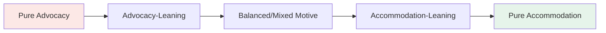
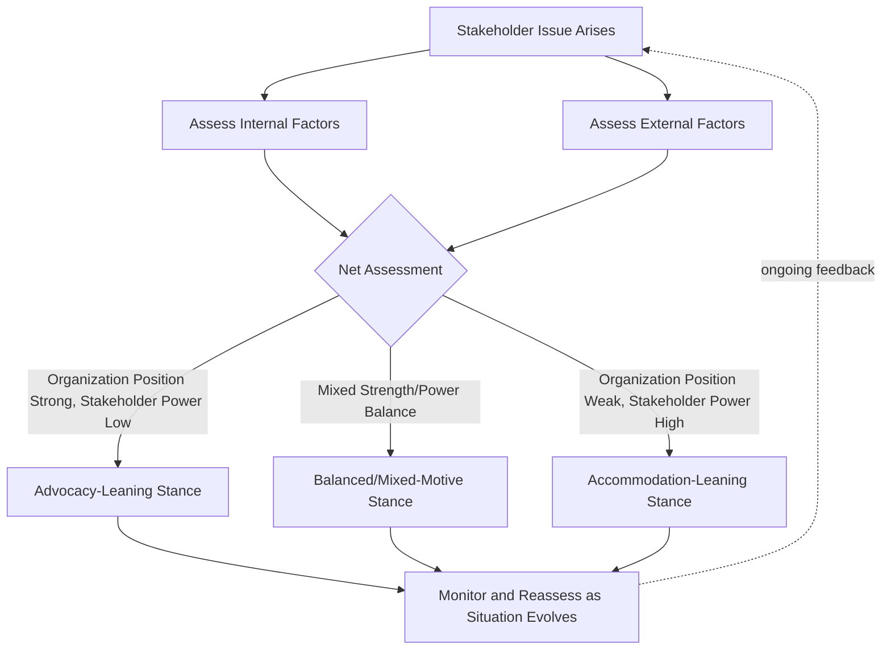

## Contingency Theory of Accommodation

### Overview

The Contingency Theory of Accommodation, developed principally by Cancel, Cameron, Sallot, and Mitrook in the mid-1990s, is a public relations framework that models organizational stance toward a stakeholder or public as a dynamic position along a continuum ranging from pure advocacy to pure accommodation. Unlike SCCT or CERC, which focus on message strategy during a discrete crisis event, Contingency Theory addresses the broader, ongoing question of how much an organization should adjust its own position to accommodate a stakeholder's demands, and why that position shifts across situations and over time.

### Theoretical Foundations

**Key Points**

- Contingency Theory emerged partly as a critique of the "Excellence Theory" in public relations, which had proposed two-way symmetrical communication as a normative ideal; contingency theorists argued that pure symmetry is rarely observed in practice and that organizations realistically move along a continuum based on situational factors.
- The theory's central construct is the **stance continuum**, anchored at one end by pure advocacy (the organization argues exclusively for its own position with no concession) and at the other end by pure accommodation (the organization fully adopts the stakeholder's position).
- Organizational stance is treated as inherently unstable and situational: the same organization may occupy different points on the continuum simultaneously with different stakeholder groups, and its position with any single stakeholder can shift as circumstances change.

### The Stance Continuum

**Key Points**

- Pure advocacy: The organization defends its position with no willingness to change; typically used when the organization believes it holds legitimate authority, factual correctness, or overriding legal/safety constraints.
- Pure accommodation: The organization concedes fully to stakeholder demands; typically used when stakeholder power is high, the organization's position is weak, or public trust is severely damaged.
- Most real-world organizational stances fall somewhere in the middle, and contingency theorists have identified dozens of factors that predict where on the continuum an organization is likely to land in a given situation.

### Contingent Factors

The theory identifies a large set of internal and external variables (over 80 in some published inventories) that influence stance. These are commonly grouped into internal and external categories.

**Internal Factors**

- Organizational characteristics (size, culture, structure, decision-making speed)
- Characteristics of the public relations department (level of influence/access to dominant coalition, professionalism)
- Characteristics of dominant coalition/senior leadership (values, risk tolerance, prior experience with the issue)
- Individual characteristics of negotiators/spokespersons involved
- Organizational reputation and credibility history with the stakeholder

**External Factors**

- Political/social environment (regulatory climate, activist pressure, media environment)
- The external public itself (its size, power, willingness to negotiate, legitimacy of its claims)
- Threat level posed by the issue (litigation risk, potential for boycott, regulatory penalty)
- Industry environment and competitive context
- General characteristics of the situation (urgency, complexity, availability of resources for response)

[Inference] The exact number and categorization of contingent factors has varied somewhat across successive publications by the original theorists as the framework was refined; practitioners generally treat the list as an illustrative, non-exhaustive inventory of relevant considerations rather than a fixed closed set.

### Stance Determination Model

### Worked Example

**Example**

*Scenario*: A manufacturing company faces a community activist group's demand to halt a factory expansion over environmental concerns.

**Internal factor assessment**: The company has a strong balance sheet (favors advocacy), but has a documented history of prior environmental violations in the same community (favors accommodation).

**External factor assessment**: The activist group has significant local media relationships and has recently succeeded in halting a similar project elsewhere (favors accommodation); however, regulatory review has already approved the expansion on environmental grounds (favors advocacy).

**Resulting stance**: Given the mixed signals but the activist group's demonstrated power and the company's negative crisis history, a mixed-motive stance is likely: the company proceeds with the expansion (partial advocacy) while offering substantive concessions such as independent environmental monitoring, a community advisory board, and revised emissions commitments (partial accommodation).

### Comparative Positioning: Contingency Theory vs. SCCT vs. Excellence Theory

| Dimension | Contingency Theory | SCCT | Excellence Theory |
| --- | --- | --- | --- |
| Core Question | How much should we accommodate this stakeholder? | What response strategy fits this crisis's attributed responsibility? | Is our communication two-way and symmetrical? |
| Unit of Analysis | Organization-stakeholder relationship stance | Crisis event and response strategy | Organizational communication program structure |
| Normative Stance | Descriptive/predictive; no single "ideal" stance | Prescriptive strategy matching | Normative ideal (symmetry as excellence) |
| Time Orientation | Ongoing, relationship-level, pre- and post-crisis | Primarily during/immediately after a discrete crisis | Long-term organizational communication philosophy |
| Key Limitation | Large number of factors makes precise prediction difficult | Less applicable to ongoing stakeholder relationship management | Criticized as an idealized standard rarely achieved in practice |

### Relationship to Crisis and Reputation Management

**Key Points**

- Contingency Theory helps explain *why* organizations sometimes choose seemingly inconsistent stances across simultaneous crises or stakeholder groups — differing contingent factors legitimately produce different optimal stances.
- It complements SCCT by providing the relational/political context in which an SCCT-recommended strategy (e.g., "rebuild") is actually implemented: an organization may know rebuild-type accommodation is warranted but be constrained by internal factors (e.g., legal resistance) from moving fully toward that end of the continuum.
- The theory is particularly useful for issues management and activist relations, where the "crisis" is often a prolonged negotiation rather than a single acute event.

### Common Misapplications

**Key Points**

- Treating the continuum as a fixed organizational trait ("we are an accommodating company") rather than a situational, per-stakeholder, per-issue assessment.
- Failing to reassess stance as contingent factors change during a prolonged issue (e.g., a shift in regulatory environment or stakeholder coalition strength mid-crisis).
- Assuming pure accommodation is always the "safest" reputational choice; contingency theorists note that over-accommodation can damage credibility with other stakeholder groups or invite further escalating demands if perceived as a sign of organizational weakness.

### Practical Application Checklist

- Identify the specific stakeholder/public and issue before assessing stance; do not assume a single organization-wide stance applies uniformly across all relationships.
- Systematically review key internal factors (leadership risk tolerance, PR department influence, prior reputation) and external factors (stakeholder power, legitimacy, regulatory/media environment) relevant to the issue.
- Position the organizational response along the advocacy-accommodation continuum deliberately, rather than defaulting reflexively to either extreme.
- Reassess stance periodically as contingent factors shift, particularly in prolonged issues or activist campaigns.
- Coordinate contingency-based stance decisions with legal and executive stakeholders, since stance often has direct negotiation, litigation, and resource implications.

### Related Topics

- Excellence Theory and Two-Way Symmetrical Communication
- Situational Crisis Communication Theory (SCCT) as a Comparative Framework
- Issues Management and Activist Relations Strategy
- Stakeholder Power and Legitimacy Assessment Models
- Negotiation Theory Applications in Public Relations
- Organizational Reputation History and Its Effect on Stakeholder Trust