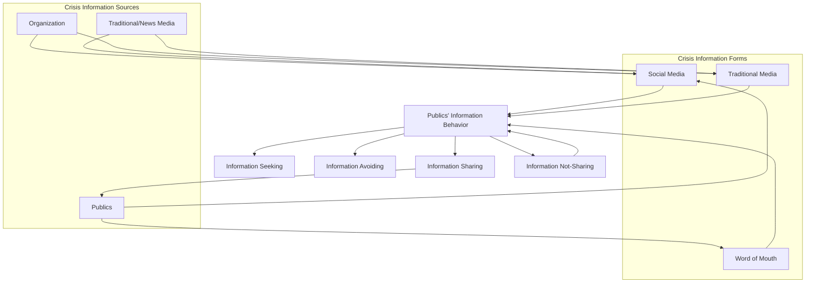

## Social Mediated Crisis Communication (SMCC) Model

### Overview

The Social Mediated Crisis Communication (SMCC) Model, developed primarily by Lucinda Austin, Brooke Fisher Liu, and Yan Jin beginning around 2010–2011, is a theoretical framework that explains how publics process, seek, and share crisis information across social and traditional media channels during an organizational crisis. It extends earlier crisis communication theory—most notably Situational Crisis Communication Theory (SCCT)—by explicitly modeling the *public's* information behaviors rather than focusing solely on the organization's response strategy selection. The SMCC model treats crisis communication as a multidirectional, networked process involving the organization, traditional media, social media influencers, and the public, rather than a one-directional broadcast from organization to audience.

### Theoretical Origins and Positioning

**Key Points**

- Builds on and complements SCCT (Coombs), which focuses on matching crisis response strategies to crisis types and attributed responsibility
- Addresses a gap SCCT does not cover: how information *flows* and how publics *behave* once a crisis message enters a fragmented, socially networked media environment
- Grounded empirically in survey and experimental research conducted in the aftermath of real crises (e.g., studies following events like the 2010 BP oil spill and various organizational crises)
- Positions crisis communication as occurring within a "crisis communication ecology" — a system of interdependent information sources and channels

[Inference] The model's continued refinement across multiple published iterations (2011, 2012, 2016) reflects an intent to keep pace with evolving social media platform behaviors rather than a single fixed theoretical statement.

### Core Components of the Model

The SMCC model is typically described through three interacting dimensions: **crisis information form**, **crisis information source**, and **publics' information behavior**.

#### 1. Crisis Information Form

This refers to the medium/channel through which crisis information travels. The model identifies three forms:

- **Social media** — owned channels (organizational social accounts), earned channels (media/influencer social accounts), and third-party/external social platforms (forums, review sites)
- **Traditional media** — television, radio, print, and their online counterparts
- **Word-of-mouth (offline)** — interpersonal, face-to-face communication that still influences crisis perception

#### 2. Crisis Information Source

Sources are the originators or relayers of crisis-related messages. The SMCC model identifies three primary source types:

- **Organizations** — the entity experiencing the crisis, communicating through official channels
- **Media** — journalists and traditional news outlets, including their social media presences
- **Publics** — individuals and groups who create and share crisis-related content, further subdivided into:
  - Influential social media creators (bloggers, "social media influentials")
  - Followers of influential creators
  - Social media inactives (those who consume but do not create/share)

#### 3. Publics' Crisis Information Behavior

This is the model's most distinctive contribution — a typology of how people behave when encountering crisis information, organized around two behavioral dimensions:

- **Information seeking vs. information avoiding**
- **Information sharing/forwarding vs. information not-sharing**

Combining these dimensions produces four behavioral types commonly cited in SMCC literature:

- **Information seeking** — actively searching for crisis updates across channels
- **Information sharing** — forwarding, retweeting, or otherwise disseminating crisis information to one's own network
- **Information avoiding** — deliberately disengaging from crisis content
- **Information not-sharing** — consuming crisis information without further disseminating it

### The Crisis Communication Process Under SMCC

**Key Points**

- Crisis information can originate from *any* of the three source types (organization, media, or public), not only the organization — a major departure from traditional linear crisis communication models
- Once released, information circulates through a network of "form × source" combinations (e.g., a journalist's tweet, an organization's press release picked up by a blog, a bystander's eyewitness video)
- Publics' pre-crisis relationship with the organization, prior reputation, and perceived crisis severity moderate how they seek/avoid and share/withhold information
- The model emphasizes that publics are simultaneously *consumers and producers* (a "prosumer" dynamic) of crisis content, which can amplify, distort, or counter the organization's official narrative

### Diagram: SMCC Information Flow (svg_diagram)

### Application to Crisis & Reputation Management Practice

#### Strategic Implications for Practitioners

- **Multi-channel monitoring is mandatory** — because information can originate from publics or media rather than only the organization, practitioners must monitor social listening tools across platforms, not just their owned channels
- **Influencer identification** — since "social media creators" disproportionately shape narrative spread, identifying and engaging credible third-party voices (journalists, subject-matter influencers) early can shape the information ecology
- **Segmentation by behavior type** — messaging strategy can be tailored: informational depth for "seekers," easily shareable/concise content for "sharers," and reassurance-oriented content for "avoiders" who may be highly anxious rather than disengaged
- **Speed and first-mover positioning** — because publics and media can originate crisis narratives faster than official statements, the model implicitly supports the "stealing thunder" principle (disclosing crisis information before it is broken by another source) as a way to control initial framing

#### Example

A data breach at a retail company is first reported not by the company but by a security researcher's tweet (public-as-source, social media form). Under an SMCC-informed response, the company would:

1. Monitor social channels to detect the researcher's post rapidly (behavioral monitoring)
2. Assess whether affected customers are in "seeking" or "avoiding" mode via sentiment/engagement analysis
3. Release a factual statement simultaneously across owned social media and traditional press channels (multi-form dissemination) rather than a single press release
4. Equip identified sympathetic influencers/journalists with accurate information to reduce misinformation spread through the "sharing" pathway

### Relationship to Other Crisis Communication Theories

| Theory | Primary Focus | Relationship to SMCC |
| --- | --- | --- |
| Situational Crisis Communication Theory (SCCT) | Matching response strategy to crisis type/attributed responsibility | SMCC extends SCCT by modeling *channel and public behavior*, often used together |
| Image Restoration Theory (Benoit) | Rhetorical strategies for defending organizational image | Focuses on message content; SMCC focuses on message flow and audience behavior |
| Diffusion of Innovations | Spread of ideas/products through a social system over time | Shares interest in network spread, but SMCC is crisis-specific and behavior-typology-based |
| Two-Step Flow Theory | Opinion leaders mediate media effects on the public | Conceptual ancestor of SMCC's "social media creators/followers" source distinction |

### Empirical Support and Critiques

**Key Points**

- Multiple studies using the SMCC framework have found that source credibility and channel choice significantly affect publics' trust and behavioral intentions during crises
- [Unverified] Some scholars have noted that the model's behavioral typology (seeking/avoiding × sharing/not-sharing) can oversimplify a continuum of engagement into discrete categories, and real-world behavior may shift dynamically within a single crisis lifecycle
- Later extensions of the model (sometimes termed SMCC 2.0 or refined iterations) incorporated **crisis stage** (pre-crisis, crisis response, post-crisis) as a moderating temporal dimension, recognizing that source/form preferences change over the crisis lifecycle
- [Inference] Because the model was formulated in the early 2010s, its original channel assumptions (blog-centric influencer model) may require adaptation for short-form video and algorithm-driven platforms that have since become dominant; practitioners should treat the core behavioral logic as more durable than the specific platform examples used in foundational papers

### Limitations

- The model is descriptive/explanatory rather than strongly predictive — it helps categorize behavior but offers less precise guidance on *which specific response strategy* to deploy (that remains SCCT's domain)
- Measuring the four behavioral types in real time requires robust social analytics infrastructure, which may not be available to smaller organizations
- Cross-cultural validity has been tested in a limited number of national contexts; behavioral patterns around information sharing/avoiding may vary by cultural context and platform regulation environment [Unverified]

**Next Steps**

- Situational Crisis Communication Theory (SCCT) and crisis response strategy matching
- Image Restoration/Repair Theory (Benoit)
- Stealing Thunder as a crisis disclosure strategy
- Crisis lifecycle staging (pre-crisis, crisis, post-crisis) frameworks
- Social listening and sentiment analysis tools for crisis monitoring
- Diffusion of Innovations and Two-Step Flow Theory as conceptual precursors
- Rhetorical Arena Theory (multivocal crisis communication)
- Case study: application of SMCC to a specific real-world corporate crisis