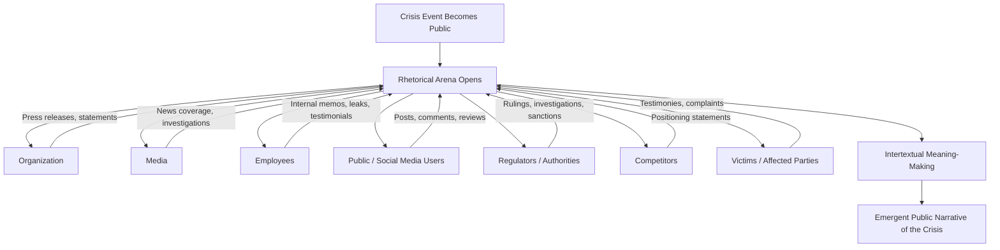

## Rhetorical Arena Theory

### Overview

Rhetorical Arena Theory is a crisis communication framework developed by Finn Frandsen and Winni Johansen at Aarhus University, building on and extending Situational Crisis Communication Theory (SCCT) and Image Restoration Theory. It reframes crisis communication away from a single-organization, single-message model and toward a multi-voiced, multi-genre "arena" in which numerous stakeholders simultaneously produce and consume crisis communication.

The theory's central claim is that a crisis is not a discrete event managed by one organization broadcasting to a passive audience. Instead, a crisis generates a rhetorical arena: a shared communicative space where the focal organization, the media, employees, customers, competitors, regulators, activist groups, and bystanders all speak at once, in different genres, for different purposes, often contradicting or amplifying one another. Crisis communication, in this view, is best studied and managed as an ecosystem of interacting texts rather than as a single organizational response.

### Core Concepts

**The Rhetorical Arena**

The arena is the theory's central metaphor: a bounded but dynamic space (physical, textual, and increasingly digital) in which a crisis "plays out" through the interaction of many voices. Key properties of the arena:

- It contains multiple senders, not just the crisis-afflicted organization.
- It contains multiple genres of text operating simultaneously (press releases, news articles, tweets, internal memos, customer complaints, regulatory statements).
- Texts within the arena reference, react to, and reshape one another — meaning is produced intertextually, not by any single sender.
- The arena has a temporal dimension: it opens when a crisis becomes public and evolves as new texts are added.

**Multivocality**

Traditional crisis communication models (e.g., early SCCT) focus almost exclusively on the organization's chosen response strategy. Rhetorical Arena Theory insists that the organization is only one voice among many competing to define the crisis. Journalists, victims, regulators, and online commentators each contribute a version of events, and the "meaning" of the crisis emerges from the interplay of these accounts rather than from the organization's messaging alone.

**Genre**

Frandsen and Johansen draw on genre theory to argue that each stakeholder group produces crisis communication in genres appropriate to its role: press releases and press conferences (organization), news reports and investigative pieces (media), tweets and forum posts (public), internal memos (employees), incident reports (regulators). Genres carry their own conventions, credibility signals, and audiences, and studying only the organization's genre gives an incomplete picture of the crisis.

**Three Analytical Dimensions**

The theory is often operationalized along three dimensions that structure analysis of any crisis case:

1. **Textual dimension** — analysis of the content, rhetoric, and strategies within individual texts (e.g., applying Image Restoration Theory or SCCT response-strategy typologies to a single press release).
2. **Contextual dimension** — analysis of the situational factors surrounding the crisis: industry, regulatory environment, organizational history, national culture.
3. **Intertextual/interdiscursive dimension** — analysis of how texts from different senders and genres relate to, borrow from, and contest one another within the arena. This is the dimension unique to Rhetorical Arena Theory and the one most responsible for differentiating it from earlier, single-text-focused models.

### Relationship to Other Frameworks

**Versus Situational Crisis Communication Theory (SCCT)**

SCCT (Coombs) focuses on matching response strategies (denial, diminishment, rebuilding, bolstering) to crisis type and attributed responsibility, largely from the organization's perspective. Rhetorical Arena Theory does not discard SCCT — it treats SCCT's strategy typology as a useful tool for the *textual* dimension of analysis — but argues SCCT alone is incomplete because it ignores the surrounding arena of competing voices.

**Versus Image Restoration Theory**

Image Restoration Theory (Benoit) similarly analyzes an accused party's rhetorical strategies for repairing reputation after an offense. Rhetorical Arena Theory subsumes this as one lens for the textual dimension while insisting that image restoration efforts must be understood against what other arena participants are simultaneously saying.

**Complementary Positioning**

[Inference] Frandsen and Johansen have generally positioned Rhetorical Arena Theory as a meta-framework or "second-order" theory that integrates existing crisis-response typologies rather than replacing them, using the arena concept to explain *why* a single organization's chosen strategy so often fails to control the narrative.

### Structural Model of the Arena

This diagram illustrates the key structural claim: the "meaning" of a crisis (N) is not authored by the organization directly but emerges from intertextual exchange (I) among all arena participants.

### Practical Example

**Scenario:** A food manufacturer discovers a contamination issue in a popular product line.

- **Organizational text:** The company issues a press release using an SCCT "rebuild" strategy (apology + corrective action + compensation).
- **Media text:** Investigative journalists publish an article citing an anonymous employee who claims management knew about contamination risks months earlier, contradicting the company's "isolated incident" framing.
- **Employee text:** Internal memos leak via social media, adding a competing internal-voice account.
- **Public text:** Consumers on social platforms circulate photos and personal accounts of illness, generating a grassroots narrative independent of any official statement.
- **Regulatory text:** A food safety authority releases a preliminary investigation statement that partially corroborates the media account.

Under a purely organization-centric model (e.g., SCCT alone), analysts would evaluate only whether the company's chosen strategy (rebuild) matched the attributed crisis type. Rhetorical Arena Theory instead requires mapping all five text streams, showing how the leaked memo undermines the credibility of the company's "isolated incident" claim and how the regulator's statement shifts public perception independent of the company's messaging — explaining why the company's carefully chosen SCCT strategy failed to contain reputational damage.

### Methodological Implications

- **Case selection**: Researchers using this framework typically select high-profile, well-documented crises where multiple text types (press releases, news coverage, social media, internal documents) are available for comparison.
- **Data corpus**: Rather than analyzing a single organizational statement, analysts assemble a corpus spanning all identifiable arena participants.
- **Coding approach**: Texts are coded both for internal rhetorical strategy (textual dimension, often via SCCT or Image Restoration Theory categories) and for their intertextual relationships (referencing, contradicting, amplifying other texts).
- **Temporal mapping**: Because the arena evolves over time, many applications track how the dominant narrative shifts across the crisis lifecycle rather than treating the crisis as a single frozen moment.

### Strengths and Limitations

**Strengths**

- Captures the reality of contemporary crises, where social media and 24-hour news make single-source narrative control largely impossible.
- Provides an integrative structure that incorporates rather than discards earlier response-strategy models.
- Directs attention to stakeholder groups (employees, regulators, competitors) often neglected in organization-centric models.

**Limitations**

- [Inference] The framework is more useful as a descriptive/analytical lens for researchers and case-study analysis than as a prescriptive step-by-step operational playbook for practitioners in the middle of an active crisis, since it does not by itself specify which strategy an organization should choose.
- Assembling a full multi-voice corpus is resource-intensive, which can make the framework harder to apply in real-time crisis response compared to more streamlined models like SCCT.
- The boundaries of "the arena" (which voices count, how far intertextual tracing should extend) are not rigidly defined and require analyst judgment.

### Key Points

- Rhetorical Arena Theory treats crisis communication as a multi-voiced, multi-genre ecosystem rather than a single organizational message.
- It integrates, rather than replaces, SCCT and Image Restoration Theory by using them as tools for analyzing the textual dimension within the arena.
- Three analytical dimensions structure its application: textual, contextual, and intertextual/interdiscursive — the last being its distinctive contribution.
- Meaning during a crisis emerges from the interaction of texts across the arena, not from the crisis-afflicted organization's statements alone.
- The framework is primarily academic/analytical in origin, developed for studying how crisis narratives form across stakeholders.

### Related Topics

- Situational Crisis Communication Theory (SCCT)
- Image Restoration Theory / Image Repair Theory
- Contingency Theory of Accommodation
- Stakeholder Theory in Crisis Communication
- Intertextuality and Genre Theory
- Social-Mediated Crisis Communication Model (SMCC)
- Crisis Lifecycle Models (pre-crisis, crisis, post-crisis phases)
- Narrative Paradigm Theory applied to crisis discourse