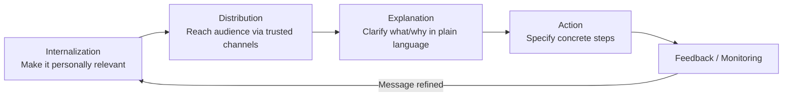

## The IDEA Model and Integrated Crisis Mapping


### Overview

The IDEA model is a risk and crisis communication framework developed primarily by Robert Sellnow-Richmond, Deanna Sellnow, and Timothy Sellnow, oriented around instructional and explanatory communication rather than purely reputation-repair rhetoric. IDEA stands for **Internalization, Distribution, Explanation, Action**, and the model is designed to help publics understand what is happening during a crisis and what they should do about it, especially in risk contexts such as natural disasters, disease outbreaks, and infrastructure failures. Integrated Crisis Mapping (ICM) is a complementary analytical framework, developed by Timothy Coombs and Sherry Holladay, that plots crisis types along two dimensions to help predict stakeholder emotional and behavioral responses. The two frameworks are often taught together because both extend beyond message-strategy selection (as in SCCT or Image Restoration Theory) into audience cognition, emotion, and behavior.

### Part 1: The IDEA Model

**Origins and Purpose**

The IDEA model emerged from instructional risk and crisis communication research, particularly work on best practices for communicating during health emergencies, severe weather events, and technological accidents. Unlike SCCT, which centers on protecting organizational reputation, IDEA centers on effectively transmitting actionable, comprehensible information so that affected publics can make good decisions and take protective action.

**The Four Components**

**1. Internalization**

The message must be relevant and personally meaningful to the receiver before they will act on it. Internalization concerns how a message helps individuals understand that the risk applies to *them specifically*, not to an abstract "public."

- Techniques: personalized risk framing, local/geographic specificity, relatable examples, addressing the audience's specific circumstances.
- Failure mode: generic, one-size-fits-all warnings that recipients perceive as "not about me," leading to inaction (optimistic bias).

**2. Distribution**

The message must reach the intended audience through channels they actually use and trust, delivered with appropriate timeliness.

- Techniques: multi-channel dissemination (broadcast media, SMS/emergency alerts, social media, community networks), redundancy across channels, attention to access barriers (language, disability, connectivity, literacy).
- Failure mode: reliance on a single channel that excludes vulnerable or hard-to-reach populations.

**3. Explanation**

The message must clearly convey what is happening, why it is happening, and what the risk entails, in language the audience can understand.

- Techniques: plain language, avoidance of jargon, use of analogies, visual aids, addressing uncertainty honestly (what is known vs. unknown).
- Failure mode: overly technical or hedged language that leaves the audience confused about the severity or nature of the threat.

**4. Action**

The message must specify concrete, achievable steps the audience should take in response to the risk or crisis.

- Techniques: specific, sequenced instructions ("do X, then Y"), avoidance of vague directives ("be careful," "stay safe"), and providing self-efficacy cues (making the action feel achievable).
- Failure mode: messages that convey danger but no clear behavioral guidance, which can increase anxiety without producing protective action.

**IDEA as a Sequential and Iterative Process**



[Inference] While the acronym implies a linear order, IDEA is generally applied iteratively in practice: crisis communicators monitor audience comprehension and behavior after distribution and revise the explanation or action components as the situation evolves, rather than treating the four components as a strict one-time sequence.

**Practical Example: Wildfire Evacuation Notice**

- **Internalization:** "Residents in Zone 3 (Hillcrest, Oak Ridge, and Pine Valley) are within the projected fire path" rather than "residents in the affected area."
- **Distribution:** Simultaneous push via emergency SMS alert system, local radio, county social media accounts, and door-to-door notification for residents without phone access.
- **Explanation:** "Winds are pushing the fire northeast at an estimated 2 miles per hour toward Zone 3. Containment is currently at 15 percent."
- **Action:** "Evacuate via Highway 12 North by 6 PM today. Bring medications, identification, and pets. Do not use Route 9, which is currently blocked."

### Part 2: Integrated Crisis Mapping (ICM)

**Origins and Purpose**

Integrated Crisis Mapping, developed by Coombs and Holladay, extends SCCT by incorporating emotional response prediction. Where SCCT primarily addresses *attribution of responsibility* and matching response strategies to reputational threat level, ICM adds a dimension for predicting which discrete emotions (anger, fear/anxiety, sadness) stakeholders are likely to feel, since different emotions drive different behavioral consequences (e.g., anger tends to drive boycotts and negative word-of-mouth more than sadness does).

**The Two Dimensions**

**1. Organizational Engagement (Internal ↔ External)**

Whether the crisis originates from and is primarily attributable to the organization's own internal actions/decisions, or from external/environmental factors largely outside the organization's control.

**2. Organizational Control (Strong ↔ Weak)**

Whether the crisis was one the organization could have reasonably prevented or controlled (strong control, e.g., negligence, misconduct) versus one largely outside its control (weak control, e.g., natural disaster, third-party sabotage).

**The Resulting Quadrant Map**

```mermaid
quadrantChart
    title Integrated Crisis Mapping (ICM)
    x-axis Weak Control --> Strong Control
    y-axis External --> Internal
    quadrant-1 Victim Cluster (low anger, high sympathy)
    quadrant-2 Accidental Cluster (moderate anger)
    quadrant-3 Preventable/Intentional Cluster (high anger)
    quadrant-4 Challenge Cluster (accusation-driven anger)
```

Note: this is a conceptual quadrant illustration; exact axis labels vary slightly across published versions of the model. [Inference] Coombs and Holladay's original formulation groups crisis types into clusters — often labeled Victim, Accidental, and Preventable/Intentional — based on where they fall on these two dimensions, with the Victim cluster (e.g., natural disaster, rumor, workplace violence by an outsider) generating the least attributed responsibility and anger, and the Preventable cluster (e.g., organizational misdeeds, management misconduct) generating the highest.

**Emotional and Behavioral Implications**

| Cluster | Organizational Responsibility | Dominant Stakeholder Emotion | Likely Behavioral Response |
| --- | --- | --- | --- |
| Victim | Low | Sympathy, mild concern | Support, goodwill |
| Accidental | Moderate | Mixed concern/frustration | Cautious continued patronage |
| Preventable/Intentional | High | Anger | Boycotts, negative WOM, reputational punishment |

This table is a simplified synthesis; actual stakeholder response varies by crisis history, prior reputation, and cultural context, and should be treated as directional rather than deterministic. [Unverified]

### Integrating IDEA and ICM in Practice

[Inference] Although developed independently, the two models are complementary in application: ICM helps a communicator anticipate *which emotional register* a crisis is likely to trigger (guiding tone and empathy level), while IDEA structures *how to construct the actual message* so that it is internalized, properly distributed, clearly explained, and paired with concrete action steps appropriate to that emotional context. For example, a crisis mapped into ICM's high-anger/high-control cluster would call for an IDEA-structured message that leads with acknowledgment and accountability (addressing the anger) before delivering action steps, whereas a low-control/external "Victim cluster" crisis can move more directly into explanation and action without extensive image-repair framing.

### Comparison to Other Core Frameworks

- **Versus SCCT:** SCCT focuses on selecting a reputation-protecting response strategy based on attributed responsibility; ICM extends this by predicting discrete emotional responses that shape which behaviors (boycott vs. continued support) are likely, and IDEA extends this further into practical message construction for audience comprehension and action, particularly in risk/emergency contexts SCCT was not originally designed for.
- **Versus Rhetorical Arena Theory:** Rhetorical Arena Theory addresses the multi-voice, multi-genre communicative ecosystem surrounding a crisis; IDEA and ICM operate more at the level of message design and audience psychology within that ecosystem, and can be seen as tools for constructing effective texts within any given arena participant's contribution (particularly the organization's or an authority's).

### Key Points

- IDEA (Internalization, Distribution, Explanation, Action) is an instructional risk/crisis communication model focused on effective, actionable public messaging rather than reputation repair alone.
- IDEA is best understood as an iterative message-design and monitoring process, not a strict one-pass sequence.
- Integrated Crisis Mapping (ICM) extends SCCT by mapping crisis types along Internal/External and Strong/Weak Control dimensions to predict stakeholder emotions (sympathy, concern, anger) and resulting behaviors.
- ICM's clusters (commonly Victim, Accidental, Preventable/Intentional) correlate with escalating attributed responsibility and escalating anger.
- IDEA and ICM are complementary: ICM anticipates the emotional register of stakeholder response; IDEA structures the message itself for clarity and actionability.

### Related Topics

- Situational Crisis Communication Theory (SCCT)
- Attribution Theory in crisis communication
- Risk Communication and the Extended Parallel Process Model (EPPM)
- Social-Mediated Crisis Communication Model (SMCC)
- Rhetorical Arena Theory
- Crisis Emotion Theory (Jin, Pang, and Cameron)
- Emergency Public Warning Systems and message design standards (e.g., CAP protocol)
- Discrete Emotions Theory applied to organizational crises