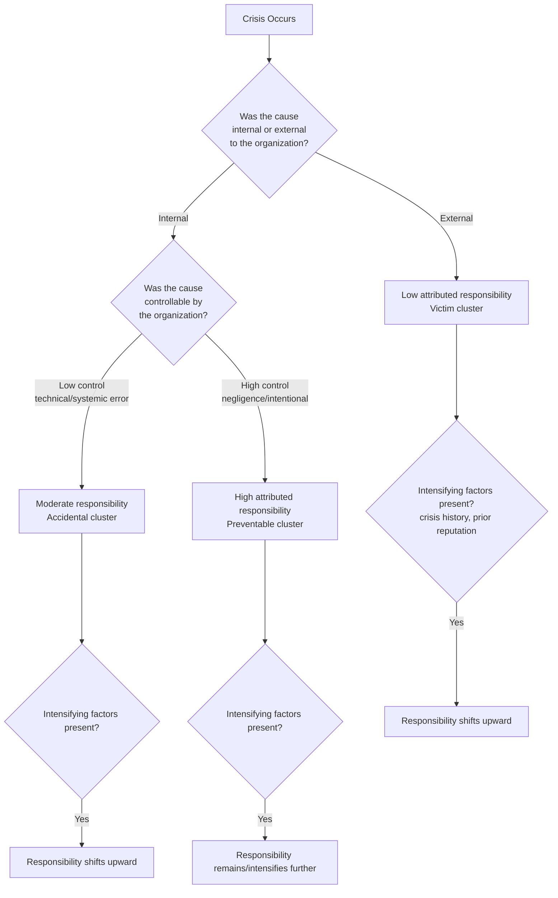

## Attribution Theory and Responsibility Assessment

### Overview

Attribution Theory is a foundational psychological framework, most closely associated with Fritz Heider, Harold Kelley, and Bernard Weiner, that explains how individuals infer the causes of events and assign responsibility for outcomes. In crisis and reputation management, attribution theory serves as the psychological engine underlying most major crisis-response frameworks, most directly Situational Crisis Communication Theory (SCCT), which Timothy Coombs built explicitly on attribution-theoretic foundations. The core premise: stakeholders do not simply react to a crisis event itself — they react to *who or what they believe caused it* and *how much control that party had*. Responsibility assessment is the applied process of determining how much blame stakeholders are likely to assign to an organization, which in turn determines the severity of reputational threat and the appropriate communicative response.

### Foundational Psychological Concepts

**Heider's Naive Psychology**

Heider proposed that people act as "naive scientists," constructing causal explanations for events to make sense of their social world. He distinguished between:

- **Personal (internal) causation** — the outcome is attributed to a person's or organization's disposition, character, or intentional action.
- **Environmental (external) causation** — the outcome is attributed to situational or external forces beyond the actor's control.

**Kelley's Covariation Model**

Kelley extended Heider's work by proposing that people use three types of information to determine whether a cause is internal or external:

1. **Consensus** — Do other similar actors behave the same way in similar situations? (Low consensus suggests internal/dispositional causation specific to this actor.)
2. **Distinctiveness** — Does this actor behave this way only in this specific situation, or consistently across situations? (Low distinctiveness suggests internal causation.)
3. **Consistency** — Does this actor behave this way every time this situation occurs? (High consistency strengthens confidence in the attribution, whichever direction it points.)

**Weiner's Attribution Dimensions**

Weiner's work, particularly influential in SCCT, identified three causal dimensions relevant to emotional and behavioral response:

1. **Locus** — internal (within the actor) vs. external (outside the actor).
2. **Stability** — whether the cause is likely to recur (stable) or was a one-time occurrence (unstable).
3. **Controllability** — whether the actor could have controlled or prevented the cause.

[Inference] Of these three, controllability is generally treated as the most consequential dimension for crisis communication outcomes, because stakeholders who perceive a crisis as having been controllable by the organization tend to experience significantly more anger and assign significantly more blame than stakeholders who perceive it as uncontrollable, even when the severity of the outcome is identical.

### Application to Crisis Communication: The SCCT Bridge

Coombs operationalized attribution theory into a practical crisis-typology system by asking: how much responsibility will stakeholders attribute to the organization for this specific crisis, based on available cues?

**Crisis Clusters by Attributed Responsibility**

| Cluster | Example Crisis Types | Locus | Attributed Responsibility | Reputational Threat |
| --- | --- | --- | --- | --- |
| Victim | Natural disaster, rumor, workplace violence (external actor), product tampering | External | Minimal | Low |
| Accidental | Technical-error accidents, challenges to business practices, technical-error product harm | Mixed | Low–Moderate | Moderate |
| Preventable | Human-error accidents, human-error product harm, organizational misdeeds (management misconduct, regulatory violations, deception) | Internal | High | High |

**Intensifying Factors**

Beyond the base crisis type, several factors intensify attributed responsibility and reputational threat regardless of cluster:

- **Crisis history** — an organization with a track record of similar crises is judged more harshly (perceived as a stable, recurring pattern rather than an isolated incident).
- **Prior relational reputation** — organizations with previously positive reputations receive a degree of attribution "halo" benefit, though this can be overridden by severe intensifiers.
- **Severity of the crisis outcome** — greater harm intensifies attributed responsibility even when the causal locus is identical.

### Responsibility Assessment as a Diagnostic Process

This diagnostic flow mirrors the practical process crisis communicators use: first locate the crisis type on the locus/controllability axes, then adjust for organization-specific intensifying factors before selecting a proportionate response strategy.

### Practical Example

**Scenario A — Low Attribution:** A regional airline cancels flights due to an unprecedented volcanic ash cloud grounding all air traffic in the region.

- **Locus:** External (natural event).
- **Controllability:** None — the airline could not have prevented or predicted the event.
- **Assessment:** Falls into the Victim cluster. Stakeholders are likely to feel sympathy rather than anger. Appropriate response: informational updates, expressions of concern for stranded passengers, minimal defensive posture needed.

**Scenario B — High Attribution:** The same airline is found to have skipped a mandatory safety inspection to save costs, resulting in a mechanical failure.

- **Locus:** Internal (organizational decision).
- **Controllability:** High — the failure was preventable through routine compliance.
- **Assessment:** Falls into the Preventable cluster. Stakeholders are likely to feel significant anger, compounded further if the airline has a prior history of safety violations. Appropriate response: full accountability, corrective action commitments, and likely compensation — denial or minimization strategies would be perceived as further evidence of bad faith and could escalate reputational damage.

### Attribution Errors Relevant to Crisis Contexts

- **Fundamental Attribution Error** — the general human tendency to over-attribute others' behavior to internal/dispositional causes while under-weighting situational factors. In crisis contexts, this means stakeholders and media often default toward internal (organizational fault) attributions even in genuinely ambiguous or externally-caused crises, which is why proactive, transparent framing of external causation matters early in a crisis response.
- **Self-Serving Bias** — organizations themselves tend to attribute negative outcomes to external factors and positive outcomes to internal factors, which can lead crisis managers to underestimate how much responsibility outside stakeholders will actually attribute to them. [Inference] This bias is one reason crisis communication research emphasizes third-party attribution assessment (e.g., media monitoring, stakeholder surveys) rather than relying solely on internal organizational judgment when calibrating a response strategy.

### Relationship to Other Frameworks

- **SCCT** is essentially attribution theory operationalized for organizational crisis response — the entire crisis-type/response-strategy matching logic in SCCT is a direct downstream application of Heider, Kelley, and Weiner's attribution dimensions.
- **Integrated Crisis Mapping (ICM)** extends attribution assessment by mapping the same locus/control dimensions to specific predicted emotions (anger, sympathy, anxiety) rather than only to a responsibility score.
- **Image Restoration Theory** operates somewhat independently of formal attribution scoring but implicitly assumes an audience has already made some attribution of blame that the response strategies (denial, evasion, reducing offensiveness, corrective action, mortification) are designed to address or redirect.

### Key Points

- Attribution Theory (Heider, Kelley, Weiner) explains how stakeholders infer causes and assign responsibility for events based on locus, stability, and controllability.
- Controllability is generally the most consequential dimension for crisis outcomes: perceived-controllable crises generate significantly more anger and blame than perceived-uncontrollable ones.
- SCCT operationalizes attribution theory into three crisis clusters (Victim, Accidental, Preventable) that map directly to escalating attributed responsibility.
- Crisis history and prior organizational reputation act as intensifying factors that can shift attributed responsibility upward regardless of the base crisis type.
- Common attribution errors (fundamental attribution error, self-serving bias) can cause both stakeholders and organizations to misjudge responsibility, underscoring the value of external attribution assessment during crisis planning.

### Related Topics

- Situational Crisis Communication Theory (SCCT)
- Integrated Crisis Mapping (ICM)
- Image Restoration Theory / Image Repair Theory
- Weiner's Attribution Theory of Motivation and Emotion
- Crisis History and the "Halo Effect" in reputation research
- Locus of Control theory
- Fundamental Attribution Error and Self-Serving Bias in organizational contexts
- Stakeholder Perception Research Methods (surveys, media content analysis)