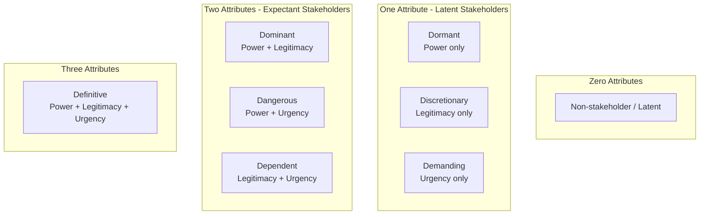

## Stakeholder Theory and Stakeholder Salience

### Overview

Stakeholder Theory, originating with R. Edward Freeman's 1984 work *Strategic Management: A Stakeholder Approach*, holds that organizations exist within a network of groups and individuals who affect or are affected by the organization's actions, and that management should attend to the legitimate interests of all these parties, not solely shareholders. In crisis and reputation management, stakeholder theory provides the conceptual foundation for identifying *who* an organization must communicate with during a crisis, while Stakeholder Salience Theory, developed by Mitchell, Agle, and Wood (1997), provides a practical model for prioritizing among stakeholders when time, resources, and attention are constrained — which is nearly always the case during an active crisis.

### Part 1: Stakeholder Theory Fundamentals

**Definition of a Stakeholder**

Freeman's classic definition: any group or individual who can affect, or is affected by, the achievement of an organization's objectives. This is deliberately broad, encompassing both parties with formal/contractual relationships (employees, shareholders, suppliers, customers) and parties without formal ties but with genuine interest or impact (communities, activist groups, media, regulators, competitors).

**Common Stakeholder Categories**

- **Primary stakeholders** — those with direct, often contractual relationships essential to organizational survival: employees, customers, shareholders/investors, suppliers, creditors.
- **Secondary stakeholders** — those who influence or are influenced by the organization without direct transactional ties: media, communities, government/regulators, activist groups, competitors, the general public.

[Inference] In crisis contexts specifically, this primary/secondary distinction is often less useful than salience-based prioritization, because a normally "secondary" stakeholder (e.g., a regulator or a viral social media account) can become the most urgent communication priority during a specific crisis even though it is not central to day-to-day operations.

**Normative vs. Instrumental Stakeholder Theory**

- **Normative stakeholder theory** argues organizations have an ethical obligation to consider stakeholder interests as inherently valuable, independent of any business benefit.
- **Instrumental stakeholder theory** argues that attending to stakeholder interests is valuable *because* it produces better organizational outcomes (reputation, trust, reduced conflict, long-term performance).

[Inference] Crisis communication practice tends to draw on both justifications simultaneously: ethical obligation to affected parties (e.g., victims, employees) alongside the instrumental recognition that poorly managed stakeholder relationships during a crisis directly damage organizational reputation and future viability.

### Part 2: Stakeholder Salience Theory

**The Core Problem It Solves**

An organization cannot treat every stakeholder with equal priority and intensity, especially during a fast-moving crisis with limited communication bandwidth. Mitchell, Agle, and Wood proposed that stakeholder *salience* — the degree of priority managers give to competing stakeholder claims — is a function of three attributes.

**The Three Salience Attributes**

1. **Power** — the stakeholder's ability to influence the organization (e.g., through coercive means like litigation or regulatory sanction, utilitarian means like withholding resources or purchases, or normative means like moral/social pressure and reputational influence).
2. **Legitimacy** — the perceived validity or appropriateness of the stakeholder's claim, based on social, legal, or moral norms.
3. **Urgency** — the degree to which the stakeholder's claim calls for immediate attention, based on time sensitivity and criticality to the stakeholder.

**Stakeholder Types by Attribute Combination**

- **Dormant** (power only): Has capacity to impose will but lacks legitimacy or urgency — e.g., a large but currently uninvolved shareholder.
- **Discretionary** (legitimacy only): Has a legitimate claim but no power to enforce it or urgency to require immediate attention — e.g., a community group with valid concerns but no coercive leverage.
- **Demanding** (urgency only): Insistent and loud but lacks power or legitimacy — e.g., an individual complainant without broader backing (often the most easily deprioritized, though risky to ignore if it can gain legitimacy or power, such as through viral amplification).
- **Dominant** (power + legitimacy): Expects and receives significant management attention — e.g., major institutional investors, key regulators.
- **Dangerous** (power + urgency, no legitimacy): Potentially coercive and time-critical but lacking legitimate standing — e.g., activists using disruptive or illegitimate tactics.
- **Dependent** (legitimacy + urgency, no power): Legitimate and urgent claims but must rely on other stakeholders (often media or dominant stakeholders) to be heard — e.g., affected individuals without direct organizational leverage.
- **Definitive** (all three attributes): Receives immediate, priority attention — e.g., a regulator with both enforcement power and unquestionable legitimacy actively investigating during a live crisis.

**Dynamic Nature of Salience During Crisis**

[Inference] A key practical implication for crisis management is that salience is not fixed — a crisis event itself frequently converts stakeholders from lower-salience categories into higher-salience ones. A Demanding stakeholder (an individual complainant) can rapidly become Definitive if their claim gains urgency through media pickup (adding legitimacy) and viral spread (adding power via public pressure) — this is a commonly cited mechanism behind why individual social media complaints can escalate into full-blown organizational crises.

### Application to Crisis Communication

**Stakeholder Mapping as a Crisis Preparedness Tool**

Crisis communication planning typically involves mapping likely stakeholders against the power/legitimacy/urgency attributes *before* a crisis occurs, to pre-identify which groups will demand immediate, high-priority engagement versus which can be addressed on a longer timeline. This mapping directly informs:

- Which stakeholders receive direct outreach versus general public communication.
- Sequencing of notifications (e.g., regulators and employees often notified before general public disclosure).
- Channel selection tailored to each stakeholder group's typical communication venues.

**Practical Example: Product Recall Crisis**

A consumer electronics company discovers a battery defect causing overheating in a popular product.

| Stakeholder | Power | Legitimacy | Urgency | Salience Type | Response Priority |
| --- | --- | --- | --- | --- | --- |
| Product safety regulator | High | High | High | Definitive | Immediate, formal notification and compliance reporting |
| Affected customers (injury reports) | Low–Moderate | High | High | Dependent (relies on media/regulator amplification) | Immediate direct outreach, safety instructions, compensation |
| Retail partners | High | High | Moderate | Dominant | Priority briefing before public announcement |
| Institutional investors | High | High | Low (initially) | Dominant, rising toward Definitive as stock impact grows | Scheduled investor communication |
| General social media commentators | Low (individually) | Variable | High (if trending) | Demanding, can escalate to Dangerous/Definitive if viral | Monitor closely, respond to trending complaints proactively |
| Competitors | Low (no direct claim) | Low | Low | Non-stakeholder / Dormant | Monitor for competitive positioning, no direct engagement needed |

This mapping shows why the regulator and directly affected/injured customers typically receive the fastest, most resource-intensive response, while lower-salience groups (competitors, uninvolved social commentary) are monitored but not actively engaged unless their salience shifts upward.

### Relationship to Other Frameworks

- **SCCT and Attribution Theory** determine *what* an organization should say and *how much* responsibility to acknowledge; Stakeholder Salience Theory determines *who* receives that message first and with what intensity of engagement.
- **Rhetorical Arena Theory** treats multiple stakeholders as simultaneous co-producers of crisis meaning; stakeholder salience provides the prioritization logic an organization can use to decide which arena voices most urgently require direct organizational engagement versus passive monitoring.
- **Contingency Theory of Accommodation** (Cameron et al.) similarly addresses how organizations calibrate their stance toward different stakeholders along an advocacy-accommodation continuum, and is often taught alongside stakeholder salience as a complementary lens on stakeholder-specific response calibration.

### Limitations

- The model is inherently perceptual and manager-dependent: power, legitimacy, and urgency are assessed subjectively by organizational decision-makers, introducing risk of misjudgment (e.g., underestimating a Demanding stakeholder's capacity to gain power through viral amplification).
- [Inference] Critics have noted that the framework can implicitly encourage organizations to deprioritize legitimate but low-power stakeholders (e.g., marginalized communities), which sits in tension with the normative branch of stakeholder theory that argues all legitimate claims merit ethical consideration regardless of power.
- Salience attributes can shift rapidly during a crisis, meaning static pre-crisis stakeholder maps require continuous real-time reassessment rather than one-time planning.

### Key Points

- Stakeholder Theory (Freeman) holds that organizations must consider all groups who affect or are affected by their actions, not only shareholders.
- Stakeholder Salience Theory (Mitchell, Agle, and Wood) prioritizes among stakeholders using three attributes: power, legitimacy, and urgency.
- Combinations of these attributes yield seven stakeholder types, from single-attribute Latent stakeholders (Dormant, Discretionary, Demanding) through two-attribute Expectant stakeholders (Dominant, Dangerous, Dependent) to the three-attribute Definitive stakeholder.
- Salience is dynamic, not fixed — crises frequently elevate previously low-salience stakeholders (e.g., individual complainants) into high-salience status through media pickup and public amplification.
- Stakeholder salience mapping complements response-strategy frameworks (SCCT, IDEA) by determining communication sequencing and resource allocation across stakeholder groups during a crisis.

### Related Topics

- Situational Crisis Communication Theory (SCCT)
- Rhetorical Arena Theory
- Contingency Theory of Accommodation
- Attribution Theory and Responsibility Assessment
- Issues Management and Environmental Scanning
- Stakeholder Mapping Methodologies (power/interest grids)
- Corporate Social Responsibility (CSR) and stakeholder legitimacy
- Social-Mediated Crisis Communication Model (SMCC)