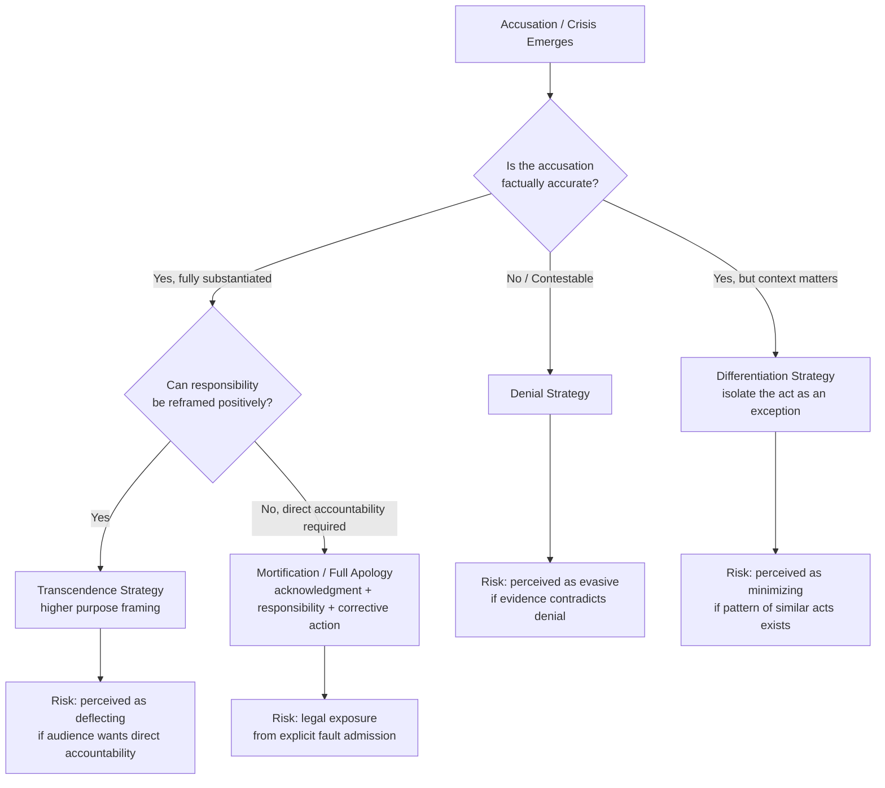

## Corporate Apologia and Apology Rhetoric

### Overview

Corporate apologia refers to the rhetorical genre in which an organization, or an individual speaking on its behalf, publicly defends itself against accusations of wrongdoing. The term derives from the classical Greek *apologia* (a formal defense or justification), and is distinct from "apology" in the everyday sense of expressing regret — apologia is a broader genre encompassing the full range of self-defense strategies, of which contrition/apology is only one option. Apology rhetoric, more narrowly, examines the specific rhetorical structure, sincerity markers, and effects of organizational apologies as a persuasive act. The foundational scholarship in this area includes B.L. Ware and Wil Linkugel's genre theory of apologia (1973), William Benoit's Image Restoration Theory (which formalizes apologia into discrete strategies), and later work on the "full apology" and its constituent components by scholars such as Aaron Lazare and, in organizational contexts, Keith Michael Hearit.

### Foundational Genre Theory: Ware and Linkugel

Ware and Linkugel identified apologia as a distinct rhetorical genre built around a "self" under attack, employing four recurring factors:

1. **Denial** — rejecting the accusation or reinterpreting the meaning of the alleged act.
2. **Bolstering** — reinforcing positive associations between the accused and favorable values, facts, or achievements to offset the negative attention.
3. **Differentiation** — separating the act in question from a broader, more negative context or reframing it as an isolated exception.
4. **Transcendence** — placing the act within a larger, more favorable context or higher set of values that reframes its significance.

[Inference] These four factors are generally considered the conceptual ancestors of Benoit's later, more granular Image Restoration Theory typology, with denial and bolstering mapping fairly directly and differentiation/transcendence anticipating Benoit's "reducing offensiveness" and "transcendence" sub-strategies.

**The Postures of Apologia**

Ware and Linkugel also proposed that these four factors combine into four rhetorical postures: absolutive (seeking exoneration), vindicative (seeking praise), explanative (seeking understanding), and justificative (seeking approval for the act despite acknowledging it occurred). [Inference] This posture framework is less frequently applied in contemporary organizational crisis communication scholarship than the four-factor typology itself, but remains useful for characterizing the overall rhetorical goal an organization is pursuing beyond the specific strategies employed.

### Hearit's Contribution: Apologia in Organizational/Corporate Contexts

Keith Michael Hearit extended apologia theory specifically to corporate and organizational contexts, arguing that corporate apologia differs from individual apologia because organizations face distinct legal, financial, and multi-stakeholder pressures that individuals defending personal reputation do not. Hearit's key contributions include:

- **Corporate ethos as the stake**: corporate apologia is fundamentally about defending organizational *legitimacy* — the audience's belief that the organization operates within accepted social norms — rather than merely personal character.
- **Legal-rhetorical tension**: corporate apologists must balance rhetorical goals (audience persuasion, relationship repair) against legal exposure, since admissions of fault in apologia can be used as evidence in litigation. This tension often produces hedged, qualified, or incomplete apologies.
- **Dissociation strategies**: corporate apologia frequently works by dissociating the organization's "true" values or identity from the specific act in question (e.g., "this does not reflect who we are"), a rhetorical move closely related to Ware and Linkugel's differentiation.

### The Anatomy of a "Full" Apology

Drawing on Lazare's clinical/psychological work on apology and its application to organizational contexts, a "full" or maximally effective apology is generally understood to require several distinct components, all of which are frequently and selectively omitted in weaker organizational apologies:

1. **Acknowledgment of the offense** — clearly and specifically naming what happened, without euphemism or vagueness.
2. **Acceptance of responsibility** — explicitly owning causation, as distinct from merely expressing sympathy for an outcome ("mistakes were made" fails this criterion; "we made a mistake" satisfies it).
3. **Expression of genuine regret/remorse** — conveying authentic emotional acknowledgment of harm caused, not merely procedural regret.
4. **Explanation** — providing context for how the failure occurred (without this shading into excuse-making, which undermines the acceptance-of-responsibility component).
5. **Corrective action** — specific commitments to prevent recurrence.
6. **Offer of repair/compensation** — addressing tangible harm where applicable.

[Inference] A common analytical exercise in this area of study is to audit real organizational apology statements against this six-part structure, since most real-world "apologies" satisfy only a subset of these components — commonly omitting explicit responsibility acceptance (component 2) while including regret and corrective action, which scholars generally regard as a significantly weaker rhetorical and relational outcome than a full apology.

### The "Non-Apology Apology"

A frequently studied failure pattern is the **non-apology apology**: a statement using apology-adjacent language while avoiding the core components of acknowledgment and responsibility acceptance. Common linguistic markers include:

- Passive voice that obscures agency: "mistakes were made," "the situation that occurred."
- Conditional or hedged regret: "if anyone was offended," "to the extent that harm occurred."
- Regret framed around the *reaction* rather than the *act*: "I'm sorry you feel that way" rather than "I'm sorry for what I did."
- Immediate pivoting to bolstering or transcendence before responsibility is established, diluting the apology's force.

[Inference] Non-apology apologies are widely regarded in the literature as rhetorically counterproductive in most cases, since audiences (and particularly media commentators) have become adept at identifying and publicly calling out these patterns, which can compound reputational damage rather than mitigate it — though this should be treated as a general pattern rather than a guaranteed outcome, since audience sophistication and media scrutiny vary by context.

### Apologia Strategy Selection Model

This model illustrates the core strategic tension in apologia: each available strategy carries a distinct rhetorical risk, and selection typically depends on the factual strength of the accusation and the organization's tolerance for legal exposure versus reputational risk.

### Practical Example

**Weak apologia (non-apology apology) — illustrative composite:**

"We are aware that some customers experienced issues with our service recently. We understand that mistakes were made, and we regret if this caused any frustration. We remain committed to excellence."

*Analysis:* Passive voice ("mistakes were made") obscures agency; "if this caused any frustration" hedges harm rather than acknowledging it; no specific acknowledgment of the offense, no explicit responsibility acceptance, no corrective action. This satisfies zero to one of the six full-apology components.

**Strong apologia (full apology) — illustrative composite:**

"On March 3rd, a coding error in our billing system charged approximately 4,000 customers twice for their monthly subscription. This was our error, caused by an inadequately tested software update. We are sorry for the financial disruption and stress this caused. Affected customers will receive an automatic refund plus a $25 credit within five business days, and we have implemented mandatory two-stage testing for all future billing system updates."

*Analysis:* Specific acknowledgment (component 1), explicit causation ownership ("this was our error," component 2), regret framed around the act's impact (component 3), brief non-excusing explanation (component 4), corrective action (component 5), and compensation (component 6) — satisfying all six components of a full apology.

### Relationship to Other Frameworks

- **Image Restoration Theory (Benoit)** is the direct scholarly successor to apologia genre theory, converting Ware and Linkugel's four factors into a more granular five-category typology (denial, evasion of responsibility, reducing offensiveness, corrective action, mortification) that is now more commonly used in applied crisis communication analysis.
- **SCCT** incorporates apologia/mortification as one of its available response strategies (categorized under "rebuild" strategies), matched to high-responsibility crisis clusters per attribution assessment.
- **Attribution Theory** underlies the audience-side judgment apologia strategies attempt to influence: denial and differentiation aim to reduce perceived locus/controllability, while mortification concedes it directly.

### Key Points

- Corporate apologia is the broader rhetorical genre of organizational self-defense against accusations, of which sincere apology (mortification) is only one available strategy.
- Ware and Linkugel's four factors (denial, bolstering, differentiation, transcendence) are the foundational genre theory later formalized into Benoit's Image Restoration Theory typology.
- Hearit's work highlights the distinct legal-rhetorical tension corporate apologists face, since fault admissions carry litigation risk not present in purely interpersonal apologia.
- A "full apology" requires six components: acknowledgment, responsibility acceptance, genuine regret, explanation, corrective action, and repair/compensation — most real organizational apologies satisfy only a subset.
- The "non-apology apology" (passive voice, hedged regret, reaction-focused rather than act-focused language) is a well-documented failure pattern that frequently compounds rather than mitigates reputational harm.

### Related Topics

- Image Restoration Theory / Image Repair Theory (Benoit)
- Situational Crisis Communication Theory (SCCT)
- Attribution Theory and Responsibility Assessment
- Mortification as a Crisis Response Strategy
- Legal-Rhetorical Tension in Crisis Communication
- Genre Theory in Organizational Rhetoric
- Sincerity Markers and Linguistic Analysis of Apologies
- Case Studies in Non-Apology Apologies (media and corporate examples)