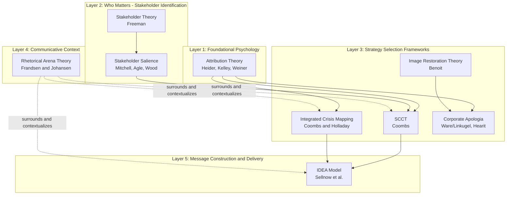
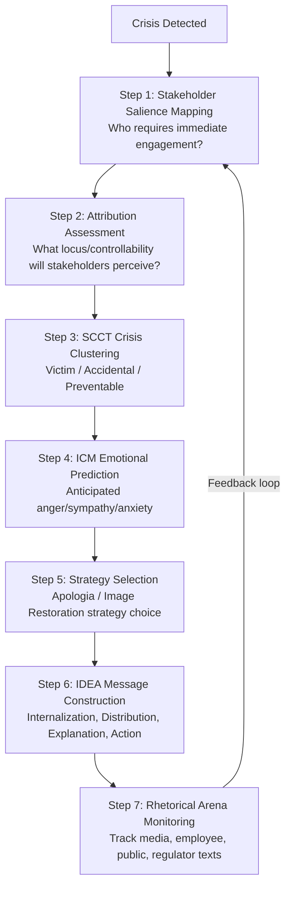

## Comparing and Integrating Crisis Frameworks

### Overview

Crisis and reputation management draws on a cluster of distinct but overlapping theoretical frameworks, each developed to address a different facet of the crisis communication problem: response strategy selection, multi-voice communicative context, audience psychology, message design, and stakeholder prioritization. No single framework covers the full scope of crisis communication practice; effective crisis management typically requires integrating multiple frameworks at different analytical levels. This entry synthesizes the relationships, overlaps, and appropriate use cases across the core frameworks covered in this chapter: Rhetorical Arena Theory, the IDEA Model, Integrated Crisis Mapping (ICM), Attribution Theory, Stakeholder Theory/Salience, and Corporate Apologia/Image Restoration Theory, along with Situational Crisis Communication Theory (SCCT) as the connective throughline among them.

### The Layered Structure of Crisis Frameworks

[Inference] These frameworks can be organized into a rough hierarchy based on the level of analysis they operate at, from foundational psychology through to applied message construction. This layering is a synthesis for pedagogical clarity rather than an explicit structure proposed by any single cited author.

### Framework-by-Framework Comparison

| Framework | Core Question Answered | Unit of Analysis | Primary Contribution |
| --- | --- | --- | --- |
| Attribution Theory | Why do stakeholders assign blame the way they do? | Individual psychological judgment | Locus, stability, controllability as drivers of blame and emotion |
| Stakeholder Theory / Salience | Who matters, and how much? | Organization-stakeholder relationships | Power, legitimacy, urgency prioritization |
| SCCT | Which response strategy fits this crisis? | Organization's single response | Matches response strategy to attributed responsibility |
| Integrated Crisis Mapping | What emotion and behavior will this crisis provoke? | Crisis type against two dimensions | Predicts discrete emotions (anger, sympathy, anxiety) from locus/control |
| Image Restoration / Apologia | What rhetorical moves defend organizational image? | Individual text/statement | Granular typology of defense strategies (denial through mortification) |
| Rhetorical Arena Theory | How does meaning form across all voices in the crisis? | The entire communicative ecosystem | Multi-voice, multi-genre, intertextual analysis |
| IDEA Model | How do we construct an effective, actionable message? | Individual message design | Internalization, Distribution, Explanation, Action structure |

### Where Frameworks Overlap and Diverge

**Attribution Theory underlies almost everything**

Attribution Theory is not itself a crisis communication framework but the psychological substrate that SCCT, ICM, and (implicitly) apologia strategy selection all depend on. Any framework concerned with "how much blame will stakeholders assign" is, at root, applying Heider/Kelley/Weiner's locus-stability-controllability logic to a specific organizational context.

**SCCT as the connective hub**

SCCT functions as the most widely used integrative model because it directly operationalizes attribution theory (via crisis clusters) and directly feeds Image Restoration Theory's strategy typology (its response-strategy categories are substantially derived from Benoit's work). [Inference] This is a key reason SCCT is often taught as the "default" or entry-point framework in crisis communication curricula — it sits at a natural junction between the psychological (attribution) and rhetorical (apologia/image restoration) traditions.

**ICM as an SCCT extension, not a replacement**

Integrated Crisis Mapping does not compete with SCCT; it extends it. SCCT determines *which strategy category* fits a crisis based on responsibility level; ICM adds a predictive layer for *which specific emotion* stakeholders will feel, which is useful because different emotions (anger vs. sympathy vs. anxiety) call for different tonal register even within the same broad SCCT response category.

**Rhetorical Arena Theory as the "container" framework**

Rhetorical Arena Theory does not compete directly with SCCT, ICM, or Image Restoration Theory at all — it operates at a different level of analysis, treating those frameworks as tools applicable to the *textual dimension* of any single arena participant's statement (most often the organization's), while itself focusing on the *intertextual dimension*: how the organization's SCCT-informed statement interacts with, is contradicted by, or is amplified by media, employee, and public texts circulating simultaneously.

**IDEA as message-construction, not strategy-selection**

The IDEA model does not tell an organization *what stance* to take (that is SCCT/ICM's role) — it tells the organization *how to construct* whatever message has been decided upon so that it is personally relevant, properly distributed, clearly explained, and paired with concrete action. IDEA is most directly applicable to risk/emergency contexts requiring public behavioral response (evacuations, health advisories, product recalls) rather than to pure reputation-repair contexts where no immediate public action is required.

**Stakeholder Salience as the prioritization filter**

Stakeholder Theory and Salience Theory answer a question none of the other frameworks address directly: given limited time and resources, whom does the organization engage first, and with what intensity? This makes salience assessment a preliminary step that shapes which arena voices (Rhetorical Arena Theory) receive direct organizational engagement, and which stakeholder groups' likely emotional reactions (ICM) are most urgent to address.

### Integrated Workflow for Applying Multiple Frameworks

This workflow illustrates a plausible integrated sequence: salience mapping and attribution assessment happen early and in parallel, feeding into SCCT/ICM-based strategy selection, which is then operationalized into an actual message via IDEA, after which the organization must monitor the surrounding rhetorical arena and loop back to reassess stakeholder salience as the crisis evolves. [Inference] This sequence is a pedagogical synthesis for illustrating how the frameworks in this chapter can be combined in practice; it is not a single named model from the literature, and real crisis response often proceeds non-linearly or with these steps happening concurrently under time pressure.

### Practical Integrated Example

**Scenario:** A ride-sharing company faces a crisis after a driver background-check failure leads to a passenger safety incident.

1. **Stakeholder Salience:** The affected passenger and their family (Dependent → rapidly becoming Definitive via media attention), transportation regulators (Definitive), and current drivers/employees (Dominant) are prioritized over lower-salience groups like competitors or unaffected users.
2. **Attribution Assessment:** Internal locus (the company controls its own background-check process), high controllability (this was preventable through due diligence) → high attributed responsibility.
3. **SCCT Clustering:** Falls into the Preventable cluster (organizational misdeed/negligence category), requiring a rebuild-oriented response strategy.
4. **ICM Prediction:** High internal, high control → anticipate significant stakeholder anger, not merely sympathy or concern, requiring a response that directly addresses accountability rather than minimizing framing.
5. **Strategy Selection:** Full apologia/mortification strategy — acknowledgment, responsibility acceptance, and corrective action are required; denial or differentiation strategies would likely be perceived as evasive given high attributed responsibility.
6. **IDEA Construction:** The public statement must internalize risk for other affected users ("all drivers are being re-screened, starting with X region"), distribute across app notifications and press channels simultaneously, explain the process failure in plain language, and specify concrete action (enhanced background-check protocol, support resources for the affected passenger).
7. **Rhetorical Arena Monitoring:** Track how media coverage, driver forum discussions, and passenger social media posts respond to and reshape the company's statement, adjusting subsequent communications as the narrative evolves.

### Choosing Which Framework to Foreground

| If your priority is... | Foreground this framework |
| --- | --- |
| Deciding a defensible response stance | SCCT |
| Predicting stakeholder emotional/behavioral reaction | Integrated Crisis Mapping |
| Understanding why stakeholders will blame you | Attribution Theory |
| Deciding who to talk to first | Stakeholder Salience Theory |
| Writing the actual public statement's specific rhetorical moves | Image Restoration Theory / Apologia |
| Making that statement clear and actionable for public safety | IDEA Model |
| Understanding how your message will be received alongside everyone else's | Rhetorical Arena Theory |

### Key Points

- No single crisis communication framework is comprehensive; each operates at a different analytical layer, from foundational psychology (Attribution Theory) through stakeholder prioritization, strategy selection, message construction, and communicative context.
- SCCT functions as a central connective framework, directly operationalizing attribution theory and directly informing (and informed by) Image Restoration Theory's strategy typology.
- Integrated Crisis Mapping extends SCCT with emotion prediction; the IDEA model operationalizes chosen strategies into constructed, actionable messages; Rhetorical Arena Theory contextualizes all organizational messaging within a broader multi-voice communicative ecosystem.
- Stakeholder Salience Theory provides the prioritization logic that determines which arena voices and crisis-affected groups receive the most urgent and resource-intensive engagement.
- Real-world crisis management typically requires applying several of these frameworks concurrently and iteratively, since stakeholder salience, attributed responsibility, and the surrounding communicative arena all evolve as a crisis unfolds.

### Related Topics

- Situational Crisis Communication Theory (SCCT) — deep dive
- Image Restoration Theory — full strategy typology
- Crisis Communication Planning and Pre-Crisis Preparedness
- Crisis Lifecycle Models (pre-crisis, crisis, post-crisis)
- Social-Mediated Crisis Communication Model (SMCC)
- Case Study Methodology in Crisis Communication Research
- Ethical Considerations Across Crisis Communication Frameworks
- Cross-Cultural Variation in Crisis Response Expectations