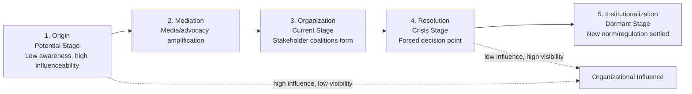

## Issues Management Fundamentals

### Overview

Issues management is the proactive, systematic process by which organizations identify, monitor, analyze, and respond to emerging trends, public concerns, and policy developments before they escalate into full-blown crises. The field traces its formal origins to W. Howard Chase, who coined the term "issues management" in 1976 and argued that organizations should treat public policy issues as manageable business variables rather than uncontrollable external forces. Chase's foundational premise — later developed further by Raymond Ewing and Robert Heath — is that most crises are not sudden, unpredictable events but the visible eruption of issues that existed in a dormant or developing state for months or years beforehand. Issues management therefore sits upstream of crisis communication: its goal is to resolve or mitigate issues while they are still negotiable, before they harden into a crisis that requires reactive, damage-control communication.

### Core Definitions

**Issue**: A gap between an organization's practices and stakeholder expectations, or an unresolved matter of public concern that has the potential to affect organizational operations, reputation, or legitimacy if left unaddressed. Issues typically involve some element of public debate, values conflict, or emerging expectation shift.

**Issues Management**: The organizational function of identifying, analyzing, prioritizing, and strategically responding to issues, with the goal of influencing their development in a direction favorable to (or least damaging to) the organization, while also fulfilling legitimate stakeholder expectations.

**Distinction from Crisis Management**: Issues management is proactive and typically operates over longer timeframes (months to years), addressing matters before they become acute. Crisis management is reactive and operates under acute time pressure once an issue has erupted into a publicly damaging event. [Inference] Many crisis communication scholars treat issues management and crisis management as points on a single continuum rather than fully separate disciplines, since an unmanaged issue is one of the most common pathways by which organizations arrive at a crisis.

### Chase's Issue Development Model

Chase proposed that issues move through a predictable lifecycle, and that an organization's ability to influence outcomes is highest early in this lifecycle and diminishes sharply as the issue matures.

**The Five Stages**

1. **Origin (Potential Stage)** — the issue first emerges, often within specialized publications, advocacy groups, academic research, or niche communities. Public awareness is minimal.
2. **Mediation and Amplification** — the issue gains attention through media coverage, activist organizing, or influential stakeholders who frame and publicize it, increasing its visibility.
3. **Organization (Current Stage)** — stakeholders coalesce around the issue; advocacy groups form or mobilize, coalitions develop, and the issue becomes a recognized matter of public debate.
4. **Resolution (Crisis Stage)** — the issue reaches a decision point, often through legislation, regulation, litigation, or acute public/media pressure forcing organizational action; this is the stage at which an unmanaged issue frequently becomes a crisis.
5. **Institutionalization (Dormant Stage)** — the issue is resolved through new laws, regulations, industry standards, or settled social norms, and the issue moves from active debate into an institutionalized, routine compliance matter.

**The Inverse Relationship: Influence vs. Visibility**

The model's central strategic insight is that organizational influence over an issue's trajectory is inversely related to the issue's public visibility. At the Origin stage, few people are paying attention, but an organization that identifies the issue early has maximum latitude to shape its own position, adjust practices, or engage stakeholders proactively. By the Resolution/Crisis stage, visibility is at its peak, but the organization's options have narrowed dramatically — it is now largely reacting to external pressure (regulation, litigation, public outrage) rather than shaping outcomes. [Inference] This inverse relationship is the primary theoretical justification for investing in environmental scanning and early issue identification, since the cost and difficulty of addressing an issue tends to increase substantially the later in the lifecycle an organization begins to engage with it.

### The Issues Management Process

**1. Environmental Scanning**

Systematic monitoring of the external environment — media coverage, academic and trade publications, regulatory activity, social media discourse, competitor actions, and stakeholder communications — to identify emerging issues before they gain broad visibility.

- Common methods: media content analysis, social listening tools, regulatory/legislative tracking, trend analysis, stakeholder surveys, competitive intelligence.
- [Inference] Scanning is typically organized around both broad horizon-scanning (looking for weak signals across a wide field) and narrow issue-specific monitoring (tracking known issues already on the organization's radar), since relying on only one approach risks either missing emerging issues entirely or over-focusing resources on already-known concerns.

**2. Issue Identification and Definition**

Once a potential issue is detected, it must be clearly defined: what is the core concern, which stakeholders are driving it, what values or expectations are in tension, and how directly does it relate to the organization's operations or reputation.

**3. Issue Analysis and Prioritization**

Not every detected issue warrants active management resources. Prioritization typically weighs:

- **Probability** — how likely is the issue to develop into something that materially affects the organization?
- **Impact** — how severe would the consequences be if the issue escalates unaddressed?
- **Timeframe** — how quickly is the issue likely to develop?
- **Stakeholder salience** — how much power, legitimacy, and urgency do the issue's advocates hold (directly connecting to Mitchell, Agle, and Wood's salience framework)?

A common prioritization tool is an **issue impact/probability matrix**, ranking issues to determine which receive active management attention, which are monitored passively, and which are deprioritized.

**4. Strategy Formulation and Response**

Response options generally span a spectrum from passive monitoring to active intervention:

- **Reactive response** — addressing the issue only once it becomes acute (generally considered a failure mode of issues management, since it forfeits the early-stage influence advantage).
- **Adaptive response** — adjusting organizational practices or policies to align with emerging stakeholder expectations.
- **Dynamic/proactive response** — actively engaging in public discourse, policy advocacy, or coalition-building to help shape the issue's development and resolution in a way that reflects organizational interests while addressing legitimate stakeholder concerns.

**5. Implementation and Evaluation**

Deploying the chosen strategy (policy change, public communication, stakeholder engagement, advocacy) and continuously monitoring the issue's trajectory to assess whether the response is succeeding, adjusting as needed.

### Issues Management as Crisis Prevention

**The Preventive Logic**

[Inference] The central strategic argument for investing organizational resources in issues management, rather than relying solely on crisis response capability, is that early intervention is both cheaper and more effective than late-stage crisis management — addressing an issue at the Origin stage might require only a policy adjustment or stakeholder dialogue, whereas addressing the same issue at the Resolution/Crisis stage might require litigation defense, regulatory compliance overhauls, and extensive reputation repair communication, at substantially higher cost and with substantially less organizational control over the outcome.

**Practical Example**

**Scenario:** A food and beverage company notices early academic research and niche advocacy discussion (Origin stage) raising concerns about a common packaging material's environmental impact.

- **If managed proactively (Origin/Mediation stage):** The company begins piloting alternative packaging, engages with environmental researchers, and communicates transparently about its transition timeline — positioning itself as a responsive industry leader before the issue reaches broad public awareness.
- **If left unmanaged until the Organization stage:** Advocacy groups organize public campaigns and media coverage intensifies; the company now faces reputational pressure and must respond defensively rather than proactively, with less credit for any changes it makes.
- **If left unmanaged until the Resolution/Crisis stage:** Regulators introduce mandatory packaging legislation, or a viral consumer boycott erupts; the company must now comply under external mandate and/or execute reactive crisis communication, having lost the opportunity to shape the issue's resolution on its own terms and likely facing the reputational costs of appearing to have ignored the concern.

### Organizational Structure for Issues Management

[Inference] Issues management functions are typically situated within corporate communications, public affairs, government relations, or a dedicated issues/risk management unit, and in mature organizations often involve cross-functional issue-tracking committees that include legal, communications, government relations, and relevant business-unit representatives, since issues frequently span multiple organizational domains (regulatory, reputational, operational) simultaneously.

### Relationship to Other Frameworks

- **Stakeholder Salience Theory** directly informs issue prioritization: issues championed by stakeholders with high power, legitimacy, and urgency warrant faster and more resource-intensive engagement.
- **Attribution Theory and SCCT** become relevant once an issue has failed to be managed proactively and erupts into an acute crisis — at that point, the crisis-response frameworks (SCCT, ICM, Image Restoration Theory) take over from the issues-management frameworks.
- **Risk Communication** (covered separately) overlaps with issues management but is typically more narrowly focused on communicating known hazards and uncertainties to publics, whereas issues management encompasses the broader organizational process of monitoring and shaping public policy and reputational trends over time.

### Key Points

- Issues management, originating with W. Howard Chase, is the proactive process of identifying and addressing emerging issues before they escalate into crises.
- Chase's five-stage issue lifecycle (Origin, Mediation, Organization, Resolution/Crisis, Institutionalization) shows an inverse relationship between organizational influence and public visibility — influence is highest early, when visibility is lowest.
- The issues management process cycles through environmental scanning, issue identification, analysis/prioritization, strategy formulation, and implementation/evaluation.
- Issue prioritization typically weighs probability, impact, timeframe, and stakeholder salience to allocate limited organizational attention.
- Effective issues management is generally considered both cheaper and more effective than reactive crisis management, since early-stage intervention preserves organizational influence that is largely lost by the time an issue reaches crisis-level visibility.

### Related Topics

- Environmental Scanning Methodologies and Social Listening
- Risk Communication and the Extended Parallel Process Model (EPPM)
- Stakeholder Salience Theory
- Contingency Theory of Accommodation
- Crisis Lifecycle Models (pre-crisis, crisis, post-crisis)
- Regulatory and Legislative Tracking Systems
- Corporate Social Responsibility (CSR) and Issue Ownership
- Coalition-Building and Public Policy Advocacy