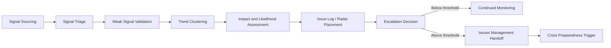
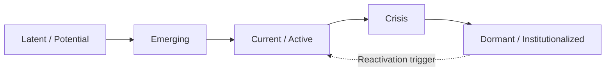
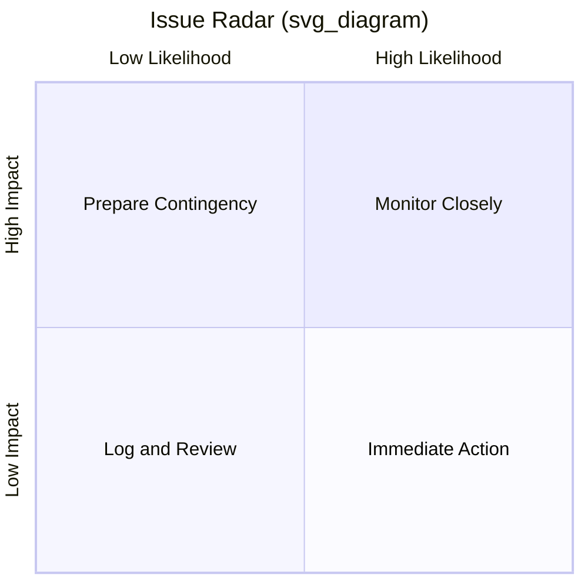

## Environmental and Horizon Scanning

### Definition and Scope

Environmental scanning is the systematic collection, analysis, and interpretation of information about external events, trends, and relationships that could affect an organization's reputation, operations, or strategic position. Horizon scanning extends this discipline forward in time, focusing specifically on weak signals, emerging issues, and low-probability/high-impact developments that have not yet crystallized into visible risks.

Within crisis and reputation management, these two practices form the **detection layer** of the risk management lifecycle — preceding issue identification, risk assessment, and crisis response. Their purpose is to convert ambiguous, distributed signals into structured intelligence early enough that an organization can influence outcomes rather than merely react to them.

### Core Distinctions

| Dimension | Environmental Scanning | Horizon Scanning |
| --- | --- | --- |
| Time horizon | Short to medium term (weeks–months) | Medium to long term (months–years) |
| Signal maturity | Established trends, visible issues | Weak signals, emerging/nascent issues |
| Primary output | Situational awareness, issue logs | Strategic foresight, scenario inputs |
| Typical cadence | Continuous/daily | Periodic (quarterly/annual) deep dives |
| Analytical posture | Monitoring "what is happening" | Anticipating "what could happen" |

[Inference] In practice, most organizations run these as a blended, continuous process rather than two discrete workstreams, since weak signals detected in horizon scanning routinely graduate into environmental scanning once they gain visibility.

### The PESTLE Framework as a Scanning Structure

A common structural backbone for environmental scanning is PESTLE, which segments the external environment into categories to ensure comprehensive coverage rather than ad hoc monitoring:

- **Political** — regulatory shifts, elections, geopolitical tension, lobbying activity, sanctions
- **Economic** — inflation, currency volatility, sector downturns, supply chain cost shocks
- **Social** — shifting public sentiment, activism, demographic change, cultural flashpoints
- **Technological** — disruptive innovation, cybersecurity threats, AI-driven disinformation, platform algorithm changes
- **Legal** — litigation trends, new compliance regimes, precedent-setting rulings
- **Environmental** — climate events, sustainability expectations, ESG scrutiny, resource scarcity

Each category is mapped against the organization's specific exposure — a PESTLE scan is only useful when filtered through materiality to the organization's stakeholders, sector, and footprint.

### The Scanning Process Pipeline

**Stage descriptions:**

1. **Signal Sourcing** — Ingesting raw data from media monitoring, social listening, regulatory bulletins, trade press, NGO reports, employee/whistleblower channels, and competitive intelligence.
2. **Signal Triage** — Filtering noise from signal; discarding irrelevant or non-material items.
3. **Weak Signal Validation** — Cross-referencing a signal across multiple independent sources to distinguish genuine emergence from a single outlier data point.
4. **Trend Clustering** — Grouping related signals into coherent themes (e.g., isolated complaints about a supply practice clustering into an emerging labor-rights narrative).
5. **Impact and Likelihood Assessment** — Scoring each cluster, typically on a probability × severity matrix.
6. **Issue Log / Radar Placement** — Formally recording the issue with an owner, status, and review date.
7. **Escalation Decision** — Determining whether the issue crosses a threshold requiring formal issues management or crisis-preparedness activation.

### Signal Sources

**Key Points**

- **Media and news monitoring**: traditional press, trade publications, broadcast transcripts
- **Social listening**: sentiment analysis, hashtag velocity, influencer commentary, platform-specific discourse (X, Reddit, TikTok, LinkedIn)
- **Regulatory and legislative tracking**: bill introductions, consultation papers, enforcement actions
- **Search trend data**: rising query volume around brand-adjacent or sector-adjacent terms
- **Internal channels**: employee surveys, customer complaints, whistleblower hotlines, sales-team field reports
- **Academic and think-tank output**: early indicators of shifting scientific or policy consensus
- **Competitor and peer-sector activity**: issues surfacing at comparable organizations often precede sector-wide scrutiny
- **NGO and activist publications**: campaign target lists, shadow reports, investigative dossiers

### Weak Signal Theory

The theoretical foundation for horizon scanning draws on Igor Ansoff's concept of "weak signals" — imprecise, early indicators of change that lack sufficient definition to compute a reliable response, but which, if ignored, can mature into strategic surprises.

A weak signal typically exhibits:

- Low information content and high ambiguity
- Dispersal across unconnected sources
- Absence from mainstream discourse
- Resistance to conventional trend-line extrapolation

[Inference] Because weak signals are, by definition, difficult to distinguish from noise at the point of detection, most organizations accept a deliberately high false-positive tolerance in horizon scanning — logging and monitoring many more issues than will ever mature into actual risks — since the cost of a missed genuine signal (reputational surprise) is asymmetrically higher than the cost of an unnecessary log entry.

### The Issue Life Cycle Model

Horizon-scanned issues are commonly mapped against a life-cycle model to determine urgency and response posture:

- **Latent/Potential**: Underlying conditions exist but no public articulation yet; horizon-scanning territory.
- **Emerging**: Early public or stakeholder articulation; still low visibility; environmental-scanning territory.
- **Current/Active**: Broad stakeholder awareness; media and regulatory attention forming.
- **Crisis**: Acute, high-visibility, demands immediate organizational response.
- **Dormant/Institutionalized**: Resolved or absorbed into standard practice, but capable of reactivation.

Effective scanning aims to identify and act on issues while they remain in the **Latent** or **Emerging** stages, when response options are broadest and reputational cost of intervention is lowest.

### Risk Radar / Issue Matrix

A standard output artifact is a two-axis matrix plotting **likelihood** against **impact**, often visualized as a radar or heat map:

Note: Some Mermaid renderers do not support `quadrantChart`; when unsupported, teams typically substitute a manually constructed 2x2 grid table or SVG scatter plot for the same purpose.

### SVG: Probability-Impact Scanning Matrix

<svg xmlns="http://www.w3.org/2000/svg" viewBox="0 0 480 400">
<text x="240" y="24" text-anchor="middle" font-size="16" font-weight="bold" fill="#1a1a1a">Probability–Impact Scanning Matrix (svg_diagram)</text>
<line x1="70" y1="330" x2="440" y2="330" stroke="#333" stroke-width="2" />
<line x1="70" y1="330" x2="70" y2="50" stroke="#333" stroke-width="2" />

<text x="255" y="365" text-anchor="middle" font-size="13" fill="#333">Likelihood of Occurrence →</text>

<text x="30" y="190" text-anchor="middle" font-size="13" fill="#333" transform="rotate(-90 30 190)">Reputational Impact →</text>

<line x1="255" y1="50" x2="255" y2="330" stroke="#bbb" stroke-dasharray="4,4" />
<line x1="70" y1="190" x2="440" y2="190" stroke="#bbb" stroke-dasharray="4,4" />
<rect x="70" y="50" width="185" height="140" fill="#fde68a" opacity="0.5" />
<rect x="255" y="50" width="185" height="140" fill="#fca5a5" opacity="0.6" />
<rect x="70" y="190" width="185" height="140" fill="#d1fae5" opacity="0.5" />
<rect x="255" y="190" width="185" height="140" fill="#fdba74" opacity="0.5" />

<text x="160" y="120" text-anchor="middle" font-size="11" fill="`#78350f`">Prepare Contingency</text>

<text x="345" y="120" text-anchor="middle" font-size="11" fill="`#7f1d1d`">Immediate Action</text>

<text x="160" y="260" text-anchor="middle" font-size="11" fill="`#065f46`">Log and Review</text>

<text x="345" y="260" text-anchor="middle" font-size="11" fill="`#7c2d12`">Monitor Closely</text>

<circle cx="150" cy="100" r="7" fill="#b45309" />
<text x="150" y="90" text-anchor="middle" font-size="10">A</text>
<circle cx="330" cy="90" r="7" fill="#991b1b" />
<text x="330" y="80" text-anchor="middle" font-size="10">B</text>
<circle cx="130" cy="250" r="7" fill="#047857" />
<text x="130" y="240" text-anchor="middle" font-size="10">C</text>
<circle cx="360" cy="240" r="7" fill="#c2410c" />
<text x="360" y="230" text-anchor="middle" font-size="10">D</text>
</svg>

### Analytical Techniques

**Key Points**

- **Content/thematic analysis** — coding scanned material into recurring themes to identify pattern emergence over time
- **Sentiment trend analysis** — tracking directional shifts (not just volume) in stakeholder tone
- **Scenario planning** — constructing plausible future narratives from clustered weak signals to stress-test organizational preparedness
- **Delphi method** — structured, iterative expert polling used when signals are too ambiguous for data-driven forecasting alone
- **Cross-impact analysis** — assessing how the emergence of one issue changes the probability or severity of another
- **Network/stakeholder mapping** — identifying which actors (activists, regulators, competitors) are amplifying a given signal, since amplifier influence often predicts an issue's trajectory more than raw signal volume

### Governance and Organizational Integration

For scanning to translate into reputational protection rather than an unused report, it typically requires:

1. **A defined owner** — usually corporate communications, public affairs, or enterprise risk, often in a joint function
2. **A standing review cadence** — e.g., weekly tactical review of the issue log, quarterly strategic horizon review
3. **A cross-functional escalation pathway** — clear criteria for when a scanned issue is handed to legal, crisis management, or executive leadership
4. **Defined thresholds** — pre-agreed likelihood/impact scores that trigger specific actions (monitoring continuation, contingency planning, spokesperson briefing, full crisis activation)
5. **Documentation discipline** — a maintained issue log with timestamps, source citations, and status history, both for institutional memory and for post-incident review/audit purposes

### Common Failure Modes

- **Signal overload without triage** — collecting large volumes of data with no filtering mechanism, causing genuine signals to be lost in noise
- **Confirmation bias in validation** — scanning teams disproportionately weighting signals that confirm existing organizational assumptions
- **Siloed scanning** — communications, legal, security, and risk functions each running separate, non-integrated scanning efforts
- **Static thresholds** — escalation criteria that are not periodically recalibrated against a changing risk environment
- **Scan-to-shelf gap** — production of scanning reports that are not structurally connected to decision-making forums, meaning identified issues are logged but never actioned

[Unverified] The specific tools, dashboards, or AI-assisted classification models an organization uses for scanning vary widely by sector and budget; no single vendor or platform can be described as a universal standard.

### Practical Example

**Example**

A consumer goods company's horizon-scanning function detects a small but recurring cluster of social media posts referencing a specific ingredient's environmental sourcing. Individually, each post has low reach. Thematic clustering identifies three independent NGO blog mentions over six weeks. Cross-referencing against regulatory tracking shows a related EU consultation paper open for comment. The issue is logged at "Emerging" stage with a moderate likelihood/high-impact score, escalated to the sustainability and legal teams for a joint position statement, and placed on a two-week review cycle — months before the topic could plausibly reach mainstream media, allowing the organization to prepare a proactive sourcing disclosure rather than a reactive crisis statement.

### Related Topics

- Issue Identification and Prioritization Frameworks
- Stakeholder Mapping and Salience Analysis
- Social Listening Tools and Sentiment Analysis Techniques
- Scenario Planning and Red-Teaming for Reputational Risk
- Crisis Preparedness and Escalation Protocols
- Enterprise Risk Management (ERM) Integration
- Media Monitoring System Architecture
- Post-Crisis Review and Institutional Learning Loops