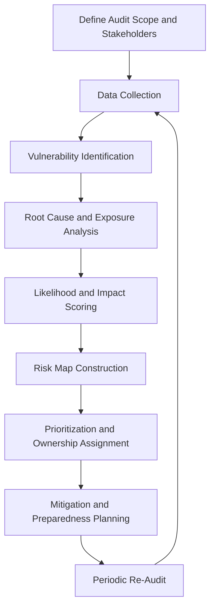
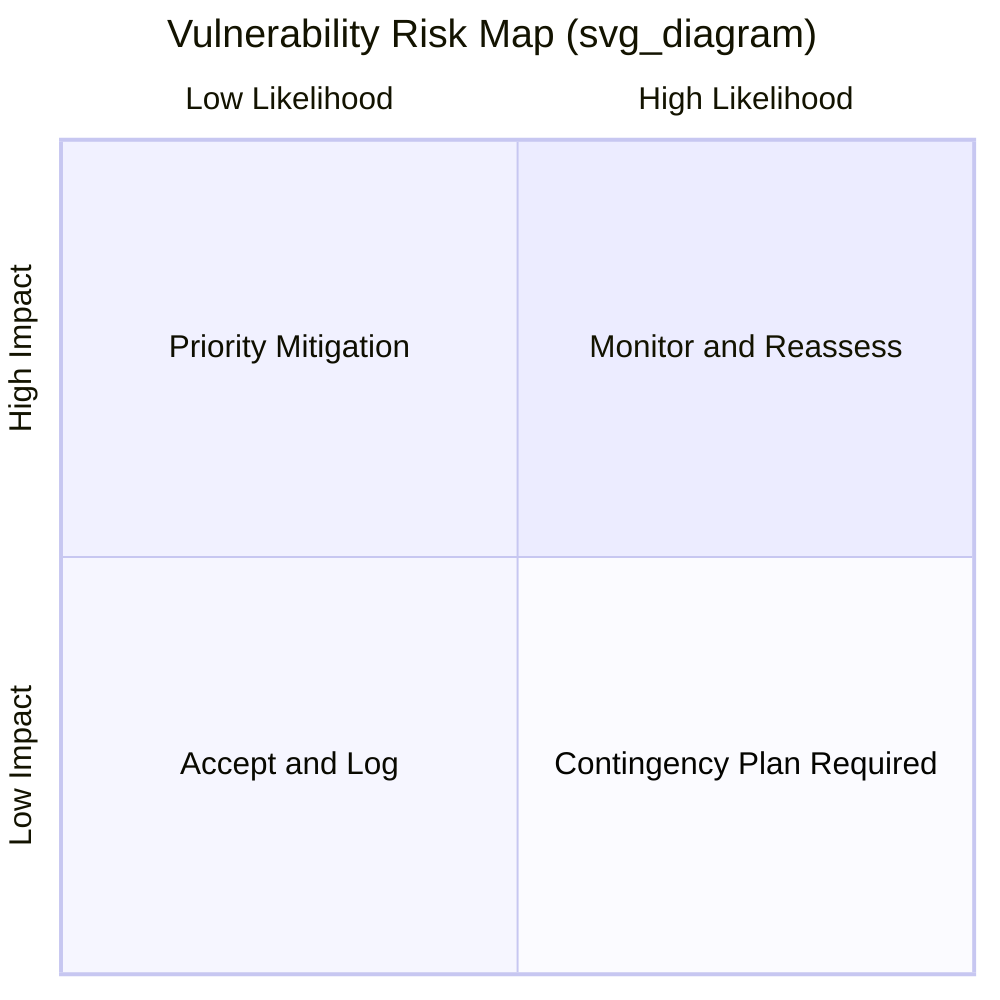

## Vulnerability Audits and Risk Mapping

### Definition and Scope

A vulnerability audit is a structured, systematic assessment of an organization's exposure points — operational, reputational, legal, financial, and technological — that could give rise to a crisis or reputational harm. Risk mapping is the complementary visualization and prioritization process that plots identified vulnerabilities against likelihood and impact to guide resource allocation and preparedness planning.

Together, these practices form the **assessment layer** of risk and issues management, positioned after environmental/horizon scanning (signal detection) and before crisis preparedness planning (response design). Where scanning identifies *external* emerging signals, vulnerability auditing turns the lens *inward*, asking: given this environment, where is our organization structurally exposed?

### Core Distinction from Scanning

| Dimension | Environmental/Horizon Scanning | Vulnerability Audit & Risk Mapping |
| --- | --- | --- |
| Orientation | Outward-facing (external environment) | Inward-facing (organizational exposure) |
| Question asked | "What is changing out there?" | "Where are we weak in here?" |
| Primary output | Issue log, trend radar | Vulnerability register, risk map/heat map |
| Frequency | Continuous | Periodic (annual/biannual), plus post-incident |
| Method | Signal detection, monitoring | Structured audit, interviews, testing |

[Inference] In mature organizations, these two processes feed each other cyclically — a vulnerability audit identifies which external signal categories matter most, while scanning surfaces new vulnerabilities that trigger an off-cycle audit refresh.

### The Vulnerability Audit Process

**Stage descriptions:**

1. **Define Audit Scope and Stakeholders** — Determining which business units, geographies, and risk categories fall under review, and which internal/external stakeholders will be consulted.
2. **Data Collection** — Gathering evidence via document review, interviews, surveys, incident history, and site inspections.
3. **Vulnerability Identification** — Cataloging discrete points of exposure across categories (see below).
4. **Root Cause and Exposure Analysis** — Understanding *why* a vulnerability exists (process gap, resource constraint, structural dependency) rather than only *that* it exists.
5. **Likelihood and Impact Scoring** — Applying a consistent scoring methodology, typically on defined scales (e.g., 1–5).
6. **Risk Map Construction** — Plotting scored vulnerabilities onto a visual matrix for comparative prioritization.
7. **Prioritization and Ownership Assignment** — Assigning named owners and target mitigation dates to top-tier risks.
8. **Mitigation and Preparedness Planning** — Feeding high-priority vulnerabilities into crisis preparedness, business continuity, or governance reform work.
9. **Periodic Re-Audit** — Refreshing the audit on a fixed cycle and after any material incident.

### Vulnerability Categories

**Key Points**

- **Operational** — supply chain fragility, single points of failure, third-party/vendor dependency, physical infrastructure risk
- **Reputational/Communications** — spokesperson readiness gaps, dark social exposure, past controversy recurrence risk, message inconsistency across regions
- **Legal and Regulatory** — pending litigation, compliance gaps, jurisdictional exposure, contract liability
- **Financial** — leverage exposure, revenue concentration, currency/market exposure, insurance coverage gaps
- **Technological/Cyber** — data breach exposure, system downtime risk, legacy infrastructure, third-party software dependency
- **Human/Organizational** — leadership succession gaps, whistleblower channel weaknesses, culture/conduct risk, key-person dependency
- **Environmental/Physical** — climate exposure, facility safety, geographic concentration risk
- **Governance** — board oversight gaps, unclear escalation authority, absent or outdated crisis protocols

### Audit Methodologies

- **Document and policy review** — examining existing crisis plans, incident logs, audit trails, and compliance records for gaps
- **Structured interviews** — one-on-one or small-group sessions with function leads to surface tacit knowledge of exposure points not captured in formal documentation
- **Tabletop exercises and simulations** — stress-testing existing plans against hypothetical scenarios to reveal untested assumptions
- **Red-teaming** — assigning a team to actively search for exploitable weaknesses from an adversarial or activist perspective
- **Benchmarking** — comparing exposure profile and incident history against peer organizations and sector-wide trend data
- **Historical incident analysis** — mining past near-misses and crises (internal and sector-wide) for recurring root causes
- **Third-party/vendor risk assessment** — extending audit scope to supply chain and partner dependencies, since reputational risk frequently originates outside direct organizational control

[Unverified] The specific weighting given to each methodology varies by sector, regulatory environment, and organizational maturity; no universal standard proportion exists across industries.

### Risk Scoring Methodology

A standard approach uses a **Risk Score = Likelihood × Impact** calculation, often extended with a **velocity** or **detectability** factor to reflect how quickly a risk could escalate and how likely it is to be caught in advance.

$$R = L \times I \times V$$

Where $L$ = likelihood (1–5), $I$ = impact severity (1–5), and $V$ = velocity/urgency multiplier (typically 0.5–1.5, reflecting how fast the risk could materialize into crisis).

[Inference] Adding a velocity factor is a common refinement in mature risk-mapping practice because a high-impact, high-likelihood risk that would take years to materialize warrants different resourcing than one that could erupt within days, even at an identical base $L \times I$ score.

### Risk Map / Heat Map Construction

Note: If the rendering environment does not support `quadrantChart` syntax, this is commonly substituted with a manually plotted 2x2 grid or an SVG scatter matrix, as shown below.

### SVG: Vulnerability Risk Map

<svg xmlns="http://www.w3.org/2000/svg" viewBox="0 0 480 420">
<text x="240" y="24" text-anchor="middle" font-size="16" font-weight="bold" fill="#1a1a1a">Vulnerability Risk Map (svg_diagram)</text>
<line x1="70" y1="350" x2="440" y2="350" stroke="#333" stroke-width="2" />
<line x1="70" y1="350" x2="70" y2="60" stroke="#333" stroke-width="2" />

<text x="255" y="385" text-anchor="middle" font-size="13" fill="#333">Likelihood →</text>

<text x="30" y="205" text-anchor="middle" font-size="13" fill="#333" transform="rotate(-90 30 205)">Impact →</text>

<line x1="255" y1="60" x2="255" y2="350" stroke="#bbb" stroke-dasharray="4,4" />
<line x1="70" y1="205" x2="440" y2="205" stroke="#bbb" stroke-dasharray="4,4" />
<rect x="70" y="60" width="185" height="145" fill="#fde68a" opacity="0.5" />
<rect x="255" y="60" width="185" height="145" fill="#fca5a5" opacity="0.6" />
<rect x="70" y="205" width="185" height="145" fill="#d1fae5" opacity="0.5" />
<rect x="255" y="205" width="185" height="145" fill="#fdba74" opacity="0.5" />

<text x="160" y="130" text-anchor="middle" font-size="11" fill="`#78350f`">Contingency Plan</text>

<text x="345" y="130" text-anchor="middle" font-size="11" fill="`#7f1d1d`">Priority Mitigation</text>

<text x="160" y="280" text-anchor="middle" font-size="11" fill="`#065f46`">Accept and Log</text>

<text x="345" y="280" text-anchor="middle" font-size="11" fill="`#7c2d12`">Monitor / Reassess</text>

<circle cx="150" cy="110" r="7" fill="#b45309" />
<text x="150" y="100" text-anchor="middle" font-size="10">Vendor Dep.</text>
<circle cx="330" cy="95" r="7" fill="#991b1b" />
<text x="330" y="85" text-anchor="middle" font-size="10">Data Breach</text>
<circle cx="140" cy="270" r="7" fill="#047857" />
<text x="140" y="260" text-anchor="middle" font-size="10">Minor Litigation</text>
<circle cx="360" cy="255" r="7" fill="#c2410c" />
<text x="360" y="245" text-anchor="middle" font-size="10">Spox Gaps</text>
</svg>

### Vulnerability Register (Illustrative Structure)

| Field | Purpose |
| --- | --- |
| Vulnerability ID | Unique tracking reference |
| Description | Concise statement of the exposure |
| Category | Operational / Reputational / Legal / etc. |
| Root Cause | Underlying driver of the exposure |
| Likelihood Score | 1–5 |
| Impact Score | 1–5 |
| Velocity Factor | Speed of potential escalation |
| Composite Risk Score | $L \times I \times V$ |
| Owner | Accountable individual/function |
| Mitigation Status | Not started / In progress / Mitigated |
| Target Date | Deadline for mitigation action |
| Last Reviewed | Date of most recent audit touchpoint |

### Integration with Governance and Preparedness

1. **Board and executive reporting** — top-tier vulnerabilities are typically escalated into enterprise risk committee or board-level risk reporting, closing the loop between communications-specific risk and overall corporate governance
2. **Crisis plan alignment** — each high-priority vulnerability should map to a corresponding response protocol or playbook, ensuring the audit output directly shapes preparedness rather than existing as a standalone document
3. **Resource allocation** — risk maps are commonly used to justify budget and staffing decisions for mitigation, spokesperson training, or infrastructure investment
4. **Insurance and legal coordination** — vulnerability findings often inform insurance coverage review and legal risk-transfer strategies
5. **Post-incident feedback loop** — any realized crisis should trigger a targeted re-audit of the relevant category to test whether the original scoring underestimated likelihood or impact

### Common Failure Modes

- **Audit-as-checkbox** — treating the audit as a compliance formality rather than a decision-driving exercise, producing a register that is never actioned
- **Inconsistent scoring** — different auditors or business units applying likelihood/impact scales subjectively, undermining cross-comparability
- **Reputational blind spots** — vulnerability audits skewed toward operational/financial/cyber risk while under-weighting purely reputational exposure (e.g., cultural or values-based vulnerabilities)
- **Static registers** — vulnerability data collected once and never refreshed, becoming stale as the organization and environment change
- **Missing ownership** — vulnerabilities identified but not assigned to an accountable owner, resulting in no mitigation action
- **Siloed audits** — separate, non-integrated audits run by risk, legal, IT security, and communications functions, producing fragmented and sometimes contradictory risk pictures

### Practical Example

**Example**

A mid-sized logistics company conducts an annual vulnerability audit. Structured interviews with regional operations leads surface that 60% of last-mile delivery capacity in one region routes through a single third-party contractor. Document review confirms no formal contingency contract exists with an alternative provider. The vulnerability is scored: Likelihood 3/5 (contractor has had prior service disruptions), Impact 4/5 (reputational and customer-facing service failure risk), Velocity 1.3 (disruption could occur with little warning), yielding a composite score of 15.6 — placing it in the "Priority Mitigation" quadrant. The finding is escalated to operations and communications leadership jointly; a backup contractor agreement and a pre-drafted customer communication template are commissioned as mitigation actions, with a 90-day target date and named owner in the vulnerability register.

### Related Topics

- Environmental and Horizon Scanning
- Crisis Preparedness Planning and Playbook Development
- Business Continuity and Disaster Recovery Integration
- Enterprise Risk Management (ERM) Frameworks
- Tabletop Exercises and Crisis Simulation Design
- Third-Party and Vendor Risk Management
- Board-Level Risk Governance and Reporting
- Post-Incident Review and Root Cause Analysis