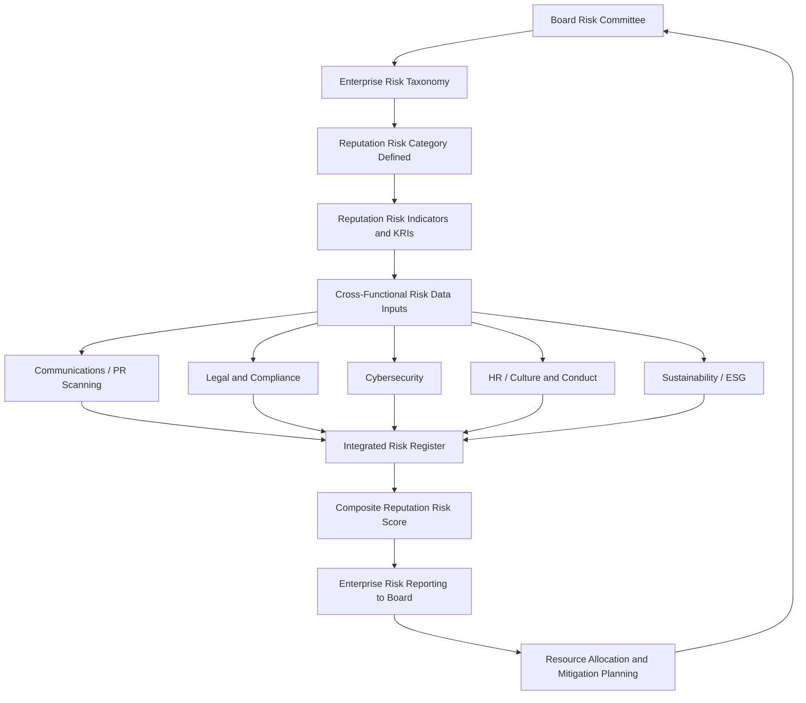
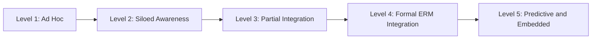

## Integrating Reputation Risk into Enterprise Risk Management

### Definition and Scope

Integrating reputation risk into Enterprise Risk Management (ERM) is the practice of formally embedding reputational exposure — a traditionally intangible, stakeholder-perception-driven risk category — into an organization's structured, board-governed risk framework alongside financial, operational, legal, and strategic risks. This addresses a historical gap in ERM practice: reputation has often been treated as a *consequence* of other risks materializing, rather than as a distinct risk category with its own drivers, indicators, and mitigation pathways.

This topic sits downstream of environmental scanning and vulnerability auditing in the risk and issues management lifecycle — it is the governance mechanism that ensures findings from those detection and assessment activities carry formal organizational weight rather than remaining siloed within communications functions.

### Why Reputation Risk Resists Traditional ERM Treatment

- **Derivative nature** — reputational damage is frequently a second-order effect of a primary risk event (a safety failure, a data breach, an executive scandal), making it harder to model as an independent variable
- **Measurement difficulty** — unlike financial risk, reputation lacks a universally agreed quantitative unit; proxies (stock price reaction, sentiment scores, survey trust indices) are imperfect and lagging
- **Stakeholder plurality** — reputation exists differently in the perception of each stakeholder group (customers, investors, regulators, employees, communities), resisting a single risk score
- **Velocity mismatch** — reputational risk can escalate on social media timescales (hours) while traditional ERM cycles operate on quarterly or annual review cadences
- **Ownership ambiguity** — reputation risk historically sits with communications/PR functions that may lack formal representation on enterprise risk committees

[Inference] These structural difficulties are likely why reputation risk integration into ERM has lagged behind other risk categories in many organizations, despite widespread executive recognition — commonly cited in industry surveys — that reputational damage ranks among the most feared business risks.

### ERM Structural Frameworks as Integration Points

Reputation risk integration is typically mapped onto established ERM frameworks rather than requiring a parallel structure. The two most referenced frameworks:

**COSO ERM Framework** — organizes risk around five interrelated components:

1. Governance and Culture
2. Strategy and Objective-Setting
3. Performance (risk identification, assessment, prioritization, response)
4. Review and Revision
5. Information, Communication, and Reporting

**ISO 31000** — organizes risk management around principles, a framework, and a process (establishing context, risk assessment, risk treatment, monitoring/review, communication/consultation).

Reputation risk integration typically inserts itself at three points across either framework: (1) explicit inclusion in the enterprise risk taxonomy, (2) representation in the risk assessment/scoring methodology, and (3) inclusion in board and executive risk reporting.

### Integration Architecture

**Architecture components explained:**

- **Reputation risk category definition** — formally naming reputation as a taxonomy entry, typically defined as the risk of stakeholder perception diverging materially from organizational values, promises, or performance
- **Key Risk Indicators (KRIs)** — quantifiable, trackable metrics serving as early-warning proxies for reputational exposure
- **Cross-functional data inputs** — reputation risk is unique in ERM for drawing inputs from nearly every other risk domain, since almost any operational, legal, or conduct failure carries reputational consequence
- **Integrated risk register** — a shared repository (not a communications-only document) where reputation risk sits alongside financial and operational entries with comparable scoring rigor
- **Board reporting** — reputation risk metrics included in standing enterprise risk dashboards, not as a standalone communications briefing

### Candidate Key Risk Indicators (KRIs)

| Category | Example Indicators |
| --- | --- |
| Sentiment/Perception | Net sentiment score trend, share-of-voice in negative coverage, NPS/trust index movement |
| Media/Digital Exposure | Volume of negative media coverage, social amplification velocity, influencer/activist mention frequency |
| Stakeholder Trust | Employee engagement/trust survey scores, customer complaint volume trend, investor sentiment in earnings calls |
| Regulatory/Legal | Number of open regulatory inquiries, litigation volume trend, compliance violation frequency |
| Operational Proxy | Product recall frequency, safety incident rate, service outage frequency |
| Governance | Whistleblower report volume, board risk committee escalation frequency |

[Unverified] The specific weighting or composite formula used to combine these indicators into a single reputation risk score is organization-specific and not standardized industry-wide; approaches vary significantly by sector and risk maturity.

### Composite Scoring Approach

A common simplified model expresses composite reputation risk exposure as a weighted sum of underlying indicator categories:

$$RRS = \sum_{i=1}^{n} w_i \cdot S_i$$

Where $RRS$ is the composite reputation risk score, $S_i$ is the normalized score for indicator category $i$, and $w_i$ is the weight assigned to that category (with $\sum w_i = 1$), calibrated to the organization's stakeholder priorities and sector exposure.

### Governance Model for Integration

1. **Board-level sponsorship** — reputation risk oversight formally assigned to the board risk committee or an equivalent body, not left solely to management discretion
2. **Named executive accountability** — typically a Chief Risk Officer, Chief Communications Officer, or joint accountability structure, with clear escalation authority
3. **Cross-functional risk committee** — regular (e.g., quarterly) convening of risk, legal, communications, HR, sustainability, and security leads to review the integrated risk register
4. **Formal reporting cadence** — reputation risk metrics included in the same reporting rhythm as financial and operational risk (board risk committee meetings, annual risk appetite reviews)
5. **Risk appetite statement inclusion** — explicit articulation of the organization's tolerance for reputational exposure across categories, analogous to financial risk appetite statements
6. **Linkage to incentive structures** — [Inference] organizations further along the maturity curve often tie reputation risk performance to executive compensation or performance reviews, though this practice is not universal

### Maturity Model

- **Level 1 — Ad Hoc**: Reputation risk addressed reactively, only after an incident occurs; no formal ownership
- **Level 2 — Siloed Awareness**: Communications function tracks reputational issues independently; not connected to enterprise risk register
- **Level 3 — Partial Integration**: Reputation risk appears in enterprise risk taxonomy but with limited data rigor or board visibility
- **Level 4 — Formal ERM Integration**: Reputation risk fully embedded with defined KRIs, cross-functional data inputs, and standing board reporting
- **Level 5 — Predictive and Embedded**: Reputation risk indicators feed forward into strategic decision-making and scenario planning, with predictive/anticipatory rather than purely reactive posture

### Common Failure Modes

- **Reporting without authority** — reputation risk metrics presented to the board but with no corresponding decision-making or resource-allocation power attached
- **Metric proliferation without synthesis** — collecting numerous sentiment and media metrics without a coherent composite framework, producing noise rather than actionable signal
- **Communications-only ownership** — treating integration as a communications department initiative rather than genuine cross-functional enterprise risk governance
- **Lagging indicators only** — relying exclusively on post-hoc measures (media coverage volume, survey results) rather than leading indicators that could enable earlier intervention
- **Disconnect from strategy** — reputation risk assessment conducted in isolation from strategic planning, missing opportunities to factor reputational exposure into major business decisions (M&A, market entry, product launches)

### Practical Example

**Example**

A multinational consumer goods company restructures its enterprise risk taxonomy to add "Reputation and Stakeholder Trust" as a formal Tier 1 risk category, reporting directly to the board risk committee. A cross-functional working group (communications, legal, sustainability, HR) defines six KRIs, including negative sentiment velocity and supplier ESG compliance rate. These feed a quarterly composite reputation risk score presented alongside financial risk metrics in board reporting. When the composite score crosses a pre-defined threshold following a spike in supplier-related social media criticism, it automatically triggers a joint review by legal, sustainability, and communications leads — formalizing a response pathway that previously depended on informal escalation. Over the following annual cycle, the reputation risk category is incorporated into the company's strategic risk appetite statement, with explicit tolerance thresholds set for supply chain and product safety-related reputational exposure.

### Related Topics

- Environmental and Horizon Scanning
- Vulnerability Audits and Risk Mapping
- Key Risk Indicator (KRI) Design and Governance
- Board-Level Risk Governance and Reporting
- Risk Appetite Statement Development
- ESG Risk Integration and Sustainability Reporting
- Crisis Preparedness Planning and Playbook Development
- Cross-Functional Risk Committee Design