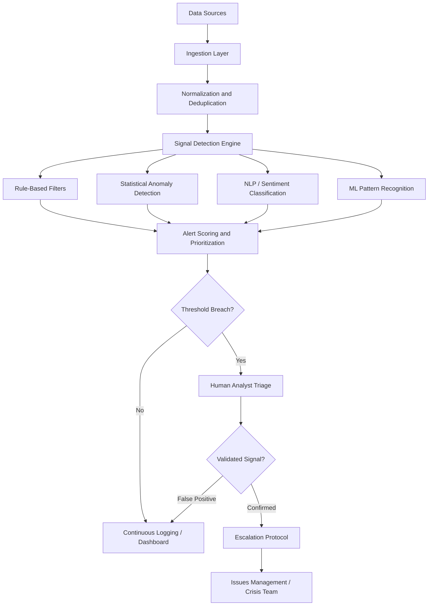

## Early Warning Systems and Signal Detection

### Definition and Scope

An Early Warning System (EWS) is the technical and organizational infrastructure that operationalizes signal detection into a repeatable, monitored capability — the systems, data pipelines, alert thresholds, and human review processes that convert raw external and internal data into timely, actionable notification before an issue reaches crisis intensity. Signal detection is the underlying analytical discipline of distinguishing meaningful indicators of emerging risk from background noise within continuous data streams.

Where environmental/horizon scanning defines *what* to look for and vulnerability audits define *where* an organization is exposed, early warning systems and signal detection define the **technical mechanism** by which those risks are continuously monitored and surfaced in near-real time. This is the operational, often technology-enabled layer that sits between strategic risk frameworks and day-to-day crisis prevention.

### Core Distinction from Scanning and Vulnerability Auditing

| Dimension | Horizon Scanning | Vulnerability Audit | Early Warning System |
| --- | --- | --- | --- |
| Focus | External trend identification | Internal exposure assessment | Continuous automated/semi-automated monitoring |
| Time orientation | Medium-long term | Point-in-time (periodic) | Real-time/near-real-time |
| Primary method | Analyst-led synthesis | Structured audit process | Technology-enabled monitoring + human triage |
| Output | Issue log, trend report | Risk register, risk map | Alerts, dashboards, threshold breaches |
| Trigger frequency | Periodic review cycles | Annual/biannual | Continuous, event-driven |

[Inference] In practice, an EWS is often the technical infrastructure layer underneath scanning — scanning is the analytical discipline, while the EWS is the tooling and workflow that makes continuous scanning operationally feasible at scale.

### System Architecture

**Layer descriptions:**

1. **Data Sources** — media, social platforms, regulatory feeds, internal systems, sensor/operational data
2. **Ingestion Layer** — APIs, web scraping (where permitted), RSS feeds, direct data partnerships with monitoring vendors
3. **Normalization and Deduplication** — standardizing disparate data formats and removing redundant entries (e.g., the same story republished across multiple outlets)
4. **Signal Detection Engine** — the analytical core, typically combining multiple detection methods rather than relying on one
5. **Alert Scoring and Prioritization** — assigning severity/confidence scores to flagged items
6. **Human Analyst Triage** — critical validation layer; automated systems flag candidates, humans confirm genuine signals before escalation
7. **Escalation Protocol** — formal handoff into issues management or crisis response workflows once a signal is validated

### Detection Methods

**Key Points**

- **Rule-based/keyword filters** — predefined trigger terms, brand mentions, executive names, or known risk phrases; simple, transparent, but prone to false positives/negatives on novel phrasing
- **Statistical anomaly detection** — flagging deviations from established baselines (e.g., sudden spike in mention volume relative to historical average), often using standard deviation thresholds or control-chart methods
- **Natural Language Processing (NLP) and sentiment classification** — automated scoring of tone, emotion, and topic within text data at scale
- **Machine learning pattern recognition** — models trained to recognize historical crisis-precursor patterns, enabling detection of signals that do not match simple keyword rules
- **Network/graph analysis** — mapping how information spreads across accounts or outlets to detect coordinated amplification or bot-driven activity
- **Velocity and virality tracking** — measuring rate-of-change in mention volume or engagement, since a slow-building issue and a rapidly accelerating one warrant different responses

[Unverified] The relative effectiveness of rule-based versus ML-based detection varies significantly by data domain and is typically determined empirically for a given organization's specific risk profile rather than assumed a priori.

### Statistical Basis for Anomaly Detection

A common baseline approach flags a signal when observed volume $x$ exceeds a threshold defined relative to historical mean $\mu$ and standard deviation $\sigma$:

$$z = \frac{x - \mu}{\sigma}$$

An alert is typically triggered when $z$ exceeds a predefined threshold (commonly $z > 2$ or $z > 3$, corresponding to roughly 95% or 99.7% confidence that the observation deviates from normal variation, under a standard normal distribution assumption).

[Inference] Organizations frequently tune this threshold empirically rather than relying purely on the theoretical distribution, since real-world media and social mention volume rarely follows a clean normal distribution — bursty, heavy-tailed patterns are common, which can produce excessive false positives if the naive z-score threshold is applied without calibration.

### Alert Prioritization Matrix

| Confidence | Severity | Response |
| --- | --- | --- |
| High confidence, high severity | Critical | Immediate human review, potential crisis team activation |
| High confidence, low severity | Moderate | Logged, routine analyst review within standard SLA |
| Low confidence, high severity | Priority review | Rapid human verification required before any action |
| Low confidence, low severity | Background | Logged for pattern analysis; no immediate action |

### SVG: Signal Detection Pipeline

<svg xmlns="http://www.w3.org/2000/svg" viewBox="0 0 500 300">
<text x="250" y="24" text-anchor="middle" font-size="16" font-weight="bold" fill="#1a1a1a">Signal Detection Confidence Funnel (svg_diagram)</text>
<polygon points="40,50 460,50 400,120 100,120" fill="#dbeafe" stroke="#2563eb" stroke-width="1.5" />
<text x="250" y="90" text-anchor="middle" font-size="12" fill="#1e3a8a">Raw Data Ingested (thousands/day)</text>
<polygon points="100,120 400,120 340,180 160,180" fill="#bfdbfe" stroke="#2563eb" stroke-width="1.5" />
<text x="250" y="155" text-anchor="middle" font-size="12" fill="#1e3a8a">Filtered / Anomaly-Flagged</text>
<polygon points="160,180 340,180 300,235 200,235" fill="#93c5fd" stroke="#2563eb" stroke-width="1.5" />
<text x="250" y="212" text-anchor="middle" font-size="11" fill="#1e3a8a">Human-Triaged Candidates</text>
<polygon points="200,235 300,235 280,280 220,280" fill="#3b82f6" stroke="#1e40af" stroke-width="1.5" />
<text x="250" y="262" text-anchor="middle" font-size="11" fill="#ffffff">Validated Escalations</text>
</svg>

### False Positive / False Negative Tradeoff

Signal detection systems must balance two error types:

- **False positive** — flagging a non-issue as significant, consuming analyst time and risking "alert fatigue" where genuine signals are eventually ignored amid noise
- **False negative** — failing to flag a genuine emerging issue, resulting in the organization being caught unaware

[Inference] Because the reputational cost of a missed genuine crisis signal is typically far higher than the operational cost of investigating a false alarm, most mature early warning systems are deliberately tuned toward higher sensitivity (accepting more false positives) rather than higher specificity, particularly for high-impact risk categories.

### Human-in-the-Loop Design

Fully automated escalation is rarely advisable in reputation-sensitive contexts. Standard practice retains human judgment at the validation stage for several reasons:

1. **Contextual nuance** — automated systems can misread sarcasm, cultural context, satire, or coordinated inauthentic activity as genuine signal
2. **Accountability** — escalation into crisis protocols typically requires a named human decision-maker for governance and audit-trail purposes
3. **Calibration feedback** — analyst triage decisions (confirming or dismissing flagged signals) are commonly fed back into detection models or rule sets to improve future accuracy
4. **Judgment on ambiguous severity** — determining whether a validated signal warrants "monitor" versus "escalate" often requires organizational and strategic context that automated scoring alone cannot supply

### Governance and Operational Integration

1. **24/7 or extended-hours monitoring coverage** — particularly important given that reputational issues can emerge and escalate outside standard business hours, especially across global time zones
2. **Defined escalation SLAs** — time-bound commitments for how quickly a validated critical signal must reach decision-makers
3. **Tiered alert routing** — different alert severities routed to different stakeholders (e.g., critical alerts to crisis team leadership, moderate alerts to communications analysts)
4. **Regular threshold calibration** — periodic review of detection thresholds against actual outcomes to reduce false positive/negative rates over time
5. **Integration with issue log and risk register** — validated signals should feed directly into the broader issues management and vulnerability tracking systems rather than existing as an isolated alert stream
6. **Post-event system review** — after any crisis, reviewing whether the EWS detected precursor signals, and if not, why, to refine detection logic

### Common Failure Modes

- **Alert fatigue** — poorly calibrated thresholds generating excessive false positives, causing analysts to deprioritize or ignore alerts over time
- **Over-reliance on single data source** — monitoring only traditional media or only one social platform, missing signals emerging in other channels (closed forums, messaging apps, niche communities)
- **Lagging keyword lists** — rule-based systems using static keyword lists that fail to capture evolving terminology, slang, or coded language
- **No human triage capacity** — technical detection infrastructure outpacing the analyst resourcing needed to review and validate flagged signals
- **Disconnected escalation** — validated signals detected but with no clear or timely pathway into decision-making structures
- **Black-box ML models** — pattern-recognition systems whose flagged signals cannot be easily explained to non-technical stakeholders, undermining trust and adoption

### Practical Example

**Example**

A financial services firm's early warning system ingests social media, news RSS feeds, and regulatory filing alerts continuously. A statistical anomaly detector flags a 4x spike in negative-sentiment mentions of the firm's name within a two-hour window (z-score of 3.4 against the 90-day baseline). The alert routes to an on-call analyst, who triages within the 15-minute SLA and confirms the spike traces to a viral social media post alleging a data security issue, rapidly amplified by several mid-tier accounts. The analyst validates this as a genuine signal, not a coordinated inauthentic campaign, and escalates to the crisis team lead under the "high confidence, high severity" protocol. The crisis team convenes within 30 minutes — well before the story reaches mainstream media — allowing the firm to verify the underlying claim internally and prepare a factual response ahead of broader visibility.

### Related Topics

- Environmental and Horizon Scanning
- Vulnerability Audits and Risk Mapping
- Social Media Monitoring and Sentiment Analysis Tools
- Crisis Escalation Protocols and Decision Trees
- Alert Fatigue and Analyst Workflow Design
- Machine Learning Applications in Reputation Risk Detection
- Dark Social and Closed-Platform Monitoring Challenges
- Post-Crisis Detection Review and System Recalibration