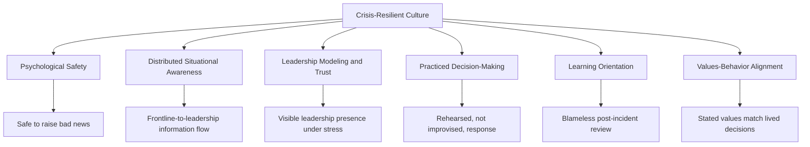
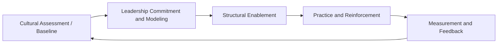

## Building a Crisis-Resilient Organizational Culture

### Definition and Scope

Crisis-resilient organizational culture refers to the set of shared values, behavioral norms, leadership practices, and structural habits that determine how an organization anticipates, absorbs, and recovers from disruptive events — independent of any single crisis plan or technical system. Where early warning systems and vulnerability audits address *detection and assessment*, and formal crisis plans address *procedural response*, culture addresses the **human and behavioral substrate** that determines whether those systems and plans are actually used effectively under pressure.

This is frequently the least visible but most decisive factor in crisis outcomes: [Inference] organizations with technically excellent crisis plans but poor underlying culture (fear of raising bad news, siloed decision-making, low psychological safety) commonly underperform organizations with simpler plans but stronger cultural readiness, because plans are executed by people whose behavior under stress is culturally conditioned long before the crisis begins.

### Distinction from Crisis Planning and Response Protocols

| Dimension | Crisis Plans/Protocols | Crisis-Resilient Culture |
| --- | --- | --- |
| Nature | Documented procedures, decision trees | Embedded values, habits, norms |
| Timescale | Activated during a crisis | Built continuously, pre-crisis |
| Owner | Crisis management team | Entire organization, led by executive/leadership behavior |
| Failure mode | Plan doesn't cover the scenario | People don't follow or trust the plan |
| Evidence of strength | Plan documentation quality | Speed and honesty of internal issue-surfacing |

### Core Pillars of Crisis-Resilient Culture

### Pillar 1: Psychological Safety

Psychological safety — the shared belief that a team is safe for interpersonal risk-taking — is foundational because crisis signals are most often first visible at the frontline or middle-management level, long before they reach executive awareness.

**Key Points**

- Employees must believe raising a problem, mistake, or early warning sign will not result in punishment or reputational harm to themselves
- The absence of psychological safety is a primary driver of the "upward filtering" problem, where bad news is softened or delayed as it moves up the hierarchy
- Practical builders include: leaders explicitly rewarding early disclosure of problems (even when the disclosure itself is uncomfortable), visible non-punitive response to good-faith error reporting, and removing informal penalties for "being the messenger"

[Inference] Organizations that have experienced a crisis worsened by delayed internal disclosure often trace the root cause, in post-incident review, to psychological safety gaps rather than to the absence of a formal escalation procedure — the procedure existed but was not used.

### Pillar 2: Distributed Situational Awareness

A resilient culture treats risk awareness as distributed across the organization rather than concentrated solely in a risk or communications function.

- **Frontline empowerment** — training and normalizing employees across functions (customer service, sales, operations) to recognize and report potential reputational signals, not just formal risk officers
- **Reduced information hoarding** — cultural discouragement of siloed knowledge-holding, particularly across business units or geographies
- **Cross-functional fluency** — shared basic vocabulary and awareness of risk categories across departments, so that, for example, a legal team member recognizes a communications-relevant signal and vice versa

### Pillar 3: Leadership Modeling and Trust

- **Visible leadership presence** — leaders who are seen engaging directly and transparently during difficult periods (not delegating entirely to spokespeople or communications staff) build organizational trust that compounds over time
- **Consistency between stated and demonstrated priorities** — [Inference] a mismatch between what leadership says it values (e.g., safety, transparency) and what it visibly rewards or tolerates day-to-day is commonly cited in crisis case studies as a driver of eroded internal trust, which in turn undermines crisis response cohesion
- **Decision-making transparency** — explaining the reasoning behind crisis decisions internally, even when full external disclosure isn't possible, sustains employee trust and reduces internal rumor/speculation that can itself become a secondary reputational risk

### Pillar 4: Practiced Decision-Making

Resilience is built through repetition, not documentation alone.

- **Tabletop exercises and simulations** — regular, realistic scenario rehearsals that stress-test both the plan and the human decision-making patterns under simulated pressure
- **Decision authority clarity** — pre-established, practiced understanding of who can make which decisions at which severity level, reducing hesitation and escalation delay during real events
- **Muscle memory over improvisation** — [Inference] teams that have rehearsed crisis roles multiple times generally exhibit faster, more confident decision-making during actual events than teams relying solely on a written plan they have not practiced, since documented procedures alone do not build the interpersonal coordination patterns that speed real-time response

### Pillar 5: Learning Orientation

- **Blameless post-incident review** — structured retrospectives focused on systemic and process causes rather than individual fault-finding, which encourages honest disclosure of what went wrong
- **Near-miss reporting culture** — treating incidents that *almost* became crises as valuable learning data, not just actual crises
- **Institutional memory practices** — deliberately capturing and disseminating lessons learned so that turnover does not erase organizational learning

### Pillar 6: Values-Behavior Alignment

- Resilient culture requires that an organization's stated values are reflected in resourcing, incentive structures, and actual decisions — not merely stated in mission documents
- [Inference] A gap between stated values and lived organizational behavior is frequently identified, in reputational crisis case studies, as both a root cause of the original crisis and an aggravating factor in stakeholder response once the gap becomes publicly visible

### Cultural Diagnostic Indicators

| Indicator | Resilient Signal | Warning Signal |
| --- | --- | --- |
| Speed of bad-news escalation | Issues reach leadership within hours/days | Issues surface only after external exposure |
| Post-incident tone | Systemic, blameless analysis | Blame-seeking, defensive posture |
| Frontline engagement | Employees proactively flag concerns | Concerns raised only when directly asked |
| Leadership visibility in drills | Active, consistent participation | Delegated entirely to risk/communications staff |
| Cross-functional communication | Regular informal information sharing | Siloed, formal-channel-only communication |
| Employee trust survey trends | Stable or improving trust scores | Declining trust, particularly around transparency |

### Building Process

1. **Cultural assessment/baseline** — surveys, focus groups, and review of past incident response to establish current psychological safety and awareness levels
2. **Leadership commitment and modeling** — executive team publicly and consistently demonstrating the desired behaviors, since culture change disproportionately follows leadership behavior rather than policy statements
3. **Structural enablement** — creating actual channels, training, and incentive alignment that make resilient behavior easier to enact (clear escalation paths, non-punitive reporting mechanisms, recognition programs)
4. **Practice and reinforcement** — regular simulations, drills, and scenario discussions that normalize crisis-related behaviors as routine rather than exceptional
5. **Measurement and feedback** — tracking cultural indicators over time and feeding results back into leadership development and organizational design

### SVG: Culture-Resilience Reinforcement Loop

<svg xmlns="http://www.w3.org/2000/svg" viewBox="0 0 460 400">
<text x="230" y="24" text-anchor="middle" font-size="15" font-weight="bold" fill="#1a1a1a">Resilience Reinforcement Loop (svg_diagram)</text>
<circle cx="230" cy="210" r="150" fill="none" stroke="#94a3b8" stroke-width="1.5" stroke-dasharray="3,3" />
<circle cx="230" cy="70" r="42" fill="#dbeafe" stroke="#2563eb" stroke-width="1.5" />
<text x="230" y="66" text-anchor="middle" font-size="10" fill="#1e3a8a">Psychological</text>
<text x="230" y="79" text-anchor="middle" font-size="10" fill="#1e3a8a">Safety</text>
<circle cx="370" cy="150" r="42" fill="#d1fae5" stroke="#047857" stroke-width="1.5" />
<text x="370" y="146" text-anchor="middle" font-size="10" fill="#065f46">Leadership</text>
<text x="370" y="159" text-anchor="middle" font-size="10" fill="#065f46">Modeling</text>
<circle cx="330" cy="310" r="42" fill="#fde68a" stroke="#b45309" stroke-width="1.5" />
<text x="330" y="306" text-anchor="middle" font-size="10" fill="#78350f">Practiced</text>
<text x="330" y="319" text-anchor="middle" font-size="10" fill="#78350f">Response</text>
<circle cx="130" cy="310" r="42" fill="#fecaca" stroke="#991b1b" stroke-width="1.5" />
<text x="130" y="306" text-anchor="middle" font-size="10" fill="#7f1d1d">Blameless</text>
<text x="130" y="319" text-anchor="middle" font-size="10" fill="#7f1d1d">Learning</text>
<circle cx="90" cy="150" r="42" fill="#e9d5ff" stroke="#7e22ce" stroke-width="1.5" />
<text x="90" y="146" text-anchor="middle" font-size="10" fill="#581c87">Distributed</text>
<text x="90" y="159" text-anchor="middle" font-size="10" fill="#581c87">Awareness</text>
<path d="M 260,95 L 340,125" stroke="#64748b" stroke-width="1.5" marker-end="url(#arrow1)" />
<path d="M 375,192 L 345,270" stroke="#64748b" stroke-width="1.5" marker-end="url(#arrow1)" />
<path d="M 295,325 L 165,325" stroke="#64748b" stroke-width="1.5" marker-end="url(#arrow1)" />
<path d="M 105,270 L 85,192" stroke="#64748b" stroke-width="1.5" marker-end="url(#arrow1)" />
<path d="M 115,125 L 200,95" stroke="#64748b" stroke-width="1.5" marker-end="url(#arrow1)" />
</svg>

### Integration with Broader Risk Architecture

1. **Feeds early warning system effectiveness** — a culture with strong psychological safety directly increases the volume and speed of genuine internal signal reporting into detection systems
2. **Strengthens vulnerability audit accuracy** — employees are more forthcoming with auditors and interviewers about real exposures when they trust disclosure will not be punished
3. **Improves ERM reporting quality** — honest, timely internal reporting improves the accuracy of data feeding into enterprise risk registers and KRIs
4. **Determines crisis plan execution fidelity** — even the most well-designed crisis plan depends on cultural readiness for actual execution speed and coordination

### Common Failure Modes

- **Culture-as-slogan** — values statements and culture initiatives that are not reinforced through actual leadership behavior or incentive alignment
- **Punitive incident response** — treating post-incident review as a fault-finding exercise, which suppresses future honest disclosure
- **Leadership absence during drills** — treating crisis simulations as a staff-level exercise without genuine executive participation, signaling low organizational priority
- **Training without repetition** — one-time crisis training sessions with no ongoing reinforcement, allowing skills and awareness to decay over time
- **Ignoring near-misses** — failing to systematically capture and learn from incidents that did not escalate into full crises, losing valuable low-cost learning opportunities
- **Siloed resilience-building** — culture initiatives run solely by HR or communications without integration into risk management, operations, and executive leadership practices

### Practical Example

**Example**

A manufacturing company experiences a near-miss safety incident that does not escalate publicly but reveals a process gap. Under a blameless review protocol, the frontline team that reported the issue is publicly thanked by senior leadership in an all-staff communication, and the process fix is documented and shared company-wide as a case study — explicitly without naming or penalizing the individuals involved. Eighteen months later, a similar but more serious signal emerges at a different facility. Because the earlier response had visibly rewarded disclosure rather than punished it, the second facility's team escalates the issue within hours rather than attempting to resolve it quietly, allowing the crisis team to intervene before any safety or reputational incident occurs. [Inference] The contrast in escalation speed between the two events is commonly attributed, in resilience literature, to the cultural signal sent by the first response rather than to any change in formal reporting procedure, since the procedure itself was unchanged between the two incidents.

### Related Topics

- Environmental and Horizon Scanning
- Vulnerability Audits and Risk Mapping
- Early Warning Systems and Signal Detection
- Integrating Reputation Risk into Enterprise Risk Management
- Crisis Leadership and Executive Communication Training
- Psychological Safety Frameworks in High-Reliability Organizations
- Tabletop Exercises and Crisis Simulation Design
- Post-Incident Review and Blameless Retrospective Methodology