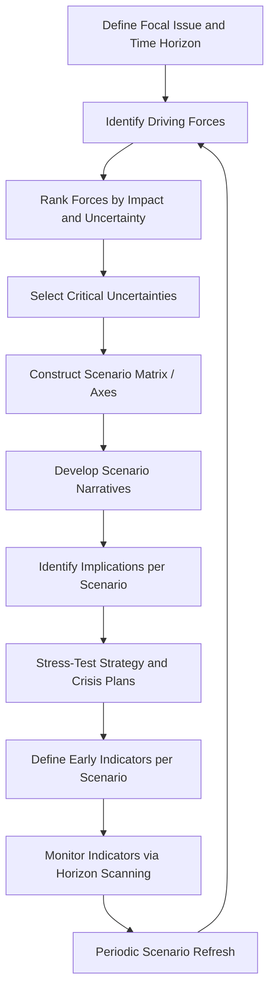

## Scenario Planning for Emerging Risks


### Definition and Scope

Scenario planning is a structured foresight methodology that constructs multiple plausible future narratives — rather than a single predicted outcome — to stress-test organizational strategy, preparedness, and decision-making against uncertainty. Applied to emerging risks, it takes the weak signals and issue clusters surfaced by horizon scanning and develops them into coherent, internally consistent future storylines that reveal how an organization's reputation, operations, and stakeholder relationships might be affected under different conditions.

This is the **synthesis and rehearsal layer** of risk and issues management: horizon scanning detects signals, vulnerability audits map internal exposure, early warning systems monitor continuously, and scenario planning integrates all of this into forward-looking narratives used to pressure-test strategy and crisis readiness before real events unfold.

### Distinction from Forecasting and Prediction

| Dimension | Forecasting | Scenario Planning |
| --- | --- | --- |
| Goal | Predict the single most likely outcome | Explore a range of plausible, divergent futures |
| Underlying assumption | Sufficient data exists to estimate probability | High uncertainty makes precise prediction unreliable |
| Output | A number or point estimate | Multiple qualitative narratives |
| Value under uncertainty | Degrades as uncertainty increases | Increases in value as uncertainty increases |
| Primary use | Resource and operational planning | Strategic stress-testing and preparedness |

[Inference] Scenario planning is generally favored over point forecasting specifically for emerging and reputational risks because these risks are characterized by high ambiguity, non-linear escalation (social media virality, cascading stakeholder reactions), and limited historical precedent — conditions under which traditional probabilistic forecasting tends to be unreliable.

### Theoretical Foundation

Modern corporate scenario planning traces to methodologies developed at RAND Corporation in the mid-20th century and later popularized in the corporate sector, notably through Royal Dutch Shell's scenario planning practice, which is widely cited as demonstrating the approach's value in anticipating major strategic discontinuities.

The core premise is that the future is not a single extrapolation of current trends but a branching set of possibilities shaped by a small number of critical uncertainties — and that organizations that have already "rehearsed" a range of these possibilities respond more effectively when one begins to materialize, regardless of which specific scenario proves closest to reality.

### Scenario Planning Process



**Stage descriptions:**

1. **Define focal issue and time horizon** — establishing the specific decision or risk area under examination and how far into the future the exercise looks (commonly 3–10 years for strategic scenarios, shorter for tactical reputational scenarios)
2. **Identify driving forces** — cataloging the political, economic, social, technological, legal, and environmental factors that could shape the focal issue, often drawing directly on PESTLE-categorized horizon scanning outputs
3. **Rank forces by impact and uncertainty** — distinguishing predetermined elements (high certainty, e.g., demographic trends) from critical uncertainties (high impact, low predictability)
4. **Select critical uncertainties** — narrowing to the two (occasionally three) most impactful and uncertain forces, since scenario matrices become unwieldy beyond this
5. **Construct scenario matrix/axes** — plotting the two critical uncertainties as intersecting axes, generating four quadrant scenarios
6. **Develop scenario narratives** — writing detailed, internally consistent stories for each quadrant, giving each a memorable name
7. **Identify implications per scenario** — working through how each scenario would affect stakeholders, operations, and reputation
8. **Stress-test strategy and crisis plans** — evaluating whether current plans, resources, and messaging would hold up under each scenario
9. **Define early indicators per scenario** — specifying observable signals that would suggest a given scenario is beginning to materialize
10. **Monitor indicators via horizon scanning** — closing the loop back into continuous environmental scanning
11. **Periodic scenario refresh** — revisiting and updating scenarios as driving forces evolve

### The 2x2 Scenario Matrix Method

The most common structural technique selects two critical, independent uncertainties and plots them as perpendicular axes, generating four distinct future scenarios:

```mermaid
quadrantChart
    title Emerging Risk Scenario Matrix (svg_diagram)
    x-axis Low Regulatory Intervention --> High Regulatory Intervention
    y-axis Low Public Scrutiny --> High Public Scrutiny
    quadrant-1 Scenario B: Regulatory Storm
    quadrant-2 Scenario A: Quiet Compliance
    quadrant-3 Scenario D: Status Quo
    quadrant-4 Scenario C: Viral Backlash
```

Note: Where `quadrantChart` rendering is unavailable, this is typically represented as a manually constructed 2x2 table or SVG diagram, as below.

### SVG: Scenario Matrix Example

<svg xmlns="http://www.w3.org/2000/svg" viewBox="0 0 500 420">
<text x="250" y="24" text-anchor="middle" font-size="15" font-weight="bold" fill="#1a1a1a">Scenario Matrix: Critical Uncertainties (svg_diagram)</text>
<line x1="80" y1="350" x2="460" y2="350" stroke="#333" stroke-width="2" />
<line x1="80" y1="350" x2="80" y2="60" stroke="#333" stroke-width="2" />

<text x="270" y="385" text-anchor="middle" font-size="12" fill="#333">Regulatory Intervention →</text>

<text x="35" y="205" text-anchor="middle" font-size="12" fill="#333" transform="rotate(-90 35 205)">Public Scrutiny →</text>

<line x1="270" y1="60" x2="270" y2="350" stroke="#bbb" stroke-dasharray="4,4" />
<line x1="80" y1="205" x2="460" y2="205" stroke="#bbb" stroke-dasharray="4,4" />
<rect x="80" y="60" width="190" height="145" fill="#dbeafe" opacity="0.6" />
<rect x="270" y="60" width="190" height="145" fill="#fca5a5" opacity="0.6" />
<rect x="80" y="205" width="190" height="145" fill="#d1fae5" opacity="0.5" />
<rect x="270" y="205" width="190" height="145" fill="#fde68a" opacity="0.6" />

<text x="175" y="120" text-anchor="middle" font-size="12" font-weight="bold" fill="`#1e3a8a`">Scenario A</text>

<text x="175" y="138" text-anchor="middle" font-size="10" fill="`#1e3a8a`">Quiet Compliance</text>

<text x="365" y="120" text-anchor="middle" font-size="12" font-weight="bold" fill="`#7f1d1d`">Scenario B</text>

<text x="365" y="138" text-anchor="middle" font-size="10" fill="`#7f1d1d`">Regulatory Storm</text>

<text x="175" y="270" text-anchor="middle" font-size="12" font-weight="bold" fill="`#065f46`">Scenario D</text>

<text x="175" y="288" text-anchor="middle" font-size="10" fill="`#065f46`">Status Quo</text>

<text x="365" y="270" text-anchor="middle" font-size="12" font-weight="bold" fill="`#78350f`">Scenario C</text>

<text x="365" y="288" text-anchor="middle" font-size="10" fill="`#78350f`">Viral Backlash</text>

</svg>

### Scenario Narrative Components

Each scenario, once selected, is typically developed with consistent structural elements to ensure comparability and usability:

**Key Points**

- **Name/label** — memorable, evocative title aiding organizational recall and discussion
- **Storyline** — a coherent narrative describing how the world arrives at this future state
- **Key stakeholder behaviors** — how customers, regulators, media, employees, and activists behave under this scenario
- **Reputational implications** — specific exposure points and narrative risks the organization would face
- **Strategic and operational implications** — what would need to change in business operations, not just communications
- **Early warning indicators** — specific, observable signals that would suggest this scenario is emerging, feeding directly back into horizon scanning and EWS thresholds
- **Recommended preparatory actions** — no-regret moves the organization could make now that would be beneficial regardless of which scenario materializes

### Distinguishing "No-Regret" Moves

A key output of comparing scenarios side by side is identifying **no-regret actions** — strategic or preparedness moves that produce value across multiple or all scenarios, versus **contingent actions** that are only appropriate if a specific scenario begins to materialize.

[Inference] Prioritizing no-regret actions is generally considered good practice in scenario-based planning because it allows organizations to act on foresight immediately without committing significant resources to a single predicted future that may not occur.

### Integration with Crisis Preparedness

1. **Scenario-informed playbooks** — crisis communication playbooks can be pre-drafted or structurally prepared against specific scenario narratives, reducing response time if a scenario begins to materialize
2. **Tabletop exercise design** — scenarios generated through this process directly supply realistic, organization-specific content for crisis simulation exercises
3. **Spokesperson and messaging preparation** — key messages and holding statements can be scenario-tested in advance, identifying gaps before a real event forces improvisation
4. **Resource pre-positioning** — identifying which scenarios would require specific resources (legal counsel, specialized communications support, translation services) allows pre-arrangement of those resources or contracts

### Common Failure Modes

- **Single-scenario planning disguised as multiple** — producing scenarios that are only minor variations of the same underlying story rather than genuinely divergent futures
- **Overloading axes** — attempting to incorporate more than two critical uncertainties into the matrix structure, producing an unmanageable number of scenarios
- **Best-case/worst-case bias** — defaulting to overly extreme, low-plausibility scenarios rather than genuinely plausible ones, which can undermine organizational buy-in
- **Scenario-to-shelf gap** — producing detailed scenario narratives that are not connected to actual strategic decisions, crisis plans, or monitoring indicators
- **Infrequent refresh** — treating scenarios as a one-time exercise rather than periodically revisiting them as driving forces and signals evolve
- **Excluding frontline and diverse perspectives** — building scenarios solely from senior leadership or communications-team input, missing operational or ground-level insight that could reveal blind spots

### Practical Example

**Example**

A technology company runs a scenario planning exercise around the emerging risk of AI-generated misinformation targeting its brand. Two critical uncertainties are identified: (1) the pace of regulatory response to AI-generated content, and (2) the rate of public ability to distinguish authentic from synthetic content. Four scenarios are developed: "Regulatory Shield" (fast regulation, high public discernment — low organizational exposure), "Digital Wild West" (slow regulation, low public discernment — high organizational exposure), "Patchwork Protection" (fast regulation, low discernment — moderate exposure with legal complexity), and "Public Vigilance" (slow regulation, high discernment — moderate exposure managed largely by public skepticism). Early indicators are defined for each — for "Digital Wild West," these include rising volume of AI-generated impersonation content and absence of pending legislation. These indicators are fed into the company's horizon scanning process. When indicator monitoring later shows a sharp rise in synthetic-content volume with no corresponding regulatory movement, the "Digital Wild West" scenario's pre-drafted response playbook and legal escalation pathway — prepared months earlier — is activated substantially faster than an unprepared, improvised response would have allowed.

### Related Topics

- Environmental and Horizon Scanning
- Vulnerability Audits and Risk Mapping
- Early Warning Systems and Signal Detection
- Integrating Reputation Risk into Enterprise Risk Management
- Building a Crisis-Resilient Organizational Culture
- Tabletop Exercises and Crisis Simulation Design
- Crisis Communication Playbook Development
- Strategic Foresight and Driving-Force Analysis Techniques