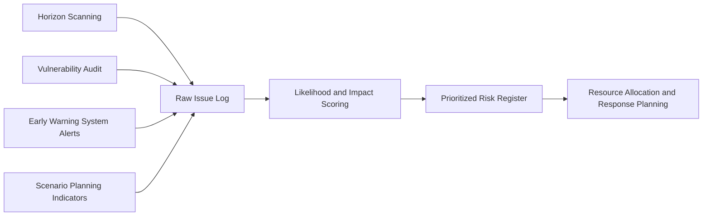

## Prioritizing Issues by Likelihood and Impact


### Definition and Scope

Prioritizing issues by likelihood and impact is the structured analytical process of ranking identified risks, vulnerabilities, and emerging issues against two core dimensions — how probable an issue is to materialize, and how severe its consequences would be if it did — to determine where limited organizational attention, resources, and preparedness effort should be concentrated. This is the **decision-filtering layer** of risk and issues management: it takes the raw output of scanning, auditing, and monitoring activities and converts an often-lengthy issue log into a ranked, actionable priority set.

Without this step, organizations accumulate large volumes of identified risks and signals with no defensible basis for deciding which warrant immediate mitigation, which merit contingency planning, and which can be logged for periodic review only.

### Position in the Risk Management Pipeline



Prioritization does not generate new risk data; it operates on the combined output of upstream detection processes, converting an undifferentiated list into a ranked action framework.

### Core Dimensions

**Likelihood** — the estimated probability that an issue will occur or escalate within a defined time horizon. Assessed through historical base rates, trend trajectory, expert judgment, and signal strength from monitoring systems.

**Impact** — the estimated severity of consequences should the issue materialize, typically assessed across multiple dimensions rather than a single measure:

- **Reputational impact** — damage to stakeholder trust, brand equity, media narrative
- **Financial impact** — direct costs, revenue loss, share price effect, litigation exposure
- **Operational impact** — disruption to core business functions
- **Regulatory/legal impact** — compliance consequences, potential sanctions
- **Human impact** — safety, wellbeing, or welfare consequences to employees, customers, or communities

[Inference] Best practice generally favors scoring impact across these separate dimensions rather than as a single composite figure at the point of initial assessment, since an issue might rank low on financial impact but high on reputational impact (or vice versa), and collapsing this distinction too early can obscure which mitigation function should own the response.

### Scoring Methodology

A standard approach assigns numerical scores (commonly 1–5) to both likelihood and impact, then combines them into a composite risk score:

$$RiskScore = L \times I$$

Where $L$ is the likelihood score and $I$ is the impact score, producing a scale typically ranging from 1 (lowest priority) to 25 (highest priority) on a 5x5 matrix.

**Illustrative 5-point likelihood scale:**

| Score | Descriptor | Approximate Interpretation |
| --- | --- | --- |
| 1 | Rare | Unlikely to occur within the review period |
| 2 | Unlikely | Could occur but not expected |
| 3 | Possible | Reasonable chance of occurring |
| 4 | Likely | Expected to occur under current conditions |
| 5 | Almost Certain | Already occurring or imminent |

**Illustrative 5-point impact scale:**

| Score | Descriptor | Approximate Interpretation |
| --- | --- | --- |
| 1 | Negligible | Minimal, easily absorbed effect |
| 2 | Minor | Limited, localized effect, short recovery |
| 3 | Moderate | Noticeable effect, requires dedicated response |
| 4 | Major | Significant, sustained damage requiring extensive response |
| 5 | Severe | Existential or near-existential threat to the organization |

[Unverified] The specific number of points on the scale (3, 5, or 7-point scales are all used in practice) and the precise descriptor language vary by organization and sector; no single scale is universally standardized.

### The Risk Matrix / Heat Map

```mermaid
quadrantChart
    title Issue Prioritization Matrix (svg_diagram)
    x-axis Low Likelihood --> High Likelihood
    y-axis Low Impact --> High Impact
    quadrant-1 High Priority: Immediate Mitigation
    quadrant-2 Contingency Planning
    quadrant-3 Routine Monitoring
    quadrant-4 Active Management
```

Note: Where `quadrantChart` rendering is unsupported, organizations commonly substitute a manually constructed 5x5 or 3x3 grid table, color-coded by composite score band, as shown below.

### SVG: 5x5 Risk Prioritization Matrix

<svg xmlns="http://www.w3.org/2000/svg" viewBox="0 0 480 460">
<text x="240" y="24" text-anchor="middle" font-size="15" font-weight="bold" fill="#1a1a1a">5x5 Risk Prioritization Matrix (svg_diagram)</text>

<text x="240" y="440" text-anchor="middle" font-size="12" fill="#333">Likelihood →</text>

<text x="20" y="240" text-anchor="middle" font-size="12" fill="#333" transform="rotate(-90 20 240)">Impact →</text>


<rect x="60" y="50" width="70" height="70" fill="#fde68a" />
<rect x="130" y="50" width="70" height="70" fill="#fca5a5" />
<rect x="200" y="50" width="70" height="70" fill="#f87171" />
<rect x="270" y="50" width="70" height="70" fill="#ef4444" />
<rect x="340" y="50" width="70" height="70" fill="#dc2626" />

<rect x="60" y="120" width="70" height="70" fill="#d1fae5" />
<rect x="130" y="120" width="70" height="70" fill="#fde68a" />
<rect x="200" y="120" width="70" height="70" fill="#fca5a5" />
<rect x="270" y="120" width="70" height="70" fill="#f87171" />
<rect x="340" y="120" width="70" height="70" fill="#ef4444" />

<rect x="60" y="190" width="70" height="70" fill="#d1fae5" />
<rect x="130" y="190" width="70" height="70" fill="#d1fae5" />
<rect x="200" y="190" width="70" height="70" fill="#fde68a" />
<rect x="270" y="190" width="70" height="70" fill="#fca5a5" />
<rect x="340" y="190" width="70" height="70" fill="#f87171" />

<rect x="60" y="260" width="70" height="70" fill="#bbf7d0" />
<rect x="130" y="260" width="70" height="70" fill="#d1fae5" />
<rect x="200" y="260" width="70" height="70" fill="#d1fae5" />
<rect x="270" y="260" width="70" height="70" fill="#fde68a" />
<rect x="340" y="260" width="70" height="70" fill="#fca5a5" />

<rect x="60" y="330" width="70" height="70" fill="#bbf7d0" />
<rect x="130" y="330" width="70" height="70" fill="#bbf7d0" />
<rect x="200" y="330" width="70" height="70" fill="#d1fae5" />
<rect x="270" y="330" width="70" height="70" fill="#d1fae5" />
<rect x="340" y="330" width="70" height="70" fill="#fde68a" />
<rect x="60" y="50" width="350" height="350" fill="none" stroke="#333" stroke-width="1.5" />
</svg>

### Beyond the Basic Matrix: Refinements

- **Velocity/urgency weighting** — factoring in how quickly an issue could escalate from emerging to critical, since a slow-building high-score issue and a rapidly escalating one warrant different response postures
- **Detectability factor** — issues that are difficult to detect in advance may warrant elevated priority even at moderate likelihood/impact scores, since limited warning time compounds response difficulty
- **Cascading/interconnection effects** — some issues carry elevated priority not from their standalone score but from their potential to trigger or compound other risks (cross-impact analysis)
- **Stakeholder salience weighting** — issues affecting high-salience stakeholders (regulators, major investors, highly engaged customer segments) may warrant priority elevation beyond a pure likelihood/impact calculation

[Inference] Organizations with more mature risk prioritization practice commonly incorporate these refinements as secondary adjustment factors layered onto the base $L \times I$ score, rather than replacing the core matrix, since the simplicity of the basic matrix is itself valuable for cross-functional communication and executive reporting.

### Scoring Calibration Challenges

- **Subjectivity and inconsistency** — different assessors applying scales differently, particularly across business units or geographies, undermining comparability
- **Optimism/pessimism bias** — assessors systematically over- or under-estimating likelihood or impact based on individual risk tolerance or incentive structures
- **Anchoring to past events** — likelihood estimates disproportionately influenced by recent or memorable incidents rather than base-rate data
- **Impact scope disagreement** — differing views on which impact dimension (financial vs. reputational vs. operational) should dominate the composite score for a given issue

Mitigations commonly include: providing detailed scale definitions with concrete examples per score level, using structured group scoring sessions (e.g., Delphi-style anonymous estimation followed by discussion) rather than individual assessment, and periodic calibration reviews comparing predicted scores against actual outcomes.

### Response Strategy by Priority Tier

| Priority Tier | Composite Score Range (5x5 scale) | Typical Response |
| --- | --- | --- |
| Critical | 20–25 | Immediate mitigation action, executive/board visibility, dedicated resourcing |
| High | 12–19 | Active management plan, defined owner, regular review cadence |
| Moderate | 6–11 | Contingency plan prepared, periodic monitoring |
| Low | 1–5 | Logged, routine/annual review, no dedicated action required |

[Unverified] Exact score-range boundaries for each tier are organization-specific and calibrated to institutional risk appetite; the ranges shown are illustrative rather than a fixed industry standard.

### Governance Integration

1. **Standing review cadence** — prioritized issue registers typically reviewed on a fixed cycle (e.g., monthly for high/critical tier, quarterly for moderate/low tier)
2. **Defined ownership per tier** — critical and high-priority issues assigned named accountable owners with reporting obligations; lower-tier issues may be owned at a functional/team level
3. **Escalation triggers** — pre-defined criteria for re-scoring an issue upward (e.g., new information, monitoring threshold breach) that moves it to a higher-attention tier
4. **Linkage to resource allocation** — prioritization output directly informing budget, staffing, and executive attention allocation decisions, closing the loop between assessment and action
5. **Audit trail** — documented rationale for each score, supporting both internal consistency review and external accountability (e.g., regulatory or board scrutiny)

### Common Failure Modes

- **Score inflation** — issue owners systematically scoring their own issues as higher priority to secure resources, distorting the overall register's comparability
- **Static scoring** — issues scored once and never revisited despite changing conditions, leading to a stale and increasingly inaccurate priority list
- **Matrix-only decision-making** — treating the composite score as a mechanical, final determinant of response without applying contextual judgment for edge cases (e.g., low-probability, catastrophic-impact "black swan" issues that a pure multiplication approach can under-prioritize)
- **Single-dimension impact scoring** — collapsing reputational, financial, and operational impact into one number too early, losing the ability to route the issue to the right functional owner
- **Overloaded critical tier** — poorly calibrated scoring thresholds resulting in too many issues classified as "critical," diluting the tier's usefulness for focusing executive attention

### Practical Example

**Example**

A retail company's issue log, populated from horizon scanning and vulnerability audit outputs, contains 40 distinct items. Using a 5-point scale, an emerging issue around a key supplier's labor practices is scored: Likelihood 4 (multiple independent signals over recent months, confirmed by vulnerability audit interviews), Reputational Impact 5 (high media and activist sensitivity in the sector), Financial Impact 2 (limited direct revenue exposure), Operational Impact 2 (alternative suppliers available). Using reputational impact as the dominant dimension per company policy for consumer-facing risks, the composite score is calculated as $4 \times 5 = 20$, placing it in the "Critical" tier. This triggers immediate escalation to a joint sustainability-legal-communications working group, a defined 30-day remediation timeline, and monthly board risk committee reporting — resource allocation the raw issue log alone, without prioritization scoring, would not have justified ahead of dozens of other lower-scored items.

### Related Topics

- Environmental and Horizon Scanning
- Vulnerability Audits and Risk Mapping
- Early Warning Systems and Signal Detection
- Integrating Reputation Risk into Enterprise Risk Management
- Scenario Planning for Emerging Risks
- Risk Register Design and Maintenance
- Cross-Impact Analysis and Cascading Risk Modeling
- Board-Level Risk Reporting and Escalation Protocols