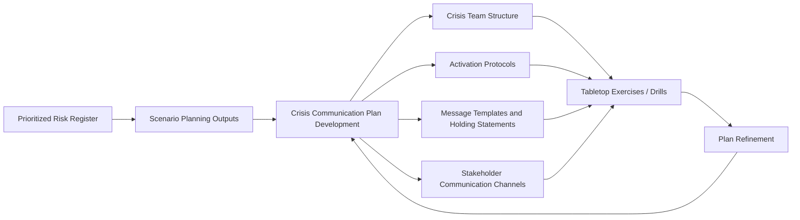
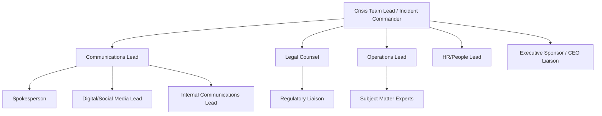

## Components of a Crisis Communication Plan

### Definition and Scope

A crisis communication plan is the documented, pre-established set of protocols, structures, tools, and content templates that enable an organization to respond quickly, consistently, and credibly when a crisis occurs. It is the primary output artifact of the crisis preparedness phase — the point at which the risk identification, prioritization, and scenario work covered in risk and issues management is converted into an operational, executable document.

Where risk and issues management answers "what could happen and how likely is it," the crisis communication plan answers "what do we actually do, who does it, and what do we say" once an issue crosses the threshold into active crisis status.

### Position in the Preparedness Lifecycle

### Core Components

**Key Points**

- **Governance and activation protocols** — who declares a crisis and how
- **Crisis management team structure** — roles, responsibilities, and decision authority
- **Notification and escalation procedures** — internal alerting mechanisms
- **Stakeholder mapping and communication channels** — who needs to hear what, and how
- **Message templates and holding statements** — pre-drafted content for common scenarios
- **Spokesperson designation and media protocols** — who speaks externally
- **Monitoring and situation assessment procedures** — ongoing intelligence during the crisis
- **Legal and regulatory coordination protocols** — ensuring communications don't create legal exposure
- **Resource and logistics annexes** — contact lists, tools, physical/virtual command center details
- **Post-crisis review procedures** — built-in mechanism for organizational learning

### Component 1: Governance and Activation Protocols

Defines the formal trigger mechanism that converts a monitored issue into an active crisis response.

- **Activation criteria** — objective, pre-agreed thresholds (often tied to the likelihood/impact scoring and priority tiers established in risk prioritization) that determine when the plan is formally invoked
- **Activation authority** — named individual(s) or role(s) empowered to declare a crisis and activate the plan, avoiding delay caused by ambiguous authority
- **Severity levels** — most plans define tiered severity (e.g., Level 1 monitoring, Level 2 elevated response, Level 3 full crisis activation), each with a corresponding response scale, since not every issue warrants full organizational mobilization

### Component 2: Crisis Management Team Structure

- **Incident commander/crisis lead** — single point of decision-making authority during activation, preventing fragmented or contradictory action
- **Communications lead** — oversees all external and internal messaging, typically the senior communications/PR executive
- **Legal counsel** — reviews all external statements for legal exposure, advises on disclosure obligations
- **Operations lead** — represents the affected business function, provides factual grounding for messaging
- **HR/People lead** — manages employee-facing communication and welfare considerations
- **Executive sponsor** — ensures leadership visibility and decision-making backing, particularly for severe-tier crises
- Each role requires a **named primary and at least one backup**, since crises frequently occur when primary personnel are unavailable

### Component 3: Notification and Escalation Procedures

- **Alert cascade** — the specific sequence and method (call tree, automated notification system, messaging platform) by which the crisis team and broader organization are notified
- **Response time SLAs** — defined expectations for how quickly team members must acknowledge and mobilize following activation
- **24/7 coverage provisions** — on-call rotations and out-of-hours contact protocols, given that crises are not confined to business hours

### Component 4: Stakeholder Mapping and Channels

| Stakeholder Group | Typical Channel | Priority Consideration |
| --- | --- | --- |
| Employees | Intranet, all-staff email, direct manager cascade | Should generally be informed before or simultaneously with external audiences |
| Customers | Website banner, email, customer service scripts | Clarity and actionability of guidance |
| Media | Press release, press conference, direct outreach | Speed and accuracy balance |
| Investors/Shareholders | Regulatory filings, investor relations statements | Legal/disclosure compliance |
| Regulators | Direct formal notification, compliance filings | Often legally mandated timelines |
| Social media audiences | Owned social channels, paid amplification if needed | Real-time monitoring and response capability |
| Local communities | Community liaison, local media, town halls | Particularly relevant for physical/operational incidents |

[Inference] Sequencing matters: many crisis communication failures are attributed less to the content of the message than to stakeholders learning of an issue through the wrong channel first (e.g., employees discovering a crisis via external news media before internal notification), which independently damages trust regardless of message quality.

### Component 5: Message Templates and Holding Statements

- **Holding statements** — brief, pre-approved initial statements acknowledging awareness of a situation without committing to unconfirmed facts, designed to fill the gap between crisis onset and full situational understanding
- **Scenario-specific templates** — draft messaging frameworks aligned to the scenarios developed in scenario planning (e.g., product recall template, data breach template, executive misconduct template)
- **Q&A documents** — anticipated questions and approved response lines for spokespeople and customer-facing staff
- **Tone and messaging principles** — organizational guidance on register, empathy expression, and brand voice consistency during crisis, distinct from routine marketing tone

[Unverified] The degree to which templates can be fully pre-drafted versus requiring significant situational customization varies by crisis type; highly specific factual crises (e.g., safety incidents with casualties) generally require more real-time customization than procedural crises (e.g., planned service outages).

### Component 6: Spokesperson and Media Protocols

- **Designated spokesperson(s)** — by severity tier and subject matter, since a single spokesperson may not be appropriate across all scenario types (e.g., technical incidents may require a subject-matter expert alongside the primary communications spokesperson)
- **Media training requirements** — pre-crisis training ensuring designated spokespeople can perform under pressure
- **Interview and press conference protocols** — logistics for organizing media engagement quickly and consistently
- **Message discipline mechanisms** — ensuring all spokespeople, including those not formally designated (executives, employees), are aware of what can and cannot be said publicly

### Component 7: Monitoring and Situation Assessment

- **Real-time monitoring integration** — direct linkage to the organization's early warning system and media monitoring tools to track how the crisis is evolving and how messaging is landing
- **Situation reports (SitReps)** — structured, regular internal updates to the crisis team summarizing current status, actions taken, and emerging developments
- **Sentiment and narrative tracking** — ongoing assessment of whether the organization's messaging is shifting public/stakeholder narrative in the intended direction

### Component 8: Legal and Regulatory Coordination

- **Disclosure obligation checklist** — jurisdiction-specific requirements for regulatory notification timelines (particularly relevant for publicly listed companies, data breaches, and safety incidents)
- **Legal review gate** — formal process ensuring all external statements pass legal review before release, balanced against speed requirements
- **Privilege and documentation protocols** — guidance on what crisis-related communications and notes may be subject to legal discovery

### Component 9: Resources and Logistics Annexes

- **Contact directories** — crisis team members, key external partners (PR agencies, legal counsel, regulators), media contacts
- **Command center specification** — physical or virtual location and technical setup for crisis team coordination
- **Tool and platform access** — monitoring dashboards, communication platforms, content management system access
- **Budget/resource pre-authorization** — pre-approved emergency spending authority for crisis-related needs (translation services, additional staffing, paid media)

### Component 10: Post-Crisis Review Procedures

- **After-action review protocol** — structured process for evaluating plan performance following any activation, feeding directly into the blameless learning culture discussed in crisis-resilient culture practices
- **Plan revision triggers** — defined process for updating the plan based on lessons learned, changes in organizational structure, or shifts in the risk environment
- **Documentation and institutional memory** — archiving crisis records and outcomes for future reference and training material

### SVG: Crisis Communication Plan Activation Timeline

<svg xmlns="http://www.w3.org/2000/svg" viewBox="0 0 520 260">
<text x="260" y="24" text-anchor="middle" font-size="15" font-weight="bold" fill="#1a1a1a">Activation Timeline (svg_diagram)</text>
<line x1="50" y1="140" x2="480" y2="140" stroke="#333" stroke-width="2" />
<circle cx="80" cy="140" r="8" fill="#2563eb" />
<text x="80" y="170" text-anchor="middle" font-size="10">Issue Detected</text>
<text x="80" y="185" text-anchor="middle" font-size="9" fill="#666">(EWS/Scanning)</text>
<circle cx="170" cy="140" r="8" fill="#7e22ce" />
<text x="170" y="170" text-anchor="middle" font-size="10">Severity</text>
<text x="170" y="183" text-anchor="middle" font-size="10">Assessed</text>
<circle cx="260" cy="140" r="8" fill="#b45309" />
<text x="260" y="170" text-anchor="middle" font-size="10">Plan</text>
<text x="260" y="183" text-anchor="middle" font-size="10">Activated</text>
<circle cx="350" cy="140" r="8" fill="#047857" />
<text x="350" y="170" text-anchor="middle" font-size="10">Holding Statement</text>
<text x="350" y="183" text-anchor="middle" font-size="10">Issued</text>
<circle cx="440" cy="140" r="8" fill="#991b1b" />
<text x="440" y="170" text-anchor="middle" font-size="10">Full Response</text>
<text x="440" y="183" text-anchor="middle" font-size="10">Coordinated</text>

<text x="80" y="110" text-anchor="middle" font-size="9" fill="#666">T+0</text>

<text x="170" y="110" text-anchor="middle" font-size="9" fill="#666">T+15–30min</text>

<text x="260" y="110" text-anchor="middle" font-size="9" fill="#666">T+30–60min</text>

<text x="350" y="110" text-anchor="middle" font-size="9" fill="#666">T+1–2hrs</text>

<text x="440" y="110" text-anchor="middle" font-size="9" fill="#666">T+2hrs+</text>

</svg>

[Unverified] These illustrative timeframes are commonly cited targets in crisis communication practice but vary significantly by crisis type, severity, and organizational capability; they should not be treated as fixed standards.

### Common Failure Modes

- **Plan-as-artifact** — a comprehensive document that exists but has never been rehearsed, tested, or updated, reducing real-world reliability
- **Single point of failure in roles** — no named backups for key crisis team positions
- **Overly rigid templates** — message templates so specific that they fail to adapt to the actual facts of a real crisis, leading to abandonment under pressure
- **Legal-communications friction** — inadequately defined coordination between legal review requirements and communication speed needs, causing costly response delays
- **External-before-internal sequencing failures** — employees or other internal stakeholders learning of a crisis through external channels
- **Stale contact information** — logistics annexes not maintained, causing activation delays when the plan is actually needed
- **No integration with monitoring/EWS** — a plan that exists independently of the organization's signal detection infrastructure, disconnecting activation triggers from real-time intelligence

### Practical Example

**Example**

A mid-sized airline's crisis communication plan is activated following a Level 2 (elevated) severity event: a significant flight delay cascade caused by a technical system failure. The on-call incident commander activates the plan within 10 minutes of the alert cascade reaching the crisis team. A pre-drafted holding statement template for operational disruptions is customized with situation-specific facts and issued via the company's social media and customer service channels within 25 minutes, informed by the legal review gate confirming no regulatory disclosure trigger applies. Employee-facing communication, including guidance for customer-facing staff on approved response lines, is issued simultaneously via the internal cascade — ensuring frontline staff are equipped before customer inquiries peak. A situation report is issued to the crisis team every 30 minutes as the technical issue is resolved, and a full after-action review is scheduled within 72 hours per the plan's post-crisis review procedure, ultimately identifying that the alert cascade could be shortened by adopting an additional automated notification channel.

### Related Topics

- Prioritizing Issues by Likelihood and Impact
- Scenario Planning for Emerging Risks
- Crisis Management Team Roles and Governance
- Spokesperson Selection and Media Training
- Tabletop Exercises and Crisis Simulation Design
- Legal and Regulatory Disclosure Requirements in Crisis Response
- Internal Communications During a Crisis
- Post-Crisis Review and After-Action Reporting