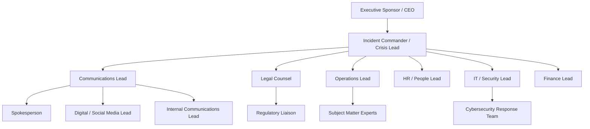
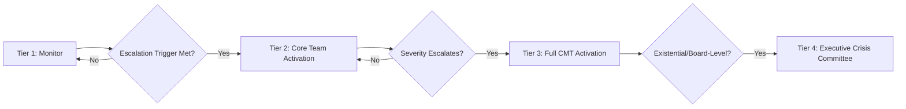

## Crisis Management Team Structure and Governance

### Definition and Scope

Crisis Management Team (CMT) structure and governance defines the formal organizational architecture — roles, reporting lines, decision authority, and operating rules — through which an organization coordinates its response once a crisis communication plan is activated. Where the crisis communication plan (covered previously) defines *what* the organization will do and say, CMT structure and governance defines *who* makes those decisions, under what authority, and through what coordination mechanism.

This distinction matters because even a well-designed plan with excellent message templates can fail in execution if authority is ambiguous, roles overlap, or decision-making bottlenecks under pressure. Governance is the human coordination layer that determines whether a plan is executed coherently or degrades into confusion during an actual event.

### Core Governance Principles

**Key Points**

- **Single point of command** — one designated incident commander/crisis lead holds final decision authority during activation, preventing fragmented or contradictory action across functions
- **Pre-defined authority, not improvised authority** — decision rights are established and communicated before a crisis occurs, not negotiated during one
- **Named individuals with backups** — every critical role has a primary and at least one trained backup, since crises do not wait for personnel availability
- **Tiered activation** — governance structure scales with severity; not every issue requires full CMT mobilization
- **Separation of strategic and operational decision-making** — executive-level strategic decisions (e.g., business continuity, major financial commitments) are kept distinct from tactical communications execution to avoid bottlenecking fast-moving tactical decisions behind slower strategic approval

### Standard CMT Structure

### Role Definitions and Authority

| Role | Primary Responsibility | Decision Authority |
| --- | --- | --- |
| Executive Sponsor | Ultimate organizational accountability, board/investor liaison | Strategic/existential decisions, resource authorization beyond pre-set limits |
| Incident Commander | Overall coordination, tactical decision-making during activation | Activation/deactivation, cross-functional resolution, tactical response approval |
| Communications Lead | All external/internal messaging strategy and execution | Message content and channel decisions within approved parameters |
| Legal Counsel | Legal risk assessment, regulatory compliance review | Veto/hold authority on statements with legal exposure |
| Operations Lead | Factual grounding, operational remediation | Operational response actions within functional area |
| HR/People Lead | Employee welfare, internal culture considerations | Employee-facing communication and support decisions |
| IT/Security Lead | Technical incident containment (where applicable) | Technical remediation and system-level decisions |
| Finance Lead | Financial impact assessment, resource authorization tracking | Budget release within pre-authorized crisis spending limits |

[Inference] The distinction between "decision authority" and "advisory input" is one of the more consequential governance design choices: roles like legal counsel are commonly given veto/hold power specifically over legal exposure (rather than general message strategy), since granting broader veto authority to a single advisory function can create bottlenecks that slow response without a corresponding risk-reduction benefit.

### Tiered Activation Governance

- **Tier 1 (Monitor)** — issue tracked via early warning system/issue log; no formal team convened
- **Tier 2 (Core Team)** — communications lead and immediately relevant functional lead(s) convene; limited scope
- **Tier 3 (Full CMT)** — complete cross-functional team activated per the standard structure above; incident commander formally designated
- **Tier 4 (Executive Crisis Committee)** — board-level or CEO-direct involvement for existential or highly severe events, often involving external advisors (specialized legal counsel, PR agencies, financial advisors)

[Unverified] The specific number of tiers and their precise triggering thresholds vary considerably by organization size, sector, and risk appetite; the four-tier structure shown is illustrative rather than a fixed industry standard.

### Decision-Making Protocols

- **RACI-style clarity** — for each anticipated decision type (message approval, operational shutdown, regulatory notification, executive statement), the plan specifies who is Responsible, Accountable, Consulted, and Informed
- **Escalation pathways for disagreement** — pre-defined resolution process when functional leads disagree (e.g., legal vs. communications on message timing), typically resolving to the incident commander or executive sponsor
- **Time-boxed decision windows** — many governance models impose maximum time limits for key decisions (e.g., holding statement approval within 30 minutes) to prevent analysis paralysis during fast-moving situations
- **Documented decision log** — real-time recording of key decisions, rationale, and approvers during activation, serving both operational coordination and post-crisis/legal review purposes

### Composition Considerations

**Core standing members** (present in virtually all activations):

- Incident commander, communications lead, legal counsel

**Scenario-dependent members** (activated based on crisis type):

- IT/security lead (cyber incidents), operations/safety lead (physical/operational incidents), finance lead (financial/investor-facing crises), HR lead (conduct/culture-related crises), sustainability lead (ESG-related crises)

[Inference] Building a "core plus scenario-dependent" model rather than a single fixed team roster is generally considered better governance practice, since it avoids both under-resourcing scenario-specific expertise and over-mobilizing irrelevant functions that can slow decision-making without adding value.

### External Party Integration

- **PR/crisis communications agencies** — pre-established relationships and retainer agreements allow rapid activation of external support without procurement delay during an actual crisis
- **Outside legal counsel** — particularly for specialized regulatory areas (data privacy, securities law, product liability) beyond in-house legal capacity
- **Forensic and technical specialists** — cybersecurity forensics, safety investigators, or other technical experts relevant to specific crisis types
- **Translation and localization services** — pre-arranged for multinational organizations to ensure message consistency across markets during time-sensitive activation

### Governance Documentation Requirements

1. **Role and responsibility charter** — formal documentation of each CMT role, authority, and reporting line, reviewed and reaffirmed periodically
2. **Activation and deactivation criteria** — objective triggers for standing up and standing down each tier
3. **Meeting cadence and format protocols** — standard operating rhythm during activation (e.g., situation report briefings every X hours, standing call structure)
4. **Succession and backup protocols** — documented backup chain for every critical role, tested through drills
5. **Authority limits documentation** — explicit pre-authorized spending, messaging, and operational limits at each role level, beyond which escalation to the executive sponsor is required

### SVG: Escalation and Decision Flow

<svg xmlns="http://www.w3.org/2000/svg" viewBox="0 0 500 320">
<text x="250" y="24" text-anchor="middle" font-size="15" font-weight="bold" fill="#1a1a1a">CMT Decision Escalation Flow (svg_diagram)</text>
<rect x="180" y="50" width="140" height="45" rx="6" fill="#dbeafe" stroke="#2563eb" stroke-width="1.5" />
<text x="250" y="77" text-anchor="middle" font-size="11" fill="#1e3a8a">Functional Lead Decision</text>
<path d="M 250,95 L 250,130" stroke="#64748b" stroke-width="1.5" marker-end="url(#arrow2)" />
<text x="330" y="115" font-size="9" fill="#666">Within authority?</text>
<rect x="180" y="130" width="140" height="45" rx="6" fill="#d1fae5" stroke="#047857" stroke-width="1.5" />
<text x="250" y="150" text-anchor="middle" font-size="10" fill="#065f46">Yes: Execute and</text>
<text x="250" y="163" text-anchor="middle" font-size="10" fill="#065f46">Log Decision</text>
<path d="M 320,152 L 400,152" stroke="#64748b" stroke-width="1.5" marker-end="url(#arrow2)" />
<rect x="330" y="130" width="0" height="0" />
<path d="M 250,175 L 250,150" stroke="none" />
<rect x="180" y="200" width="140" height="45" rx="6" fill="#fde68a" stroke="#b45309" stroke-width="1.5" />
<text x="250" y="220" text-anchor="middle" font-size="10" fill="#78350f">No: Escalate to</text>
<text x="250" y="233" text-anchor="middle" font-size="10" fill="#78350f">Incident Commander</text>
<path d="M 250,175 L 250,200" stroke="#64748b" stroke-width="1.5" marker-end="url(#arrow2)" />
<path d="M 130,152 L 180,152" stroke="none" />
<path d="M 200,175 L 200,175" stroke="none" />
<path d="M 250,95 L 200,200" stroke="#64748b" stroke-width="1.5" stroke-dasharray="3,3" marker-end="url(#arrow2)" />
<rect x="180" y="270" width="140" height="45" rx="6" fill="#fca5a5" stroke="#991b1b" stroke-width="1.5" />
<text x="250" y="290" text-anchor="middle" font-size="10" fill="#7f1d1d">Existential: Escalate</text>
<text x="250" y="303" text-anchor="middle" font-size="10" fill="#7f1d1d">to Executive Sponsor</text>
<path d="M 250,245 L 250,270" stroke="#64748b" stroke-width="1.5" marker-end="url(#arrow2)" />
</svg>

### Common Failure Modes

- **Ambiguous or shared authority** — multiple people believing they hold final decision authority, producing contradictory actions or paralysis at the moment of activation
- **Missing backups** — key roles held by a single individual with no trained alternate, creating a single point of failure
- **Governance-plan mismatch** — a documented governance structure that does not reflect actual organizational reporting lines or informal power dynamics, causing real-world friction during activation
- **Legal veto overreach** — legal counsel's hold authority expanding beyond genuine legal risk into general message strategy, slowing response without proportionate risk reduction
- **Untested escalation paths** — governance structure documented but never rehearsed via tabletop exercises, leaving ambiguity about how it functions under real pressure
- **Executive bypass** — senior leaders informally overriding the designated incident commander during a live event, undermining the single-point-of-command principle the structure is designed to protect

### Practical Example

**Example**

A healthcare organization activates its Tier 3 CMT following a data security incident potentially affecting patient records. The incident commander, per the pre-established governance charter, convenes the core team within 20 minutes: communications lead, legal counsel, IT/security lead, and HR lead, with the finance lead added given potential regulatory penalty exposure. Legal counsel exercises hold authority on the initial external statement pending confirmation of the scope of affected records — a genuine legal-exposure decision within their defined authority — while the communications lead proceeds in parallel with employee-facing internal communication, which falls outside legal's hold scope per the documented authority limits. When the incident's severity is confirmed to involve regulatory notification obligations across multiple jurisdictions, the incident commander escalates to Tier 4, bringing in the executive sponsor and pre-arranged outside regulatory counsel, consistent with the organization's documented escalation criteria. The decision log later shows each approval point and rationale, supporting both the after-action review and the organization's regulatory disclosure documentation.

### Related Topics

- Components of a Crisis Communication Plan
- Prioritizing Issues by Likelihood and Impact
- Spokesperson Selection and Media Training
- Tabletop Exercises and Crisis Simulation Design
- Legal and Regulatory Disclosure Requirements in Crisis Response
- Building a Crisis-Resilient Organizational Culture
- Decision-Making Under Pressure and Cognitive Bias in Crisis Response
- Post-Crisis Review and After-Action Reporting