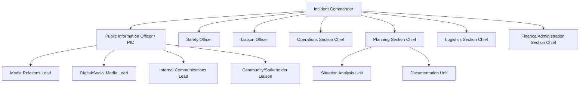

## Incident Command Systems for Communications

### Definition and Scope

An Incident Command System (ICS) is a standardized, hierarchical management structure originally developed for emergency and disaster response, adapted here for coordinating communications functions during a crisis. Where the previously covered Crisis Management Team (CMT) structure defines the organizational roles and authority for crisis decision-making broadly, ICS provides a more granular, formalized operational framework specifically for **command, control, and coordination** — offering standardized terminology, span-of-control principles, and modular scalability that communications functions can adopt or adapt from emergency management practice.

ICS is most directly relevant to organizations managing physical, safety-related, or large-scale operational crises (industrial incidents, natural disasters affecting operations, mass-casualty events) where communications must coordinate tightly with operational, safety, and emergency response functions — though its structural principles are increasingly applied to purely reputational and digital crises as well.

### Origins and Standardization

ICS originated in the 1970s in U.S. wildland firefighting response, developed to address coordination failures observed when multiple agencies with differing structures, terminology, and command practices responded to the same incident. It was later formalized as a component of the U.S. National Incident Management System (NIMS) and has since been adapted internationally and across sectors, including corporate crisis and business continuity management.

[Inference] The reason ICS principles translate well to corporate crisis communications, despite originating in physical emergency response, is that both contexts share the same core coordination problem: multiple functions with different expertise and authority need to act quickly, consistently, and without duplicated or contradictory effort under conditions of incomplete information.

### Core ICS Principles Applied to Communications

**Key Points**

- **Unity of command** — each person reports to only one supervisor, eliminating conflicting direction
- **Span of control** — one supervisor manages a limited number of direct reports (commonly cited as 3–7, with 5 as a frequent guideline) to maintain effective oversight
- **Modular and scalable organization** — the structure expands or contracts based on incident size and complexity, avoiding both under- and over-resourcing
- **Common terminology** — standardized role titles and terms avoid confusion when personnel from different functions or external partners integrate into the response
- **Management by objectives** — response is organized around specific, measurable objectives for each operational period, not open-ended activity
- **Integrated communications** — a common communications plan and compatible information-sharing processes across all participating functions

### ICS Organizational Structure Applied to Crisis Communications

### Key Communications-Relevant Roles

| Role | Function |
| --- | --- |
| Incident Commander | Overall authority and responsibility for incident response; sets objectives and priorities |
| Public Information Officer (PIO) | Single authorized point for developing and releasing information to media and the public; coordinates with other communications sub-functions |
| Safety Officer | Monitors and advises on operations safety; can independently halt unsafe actions, including communications actions that could create safety risk |
| Liaison Officer | Primary contact for coordination with external agencies, partner organizations, and other outside entities |
| Operations Section Chief | Directs tactical response activities addressing the incident itself |
| Planning Section Chief | Collects and evaluates information, develops the Incident Action Plan (IAP), tracks resources |
| Logistics Section Chief | Provides resources, services, and support needed for response |
| Finance/Administration Section Chief | Tracks costs, manages procurement, and handles administrative/financial aspects of the response |

[Inference] The Public Information Officer role is the point of closest overlap with standard corporate crisis communication practice — functionally analogous to a communications lead or crisis spokesperson coordinator — but ICS formalizes it as a single-point, singularly authorized information release function, which is a stricter standard than many corporate crisis plans explicitly codify.

### The Incident Action Plan (IAP)

A defining ICS artifact is the **Incident Action Plan** — a structured, time-bound document covering a defined "operational period" (commonly 12–24 hours in emergency response contexts, though corporate crisis applications may use shorter cycles for fast-moving reputational events) that specifies:

- Incident objectives for that period
- Organizational structure and assignments for that period
- Specific tasks and resource assignments
- Communications plan for that period (who communicates what, to whom, via which channel)
- Safety considerations and medical/support plans (where applicable)

[Unverified] The specific cadence and formality of IAP cycles in corporate (as opposed to emergency management) crisis communications applications vary considerably; many corporate adopters use a lighter-weight, adapted version of the IAP concept rather than the full formal emergency-management documentation standard.

### Span of Control and Modular Scaling

ICS structures are explicitly designed to scale up or down based on incident complexity, avoiding the common failure mode of either an under-resourced skeleton team facing a major incident or an oversized team creating coordination overhead for a minor one.

| Incident Scale | Structure |
| --- | --- |
| Small/localized | Single Incident Commander handling multiple functions directly; minimal formal structure |
| Moderate | Incident Commander plus key section chiefs activated as needed (e.g., PIO plus Operations) |
| Large/complex | Full ICS structure activated across all sections, potentially with multiple branches within sections |
| Multi-jurisdictional/very large | Unified Command structure, where multiple organizations share command authority jointly |

### Unified Command for Multi-Organization Crises

When a crisis spans multiple organizations or jurisdictions (e.g., an industrial incident involving the company, local government, and regulatory agencies), ICS provides for **Unified Command** — a structure where representatives from each involved organization share command authority and jointly approve a single Incident Action Plan, rather than each organization running a separate, potentially conflicting response.

[Inference] Unified Command is particularly relevant to reputation and crisis management because uncoordinated messaging between an organization and external agencies responding to the same incident (e.g., a company and a government regulator issuing contradictory statements) is a commonly cited driver of stakeholder confusion and eroded trust during major incidents — a risk Unified Command structures are specifically designed to mitigate through joint information management.

### Joint Information Center (JIC)

For larger incidents, particularly those involving multiple organizations under Unified Command, ICS practice establishes a **Joint Information Center** — a physical or virtual facility where public information staff from all participating organizations co-locate to coordinate and disseminate consistent, accurate, and timely information.

- Ensures message consistency across all responding organizations
- Reduces duplicated or contradictory public statements
- Provides a single coordination point for media and public inquiries spanning multiple organizations

### Applying ICS Principles to Purely Reputational (Non-Physical) Crises

[Inference] While ICS originated for physical emergency response, its core coordination principles — unity of command, defined span of control, modular scaling, and a single authorized information source — are increasingly cited as transferable to purely reputational or digital crises (e.g., a viral social media controversy with no physical safety dimension), since the underlying coordination problem of preventing fragmented or contradictory messaging exists in both contexts. Organizations adopting this approach typically simplify the full ICS structure, retaining the Incident Commander/PIO relationship and span-of-control discipline while omitting sections (like Operations or Logistics in the emergency-response sense) that have no direct communications analog.

### Integration with Crisis Communication Plans and CMT Structure

1. **Complementary, not competing, frameworks** — ICS can operate as the formal command structure *within* a broader crisis management team framework, particularly for organizations in high-hazard industries (energy, manufacturing, transportation, healthcare) already using ICS for operational emergency response
2. **PIO-to-Communications Lead mapping** — the PIO role typically maps to (or is held by) the same individual designated as communications lead in the organization's broader crisis communication plan
3. **Training and certification** — organizations that adopt formal ICS, particularly in regulated or high-hazard sectors, commonly pursue standardized ICS training and certification for key personnel to ensure interoperability with external emergency responders and regulators who use the same standard
4. **Interoperability advantage** — organizations already familiar with ICS terminology and structure integrate more smoothly with external emergency responders, regulators, and government agencies during incidents requiring their involvement

### Common Failure Modes

- **Over-formalization for minor incidents** — applying the full multi-section ICS structure to incidents that do not warrant that scale, creating unnecessary process overhead
- **PIO authority ambiguity** — failing to establish the PIO as the single authorized information source, resulting in multiple, potentially conflicting statements from different functions
- **Unfamiliarity under pressure** — adopting ICS terminology and structure on paper without training or drilling, leading to confusion when the framework is actually invoked
- **Neglecting Unified Command coordination** — organizations failing to establish joint information coordination with external agencies during multi-party incidents, resulting in contradictory public statements
- **Rigid application to reputational crises** — attempting to force the full physical-emergency-oriented ICS structure onto purely digital/reputational crises without appropriate adaptation, adding process complexity without corresponding coordination benefit

### Practical Example

**Example**

A chemical manufacturing company experiences a facility incident requiring both operational emergency response and coordinated public communication. The company's existing ICS structure, already used for operational safety incidents, is activated: the site Incident Commander directs operational containment while the designated PIO — pre-trained and certified under the company's ICS program — becomes the single authorized source for public statements. Because the incident also involves the local fire department and a state environmental regulator, Unified Command is established, and a Joint Information Center is set up virtually within two hours, allowing the company, fire department, and regulator to jointly review and approve public statements before release. This prevents the scenario the company's after-action reviews from a prior, smaller incident had identified as a key risk: the regulator and company issuing separate, subtly inconsistent statements about the same event, which had previously fueled public confusion and media scrutiny of the discrepancy itself rather than the underlying incident.

### Related Topics

- Components of a Crisis Communication Plan
- Crisis Management Team Structure and Governance
- Spokesperson Selection and Media Training
- Tabletop Exercises and Crisis Simulation Design
- Legal and Regulatory Disclosure Requirements in Crisis Response
- Multi-Agency Coordination in Crisis Response
- Business Continuity and Emergency Operations Integration
- Post-Crisis Review and After-Action Reporting