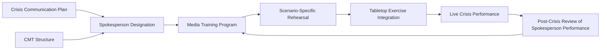
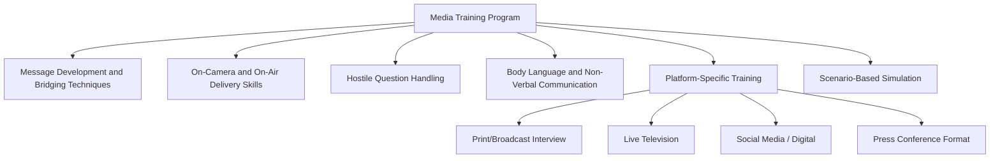

## Spokesperson Selection and Media Training

### Definition and Scope

Spokesperson selection and media training encompasses the process of identifying, preparing, and maintaining the individuals authorized to represent an organization publicly during a crisis, along with the structured skill-building that ensures they can communicate effectively, credibly, and consistently under high-pressure media scrutiny. This is the **human capability layer** of crisis preparedness: even a well-governed CMT structure and a comprehensive communication plan depend on the individuals actually delivering messages being credible, composed, and message-disciplined in the moment of public scrutiny.

Poor spokesperson performance — visible discomfort, inconsistency with prior statements, defensive body language, or factual missteps — can independently damage organizational credibility regardless of how sound the underlying message strategy or crisis response actually is.

### Position in the Preparedness Framework

### Spokesperson Selection Criteria

**Key Points**

- **Credibility and authority** — audiences generally respond better to spokespeople whose role or expertise plausibly matches the subject matter (e.g., a technical incident benefits from a subject-matter expert alongside or instead of a pure communications spokesperson)
- **Composure under pressure** — demonstrated ability to remain measured and clear when challenged, interrupted, or confronted with hostile questioning
- **Message discipline** — capacity to stay within approved talking points without appearing rehearsed or evasive
- **Empathy and tone calibration** — ability to convey appropriate concern, accountability, or reassurance depending on the crisis type, without sounding scripted or insincere
- **Organizational seniority appropriate to severity** — higher-severity crises generally warrant more senior spokespeople, since audience perception of organizational seriousness is often calibrated to who is speaking
- **Availability and reliability** — willingness and practical availability to respond on short notice, including outside standard business hours

[Inference] Selecting spokespeople based primarily on communications skill rather than organizational seniority alone is a common refinement in more mature crisis preparedness practice, since a highly polished but visibly non-empowered spokesperson can undermine audience confidence that the organization is taking a serious matter seriously — even when the underlying message content is accurate and appropriate.

### Spokesperson Tiers by Severity and Subject

| Tier | Typical Spokesperson | Use Case |
| --- | --- | --- |
| Routine/Tier 1 | Communications team member, customer service lead | Minor, low-visibility issues |
| Elevated/Tier 2 | Senior communications lead, functional department head | Moderate visibility issues, trade/local media |
| Major/Tier 3 | Senior executive, subject-matter expert pairing | High-visibility issues, national media |
| Existential/Tier 4 | CEO or equivalent, often with board involvement | Existential threats, major national/international coverage |

[Unverified] Exact tiering structures and thresholds vary by organization size and sector; the four-tier model shown is illustrative rather than a fixed industry standard.

### Designating Primary and Backup Spokespeople

- **Named primary and at least one backup per tier and subject area**, since crises do not wait for a single individual's availability
- **Subject-matter pairing** — for technical, scientific, medical, or safety crises, pairing a communications-trained spokesperson with a credible subject-matter expert is commonly used to combine message discipline with substantive authority
- **Regional/market-specific spokespeople** — multinational organizations typically designate market-specific spokespeople fluent in local language and cultural context rather than relying solely on a single global spokesperson

### Media Training Program Components

### Core Media Training Skills

**Message development and bridging** — training spokespeople to deliver key messages clearly and to "bridge" from difficult or off-topic questions back to approved core messages without appearing evasive. Common bridging techniques include acknowledging the question directly before pivoting, and using transitional phrases that redirect without ignoring what was asked.

**Hostile question handling** — preparing spokespeople for adversarial, leading, or "gotcha" style questioning through repeated practice, including:

- Recognizing and defusing loaded or hypothetical questions without accepting a false premise
- Maintaining composure through interruption or aggressive follow-up
- Declining to speculate on unconfirmed facts without appearing evasive

**Non-verbal communication** — coaching on posture, eye contact, vocal tone, and pacing, since [Inference] audience perception of credibility during high-stakes media appearances is commonly influenced as much by delivery and composure as by message content itself, making non-verbal coaching a standard component of serious media training programs rather than a secondary concern.

**Platform-specific adaptation** — recognizing that print interviews, live broadcast, and social media contexts each carry different risks (e.g., live broadcast offers no opportunity to correct a misstatement before publication; social media carries risk of clips being taken out of context) and training accordingly.

### The Bridging Technique — Structural Pattern

Example bridge phrase patterns commonly taught (illustrative, not exhaustive): "What's most important for people to understand is...", "I can't speak to that specifically, but what I can tell you is...", "That's exactly why we're focused on...".

[Inference] Overuse of visible bridging techniques without adequate substantive content can itself become a credibility risk, since audiences and journalists are often familiar with the pattern and may perceive excessive, unsubstantive bridging as evasion rather than message discipline — making the underlying quality and honesty of the content bridged *to* as important as the technique itself.

### Simulation and Rehearsal Methods

- **Mock interviews** — recorded practice sessions with trained media trainers playing an adversarial journalist role, followed by structured feedback review
- **Press conference simulations** — full-format rehearsals including multiple simulated journalists, follow-up questioning, and time pressure
- **Video review and self-assessment** — recording practice sessions and reviewing with the spokesperson to build self-awareness of verbal and non-verbal habits under pressure
- **Integration with tabletop exercises** — spokesperson training is most effective when embedded within broader crisis simulation exercises rather than conducted as an isolated skill-building activity, since it tests message delivery within realistic organizational decision-making conditions rather than in isolation

### Message Discipline vs. Authenticity Balance

A persistent tension in spokesperson preparation is balancing message discipline (consistency, accuracy, legal defensibility) against perceived authenticity (avoiding a scripted, evasive impression).

[Inference] Media training programs generally address this tension not by minimizing preparation, but by training spokespeople to internalize key messages deeply enough that delivery feels natural rather than recited — since visibly reading from or rigidly adhering to a script is commonly identified as a driver of audience skepticism, whereas well-internalized message discipline can be delivered with apparent spontaneity while remaining consistent and accurate.

### Ongoing Maintenance and Refresh

1. **Periodic retraining** — media training skills, like other crisis-readiness capabilities, generally require periodic refresh (commonly annual or biannual) rather than one-time certification, since skills atrophy without practice
2. **Post-appearance review** — structured debrief after any actual media appearance (crisis-related or routine), assessing performance against training standards and feeding lessons back into future training
3. **Roster maintenance** — regular review of the spokesperson roster to reflect organizational changes, ensuring designated individuals remain in relevant roles and are re-briefed as message priorities evolve
4. **New spokesperson onboarding** — structured initial training and shadowing process for any newly designated spokesperson before they are activated in a live scenario

### Common Failure Modes

- **Untrained senior leaders thrust into crisis spotlight** — assuming organizational seniority alone qualifies someone to serve as spokesperson without dedicated media training
- **Over-scripted delivery** — spokespeople who are visibly reading from or rigidly reciting talking points, undermining perceived authenticity
- **No backup designation** — reliance on a single trained spokesperson with no trained alternate, creating a bottleneck if that individual is unavailable or personally implicated in the crisis
- **Stale training** — one-time training with no periodic refresh, allowing skills to degrade or messages to become outdated
- **Platform mismatch** — training focused solely on traditional broadcast/print interview formats without addressing social media-specific risks (clip extraction, rapid amplification, comment engagement)
- **Disconnect from message strategy** — media training conducted in isolation from the organization's actual crisis communication plan and current message priorities, producing generically polished but strategically misaligned delivery

### Practical Example

**Example**

A pharmaceutical company designates its Chief Medical Officer as the Tier 3 spokesperson for any product safety-related crisis, paired with the Head of Communications for message coordination. Both undergo biannual media training, including mock hostile interviews conducted by an external media training firm simulating adversarial health journalists. During a training simulation, the CMO initially responds defensively to a hypothetical "gotcha" question about a competitor product recall; the trainer identifies this as accepting a false premise and coaches a bridging response that acknowledges the question without speculating on unrelated products. Six months later, during an actual product safety inquiry from a national health reporter, the CMO applies the trained bridging technique when asked a similarly loaded comparative question, redirecting composed and substantively to the company's own safety data — a response the post-appearance review credits directly to the specific simulation exercise conducted months earlier.

### Related Topics

- Components of a Crisis Communication Plan
- Crisis Management Team Structure and Governance
- Incident Command Systems for Communications
- Tabletop Exercises and Crisis Simulation Design
- Message Development and Key Messaging Frameworks
- Social Media Crisis Response and Platform-Specific Risk
- Post-Crisis Review and After-Action Reporting
- Executive Presence and Crisis Leadership Communication