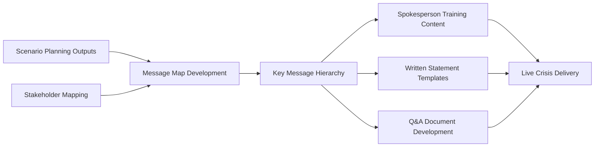
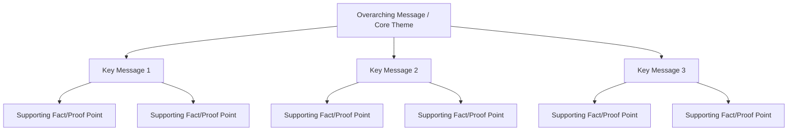
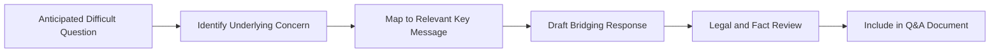

## Message Mapping and Key Message Architecture

### Definition and Scope

Message mapping and key message architecture is the structured methodology for developing, organizing, and hierarchically arranging an organization's core messages before and during a crisis, ensuring that everything communicated — from a spokesperson's live remarks to a written press release to a customer service script — traces back to a consistent, pre-tested foundation. Where spokesperson selection and media training build the human capability to *deliver* messages effectively, message mapping defines *what those messages actually are* and how they are structured for consistency, clarity, and retention under pressure.

This is a foundational preparedness artifact: message maps are typically developed in advance (often scenario-specific, drawing on the same scenarios generated through scenario planning) rather than constructed from scratch in the middle of an active crisis, when time pressure and incomplete information make rigorous message architecture significantly harder to produce well.

### Position in the Preparedness Framework

### Core Principles of Message Mapping

**Key Points**

- **Audience-centered, not organization-centered** — effective message maps are built around what stakeholders need to know and care about, not solely what the organization wants to say
- **Hierarchical structure** — messages are organized from a single overarching theme down through supporting messages to specific proof points, allowing consistent delivery at varying levels of detail
- **Brevity and memorability** — key messages are typically distilled to short, retainable statements, since spokespeople and audiences alike retain concise statements far better than lengthy explanations under pressure
- **Pre-tested language** — message maps are ideally reviewed and refined before a crisis, including legal review, rather than drafted reactively
- **Consistency across channels and speakers** — the same core messages should be traceable across press statements, social media, customer communications, and spokesperson remarks

### The Message Map Hierarchy

A standard message map structure, widely used in risk and crisis communication practice (notably associated with the work of risk communication researchers such as Vincent Covello), organizes content into three tiers:

1. **Overarching message/core theme** — the single central idea the organization wants stakeholders to retain above all else, typically one sentence
2. **Key messages** — commonly three (occasionally up to four or five), each addressing a distinct dimension of the situation (e.g., what happened, what the organization is doing, what stakeholders should do)
3. **Supporting facts/proof points** — specific data, examples, or evidence substantiating each key message, providing depth for follow-up questions without diluting the core statement

[Inference] The common convention of limiting key messages to approximately three is generally attributed to cognitive retention limits — audiences and journalists under time pressure are widely understood to retain a small number of discrete points far more reliably than a longer list, making three a frequently cited practical ceiling rather than an arbitrary stylistic choice.

### Message Map Template Structure

| Element | Content | Example (Illustrative) |
| --- | --- | --- |
| Stakeholder/Audience | Who this map is designed for | Customers, media, regulators |
| Core Question/Concern | The central question this audience is asking | "Is this product safe to use?" |
| Overarching Message | Single-sentence core theme | "Customer safety is our immediate and complete priority." |
| Key Message 1 | First supporting pillar | "We identified the issue and acted immediately." |
| Key Message 2 | Second supporting pillar | "We are working with [relevant authority] to resolve this fully." |
| Key Message 3 | Third supporting pillar | "We will keep customers informed as we learn more." |
| Proof Points | Facts substantiating each key message | Timeline of actions taken, specific remediation steps, contact channels |

### Scenario-Specific vs. Universal Message Maps

- **Universal/foundational message maps** — core organizational values and identity statements applicable across most crisis types (e.g., commitment to safety, transparency, accountability), providing a consistent foundation regardless of the specific triggering event
- **Scenario-specific message maps** — developed for specific anticipated crisis types (product recall, data breach, workplace incident, executive controversy), drawing directly on scenario planning outputs to pre-build the most likely-needed message architecture
- **Hybrid approach** — [Inference] most mature crisis preparedness practice combines both, maintaining a small set of universal core themes while pre-drafting scenario-specific key messages and proof points for the highest-priority risks identified through the organization's risk prioritization process, since fully genericized messaging often fails to address the specific facts and concerns a real crisis presents, while fully improvised messaging sacrifices the consistency and rigor that advance preparation provides

### Addressing Difficult or Hostile Questions Through Message Mapping

A core practical application of message mapping is anticipating and pre-drafting responses to the most difficult likely questions, ensuring spokespeople are never improvising answers to foreseeable hostile or challenging questions in real time.

[Inference] Mapping anticipated hostile questions back to the existing key message hierarchy, rather than drafting standalone answers, is generally preferred in structured message mapping practice because it reinforces message consistency — ensuring that even responses to unexpected or adversarial questions reinforce the same core themes rather than introducing new, potentially inconsistent messaging under pressure.

### Message Testing and Validation

- **Legal review** — verifying that draft messages do not create unintended legal exposure, overstate certainty, or conflict with disclosure obligations
- **Internal stakeholder review** — checking messages against operational reality and technical accuracy with subject-matter experts
- **Message testing with representative audiences** — [Unverified] some organizations conduct structured message testing (focus groups, survey-based testing) with representative stakeholder samples before finalizing high-stakes scenario-specific message maps, though the extent of formal testing versus internal-only review varies considerably by organization size and resourcing
- **Consistency check across channels** — verifying that press release language, social media content, spokesperson talking points, and customer service scripts all trace back to the same key message hierarchy without contradiction

### Adapting Message Maps in Real Time

Pre-drafted message maps are living documents during an active crisis, not fixed scripts:

1. **Fact updates** — as new confirmed information emerges, proof points and supporting facts are updated while the overarching message and key message structure generally remain stable, providing continuity even as specifics evolve
2. **Escalation triggers for message revision** — significant shifts in the situation (e.g., confirmed casualties where none were previously known, regulatory action) typically trigger formal message map review and revision, not just incremental proof-point updates
3. **Version control and approval tracking** — maintaining clear documentation of which message map version is currently authorized for use, particularly important when multiple spokespeople and channels are active simultaneously

### SVG: Message Map Structure

<svg xmlns="http://www.w3.org/2000/svg" viewBox="0 0 500 340">
<text x="250" y="24" text-anchor="middle" font-size="15" font-weight="bold" fill="#1a1a1a">Message Map Hierarchy (svg_diagram)</text>
<rect x="150" y="45" width="200" height="50" rx="6" fill="#1e3a8a" stroke="#1e3a8a" stroke-width="1.5" />
<text x="250" y="66" text-anchor="middle" font-size="11" fill="#fff">Overarching Message</text>
<text x="250" y="82" text-anchor="middle" font-size="9" fill="#dbeafe">Single core theme</text>
<line x1="250" y1="95" x2="90" y2="130" stroke="#64748b" stroke-width="1.5" />
<line x1="250" y1="95" x2="250" y2="130" stroke="#64748b" stroke-width="1.5" />
<line x1="250" y1="95" x2="410" y2="130" stroke="#64748b" stroke-width="1.5" />
<rect x="20" y="130" width="140" height="45" rx="6" fill="#2563eb" stroke="#1e40af" stroke-width="1.5" />
<text x="90" y="157" text-anchor="middle" font-size="10" fill="#fff">Key Message 1</text>
<rect x="180" y="130" width="140" height="45" rx="6" fill="#2563eb" stroke="#1e40af" stroke-width="1.5" />
<text x="250" y="157" text-anchor="middle" font-size="10" fill="#fff">Key Message 2</text>
<rect x="340" y="130" width="140" height="45" rx="6" fill="#2563eb" stroke="#1e40af" stroke-width="1.5" />
<text x="410" y="157" text-anchor="middle" font-size="10" fill="#fff">Key Message 3</text>
<line x1="90" y1="175" x2="90" y2="200" stroke="#64748b" stroke-width="1" />
<line x1="250" y1="175" x2="250" y2="200" stroke="#64748b" stroke-width="1" />
<line x1="410" y1="175" x2="410" y2="200" stroke="#64748b" stroke-width="1" />
<rect x="20" y="200" width="140" height="40" rx="4" fill="#93c5fd" stroke="#2563eb" stroke-width="1" />
<text x="90" y="218" text-anchor="middle" font-size="8" fill="#1e3a8a">Proof Point A</text>
<text x="90" y="230" text-anchor="middle" font-size="8" fill="#1e3a8a">Proof Point B</text>
<rect x="180" y="200" width="140" height="40" rx="4" fill="#93c5fd" stroke="#2563eb" stroke-width="1" />
<text x="250" y="218" text-anchor="middle" font-size="8" fill="#1e3a8a">Proof Point A</text>
<text x="250" y="230" text-anchor="middle" font-size="8" fill="#1e3a8a">Proof Point B</text>
<rect x="340" y="200" width="140" height="40" rx="4" fill="#93c5fd" stroke="#2563eb" stroke-width="1" />
<text x="410" y="218" text-anchor="middle" font-size="8" fill="#1e3a8a">Proof Point A</text>
<text x="410" y="230" text-anchor="middle" font-size="8" fill="#1e3a8a">Proof Point B</text>
</svg>

### Common Failure Modes

- **Organization-centered rather than audience-centered messages** — message maps built around what the organization wants to say rather than what stakeholders actually need or want to know, reducing message resonance and trust
- **Message overload** — exceeding a manageable number of key messages, diluting retention and making consistent delivery across spokespeople harder
- **Rigid adherence despite fact changes** — continuing to deliver outdated proof points after facts have changed, creating credibility risk when discrepancies are noticed
- **No scenario-specific preparation** — relying solely on generic universal messaging that fails to address the specific concerns a real crisis presents, forcing improvisation under pressure
- **Disconnected from spokesperson training** — message maps developed by a separate team without integration into actual spokesperson rehearsal and media training, resulting in inconsistent real-world delivery
- **Legal-message misalignment** — message maps developed without adequate legal review, creating exposure risk during actual delivery under pressure when there is no time for correction

### Practical Example

**Example**

An airline pre-develops a scenario-specific message map for flight safety incidents as part of its crisis preparedness program, drawing on scenario planning work that identified this as a high-priority risk category. The overarching message is set as "The safety of our passengers and crew is our absolute and immediate priority." Three key messages address: (1) immediate actions taken, (2) cooperation with relevant investigative authorities, and (3) support provided to affected passengers and families, each with pre-drafted proof points reviewed by legal counsel in advance. When an actual incident occurs, the crisis team populates the pre-built structure with situation-specific facts rather than drafting message architecture from scratch, allowing a legally reviewed, consistent statement to be issued within the target response window. As the situation develops and new facts are confirmed, only the proof points beneath each key message are updated in subsequent communications — the overarching message and three-pillar structure remain stable throughout, providing message consistency across the multi-day response even as spokespeople, channels, and specific content evolve.

### Related Topics

- Components of a Crisis Communication Plan
- Spokesperson Selection and Media Training
- Scenario Planning for Emerging Risks
- Crisis Management Team Structure and Governance
- Stakeholder Mapping and Salience Analysis
- Legal and Regulatory Disclosure Requirements in Crisis Response
- Social Media Crisis Response and Platform-Specific Risk
- Internal Communications During a Crisis