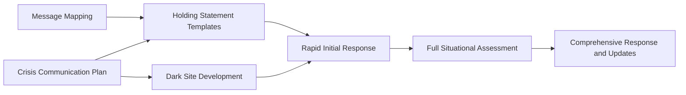
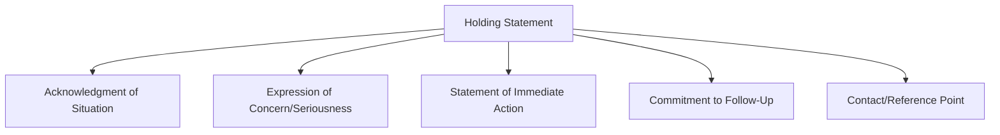
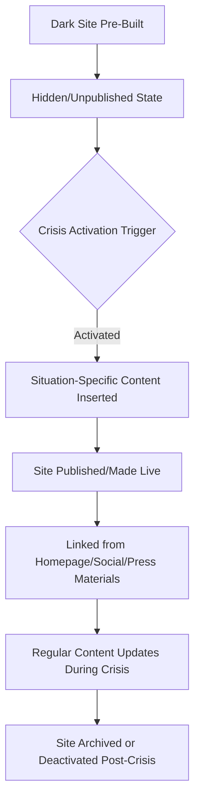

## Holding Statements and Dark Site Preparation

### Definition and Scope

Holding statements are brief, pre-approved initial communications issued in the earliest moments of a crisis to acknowledge awareness of a situation without committing to unconfirmed facts, buying time for full situational assessment while demonstrating organizational responsiveness. Dark site preparation refers to the practice of building and staging a ready-to-activate crisis version of an organization's website — populated but hidden ("dark") until needed — so that critical information can be published within minutes rather than requiring live design and development work during an active crisis.

Both practices exist to solve the same fundamental problem in crisis response: the gap between when a crisis becomes public and when an organization can produce fully accurate, comprehensive, fact-checked communications is often filled by speculation, rumor, and media narrative if the organization has no mechanism to communicate *something* credible immediately.

### Position in the Preparedness Framework

### Holding Statements: Purpose and Structure

**Key Points**

- **Acknowledge, don't speculate** — confirms awareness of the situation without stating unconfirmed facts or committing to specific outcomes
- **Demonstrate responsiveness** — signals that the organization is actively engaged, reducing the perception of silence or evasion, which stakeholders often interpret negatively regardless of actual cause
- **Buy time responsibly** — creates space for accurate fact-gathering without leaving an information vacuum for others to fill
- **Express appropriate concern** — conveys empathy or seriousness proportionate to the situation without admitting fault or liability before facts are established
- **Commit to follow-up** — specifies that further information will be provided, and ideally when, maintaining stakeholder trust that the organization will continue engaging

### Standard Holding Statement Components

1. **Acknowledgment** — a brief, factual statement confirming the organization is aware of the situation, using only confirmed information
2. **Expression of concern or seriousness** — appropriate tone conveying that the organization takes the matter seriously, calibrated to severity without overstating or understating
3. **Statement of immediate action** — what the organization is doing right now (e.g., "we are investigating," "our team is on-site"), described factually rather than promotionally
4. **Commitment to follow-up** — indication that more information will follow, ideally with a general timeframe if one can be responsibly given
5. **Contact/reference point** — where stakeholders can find updates or direct further inquiries

### Illustrative Holding Statement Template (Generic Structure)

> "We are aware of [situation] and are actively gathering information. [Organization]'s immediate priority is [safety/customer welfare/appropriate priority for context]. We are [specific immediate action, e.g., 'working closely with local authorities' / 'conducting a thorough internal review']. We will provide further updates as soon as we have verified information to share. For the latest updates, please [reference point]."

[Inference] The deliberate avoidance of specific factual claims beyond what is confirmed is the central design principle of holding statement templates, since premature factual claims that are later proven inaccurate typically cause greater reputational damage than an appropriately vague initial acknowledgment followed by accurate substantive updates.

### Scenario-Specific Holding Statement Pre-Drafting

Similar to message mapping, holding statements are most effective when pre-drafted for anticipated scenario types rather than composed from scratch during an active crisis:

| Scenario Type | Holding Statement Emphasis |
| --- | --- |
| Safety/physical incident | Immediate safety priority, cooperation with authorities |
| Data breach/cybersecurity | Investigation status, protective steps for affected parties |
| Product issue/recall | Customer safety priority, immediate remediation steps |
| Executive/conduct issue | Seriousness of allegations, review process underway |
| Operational disruption | Transparency on scope, restoration timeline where known |

[Unverified] The degree to which holding statements can be fully pre-drafted versus requiring real-time customization varies by scenario specificity; highly generic templates risk sounding impersonal if used without adaptation, while overly specific pre-drafted language may not fit the actual facts of a real event.

### Approval and Release Speed

- **Pre-authorized approval chains** — holding statements, given their deliberately conservative and fact-light nature, are often subject to an expedited legal and executive review process compared to full statements, since the risk of legal exposure from carefully genericized acknowledgment language is generally lower than from detailed factual claims
- **Time-boxed release targets** — many crisis communication plans set specific target windows (commonly cited illustrative ranges of within 30–60 minutes of confirmed activation) for holding statement release, distinct from longer windows for comprehensive follow-up statements
- **Multi-channel simultaneous release** — holding statements are typically released across all relevant channels simultaneously (website, social media, direct stakeholder communication) rather than sequentially, to avoid the appearance of inconsistent initial response

### Dark Site: Definition and Purpose

A **dark site** (also called a "dark web page" or "crisis microsite") is a pre-built, fully designed webpage or website section that remains unpublished and hidden from public view until a crisis triggers its activation ("going live" or "lighting up"). The content structure, design, and template are prepared in advance; only situation-specific content needs to be added at the moment of activation.

### Dark Site Content Architecture

**Key Points**

- **Situation overview/FAQ section** — pre-structured space for facts as they become confirmed, in accessible Q&A format
- **Official statements repository** — chronological archive of all official statements issued, providing a single authoritative source
- **Resources and next-steps guidance** — scenario-specific practical information (e.g., affected product identification for a recall, protective steps for a data breach, contact numbers for a safety incident)
- **Media resources section** — downloadable assets, executive statements, and background materials for journalists
- **Contact and escalation information** — clear channels for different stakeholder types (customers, media, employees, regulators) to get further information or support

### Pre-Built vs. Activation-Time Elements

| Pre-Built (in advance) | Populated at Activation |
| --- | --- |
| Page template, design, navigation structure | Situation-specific facts and details |
| Standard sections (FAQ format, statement archive structure) | Actual statement content |
| Brand-compliant visual design | Scenario-specific resources/guidance |
| Technical infrastructure (hosting, CMS access, mobile responsiveness) | Real-time update content |
| Standard legal boilerplate/disclaimers | Situation-specific legal language (reviewed at activation) |

[Inference] The core value proposition of dark site preparation is removing technical and design work from the critical path during an actual crisis — since web development, even for a simple page, typically takes considerably longer than the response window a crisis demands, pre-building the infrastructure allows the crisis team to focus exclusively on content accuracy and message strategy rather than technical execution under time pressure.

### Technical Considerations

- **Rapid activation mechanism** — the technical process for taking a dark site live should require minimal steps (ideally a single publish action or toggle) rather than a lengthy deployment process
- **Content Management System (CMS) access and permissions** — pre-authorized personnel with CMS access and training, avoiding a scenario where activation is delayed by access or technical-knowledge bottlenecks
- **Mobile responsiveness and accessibility** — pre-built and tested in advance, since crisis-driven traffic often skews heavily toward mobile access
- **Search engine and social sharing optimization** — pre-configured metadata ensuring the dark site surfaces appropriately when shared or searched, rather than requiring real-time technical configuration
- **Hosting capacity/scalability** — [Unverified] organizations anticipating high-visibility crises sometimes pre-arrange for traffic surge capacity (e.g., cloud hosting auto-scaling) given that crisis-related traffic spikes can be substantial and sudden, though the degree of technical over-provisioning varies by organization size and risk profile
- **Integration with monitoring and updates** — clear internal process for who can update the live dark site content and how updates are reviewed/approved once activated

### Testing and Maintenance

1. **Periodic technical testing** — verifying the activation mechanism actually works as designed, since infrastructure changes (CMS updates, hosting migrations) can silently break a rarely-used activation pathway
2. **Content template refresh** — reviewing and updating pre-built templates and boilerplate content periodically to reflect current branding, organizational structure, and legal requirements
3. **Integration with tabletop exercises** — including dark site activation as a component of crisis simulation drills, testing both the technical mechanism and the content population workflow under simulated time pressure
4. **Access and permission audits** — confirming that personnel with activation authority and CMS access remain current as staff change

### Common Failure Modes

- **Untested activation mechanism** — a dark site that has never actually been tested for live activation, discovered to be broken or outdated only during a real crisis
- **Overly specific pre-drafted content** — holding statements or dark site content so specifically worded that they don't fit the actual facts of a real event, forcing time-consuming rewrites rather than rapid customization
- **Speculative content in holding statements** — including unconfirmed details or assumptions in an initial holding statement, creating correction risk if facts later differ
- **No pre-authorized approval pathway** — treating holding statement approval with the same lengthy review process as comprehensive statements, eliminating the speed advantage the format is designed to provide
- **Forgotten dark site** — infrastructure built once and never revisited, becoming technically outdated, off-brand, or inaccessible to current personnel by the time it's actually needed
- **Silence perceived as evasion** — delaying any public statement while awaiting complete information, when even an appropriately vague holding statement would have reduced the information vacuum and associated speculation

### Practical Example

**Example**

A consumer electronics company maintains a pre-built dark site template covering product safety scenarios, tested twice yearly as part of its tabletop exercise program. When a safety concern involving a specific product line is reported, the pre-authorized holding statement approval chain allows a scenario-matched template — acknowledging awareness, confirming an investigation is underway, and directing customers to the dark site for updates — to be issued within 40 minutes of crisis activation, ahead of the organization having fully confirmed the scope of the issue. Simultaneously, the pre-built dark site is activated within the same window; only the situation-specific FAQ content and affected product identification details require real-time population, since the page structure, design, and technical infrastructure were already complete. This combination allows the company to establish itself as the authoritative source of information before external speculation fills the vacuum, with the dark site subsequently updated three times over the following 48 hours as confirmed facts develop, each update logged in the statement archive section for consistency and transparency.

### Related Topics

- Components of a Crisis Communication Plan
- Message Mapping and Key Message Architecture
- Spokesperson Selection and Media Training
- Crisis Management Team Structure and Governance
- Social Media Crisis Response and Platform-Specific Risk
- Legal and Regulatory Disclosure Requirements in Crisis Response
- Tabletop Exercises and Crisis Simulation Design
- Internal Communications During a Crisis