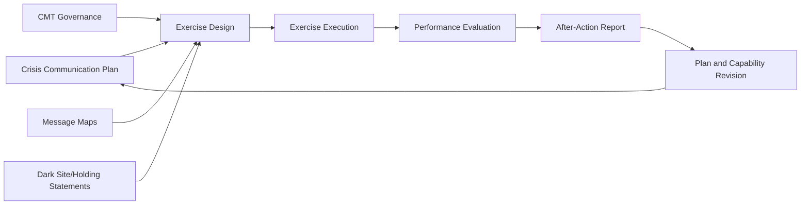
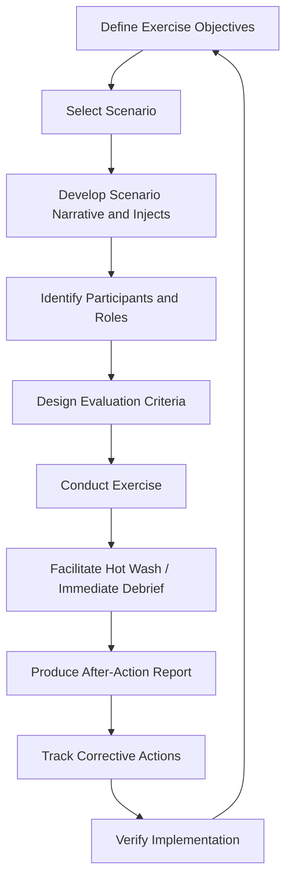

## Tabletop Exercises and Crisis Simulations

### Definition and Scope

Tabletop exercises and crisis simulations are structured, facilitated rehearsals in which crisis management teams work through a hypothetical scenario in a controlled environment, testing plans, decision-making, coordination, and communication without the consequences of an actual crisis. This is the **validation and rehearsal layer** of crisis preparedness — the mechanism through which every prior component covered (crisis communication plans, CMT governance, incident command structures, spokesperson training, message maps, holding statements, dark sites) is stress-tested against realistic conditions before being relied upon in an actual event.

Documentation alone does not guarantee effective crisis response; exercises are the primary mechanism by which an organization discovers gaps, builds team coordination, and develops the practiced decision-making referenced throughout crisis-resilient culture practice.

### Position in the Preparedness Framework

### Exercise Format Spectrum

Exercises range in complexity, realism, and resource intensity, typically progressing through increasing sophistication as organizational crisis preparedness matures:

| Format | Description | Typical Use |
| --- | --- | --- |
| Discussion-based tabletop | Facilitated verbal walkthrough of a scenario; participants discuss decisions without real-time pressure | Foundational training, plan familiarization |
| Facilitated tabletop with injects | Scenario unfolds via sequential "injects" (new information delivered at intervals), requiring adaptive decisions | Testing decision-making under evolving conditions |
| Functional exercise | Tests specific functions (e.g., notification systems, dark site activation) in isolation under realistic conditions | Validating specific operational capabilities |
| Full-scale simulation | Real-time, high-fidelity simulation involving multiple functions, simulated media, and time pressure | Comprehensive readiness testing for high-priority scenarios |
| Full-scale exercise with external participants | Involves simulated or actual external parties (media trainers playing journalists, regulators, partner organizations) | Testing Unified Command and multi-party coordination |

[Inference] Organizations generally progress through this spectrum over time rather than starting with full-scale simulations, since discussion-based tabletops build foundational plan familiarity and team comfort that make more intensive, realistic exercises significantly more valuable once introduced.

### Exercise Design Process

1. **Define exercise objectives** — specific, measurable goals for what the exercise should test (e.g., "test the 30-minute holding statement release target," "evaluate cross-functional decision-making under the tiered activation protocol")
2. **Select scenario** — drawing on scenario planning outputs and prioritized risk register to choose a realistic, organizationally relevant scenario, often prioritizing high-likelihood/high-impact risks identified through earlier prioritization work
3. **Develop scenario narrative and injects** — building the initial situation and a sequence of "injects" (new developments introduced at intervals) that force participants to adapt and make decisions with evolving, sometimes incomplete or contradictory information
4. **Identify participants and roles** — determining which CMT members, functional leads, and potentially external parties will participate, and whether participants play their actual roles or intentionally different ones (role reversal can reveal knowledge gaps)
5. **Design evaluation criteria** — establishing what "good" performance looks like against specific plan elements (response time targets, message consistency, decision authority adherence) before the exercise begins, not retrospectively
6. **Conduct exercise** — facilitated execution, with a designated exercise controller managing inject delivery and pacing
7. **Facilitate hot wash** — an immediate, informal debrief conducted right after the exercise while impressions are fresh, capturing initial reactions before formal analysis
8. **Produce after-action report** — formal documentation of findings, gaps identified, and recommended corrective actions
9. **Track corrective actions** — assigning owners and deadlines for addressing identified gaps
10. **Verify implementation** — confirming corrective actions were actually completed, often validated in a subsequent exercise

### Scenario Injects — Structural Pattern

Injects are the mechanism by which a tabletop exercise creates realistic time pressure and decision complexity, simulating how real crises evolve unpredictably rather than presenting a single static situation.

**Common inject types:**

- **Escalation injects** — the situation worsens or expands in scope
- **Complication injects** — new complexity is introduced (e.g., a key spokesperson becomes unavailable, conflicting information emerges)
- **Stakeholder reaction injects** — simulated media inquiries, social media reaction, regulatory contact, or customer complaints
- **Resolution-testing injects** — information suggesting the situation may be resolving, testing whether the team appropriately scales down response

[Inference] Well-designed injects are generally calibrated to test specific plan elements rather than introduced arbitrarily — for example, an inject removing the primary spokesperson from availability specifically tests the backup designation and succession protocols covered in CMT governance, rather than simply adding narrative complexity for its own sake.

### Exercise Participants and Roles

- **Exercise controller/facilitator** — manages scenario delivery, injects, pacing, and ensures objectives are being tested; typically does not participate in the crisis response itself
- **Players** — CMT members and functional leads who respond to the scenario in their actual (or, occasionally, intentionally rotated) roles
- **Evaluators/observers** — dedicated personnel who observe and document performance against pre-defined criteria without participating in decision-making, providing more objective assessment than self-reported participant impressions
- **Simulation cell (SimCell)** — for larger exercises, a team playing external roles (media, regulators, customers, social media activity) to create realistic interaction and pressure
- **External media trainers** — sometimes engaged to play adversarial journalist roles, particularly when spokesperson performance under hostile questioning is a specific exercise objective

### Evaluation Criteria Design

Effective exercises establish specific, measurable evaluation criteria in advance rather than relying solely on general impressions after the fact:

| Evaluation Category | Example Criteria |
| --- | --- |
| Activation speed | Time from scenario trigger to formal CMT activation |
| Decision-making | Adherence to defined decision authority; escalation used appropriately |
| Message consistency | Alignment between spokesperson statements, written materials, and message map |
| Response timing | Holding statement issued within target window; dark site activated within target window |
| Cross-functional coordination | Legal, operations, and communications coordination without unnecessary delay |
| Stakeholder sequencing | Internal audiences informed appropriately relative to external release |

[Unverified] The specific weighting or scoring methodology applied to these criteria varies by organization; some use structured scorecards while others rely on qualitative evaluator assessment, with no single standardized approach across the field.

### The After-Action Report (AAR)

A structured document capturing exercise findings, typically including:

1. **Executive summary** — high-level assessment of overall performance and key findings
2. **Objectives assessment** — whether each pre-defined exercise objective was met, partially met, or not met
3. **Strengths identified** — capabilities and behaviors that performed well, reinforcing what should be maintained
4. **Gaps and areas for improvement** — specific deficiencies identified, ideally tied to specific plan elements or capability areas
5. **Corrective action plan** — specific, assigned, time-bound actions to address identified gaps
6. **Follow-up verification plan** — how and when corrective action completion will be confirmed

[Inference] The distinction between the informal hot wash and the formal AAR matters structurally: the hot wash captures immediate, candid impressions while memory is fresh and before participants have had time to rationalize decisions, while the formal AAR provides the documented, actionable record that drives actual plan revision — organizations that skip the hot wash in favor of only a delayed formal review risk losing some of the candid, in-the-moment observations.

### Blameless Facilitation Approach

Consistent with crisis-resilient culture principles, effective exercise facilitation emphasizes:

- **Focus on systems and plans, not individual blame** — evaluation criteria target whether the *plan* and *structure* supported good decisions, not whether a specific individual performed well or poorly in isolation
- **Psychological safety during debrief** — participants must feel safe candidly discussing what went wrong or what they were uncertain about, since a defensive or punitive debrief atmosphere suppresses the honest disclosure that makes exercises valuable
- **Normalizing imperfect performance** — exercises are explicitly a learning environment; treating every gap as a failure rather than a discovery opportunity undermines the willingness of participants to engage authentically in future exercises

### Exercise Frequency and Program Maintenance

- **Regular cadence** — [Unverified] commonly cited practice suggests conducting tabletop exercises at least annually for core scenarios, with higher-priority or newly identified risks tested more frequently, though exact cadence recommendations vary by sector, regulatory requirement, and organizational risk profile
- **Scenario rotation** — cycling through different scenario types over time to avoid over-preparing for a narrow set of situations while leaving other plausible scenarios untested
- **New scenario incorporation** — [Inference] scenarios identified through horizon scanning or scenario planning as newly emerging risks are generally incorporated into the exercise program relatively promptly, since exercise programs that only test previously known risk types can miss validating preparedness against the very emerging risks the organization's scanning processes were designed to surface
- **Progressive complexity** — exercise design often deliberately increases in realism and difficulty over successive iterations as team familiarity and baseline competence improve

### Common Failure Modes

- **Exercise-as-formality** — conducting tabletop exercises to satisfy a compliance or governance checkbox without genuine engagement or rigorous evaluation
- **Overly easy scenarios** — designing scenarios and injects that do not meaningfully stress-test the plan, producing a false sense of preparedness
- **No corrective action follow-through** — identifying gaps in the after-action report that are never actually addressed before the next exercise or a real crisis
- **Leadership non-participation** — senior leaders declining to participate directly, undermining both the realism of the exercise and the organizational signal about its priority
- **Punitive evaluation atmosphere** — treating exercise performance gaps as individual failures rather than systemic learning opportunities, suppressing candid engagement
- **Static scenario library** — repeatedly testing the same scenario type without incorporating newly emerging risks or increasing complexity, leaving other risk categories unvalidated
- **Missing evaluators** — running exercises without dedicated, objective observers, relying solely on participant self-assessment, which tends to be less reliable

### Practical Example

**Example**

A hospital network conducts an annual full-scale simulation exercise for a data breach scenario affecting patient records, identified as a top-tier risk through its prioritized risk register. The exercise controller delivers an initial scenario brief followed by four injects over two hours: confirmation of the breach scope expanding, a simulated urgent media inquiry from a health reporter (played by an external media trainer), a complication where the designated primary spokesperson is marked "unavailable" to test backup protocols, and a simulated regulatory contact requiring coordinated Unified Command-style response. Dedicated evaluators score the exercise against pre-defined criteria, including the target 30-minute holding statement window and correct application of the legal hold-authority protocol from the CMT governance structure. The hot wash immediately following the exercise surfaces that the backup spokesperson, while technically designated, had not received recent media training refresh — a gap the formal after-action report documents as a specific corrective action with a 60-day deadline, subsequently verified as completed and validated in a smaller functional exercise before the next annual full-scale simulation.

### Related Topics

- Components of a Crisis Communication Plan
- Crisis Management Team Structure and Governance
- Incident Command Systems for Communications
- Spokesperson Selection and Media Training
- Message Mapping and Key Message Architecture
- Holding Statements and Dark Site Preparation
- Building a Crisis-Resilient Organizational Culture
- Post-Crisis Review and After-Action Reporting