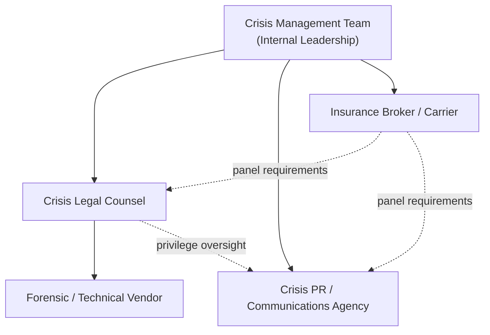

## Vendor, Agency, and Legal Counsel Relationships

### Overview

Vendor, agency, and legal counsel relationships form the external infrastructure that a crisis response depends on once internal resources are exhausted or specialized expertise is required. Crisis Preparedness and Planning treats these relationships as pre-negotiated, pre-vetted assets rather than emergency procurements. An organization that begins vendor selection, contract negotiation, or outside counsel engagement *after* a crisis has already broken loses the single most valuable resource in crisis response: time. This topic covers the categories of external partners needed, how to structure agreements in advance, retainer and activation mechanics, governance of the relationship during an active crisis, and common failure modes.

### Why Pre-Crisis Relationships Matter

**Key Points**

- Crisis response has compressed timelines; standard procurement cycles (RFPs, competitive bidding, legal review of new vendor contracts) typically take weeks to months — incompatible with a crisis that must be addressed in hours.
- Vendors and counsel engaged mid-crisis lack institutional knowledge: they do not know the organization's risk profile, prior incidents, internal politics, or stakeholder map, and onboarding them consumes senior leadership time that should be spent managing the crisis itself.
- Pre-negotiated rates and terms prevent "crisis pricing," where vendors and law firms — aware of the client's urgency and diminished negotiating leverage — charge premium rates for emergency engagement.
- A documented, tested relationship means the vendor or firm has already been through at least one tabletop exercise with the organization, so working relationships and communication protocols are established before they are needed under pressure.

### Categories of External Partners

#### Crisis Communications and PR Agencies

Retained to manage message development, media relations, and reputation monitoring during a crisis. Roles typically include:

- Drafting and reviewing statements, holding statements, and Q&A documents
- Media monitoring and sentiment tracking across traditional and social channels
- Spokesperson coaching and media training (ideally conducted pre-crisis, not during)
- Coordinating with the organization's internal communications team rather than replacing it

**Selection criteria**: sector-specific crisis experience (not just general PR), 24/7 availability commitments, existing media relationships relevant to the organization's industry, and demonstrated ability to work under an NDA with sensitive, unreleased information.

#### Legal Counsel

Two distinct categories are often needed, and organizations frequently conflate them:

1. **General/corporate outside counsel** — handles standard legal matters, may not have crisis-specific experience.
2. **Crisis and litigation counsel** — specializes in regulatory exposure, privilege protection, litigation hold procedures, and coordinating legal strategy with communications strategy. This is the counsel that should be pre-retained for crisis scenarios specifically.

Crisis counsel's core functions:

- Establishing attorney-client privilege over crisis investigations and communications (critical — see Privilege section below)
- Advising on disclosure obligations (SEC, regulatory bodies, breach notification laws, sector-specific mandates)
- Reviewing public statements for legal exposure before release
- Managing litigation holds and evidence preservation
- Interfacing with regulators, law enforcement, or investigators

#### Specialized Technical/Operational Vendors

Depending on the organization's risk profile, this may include:

- **Cybersecurity incident response firms** (digital forensics, breach containment, threat intelligence)
- **Security consultants** (physical security incidents, workplace violence)
- **Environmental/safety consultants** (industrial accidents, product recalls, environmental releases)
- **Translation and localization services** (multinational crisis communication)
- **Executive protection services** (personal safety threats to leadership)

#### Insurance Brokers and Carriers

Crisis-relevant insurance (cyber liability, D&O, crisis management riders) often includes **pre-approved vendor panels** — the insurer requires or incentivizes use of specific PR firms, forensic vendors, or counsel. This must be reconciled with the organization's own pre-selected vendors *before* a crisis, since a mismatch can create coverage disputes at the worst possible time.

### Structuring the Relationship: Retainer Agreements

**Example**

A typical crisis PR retainer structure:

| Component | Typical Terms |
| --- | --- |
| Base retainer | Monthly or annual fee securing priority access and capacity reservation |
| Activation trigger | Defined in the contract (e.g., "written notice invoking crisis protocol") |
| Response SLA | e.g., senior team member reachable within 1 hour, on-site or video within 4 hours |
| Rate lock | Pre-negotiated hourly/day rates that do not escalate during active crisis use |
| Scope ceiling | Hours or budget included in retainer before additional billing begins |
| Conflict check | Pre-cleared so the firm is not representing a direct competitor or adversarial party |

Legal counsel retainers follow a similar pattern but add:

- **Engagement letter scope** defining what triggers the crisis-specific rate versus standard billing
- **Conflicts waiver or pre-clearance** process, since law firms must run conflict checks and this can be pre-completed for anticipated crisis types
- **Privilege structuring language** — pre-agreeing that the firm will engage vendors (e.g., forensic investigators) *under privilege* via a Kovel-type arrangement (in U.S. practice, engaging a non-legal expert through counsel to extend privilege protection to the expert's work product)

### The Privilege Architecture Problem

**Key Points**

This is one of the most technically important and frequently mishandled aspects of vendor relationships in crisis response, particularly for cybersecurity incidents and internal investigations.

- If a technical vendor (e.g., a forensics firm) is engaged **directly by the organization**, their findings, reports, and communications may be discoverable in subsequent litigation or regulatory proceedings.
- If the same vendor is engaged **by outside counsel, on behalf of the organization, for the purpose of providing legal advice**, the work product may be protected under attorney-client privilege or work-product doctrine — though courts have scrutinized and sometimes rejected this protection where the vendor's work appears to serve a business purpose rather than a legal one (as seen in cases involving post-breach forensic reports later ordered disclosed in litigation).
- [Inference] Because privilege determinations are fact-specific and jurisdiction-dependent, organizations should not assume that routing a vendor engagement through counsel automatically guarantees privilege; the structure, scope of engagement letters, and actual conduct of the investigation all affect the outcome, and this should be confirmed with counsel for the specific jurisdiction and fact pattern involved.
- Pre-crisis planning should include a **pre-drafted engagement letter template** that counsel can execute quickly to retain technical vendors under privilege the moment a crisis is declared, rather than drafting this from scratch during the incident.

### Governance During Activation

#### Roles and Reporting Lines

A recurring design question is whether the PR agency reports to the internal communications lead or to legal counsel. [Inference] Many crisis management frameworks recommend that legal counsel have review authority over public statements (not drafting authority) specifically to manage legal exposure, while the communications team retains ownership of message strategy and voice — but the exact balance depends on organizational culture, industry, and the regulatory environment, and rigid legal control over every communication can slow response time and produce statements that read as evasive.

#### Activation Protocol

**Example** activation sequence once a crisis is declared:

1. Crisis Management Team lead issues written activation notice to pre-retained vendors per contract terms
2. Legal counsel confirms privilege structure and issues engagement letters to any technical vendors requiring privileged engagement
3. PR agency and legal counsel are added to a shared, access-controlled communication channel (with legal advising on what should and should not be documented in writing)
4. Insurance carrier/broker notified per policy notification requirements (often within a specific number of days — delay can jeopardize coverage)
5. Vendor SLA clocks start per contract terms

### Contractual Elements to Negotiate in Advance

- **Confidentiality and NDA terms** — should survive termination of the retainer and cover all personnel the vendor assigns
- **Conflict of interest exclusivity** — restrictions on the vendor/firm representing competitors or known adversarial parties during the retainer term
- **Data handling and jurisdiction** — where vendor-collected data (especially forensic evidence) is stored, processed, and under what data protection regime, particularly relevant for multinational organizations under GDPR or similar frameworks
- **Termination and transition provisions** — how quickly the relationship can be exited and what happens to work product/data upon termination
- **Indemnification and liability caps** — particularly important for forensic and technical vendors whose errors could compound the crisis
- **Named personnel clauses** — ensuring the specific senior staff who did the tabletop exercises are the ones who show up during an actual crisis, not junior substitutes

### Common Failure Modes

- **Retainer without testing**: A contract exists but has never been exercised in a tabletop or simulation, so the first real activation is also the first real test of response times and communication protocols.
- **Single point of contact risk**: Only one person at the vendor/firm knows the account; if that person is unavailable, response stalls.
- **Insurance panel conflicts**: The organization's preferred vendor is not on the cyber insurance carrier's approved panel, forcing a choice between using an unfamiliar panel vendor or risking reduced/denied coverage.
- **Scope creep without repricing clarity**: Crisis extends beyond the retainer's included hours and the organization is surprised by overage billing during an already stressful period.
- **Privilege structure ignored in practice**: Engagement letter is technically routed through counsel, but day-to-day communication happens directly between the business and the vendor, undermining the privilege claim.
- **Stale contact information**: Vendor contract exists but emergency contact numbers, escalation paths, or personnel have changed and were never updated.

### Best Practices Checklist

- [ ] Maintain a current **vendor roster document** listing all pre-retained crisis vendors, contract expiration dates, activation procedures, and named contacts
- [ ] Conduct at least one **tabletop exercise annually** involving actual retained vendors and counsel, not simulated stand-ins
- [ ] Reconcile vendor selections with **insurance panel requirements** before finalizing contracts
- [ ] Pre-draft **engagement letter templates** for privileged technical vendor engagement
- [ ] Establish clear **statement review vs. approval authority** between legal and communications
- [ ] Review and renew retainer terms **at least annually**, including rate locks and SLA terms
- [ ] Confirm **24/7 contact reachability** is tested, not just contractually promised

### Related Topics

- Crisis Management Team Structure and Roles
- Attorney-Client Privilege in Internal Investigations
- Cyber Insurance Policy Requirements and Panel Vendors
- Tabletop Exercise Design and Facilitation
- Litigation Hold and Evidence Preservation Procedures
- Regulatory Notification Requirements by Sector
- Spokesperson Selection and Media Training