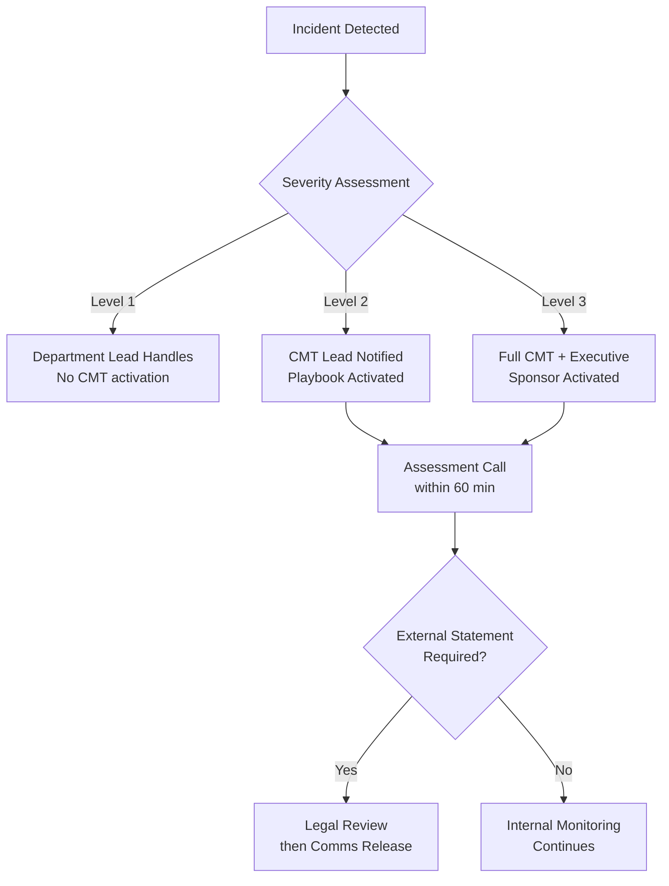
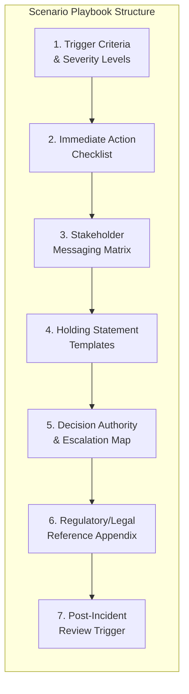

## Scenario-Specific Crisis Playbooks

### Overview

A scenario-specific crisis playbook is a pre-written, tactical response document tailored to a single, identifiable category of crisis — as distinct from a generic crisis management plan, which covers governance, roles, and escalation logic applicable to *any* crisis. Where the general crisis plan answers "who is in charge and how do we activate," the scenario playbook answers "what specifically do we do, say, and check in the first hours of *this particular kind* of event." Playbooks are the operational layer that turns a crisis management framework into executable action under time pressure, when cognitive load is high and improvisation is riskiest.

### Playbook vs. Master Crisis Plan

**Key Points**

- The master crisis plan is scenario-agnostic: it defines the Crisis Management Team (CMT), activation thresholds, communication chain of command, and general escalation procedures.
- The scenario playbook is scenario-specific: it assumes the master plan's structure already exists and layers on tactical detail unique to one type of event (data breach, product recall, executive misconduct allegation, workplace violence, natural disaster, etc.).
- Playbooks should never duplicate governance content from the master plan — they should reference it ("see Master Crisis Plan §4 for activation authority") and focus only on what differs for this scenario.
- Organizations that only maintain a master plan and skip scenario playbooks often find that generic guidance ("communicate promptly and transparently") is too abstract to act on within the first critical hour of an actual incident.

### Core Components of a Scenario Playbook

#### 1. Trigger Criteria and Severity Thresholds

Each playbook opens with objective, unambiguous criteria for when it applies and at what severity level. Vague triggers ("if something goes wrong with a product") cause hesitation; specific triggers speed activation.

**Example** (Product Recall Playbook trigger criteria):

| Severity | Trigger Condition | Activation Level |
| --- | --- | --- |
| Level 1 | Single confirmed safety complaint, no injury | Monitor; Quality team review |
| Level 2 | Multiple complaints or one injury report, root cause unconfirmed | CMT notified; playbook activated |
| Level 3 | Confirmed defect with injury/death risk, regulatory inquiry likely | Full CMT activation; legal and regulatory engaged within 1 hour |

#### 2. Immediate Action Checklist (First 60–90 Minutes)

A short, ordered, role-assigned checklist — not prose — covering the actions that must happen before deliberation, analysis, or strategy discussion.

**Example** (Data Breach Playbook, first-hour checklist):

1. IT Security: isolate affected systems, preserve logs (do not remediate/delete yet — evidence preservation)
2. CISO/IT Lead: notify CMT lead and pre-retained forensic vendor per activation protocol
3. Legal Counsel: determine if attorney-client privilege engagement letter is needed before forensic vendor begins work
4. Communications Lead: activate internal holding statement to employees (no external statement yet — facts unconfirmed)
5. CMT Lead: convene initial assessment call within 60 minutes

#### 3. Stakeholder-Specific Messaging Matrix

Different audiences need different information, delivered through different channels, on different timelines. The playbook pre-drafts the *structure* of these messages (not final copy, since facts will differ per incident) so drafting under pressure starts from a template, not a blank page.

| Stakeholder | Channel | Timing Target | Key Message Elements |
| --- | --- | --- | --- |
| Employees | Internal email/intranet | Within 2 hours | What we know, what we're doing, what to say if asked externally |
| Customers/affected parties | Direct notification, website banner | Per regulatory deadline | What happened, what data/product is affected, remediation steps |
| Media | Press statement, spokesperson | After facts confirmed, typically 4–24 hrs | Holding statement first, detailed statement once verified |
| Regulators | Formal notification per statute | Per statutory deadline (varies by jurisdiction) | Factual, legally reviewed disclosure |
| Investors (if public company) | 8-K or equivalent disclosure | Per securities disclosure rules | Material impact assessment |

#### 4. Pre-Approved Holding Statement Templates

A holding statement is issued before all facts are known, to acknowledge awareness and demonstrate the organization is responding — without speculating or admitting liability prematurely.

**Example** holding statement structure (bracketed fields filled at time of use):

> "We are aware of [incident type] affecting [scope]. We take this seriously and are actively investigating with the support of [outside experts, if applicable]. We will provide updates as more information becomes available. The [safety/security/wellbeing] of our [customers/employees/community] is our top priority."

[Inference] Holding statement templates should be reviewed by legal counsel in advance for the specific scenario type, since language implying fault or certainty (e.g., "this was caused by X") can create legal exposure if later proven inaccurate — the exact risk depends on jurisdiction and the applicable legal standard for admissions.

#### 5. Decision Authority and Escalation Map

Defines who can approve what, specific to this scenario type — since authority levels often differ by crisis category (e.g., a product recall may require Legal + Operations sign-off, while a cybersecurity incident may require CISO + Legal + CEO sign-off for ransom-related decisions).

#### 6. Regulatory and Legal Reference Appendix

Scenario-specific statutory obligations, since these vary enormously by crisis type and jurisdiction:

- Data breach: breach notification laws (varies by state/country — e.g., differing timelines under U.S. state laws versus GDPR's 72-hour requirement to supervisory authorities)
- Product safety: Consumer Product Safety Commission or equivalent regulatory reporting obligations
- Workplace incidents: OSHA or equivalent occupational safety reporting requirements
- Environmental incidents: environmental agency notification requirements

[Unverified] Specific statutory deadlines and thresholds should be confirmed with legal counsel at time of playbook creation and re-verified periodically, as regulatory requirements change and vary significantly by jurisdiction and industry — the examples above illustrate the *category* of obligation, not current, universally applicable deadlines.

#### 7. Post-Incident Review Trigger

Every playbook should close with a mandated after-action review trigger, ensuring the playbook itself gets updated based on real activation experience.

### Common Scenario Playbook Categories

**Key Points** — organizations typically maintain a portfolio of playbooks covering their actual risk profile, commonly including:

- **Data breach / cybersecurity incident**
- **Product recall / safety defect**
- **Executive misconduct or leadership scandal**
- **Workplace violence or safety incident**
- **Natural disaster / business continuity disruption**
- **Financial misconduct or fraud disclosure**
- **Social media backlash / viral reputational event**
- **Mergers, acquisitions, or layoffs communication crises**
- **Supply chain disruption or third-party vendor failure**
- **Environmental incident or regulatory violation**

Not every organization needs every playbook — the portfolio should map to an actual risk assessment rather than a generic checklist, since maintaining unused playbooks consumes review and update resources without corresponding risk reduction.

### Playbook Structure Template

### Maintenance and Testing

**Key Points**

- Playbooks decay quickly: personnel change, regulations update, vendor contracts expire, and organizational structure shifts. A playbook untouched for 18+ months is a liability, not an asset.
- **Tabletop exercises** should rotate through the playbook portfolio, ideally testing at least one scenario category per year with the actual personnel who would respond.
- **After-action reviews** following both real incidents and exercises should feed directly back into playbook revisions — a playbook that is never updated after being tested has not actually been improved by the exercise.
- Version control and a clear "last reviewed" date on each playbook prevents teams from executing outdated procedures during an actual crisis.

### Common Pitfalls

- **Over-genericizing**: writing playbooks so vague they could apply to any crisis, which defeats the purpose of having scenario-specific guidance at all.
- **Over-scripting**: writing final, verbatim public statements in advance rather than templates — real incidents rarely match assumed facts exactly, and rigid scripts can force awkward, obviously pre-written responses that damage credibility.
- **Siloed ownership**: a single department (often Legal or Comms) owns the playbook without cross-functional input, producing gaps in operational or technical accuracy.
- **No accessibility plan**: playbooks stored only on internal systems that may be unavailable during the crisis itself (e.g., a cybersecurity playbook stored on a network that gets taken offline during a ransomware attack) — playbooks for IT/security scenarios in particular should have an accessible offline or out-of-band copy.
- **Missing authority clarity**: playbook lists actions but doesn't specify who has authority to approve them, causing delay while people seek clarification during the actual event.

### Related Topics

- Crisis Management Team Structure and Roles
- Vendor, Agency, and Legal Counsel Relationships
- Tabletop Exercise Design and Facilitation
- Holding Statement and Message Map Development
- Breach Notification and Regulatory Disclosure Requirements
- After-Action Review and Post-Incident Debrief Process
- Business Continuity and Disaster Recovery Planning