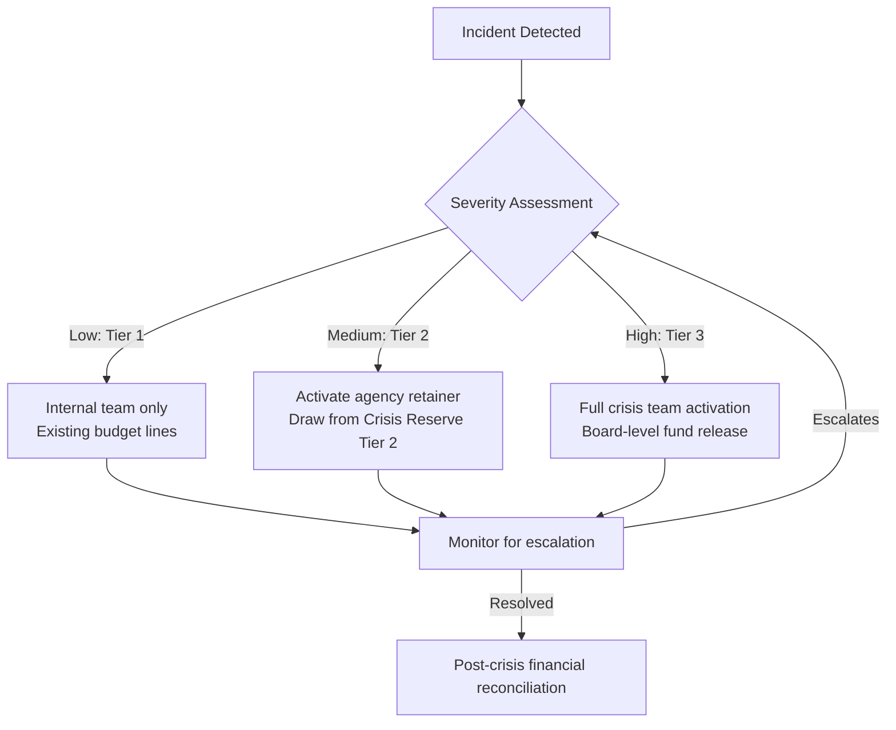

## Budgeting and Resourcing for Crisis Response

### Overview

Budgeting and resourcing for crisis response is the discipline of pre-allocating financial, human, technological, and material resources so that an organization can act within the "golden hour" of a crisis rather than scrambling to secure approvals while reputational damage compounds. Unlike routine operational budgeting, crisis budgets must account for events with unknown timing, unknown severity, and unknown duration, which means the financial architecture has to be built around contingency logic rather than fixed line items.

### Why Standard Budgeting Fails in Crisis Contexts

Annual budget cycles assume predictable, plannable expenditure. Crises violate this assumption in three ways:

- **Temporal unpredictability**: A crisis can emerge at any point in the fiscal year, often when discretionary funds are already committed elsewhere.
- **Magnitude variance**: The same category of crisis (e.g., a data breach) can cost $50,000 or $5,000,000 depending on scope, making single-point estimates unreliable.
- **Approval latency**: Standard procurement and sign-off chains (multiple approvals, competitive bidding, finance committee review) are too slow for a situation demanding action within hours.

**[Inference]** Organizations that rely solely on standard budget reallocation during a live crisis typically experience a 24–72 hour lag before funds are usable, which is often long enough for a controllable issue to escalate into an uncontrolled one.

### Core Components of a Crisis Budget

#### 1. Dedicated Crisis Reserve Fund

A ring-fenced pool of capital, separate from operating budgets, that can be accessed without going through the normal approval hierarchy.

- Typically sized as a percentage of annual revenue or operating budget (commonly cited industry ranges are 0.5%–2%, though this varies heavily by risk profile and sector)
- Governed by pre-approved trigger conditions and spending authorities, not case-by-case board votes
- Reviewed and replenished annually as part of enterprise risk management (ERM) cycles

#### 2. Pre-Authorized Spending Tiers

A tiered authority matrix that maps dollar thresholds to approval levels, removing bottlenecks during time-sensitive decisions.

| Tier | Spending Threshold | Approval Authority | Typical Use |
| --- | --- | --- | --- |
| Tier 1 | Up to $10,000 | Crisis Communications Lead | Monitoring tools, initial legal consult, urgent translation/localization |
| Tier 2 | $10,000–$100,000 | CCO / VP Communications + CFO sign-off | Media buys, agency surge staffing, dark site activation |
| Tier 3 | $100,000+ | CEO / Board Crisis Committee | Litigation reserves, large-scale recall, executive travel, settlement funds |

**[Inference]** Exact thresholds should be calibrated to the organization's size; the ratios (not absolute numbers) are the transferable principle.

#### 3. Resource Categories to Budget For

**Human Resources**

- Internal crisis team overtime and backfill costs
- External PR/crisis communications agency retainers (on standby, not just on-call)
- Legal counsel (both in-house surge capacity and outside crisis litigation counsel)
- Translation and localization services for multi-region crises
- Employee assistance / counseling services if the crisis involves harm to staff

**Technology and Monitoring**

- Media monitoring and social listening platform subscriptions (e.g., Meltwater, Brandwatch, Talkwalker-class tools)
- Dark site / holding statement web infrastructure kept warm and ready to deploy
- Mass notification systems (SMS/email/push for employees, customers, stakeholders)
- Call center surge capacity (temporary staffing or outsourced overflow lines)

**Physical and Logistical**

- Travel and lodging for executives or spokespeople to reach affected sites
- Physical security if the crisis has a safety dimension
- Signage, temporary facilities, or replacement equipment for operational crises

**Financial and Legal Contingencies**

- Settlement or compensation reserves (product recalls, customer harm)
- Regulatory fines contingency (where estimable)
- Insurance deductibles for cyber, D&O, or general liability policies that may be triggered

#### 4. Insurance as a Resourcing Instrument

Insurance is a budgeting lever, not a separate function, because it converts an unbounded liability into a bounded, budgetable premium plus deductible.

- **Cyber liability insurance**: often covers breach notification costs, forensic investigation, credit monitoring, and sometimes crisis PR expenses
- **Directors & Officers (D&O) insurance**: relevant when leadership decisions are challenged post-crisis
- **Product liability / recall insurance**: covers recall logistics, replacement costs, and sometimes reputational recovery campaigns
- **Business interruption insurance**: relevant when the crisis halts operations

**[Unverified]** Whether a specific policy covers reputational or PR-specific costs (as opposed to direct damages) depends entirely on the policy language; this must be confirmed with legal/insurance counsel per organization rather than assumed.

### Resource Allocation Framework

A practical way to structure the allocation decision is to map crisis severity against resource commitment, since over-resourcing a minor issue wastes reserve capital while under-resourcing a major one accelerates damage.

### Budget Justification and Board Communication

Because crisis reserves sit idle in "normal" years, they are frequently targeted for cuts during cost-reduction exercises. Building a defensible justification requires:

- **Cost-of-inaction modeling**: Quantify historical or industry-comparable costs of delayed crisis response (e.g., stock price impact, customer churn, regulatory penalties) to justify reserve size
- **Benchmarking**: Reference peer-organization reserve ratios and past incident costs (industry reports from PR and risk consultancies are commonly cited sources)
- **Scenario-based budgeting**: Present 2–3 crisis scenarios (minor, moderate, severe) with associated cost ranges rather than a single number, so the board understands the reserve as insurance against a distribution of outcomes, not a fixed expense

### Post-Crisis Financial Reconciliation

Budgeting discipline does not end when the acute crisis phase ends. A structured reconciliation process should:

1. Track actual spend against the activated tier's pre-authorized envelope
2. Document variances (over/under spend) with rationale
3. Feed lessons learned back into reserve sizing for the following budget cycle
4. Pursue insurance claims and reimbursements where applicable
5. Reassess vendor/agency retainer terms based on performance during the live event

### Common Pitfalls

- **Treating the reserve as a slush fund**: Using crisis funds for non-crisis discretionary spending erodes both the fund and the governance credibility needed to defend it at budget time
- **No pre-negotiated vendor rates**: Sourcing PR agencies, legal counsel, or call-center overflow *during* the crisis instead of pre-negotiating retainers results in emergency pricing premiums
- **Ignoring currency/regional exposure**: Multinational organizations often under-budget for localization, cross-border legal counsel, and regional media monitoring
- **Static budgets in dynamic risk environments**: Failing to revisit reserve sizing after the organization's risk profile changes (new product lines, new markets, M&A activity)

### Example: Simplified Crisis Budget Line Allocation

For an organization with a $200,000 annual crisis reserve:

- 25% ($50,000) — Standing agency/legal retainers (fixed cost, always committed)
- 30% ($60,000) — Tier 2 rapid-response draw (media buys, surge staffing, monitoring tool upgrades)
- 35% ($70,000) — Tier 3 uncommitted reserve (large-scale response, held liquid)
- 10% ($20,000) — Post-crisis recovery campaigns (rebuilding trust, reputation repair communications)

**[Inference]** These percentages are illustrative; actual allocation should reflect the organization's specific historical incident profile rather than being adopted as a universal ratio.

**Next Steps**

- Crisis Reserve Fund Governance and Trigger Conditions
- Vendor and Agency Retainer Negotiation for Crisis Standby Services
- Insurance Policy Mapping to Crisis Scenarios (Cyber, D&O, Recall)
- Post-Incident Financial Reconciliation and Reporting
- Scenario-Based Crisis Cost Modeling
- Cross-Border Resourcing for Multinational Crisis Response