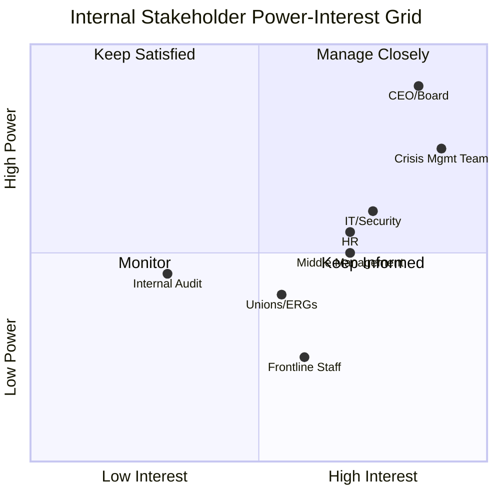
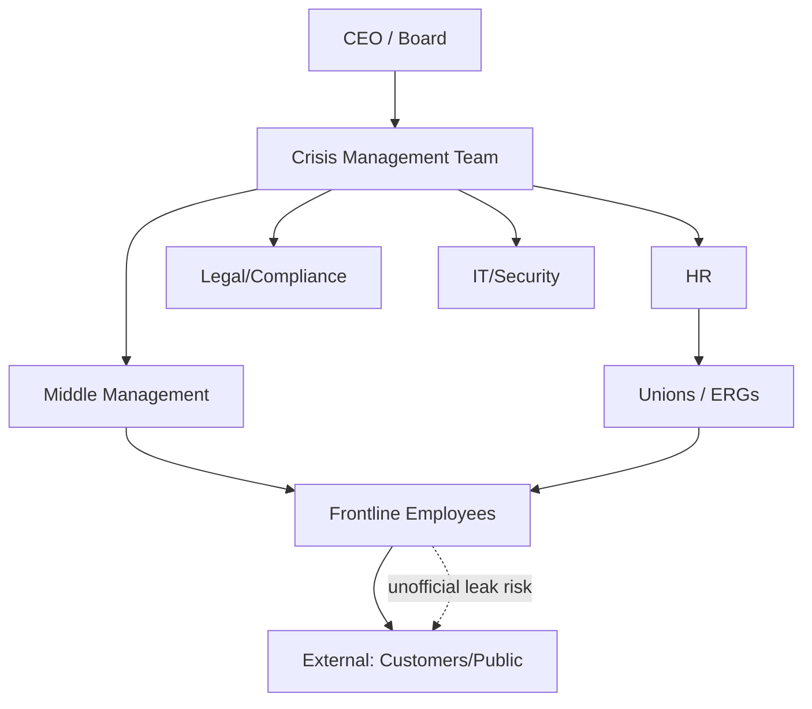

## Mapping Internal Stakeholders

### Overview

Internal stakeholder mapping is the systematic identification and classification of individuals and groups *within* an organization who affect, or are affected by, a crisis and its communication response. Unlike external stakeholder analysis (customers, media, regulators), internal mapping focuses on employees, leadership, unions, internal committees, and internal information channels — because internal stakeholders are frequently the first to know about a crisis, the first to leak or amplify it, and the group whose trust most directly determines organizational cohesion during the event.

### Why Internal Mapping Is a Distinct Discipline

Internal stakeholders differ from external ones in three structural ways that change how they must be managed:

- **Proximity to the source**: Employees often have direct, unfiltered knowledge of what happened before any official statement is prepared, making internal leak risk a first-order concern.
- **Dual role**: Employees are simultaneously an audience for crisis communication *and* a channel through which that communication (or misinformation) spreads externally via social media, personal networks, and industry contacts.
- **Dependency for execution**: Frontline staff, customer service teams, and site managers are often the ones who must operationally execute the crisis response (e.g., a recall, a service outage fix), so their buy-in and clarity directly determines response speed.

**[Inference]** Organizations that neglect internal stakeholder mapping often experience employees learning of a crisis from external media before receiving internal communication, which measurably damages internal trust independent of how well the external response is handled.

### Core Stakeholder Categories

#### 1. Executive Leadership and Board

- CEO, C-suite, and Board of Directors
- Decision authority for major resource commitments and public statements
- Require the most concise, decision-oriented briefings (situation, options, recommendation)

#### 2. Crisis Management Team (CMT) Members

- Cross-functional representatives: Legal, Communications, HR, Operations, IT/Security, Finance
- Need real-time operational detail, not summarized briefings
- Often pre-designated in a crisis management plan with named backups

#### 3. Middle Management and Site/Department Leads

- Translate top-down messaging into team-specific guidance
- Frequently the weakest link if bypassed, since they field direct employee questions without being briefed first

#### 4. Frontline Employees and Customer-Facing Staff

- Highest exposure to external stakeholder questions (customers, press inquiries at physical locations)
- Require simple, scripted talking points rather than full situational detail
- Often the group most likely to post on personal social media, intentionally or not

#### 5. Internal Committees and Employee Groups

- Unions or employee associations, where applicable
- Employee Resource Groups (ERGs), works councils (common in EU contexts), health and safety committees
- **[Unverified]** The specific legal notification obligations to unions or works councils during a crisis vary by jurisdiction and must be confirmed with local employment counsel rather than assumed universal.

#### 6. Internal Support Functions

- IT/Security (especially for cyber incidents)
- Legal and Compliance
- HR (especially for crises involving employee harm, misconduct, or layoffs)
- Internal Audit / Risk Management

### Stakeholder Mapping Methodology

#### Step 1: Identify

Compile a comprehensive list of internal roles and groups using organizational charts, the crisis management plan's designated roles, and historical incident records to catch groups that weren't formally listed but were operationally involved in past events.

#### Step 2: Classify by Power and Interest

The classic power/interest grid, adapted for internal crisis contexts:

- **Manage Closely** (high power, high interest): CMT, executive leadership — require direct, frequent engagement
- **Keep Satisfied** (high power, lower immediate interest): Board members not on the CMT, internal audit — require periodic high-level updates
- **Keep Informed** (high interest, lower power): Frontline staff, general employee population — require clear, frequent, simplified updates
- **Monitor** (lower power, lower interest): Peripheral departments not directly involved — require minimal, as-needed communication

#### Step 3: Map Information Needs and Channels

For each stakeholder group, document:

| Stakeholder Group | Information Depth | Frequency | Primary Channel | Owner |
| --- | --- | --- | --- | --- |
| CEO/Board | Full situational + options | As-needed, real-time | Direct briefing/call | CMT Lead |
| CMT Members | Full operational detail | Continuous (war room) | Dedicated channel (e.g., Slack/Teams crisis channel) | Crisis Comms Lead |
| Middle Management | Summary + talking points | Before general staff comms | Manager briefing email/call | Internal Comms |
| Frontline Staff | Scripted key messages | Same time as external release, or just before | All-staff email/intranet/SMS | Internal Comms |
| Unions/ERGs | Relevant subset per legal obligation | As required/negotiated | Formal letter/meeting | HR/Legal |

#### Step 4: Identify Interdependencies and Influence Paths

Map how information and influence actually flow between groups, not just the formal hierarchy — this exposes chokepoints where a single unbriefed manager could delay an entire department's response, or informal but high-trust employees whose word carries more weight internally than an official memo.

*Note: the dotted line represents the informal/unofficial leak pathway that formal org charts omit but crisis planning must account for.*

#### Step 5: Assign Ownership and Update Cadence

Each stakeholder group in the map should have a named internal communication owner responsible for that group during a live crisis, and the map itself should be reviewed and refreshed on a regular cycle (commonly annually, or after any major reorganization) since role turnover silently breaks a stakeholder map over time.

### Practical Example: Data Breach Scenario

For a cybersecurity incident, an internal stakeholder map might prioritize:

1. **IT/Security** — first responders, need continuous technical updates
2. **Legal/Compliance** — must assess breach notification obligations in parallel
3. **CMT/Executive** — need decision points on public disclosure timing
4. **HR** — needed if employee personal data is affected
5. **Customer-facing staff** — need a holding script *before* the news becomes public, since they will field questions the moment it leaks

**[Inference]** In practice, the sequencing above (IT/Legal informing Executive before frontline staff are briefed) is a common pattern that balances information accuracy against notification speed, but the acceptable lag before frontline staff must be informed should be a pre-defined threshold in the crisis plan rather than decided ad hoc during the event.

### Common Pitfalls

- **Treating the org chart as the stakeholder map**: Formal hierarchy often misses informal influencers (a long-tenured employee, a highly active internal forum moderator) who shape internal sentiment more than their title suggests
- **One-size-fits-all messaging**: Sending the same detailed technical brief to frontline staff as to the CMT causes either information overload or confusion about what's shareable externally
- **Static maps**: Failing to update the map after reorganizations, leadership changes, or unionization events
- **Ignoring remote/distributed staff**: Mapping channels that assume physical office presence (town halls, posted notices) without equivalent digital-first channels for remote employees

### SVG: Internal Stakeholder Concentric Influence Map (svg_diagram)

<svg xmlns="http://www.w3.org/2000/svg" viewBox="0 0 600 600" font-family="Arial, sans-serif">
<circle cx="300" cy="300" r="280" fill="#f5f7fa" stroke="#cbd5e1" stroke-width="1" />
<circle cx="300" cy="300" r="210" fill="#e7edf5" stroke="#cbd5e1" stroke-width="1" />
<circle cx="300" cy="300" r="140" fill="#d3dfee" stroke="#cbd5e1" stroke-width="1" />
<circle cx="300" cy="300" r="70" fill="#a8c1e0" stroke="#8fa9c9" stroke-width="1" />

<text x="300" y="30" text-anchor="middle" font-size="16" font-weight="bold" fill="`#1e293b`">Internal Stakeholder Influence Map (svg_diagram)</text>

<text x="300" y="305" text-anchor="middle" font-size="13" font-weight="bold" fill="`#1e293b`">CMT / Exec</text>

<text x="300" y="210" text-anchor="middle" font-size="12" fill="`#1e293b`">Middle Management</text>

<text x="300" y="225" text-anchor="middle" font-size="12" fill="`#1e293b`">Legal / HR / IT</text>

<text x="300" y="140" text-anchor="middle" font-size="12" fill="`#1e293b`">Site Leads / Supervisors</text>

<text x="300" y="155" text-anchor="middle" font-size="12" fill="`#1e293b`">Unions / ERGs</text>

<text x="300" y="65" text-anchor="middle" font-size="12" fill="`#1e293b`">Frontline / General Employees</text>

<line x1="300" y1="300" x2="300" y2="20" stroke="#94a3b8" stroke-width="1" stroke-dasharray="4,3" />
<text x="310" y="100" font-size="10" fill="#64748b">Information flow: inward-out</text>
</svg>

**Next Steps**

- Stakeholder Communication Channel Selection and Redundancy Planning
- Crisis Management Team Roles, Responsibilities, and Backup Designation
- Internal Messaging Sequencing (Who Hears What, and When)
- Employee Social Media Guidelines During a Crisis
- Union and Works Council Notification Obligations by Jurisdiction
- External Stakeholder Mapping and Segmentation