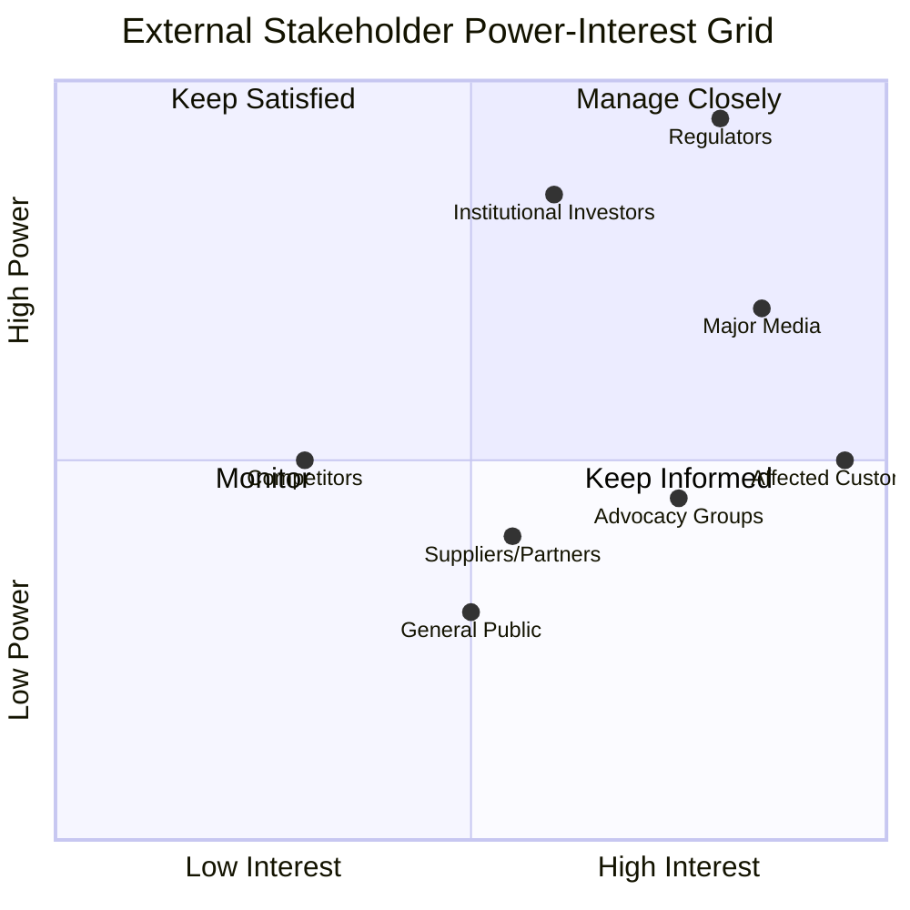
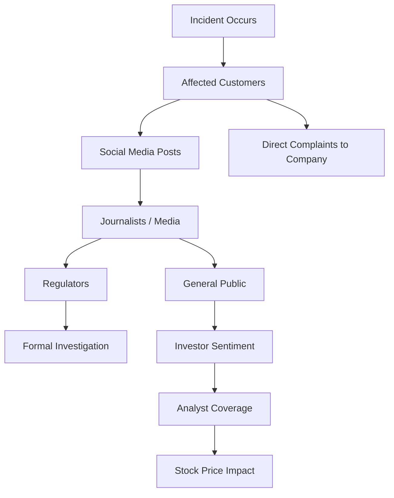

## Mapping External Stakeholders

### Overview

External stakeholder mapping is the systematic identification, classification, and prioritization of individuals and groups *outside* the organization who can affect, or are affected by, a crisis. This includes customers, media, regulators, investors, suppliers, communities, and advocacy groups. Because external stakeholders control reputation-shaping channels the organization does not own — press coverage, social media discourse, regulatory rulings, market reaction — mapping them accurately determines whether crisis communication reaches the right audiences with the right message before narratives solidify without the organization's input.

### Why External Mapping Differs from Internal Mapping

- **No direct control over the channel**: The organization can brief its own employees directly, but cannot compel a journalist, regulator, or influencer to carry a specific message accurately.
- **Competing narratives**: External stakeholders often have their own incentives (a journalist's story angle, a competitor's opportunism, an activist group's cause) that shape how they frame the crisis independent of the organization's preferred narrative.
- **Legal and regulatory weight**: Certain external stakeholders (regulators, courts) have binding authority over the organization, meaning communication with them is not purely reputational but carries legal consequence.

**[Inference]** Crises that are poorly externally mapped often see the media or regulators dictating the narrative timeline (e.g., forcing a response to a leaked detail) rather than the organization controlling its own disclosure sequence.

### Core External Stakeholder Categories

#### 1. Customers and Consumers

- Directly affected users (product recalls, service outages, data breaches)
- Indirectly affected general customer base whose trust may erode via association
- Segmentation matters: B2B customers often need account-manager-level direct outreach, while B2C customers are typically reached via mass channels

#### 2. Media

- **Traditional media**: Wire services, national and trade press, broadcast
- **Digital/social media**: Journalists active on social platforms, citizen journalists, viral content accounts
- **Trade/industry press**: Often more technically detailed and influential with B2B or regulatory audiences than general media

#### 3. Regulators and Government Bodies

- Sector-specific regulators (e.g., data protection authorities, financial regulators, health authorities)
- Local government units, especially relevant for organizations operating under LGU jurisdiction with specific reporting or permit obligations
- Law enforcement, where the crisis involves potential criminal conduct

#### 4. Investors and Financial Stakeholders

- Shareholders, institutional investors, credit rating agencies
- Analysts who publish coverage affecting stock price or market perception
- Particularly critical for publicly listed organizations where crisis disclosure intersects with securities law obligations

#### 5. Suppliers, Partners, and Distributors

- Supply chain partners who may be operationally or reputationally exposed by association
- Distribution/retail partners who need talking points to field their own customer questions

#### 6. Community and Advocacy Groups

- Local communities near affected facilities
- NGOs, advocacy organizations, and special interest groups relevant to the crisis type (environmental groups for pollution incidents, consumer rights groups for product safety, digital rights groups for data breaches)

#### 7. Competitors

- Not a communication target, but a stakeholder to *monitor* — competitors may amplify the crisis, capitalize commercially, or in some cases show solidarity depending on industry norms

### Stakeholder Mapping Methodology

#### Step 1: Identify

Build a comprehensive inventory using: existing CRM/customer segmentation data, media contact databases, the regulatory landscape applicable to the organization's sector and jurisdiction, and historical crisis records showing which external parties engaged in past incidents.

#### Step 2: Classify by Power and Interest

- **Manage Closely** (high power, high interest): Regulators, major media outlets — require proactive, prioritized, often legally reviewed communication
- **Keep Satisfied** (high power, lower immediate interest): Institutional investors, credit agencies — require periodic formal updates (e.g., investor statements)
- **Keep Informed** (high interest, lower power): Directly affected customers — require clear, empathetic, frequent updates via direct channels
- **Monitor** (lower power, lower interest): General public, competitors — require broad, less resource-intensive channels (press releases, social monitoring)

#### Step 3: Map Influence and Amplification Pathways

External stakeholders don't act in isolation — a single tweet from an affected customer can reach a journalist, who reaches the general public, who pressures a regulator. Mapping these pathways identifies where early intervention has outsized effect.

#### Step 4: Define Channel and Message Fit per Stakeholder

| Stakeholder Group | Message Focus | Channel | Timing Relative to Public Disclosure | Owner |
| --- | --- | --- | --- | --- |
| Regulators | Compliance facts, remediation plan | Formal written notification/filing | Often before or simultaneous (legally mandated) | Legal/Compliance |
| Major Media | Key facts, official statement, spokesperson access | Press release, briefing call | At/near public disclosure | Media Relations |
| Affected Customers | Impact, remedy, support channel | Direct email/SMS, dedicated hotline/page | Before or simultaneous with media | Customer Comms |
| Investors | Financial materiality, business continuity | Investor statement, earnings call if needed | Per securities disclosure obligations | IR/Legal |
| Community/Advocacy | Safety, accountability, corrective action | Community meetings, direct outreach | Context-dependent, often early | Community Relations |
| General Public | Simplified summary, reassurance | Social media, website statement, press | At public disclosure | Corporate Comms |

#### Step 5: Prioritize and Sequence

Because organizations cannot communicate with every external group simultaneously with full fidelity, sequencing decisions should be pre-defined in the crisis plan: for example, regulators and directly affected customers often need to be informed before or alongside the broader public disclosure, both for legal compliance and to avoid stakeholders feeling blindsided by their own case appearing in mass media first.

### Practical Example: Product Safety Recall

For a consumer product safety recall, external stakeholder mapping might prioritize:

1. **Regulators** (e.g., product safety authorities) — often legally required to be notified before or simultaneous with public announcement
2. **Directly affected customers** — need direct notification with clear remedy instructions (return, refund, repair)
3. **Retail/distribution partners** — need advance notice and talking points before the public announcement to avoid being blindsided at point of sale
4. **Media** — receive an official statement addressing scope, cause, and remedy
5. **Advocacy/consumer groups** — often monitor recall response quality and can amplify either satisfaction or criticism

**[Inference]** Retail partners are frequently under-prioritized in recall communications despite facing direct customer questions at point of sale; treating them as a near-Tier-1 stakeholder typically reduces frontline confusion.

### Common Pitfalls

- **Media-only focus**: Treating "external stakeholders" as synonymous with "the press" and neglecting regulators, investors, or community groups who have distinct and sometimes legally binding communication requirements
- **Uniform messaging across all groups**: Sending the same press release to regulators, customers, and investors ignores that each has different informational needs and different legal weight attached to the same facts
- **Static contact lists**: Media contacts, regulatory liaisons, and community leaders change; an unmaintained external stakeholder database causes outreach to go to outdated or incorrect contacts during time-critical moments
- **Ignoring second-order stakeholders**: Focusing only on directly affected parties while missing groups who become engaged through amplification (e.g., advocacy groups who adopt a customer's case as a cause célèbre)
- **Underestimating local/regional stakeholders**: For organizations under local government unit jurisdiction, local regulators and community leaders can have outsized influence on the crisis trajectory despite lower formal "power" compared to national bodies

### SVG: External Stakeholder Amplification Funnel (svg_diagram)

<svg xmlns="http://www.w3.org/2000/svg" viewBox="0 0 600 500" font-family="Arial, sans-serif">
<text x="300" y="30" text-anchor="middle" font-size="16" font-weight="bold" fill="#1e293b">External Stakeholder Amplification Funnel (svg_diagram)</text>
<rect x="220" y="60" width="160" height="50" rx="6" fill="#a8c1e0" stroke="#7ea1c9" />
<text x="300" y="90" text-anchor="middle" font-size="12" fill="#1e293b">Affected Customer</text>
<rect x="180" y="150" width="240" height="50" rx="6" fill="#c3d5e8" stroke="#9db8d4" />
<text x="300" y="180" text-anchor="middle" font-size="12" fill="#1e293b">Social Media / Direct Complaint</text>
<rect x="140" y="240" width="320" height="50" rx="6" fill="#dde8f3" stroke="#b7cbe0" />
<text x="300" y="270" text-anchor="middle" font-size="12" fill="#1e293b">Media / Journalists Pick Up Story</text>
<rect x="80" y="330" width="200" height="50" rx="6" fill="#eef3f9" stroke="#c9d8e8" />
<text x="180" y="360" text-anchor="middle" font-size="12" fill="#1e293b">General Public Sentiment</text>
<rect x="320" y="330" width="200" height="50" rx="6" fill="#eef3f9" stroke="#c9d8e8" />
<text x="420" y="360" text-anchor="middle" font-size="12" fill="#1e293b">Regulatory Attention</text>
<rect x="200" y="420" width="200" height="50" rx="6" fill="#f5f8fb" stroke="#d9e3ee" />
<text x="300" y="450" text-anchor="middle" font-size="12" fill="#1e293b">Investor/Market Reaction</text>
<line x1="300" y1="110" x2="300" y2="150" stroke="#64748b" stroke-width="1.5" marker-end="url(#arrow)" />
<line x1="300" y1="200" x2="300" y2="240" stroke="#64748b" stroke-width="1.5" marker-end="url(#arrow)" />
<line x1="250" y1="290" x2="180" y2="330" stroke="#64748b" stroke-width="1.5" marker-end="url(#arrow)" />
<line x1="350" y1="290" x2="420" y2="330" stroke="#64748b" stroke-width="1.5" marker-end="url(#arrow)" />
<line x1="220" y1="380" x2="280" y2="420" stroke="#64748b" stroke-width="1.5" marker-end="url(#arrow)" />
<line x1="380" y1="380" x2="320" y2="420" stroke="#64748b" stroke-width="1.5" marker-end="url(#arrow)" />
</svg>

**Next Steps**

- Media Relations and Journalist Engagement Protocols During a Crisis
- Regulatory Notification Requirements and Timelines by Sector
- Investor Relations Communication in Crisis Scenarios
- Community and Advocacy Group Engagement Strategies
- Social Media Monitoring for Early External Stakeholder Signal Detection
- Aligning Internal and External Messaging Sequencing