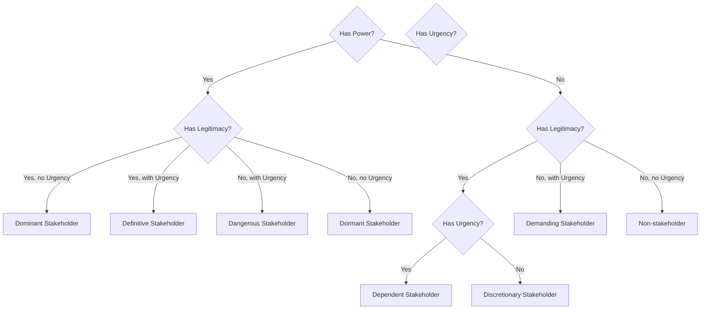

## Stakeholder Salience: Power, Legitimacy, Urgency

### Overview

The Stakeholder Salience Model, introduced by Mitchell, Agle, and Wood (1997), provides a more granular alternative to the simple power/interest grid by classifying stakeholders along three independent attributes: **power**, **legitimacy**, and **urgency**. Salience is defined as the degree of priority managers give to competing stakeholder claims, and it is determined not by any single attribute but by the *combination* of attributes a stakeholder possesses at a given moment. This model is particularly valuable in crisis contexts because stakeholder salience is dynamic — a group with low salience in normal operations can rapidly acquire urgency (and therefore salience) the moment a crisis breaks, even if their power and legitimacy haven't changed.

### The Three Core Attributes

#### Power

The ability of a stakeholder to impose their will on the organization, or to influence outcomes regardless of the organization's preference.

- **Coercive power**: Based on force, threat, or ability to restrict resources (e.g., a regulator's authority to fine or shut down operations)
- **Utilitarian power**: Based on control of material or financial resources (e.g., a major investor, a key supplier)
- **Normative power**: Based on symbolic or social influence (e.g., a respected industry commentator, a viral social media account)

**[Inference]** Power is not fixed; a stakeholder with normally low power (e.g., an individual customer) can acquire significant temporary power during a crisis if their grievance goes viral and draws media or regulatory attention.

#### Legitimacy

A generalized perception that the stakeholder's claims are desirable, proper, or appropriate within some socially constructed system of norms, values, or beliefs.

- Legitimacy can attach to the stakeholder itself (e.g., a government regulator has inherent institutional legitimacy) or to their specific claim (e.g., an anonymous online critic may lack institutional legitimacy but their specific factual claim about a product defect may be legitimate if verifiable)
- Legitimacy is a socially constructed judgment, not an objective fact, and can shift as facts emerge (an initially dismissed complaint can gain legitimacy once corroborated)

#### Urgency

The degree to which a stakeholder's claim calls for immediate attention, driven by two sub-components:

- **Time sensitivity**: The delay in addressing the claim is unacceptable to the stakeholder
- **Criticality**: The importance of the claim or relationship to the stakeholder

**[Inference]** Urgency is the attribute most likely to spike suddenly during a crisis — a stakeholder who was previously low-urgency (a dormant advocacy group, a rarely-vocal customer segment) can become high-urgency within hours of an incident becoming public.

### The Seven Stakeholder Types

The three attributes combine to produce seven possible stakeholder types (a stakeholder with none of the three attributes is not considered a stakeholder at all):

| Type | Attributes Present | Salience | Crisis Communication Implication |
| --- | --- | --- | --- |
| **Dormant** | Power only | Low | Monitor; capable of acquiring urgency quickly (e.g., a major investor who hasn't yet engaged) |
| **Discretionary** | Legitimacy only | Low | No pressure to engage urgently, but goodwill-building is valuable (e.g., a charity partner) |
| **Demanding** | Urgency only | Low | Vocal but lacks power/legitimacy to compel response (e.g., an isolated complainant); often the noisiest but not necessarily the most consequential |
| **Dominant** | Power + Legitimacy | Moderate-High | Expect ongoing engagement even without an active crisis (e.g., major regulators, key institutional investors) |
| **Dangerous** | Power + Urgency (no legitimacy) | Moderate-High, but adversarial | Potentially coercive and impatient without a socially sanctioned claim (e.g., an activist group using aggressive tactics, or in extreme cases, actors using threats) |
| **Dependent** | Legitimacy + Urgency (no power) | Moderate-High | Legitimate, time-sensitive claim but relies on others (media, regulators) to be heard — directly affected customers often start here and escalate to Definitive if power is acquired via media amplification |
| **Definitive** | Power + Legitimacy + Urgency | Highest | Demands immediate, priority attention — this is where a crisis often "arrives" as a previously Dependent or Dormant stakeholder acquires the missing attribute |

### Why This Model Matters in Crisis Contexts

Crises are, structurally, salience-shifting events. The model's core insight for crisis managers is that **stakeholder salience is not static** — a single triggering event can move a stakeholder from one category to Definitive almost instantly:

- A **Dependent** stakeholder (an affected customer with a legitimate, urgent claim but no power) becomes **Definitive** the moment a journalist picks up their story (acquiring power via media amplification)
- A **Dormant** stakeholder (a regulator who has power but no active urgency or engaged legitimacy claim) becomes **Definitive** the moment they open a formal investigation
- A **Demanding** stakeholder (a lone vocal critic) becomes **Dangerous** or **Definitive** if their claim goes viral and acquires perceived legitimacy through volume or corroboration

**[Inference]** Crisis communication plans that map stakeholders only in their pre-crisis salience category (e.g., dismissing a "Demanding" stakeholder as low-priority) risk being caught unprepared when that stakeholder rapidly transitions to Definitive status via external amplification.

### Applying the Model: A Practical Workflow

#### Step 1: Score Each Known Stakeholder

For every stakeholder identified in internal/external mapping, assign a rating (e.g., High/Medium/Low or a 1–5 scale) for each of the three attributes independently.

| Stakeholder | Power | Legitimacy | Urgency | Type | Priority |
| --- | --- | --- | --- | --- | --- |
| Regulator | High | High | Low (pre-incident) | Dominant | Monitor closely; ready to escalate |
| Affected customer (isolated) | Low | High | High | Dependent | Address proactively before amplification |
| Major investor | High | High | Low | Dominant | Periodic updates |
| Anonymous online critic | Low | Uncertain | High | Demanding | Verify claim; monitor for legitimacy shift |
| Journalist covering the story | Medium-High | High | High | Definitive (once engaged) | Priority engagement |
| Activist group (aggressive tactics) | Medium | Contested | High | Dangerous | Careful, legally-reviewed engagement |

#### Step 2: Monitor for Attribute Acquisition

Because urgency and power are the attributes most likely to shift rapidly during a live crisis, the highest-value monitoring activity is tracking signals that a stakeholder is *acquiring* a missing attribute — for example, watching for media pickup (which grants power to an otherwise powerless but legitimate/urgent claimant) or for a regulator's public statement (which converts latent power into active urgency).

#### Step 3: Reassess Continuously, Not Once

Unlike the internal/external stakeholder maps (which can be refreshed periodically), salience scoring during an active crisis should be reassessed at defined checkpoints (e.g., every few hours in a fast-moving crisis) because the model's entire value lies in capturing attribute shifts in real time.

### Relationship to Other Stakeholder Frameworks

- **Power/Interest Grid**: Simpler, two-dimensional, and more static — useful for pre-crisis planning and resource allocation, but less sensitive to the rapid attribute shifts a live crisis produces
- **Salience Model**: Three-dimensional and explicitly dynamic — better suited to triaging attention *during* an active crisis when priorities can change hour to hour
- **[Inference]** In practice, many crisis communication teams use the power/interest grid for pre-crisis planning (who gets which channel, what cadence) and layer the salience model on top during live incidents to re-triage priority as the situation evolves.

### Common Pitfalls

- **Treating salience as fixed**: Scoring stakeholders once during planning and never revisiting during the live crisis, missing the moment a Dependent or Demanding stakeholder becomes Definitive
- **Conflating legitimacy with correctness**: A stakeholder's claim can be perceived as legitimate (worth taking seriously) even if it later turns out to be factually incorrect, and vice versa — legitimacy is a perception judgment, not a truth judgment, and premature dismissal of a claim as "illegitimate" before verification can backfire reputationally
- **Underestimating Dangerous stakeholders**: Dismissing stakeholders with urgency and power but contested legitimacy (e.g., aggressive activist groups) purely because their legitimacy is disputed, when their power and urgency alone still demand a careful, often legally-coordinated response
- **Ignoring Dormant power holders**: Failing to monitor stakeholders who currently lack urgency but hold significant latent power (e.g., a regulator who hasn't yet acted) until they suddenly activate

### SVG: Salience Model Venn Diagram (svg_diagram)

<svg xmlns="http://www.w3.org/2000/svg" viewBox="0 0 500 450" font-family="Arial, sans-serif">
<text x="250" y="25" text-anchor="middle" font-size="15" font-weight="bold" fill="#1e293b">Stakeholder Salience Model (svg_diagram)</text>
<circle cx="190" cy="180" r="120" fill="#a8c1e0" fill-opacity="0.55" stroke="#7ea1c9" />
<circle cx="310" cy="180" r="120" fill="#e0a8c1" fill-opacity="0.55" stroke="#c97ea1" />
<circle cx="250" cy="290" r="120" fill="#c1e0a8" fill-opacity="0.55" stroke="#a1c97e" />

<text x="140" y="130" font-size="13" font-weight="bold" fill="`#1e293b`">Power</text>

<text x="330" y="130" font-size="13" font-weight="bold" fill="`#1e293b`">Legitimacy</text>

<text x="235" y="380" font-size="13" font-weight="bold" fill="`#1e293b`">Urgency</text>

<text x="150" y="170" font-size="11" fill="`#1e293b`">Dormant</text>

<text x="330" y="170" font-size="11" fill="`#1e293b`">Discretionary</text>

<text x="240" y="340" font-size="11" fill="`#1e293b`">Demanding</text>

<text x="250" y="150" font-size="11" fill="`#1e293b`">Dominant</text>

<text x="180" y="260" font-size="11" fill="`#1e293b`">Dangerous</text>

<text x="310" y="260" font-size="11" fill="`#1e293b`">Dependent</text>

<text x="245" y="220" font-size="12" font-weight="bold" fill="`#1e293b`">Definitive</text>

</svg>

**Next Steps**

- Stakeholder Prioritization Matrices in Practice (Power/Interest vs. Salience)
- Monitoring Signals of Attribute Acquisition (Power, Legitimacy, Urgency Shifts)
- Case Studies: Dependent-to-Definitive Stakeholder Transitions
- Handling Dangerous Stakeholders: Legal and Communication Coordination
- Legitimacy Assessment and Claim Verification Protocols
- Integrating Salience Scoring into Crisis War Room Decision-Making