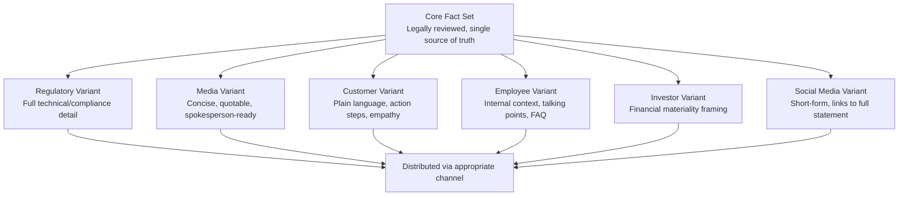

## Segmenting and Tailoring Crisis Messages

<syllabot_broad_topic/>

### Overview

Segmenting and tailoring crisis messages is the practice of adapting a single core crisis narrative into audience-specific variants — differing in depth, tone, channel, and emphasis — so that each stakeholder segment receives information that is accurate, relevant, and actionable for their specific relationship to the crisis. This discipline sits downstream of stakeholder mapping and salience scoring: once stakeholders are identified and prioritized, segmentation answers the operational question of *what exactly gets said to whom, and how*.

### Why a Single Message Fails Across Segments

A single, undifferentiated crisis statement sent to every stakeholder tends to fail in at least one of three ways:

- **Under-informs high-need segments**: Directly affected customers or regulators need specific remedy or compliance detail that a general press release omits
- **Over-informs low-need segments**: General public audiences don't need technical root-cause detail and may become confused or alarmed by information not relevant to their exposure
- **Mismatches tone to relationship**: A legally precise, hedged statement appropriate for regulators can read as cold and evasive to affected customers, while an empathetic, plain-language statement appropriate for customers can appear legally imprecise to regulators or investors

**[Inference]** Organizations that rely on a single "master statement" distributed unchanged to all audiences often see it picked apart in each context for what it fails to address, whereas segment-appropriate variants each answer the questions their specific audience is most likely to ask.

### Core Segmentation Dimensions

#### 1. By Relationship to the Crisis

- **Directly affected**: Those who experienced direct harm or impact (injured parties, customers with a defective product, employees at an affected site)
- **Indirectly affected**: Those whose experience is impacted secondarily (customers in the same product line but not affected units, employees at unaffected sites)
- **Observers**: General public, media, industry watchers with no direct stake but forming opinions that shape broader reputation

#### 2. By Informational Need

- **Operational/technical**: What happened, root cause, remediation steps (internal teams, regulators, technical press)
- **Practical/actionable**: What should I do now (affected customers — return a product, change a password, seek medical attention)
- **Reassurance/context**: Is this still safe, should I be concerned (general customer base, general public)
- **Compliance/legal**: What are the facts relevant to obligations and liability (regulators, legal counsel, insurers)

#### 3. By Power/Legitimacy/Urgency Position

Drawing directly from the salience model, message depth and priority should scale with a stakeholder's current salience classification — a Definitive stakeholder needs immediate, detailed, priority communication, while a Dormant stakeholder may only need periodic, high-level updates until their salience shifts.

#### 4. By Channel Constraints

- **Written/formal** (regulatory filings, investor statements): Precise, legally reviewed, complete
- **Broadcast/press** (media statements): Concise, quotable, consistent with legal position
- **Direct/personal** (customer emails, call center scripts): Empathetic, plain language, action-oriented
- **Social/real-time** (social media posts): Extremely concise, consistent with all other channels, monitored for immediate follow-up questions

### The Message Architecture Model

A practical approach is to build crisis messaging as a layered architecture rather than independent documents per audience, which ensures consistency of facts while allowing variation in depth and tone.

**Key Points**

- The **Core Fact Set** must remain constant across all variants — segmentation changes framing, depth, and tone, never the underlying facts
- Any factual inconsistency between variants (even unintentional) is a common source of secondary reputational damage when stakeholders compare notes across channels

### Tailoring Framework: The Four Levers

For each segment, four levers can be adjusted independently:

| Lever | Range | Example Adjustment |
| --- | --- | --- |
| **Depth** | Headline-only → Full technical detail | Regulators get root-cause analysis; general public gets a one-paragraph summary |
| **Tone** | Formal/legal → Empathetic/personal | Investor statement stays factual and measured; customer email leads with acknowledgment of impact |
| **Call to Action** | None → Specific required action | Affected customers get explicit steps (e.g., "stop using product X, visit [link] for a refund"); general public gets no action requested |
| **Timing** | Simultaneous → Sequenced | Regulators and directly affected parties often need notification before or alongside public release; general public follows |

### Practical Example: Data Breach Across Segments

For a single data breach incident, the core fact set (what data was affected, how many records, when detected, remediation steps) remains fixed, but message variants differ substantially:

**Regulatory notification** (formal, complete):

> States exact number of records affected, categories of data exposed, detection and containment timeline, and remediation measures, in the format and within the timeframe required by applicable data protection law.

**Affected customer email** (direct, actionable):

> Leads with acknowledgment and apology, states specifically what of *their* data was involved, provides concrete steps (password reset, credit monitoring enrollment), and gives a support contact.

**Media statement** (concise, quotable):

> A short, spokesperson-attributed statement confirming the incident, scope, and immediate response actions, without granular technical detail that could aid further exploitation or preempt the investigation.

**Employee FAQ** (internal, contextual):

> Provides talking points for employees fielding questions from friends/family or on social media, clarifies what employees can and cannot say publicly, and gives an internal escalation contact for press inquiries they receive.

**Social media post** (short-form, directive):

> A brief acknowledgment with a link to the full statement/FAQ page, avoiding technical or legal detail that doesn't fit the format.

**[Unverified]** The specific content and timing requirements for a regulatory data breach notification vary significantly by jurisdiction (e.g., differing thresholds and timeframes across data protection regimes), and must be confirmed against the applicable law for the organization's operating jurisdiction rather than assumed from a generic template.

### Language and Accessibility Considerations

- **Plain language for public-facing segments**: Avoid jargon, legal hedging, or passive voice that obscures accountability in customer- and public-facing variants
- **Localization**: For multi-region or multilingual stakeholder bases, tailored messages must be translated and culturally adapted, not merely machine-translated, since tone and idiom affect perceived sincerity
- **Accessibility**: Public statements should meet accessibility standards (readable formatting, alt text for any visual content, plain-language summaries alongside technical detail) so affected individuals with disabilities aren't excluded from critical safety information

### Governance: Keeping Variants Consistent

Because multiple message variants are produced from a single incident, a governance step is required to prevent drift:

1. **Single source of truth document**: All variants are drafted *from* the approved core fact set, not independently
2. **Central legal/communications review**: Every variant passes through the same review gate before release, even if the audiences and channels differ
3. **Version control and timestamping**: As facts evolve during a live crisis, all variants must be updated in sync — an outdated customer FAQ contradicting an updated regulatory statement creates a credibility gap
4. **Cross-functional sign-off log**: Track which team approved which variant and when, both for accountability and for post-crisis review

### Common Pitfalls

- **Drafting each variant independently**: Leads to factual drift between audiences, which is often discovered and publicized by stakeholders comparing statements across channels
- **Over-tailoring tone at the expense of consistency**: Excessive empathy in customer messaging paired with clinical detachment in regulatory or investor messaging can appear as two different, competing narratives if both surface publicly
- **Delaying customer/employee variants while polishing the media statement**: Media statements often receive the most drafting attention, but directly affected customers and employees frequently need clear guidance *faster*, not necessarily more polished
- **Ignoring segments with lower salience until too late**: A segment classified as low-priority in stakeholder mapping (e.g., a specific regional customer base) can become high-urgency if that specific narrative gains disproportionate media traction

**Next Steps**

- Building a Core Fact Set / Single Source of Truth Document for Crisis Response
- Spokesperson Training for Audience-Specific Message Delivery
- Multilingual and Cross-Cultural Crisis Message Adaptation
- Message Consistency Auditing Across Channels During a Live Crisis
- Legal Review Workflows for Multi-Audience Crisis Communications
- Plain Language and Accessibility Standards for Public Crisis Statements