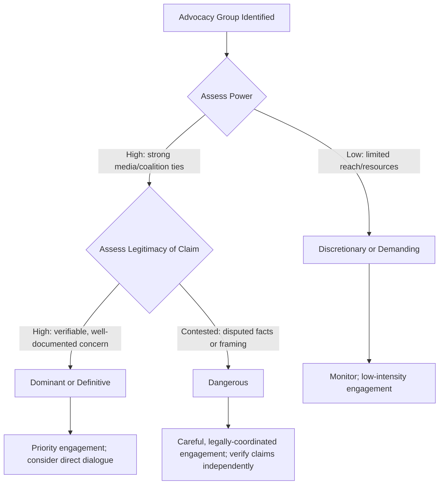

## Engaging Activists, NGOs, and Advocacy Groups

### Overview

Engaging activists, NGOs, and advocacy groups is a specialized subset of external stakeholder management dealing with organizations and individuals whose primary motivation is advancing a cause — environmental, social, consumer rights, labor, digital rights, or public health — rather than a direct commercial or regulatory relationship with the organization. These stakeholders differ fundamentally from customers, investors, or regulators because their engagement is often values-driven and public-facing by design, meaning their objective frequently includes shaping public narrative and pressuring institutional change, not merely resolving an individual grievance.

### Why This Stakeholder Category Requires Distinct Treatment

- **Mission-driven persistence**: Unlike a customer who disengages once their individual issue is resolved, an advocacy group's engagement is tied to a broader cause and may continue regardless of how a single incident is resolved
- **Media and coalition fluency**: Many advocacy organizations have substantial experience working with journalists, building coalitions, and running sustained public pressure campaigns — capabilities most other external stakeholders lack
- **Legitimacy contestation**: Using the salience model's terms, activist groups often occupy a **Dangerous** or **Dependent** stakeholder position where their legitimacy may be publicly contested (by the organization or others) even as their urgency and growing power are undeniable
- **Public accountability framing**: Engagement with advocacy groups is frequently conducted partly in public view (open letters, public statements, media coverage) rather than purely through private channels, which changes the calculus for what "resolution" looks like

**[Inference]** Organizations that treat advocacy group engagement identically to individual customer complaint resolution often find the issue persists publicly even after the specific triggering incident is addressed, because the advocacy group's underlying policy or systemic concern remains unaddressed.

### Categorizing Advocacy Stakeholders

#### By Formality and Structure

- **Established NGOs**: Formal organizational structure, professional staff, established media relationships, often with a track record of engagement across multiple organizations in a sector
- **Grassroots/ad hoc groups**: Formed in direct response to a specific incident, less institutionalized but potentially highly motivated and capable of rapid social media mobilization
- **Coalition networks**: Multiple organizations aligning around a shared cause, amplifying reach and applying coordinated pressure

#### By Engagement Posture

- **Collaborative/constructive**: Groups that prioritize dialogue and negotiated solutions, often willing to work with organizations toward mutually acceptable remediation
- **Adversarial/confrontational**: Groups that use public pressure, boycotts, or direct action as primary tactics, sometimes by strategic choice rather than a failure of dialogue
- **Watchdog/monitoring**: Groups that primarily track and publicize organizational behavior over time rather than engaging in direct dialogue

#### By Tactic

- Public statements, open letters, and petitions
- Social media campaigns and hashtag mobilization
- Direct outreach to media, investors, or regulators to apply indirect pressure
- Protests, demonstrations, or direct action at physical locations
- Shareholder activism (for publicly listed organizations, filing resolutions or engaging at annual meetings)

**[Unverified]** Which tactics a specific group is likely to use depends heavily on that organization's history, resources, and the specific cause — this should be assessed per-group using their public track record rather than assumed from category alone.

### Salience-Based Engagement Strategy

Applying the Power/Legitimacy/Urgency model specifically to advocacy stakeholders:

- **Discretionary/Demanding groups** (limited power, contested or unclear legitimacy): Monitor for escalation; avoid over-engaging in ways that grant undue amplification to a claim that lacks broad traction
- **Dominant/Definitive groups** (established power, well-documented legitimate concern): Prioritize direct, good-faith engagement; these groups often have the credibility and reach to shape mainstream narrative regardless of organizational response
- **Dangerous groups** (significant power/urgency, contested legitimacy): Requires the most careful handling — legal and communications coordination is essential, since dismissing a claim as illegitimate without verification risks reputational backfire if the claim later proves substantively correct, while over-conceding to unverified claims can create precedent or liability exposure

### Engagement Approaches

#### 1. Proactive Relationship-Building (Pre-Crisis)

**[Inference]** Organizations with pre-existing relationships with relevant NGOs and advocacy groups in their sector typically navigate crisis engagement more effectively than those making first contact during an active crisis, because baseline trust and communication channels already exist.

- Establishing ongoing dialogue with sector-relevant advocacy organizations before a crisis occurs
- Participating in multi-stakeholder forums or industry initiatives where advocacy groups are also represented
- Maintaining a mapped inventory of advocacy organizations relevant to the sector, their known positions, and any prior engagement history

#### 2. Direct Dialogue During a Crisis

- Acknowledging the group's concern promptly, even if full resolution takes time
- Distinguishing between acknowledging a concern is being taken seriously versus admitting fault before facts are established — these are not the same statement, and conflating them can create legal exposure
- Offering a genuine channel for ongoing dialogue rather than a one-time statement, particularly for groups with sustained interest in the underlying issue

#### 3. Fact Verification and Response Calibration

- Independently verifying claims made by advocacy groups before responding, since the salience model's legitimacy attribute functions as perception, but public response should still be grounded in the organization's own verified facts
- Where a claim is substantiated, acknowledging it directly rather than deflecting, since credibility loss compounds if a claim is initially dismissed and later confirmed
- Where a claim is inaccurate or exaggerated, responding with specific corrective facts rather than blanket denial, since blanket denial without detail tends to reduce perceived credibility with observing audiences

#### 4. Managing Adversarial Engagement

For groups using confrontational tactics:

- Maintain professional, measured public statements regardless of the tone of public criticism directed at the organization
- Avoid public statements that question the group's motives or legitimacy without substantive basis, since this often escalates rather than de-escalates media attention
- Coordinate closely with legal counsel when statements or actions from advocacy groups raise potential legal issues (defamation exposure runs in both directions, and organizations should be cautious about statements that could be construed as retaliatory)

### Practical Example: Environmental Incident Response

For an organization facing an environmental advocacy campaign following an operational incident:

1. **Immediate**: Acknowledge the concern publicly and confirm an investigation is underway, without conceding specific causation claims not yet verified
2. **Short-term**: Engage directly with the lead advocacy organization(s), offering a dedicated point of contact rather than routing them through general customer service channels
3. **Verification**: Conduct and, where appropriate, share findings from an independent technical assessment, since self-reported findings alone often carry lower credibility with advocacy audiences
4. **Remediation communication**: If the concern is substantiated, communicate specific, measurable remediation steps and timelines rather than general reassurances
5. **Ongoing relationship**: Where the underlying issue reflects a systemic or policy-level concern, consider longer-term engagement (e.g., participation in an industry sustainability initiative) rather than treating the incident as fully closed once the immediate crisis subsides

### Common Pitfalls

- **Dismissing grassroots groups as illegitimate due to informal structure**: A lack of institutional formality does not equate to a lack of legitimate underlying concern; the salience model's legitimacy attribute can attach to a well-documented claim even from an ad hoc or newly formed group
- **Engaging only through legal/formal channels**: Routing all advocacy group communication through legal counsel with no direct communications engagement can appear evasive and adversarial even when legally cautious
- **Treating single-incident resolution as full closure**: Advocacy groups engaged on systemic issues (e.g., environmental practices, labor conditions) often continue monitoring after an individual incident is resolved; a crisis plan that assumes engagement ends with incident closure underestimates sustained reputational exposure
- **Public counter-attacks on group credibility**: Attempting to discredit an advocacy group publicly, absent clear and well-substantiated grounds, frequently draws more media attention to the underlying claim rather than less
- **Failing to distinguish coalition dynamics**: Treating a coalition of multiple advocacy organizations as a single monolithic stakeholder when member organizations may have different priorities, tactics, and willingness to engage in dialogue

### Coordination with Legal and Communications Functions

Given the public-facing and sometimes adversarial nature of advocacy engagement, close coordination is required:

| Function | Role in Advocacy Engagement |
| --- | --- |
| Communications | Drafts and delivers public and direct statements; monitors media/social coverage of the group's campaign |
| Legal | Assesses liability exposure of any factual concessions; reviews statements for defamation risk in both directions; advises on any regulatory dimension the advocacy claim raises |
| Community/Public Affairs | Manages direct relationship and dialogue channel with the advocacy organization(s) |
| Executive Leadership | Determines strategic posture (collaborative vs. defensive) and approves any substantive commitments (policy change, remediation funding) |

**Next Steps**

- Building Pre-Crisis Relationships with Sector-Relevant NGOs
- Fact Verification Protocols for Third-Party Claims During a Crisis
- Legal Risk Assessment for Public Statements Involving Advocacy Groups
- Coalition Dynamics and Multi-Organization Advocacy Campaigns
- Shareholder Activism and Annual Meeting Engagement Strategies
- Long-Term Reputation Recovery Following Systemic Issue Campaigns