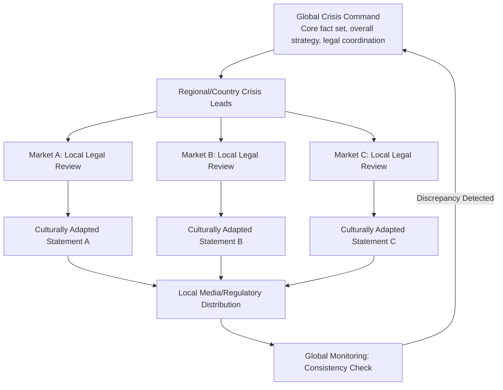

## Cross-Cultural and Multinational Stakeholder Dynamics

### Overview

Cross-cultural and multinational stakeholder dynamics addresses how crisis communication strategy must adapt when an organization's stakeholder base spans multiple countries, languages, legal systems, and cultural norms around authority, apology, and public disclosure. A crisis response strategy calibrated for one cultural or regulatory context can fail — or actively backfire — when applied unmodified in another, making this a distinct layer of analysis on top of standard stakeholder mapping and salience assessment.

### Why Cross-Border Crises Require Distinct Analysis

- **Non-uniform regulatory exposure**: The same incident can trigger different legal notification obligations, timelines, and penalties depending on jurisdiction, meaning a single global response timeline is often legally impossible to execute uniformly
- **Divergent cultural expectations around apology and accountability**: What constitutes an appropriate, sufficient apology varies significantly across cultures — some contexts expect immediate, unequivocal personal accountability from leadership, while others expect measured, legally-careful statements, and misjudging this can be read as either insincere or reckless depending on the audience
- **Media landscape fragmentation**: Different countries have different dominant media channels, levels of press freedom, and social media platform usage, meaning a monitoring and distribution strategy built around one market's media ecosystem will have blind spots elsewhere
- **Language and translation risk**: Direct translation of a crisis statement often fails to carry the same tone, legal precision, or cultural appropriateness, and poor translation can itself become a secondary story

**[Inference]** Multinational organizations that manage a cross-border crisis using a single headquarters-drafted statement, translated but not culturally adapted, often see the statement received very differently across markets — as appropriately measured in one market and as evasive or cold in another.

### Key Dimensions of Cross-Cultural Variation

#### 1. Directness and Apology Norms

- **High-context cultures**: Communication relies heavily on implicit understanding, relationship, and indirect framing; a direct, blunt admission of fault (common in some Western crisis communication training) can be perceived as clumsy or face-threatening
- **Low-context cultures**: Communication relies on explicit, direct statements; excessive hedging or indirect language can be perceived as evasive or as an attempt to avoid accountability

**[Unverified]** High-context/low-context is a widely referenced framework (originating from Edward T. Hall's work) for describing general communication tendencies, but applying it to a specific country or audience without local expert input risks stereotyping; actual stakeholder expectations should be validated with in-market communications counsel rather than inferred purely from a cultural framework.

#### 2. Authority and Hierarchy Expectations

- In some markets, stakeholders (especially media, regulators, and the public) expect the most senior possible executive (ideally the CEO) to personally address a serious crisis, and a statement from a spokesperson or lower-level executive can be read as the organization not taking the matter seriously
- In other markets, a well-prepared spokesperson or designated crisis communications lead is considered entirely appropriate, and executive over-involvement early in an unresolved situation may be viewed as premature or legally risky

#### 3. Regulatory and Legal Divergence

- Data breach notification timelines and required content differ across data protection regimes
- Product recall procedures, required regulatory filings, and consumer remedy obligations differ by consumer protection regime
- Defamation and free speech law differs significantly across jurisdictions, affecting how directly an organization can respond to public criticism or misinformation in each market

**[Unverified]** Specific legal obligations for any given jurisdiction must be confirmed with local legal counsel in that jurisdiction; general awareness of divergence should never substitute for jurisdiction-specific legal review during an actual multinational crisis.

#### 4. Media and Platform Fragmentation

- Dominant social platforms vary significantly by country/region, meaning a monitoring and response strategy built around one platform ecosystem (e.g., primarily Western platforms) can miss significant conversation occurring on regionally dominant platforms elsewhere
- State media presence and press freedom levels vary, affecting both how information spreads and how government/regulatory bodies may engage with the narrative
- Local versus international press may cover the same incident with substantially different framing, sourcing, and prominence

### Coordination Model: Global Core, Local Adaptation

A widely used structural approach separates the crisis response into a centrally-coordinated core and locally-adapted execution layers:

**Key Points**

- The **global core** owns the single source of truth for facts, overall strategic posture, and cross-market consistency monitoring
- **Regional/country leads** own translation, cultural adaptation, local legal compliance, and local media/regulatory relationships
- A **feedback loop** back to global command is essential so that local adaptations don't drift into factual inconsistency across markets

### Practical Workflow for Multinational Crisis Response

#### Step 1: Establish the Global Core Fact Set

Identical to single-market crisis response, but explicitly reviewed for terms or framing that may not translate cleanly (e.g., idioms, legal terms with no direct equivalent, culturally specific reassurance language).

#### Step 2: Map Jurisdiction-Specific Obligations

For each affected market, identify regulatory notification requirements, timelines, and any market-specific stakeholder groups (e.g., a works council structure present in some European jurisdictions but not elsewhere).

#### Step 3: Assign Local Crisis Leads

Each significant market should have a designated local lead (often the senior in-market communications or legal executive) empowered to adapt tone and sequencing within the bounds of the global core fact set, without needing to seek headquarters approval for every minor localization decision.

#### Step 4: Professional Translation and Cultural Review

- Use professional translators with subject-matter familiarity, not machine translation alone, for any public-facing crisis statement
- Have the translated/adapted statement reviewed by in-market communications or legal staff for tone appropriateness, not just linguistic accuracy
- **[Inference]** A statement that is linguistically accurate but tonally mismatched to local expectations (too apologetic, not apologetic enough, too formal, too casual) can generate its own secondary criticism independent of the underlying crisis facts.

#### Step 5: Sequence Disclosure Across Time Zones and Legal Deadlines

Where regulatory deadlines differ by market, sequencing must account for the risk that an earlier disclosure in one market becomes public and reaches stakeholders in a market where disclosure hasn't yet legally or strategically occurred — global monitoring should track this risk actively rather than assuming disclosure can be perfectly sequenced.

#### Step 6: Centralized Consistency Monitoring

A central team (often within global crisis command) should monitor all market-specific statements and media coverage for factual consistency, flagging any divergence for correction before it compounds into a "the company is telling different stories in different countries" narrative.

### Practical Example: Multinational Product Recall

For a product recall affecting multiple countries:

1. **Global core**: Product defect description, affected batch/serial identification, remedy offered (repair, replace, refund) — held constant everywhere
2. **Market-specific regulatory filings**: Each affected country's consumer product safety authority receives filings in the required format and timeline for that jurisdiction
3. **Culturally adapted customer communication**: The tone of the customer-facing apology and explanation is adapted per market's communication norms, while the substantive remedy offered remains consistent (to avoid the appearance of shortchanging customers in some markets)
4. **Local spokesperson designation**: In markets where local executive visibility is expected, a senior in-market leader is designated to speak publicly, coordinated with (but not necessarily identical to) global messaging
5. **Consistency monitoring**: Central team tracks all market statements to ensure the remedy offered and root-cause explanation remain factually aligned, even as tone and format vary

### Common Pitfalls

- **One statement, machine-translated**: Directly translating a headquarters statement without cultural or legal adaptation, risking both tonal mismatch and legal non-compliance
- **Inconsistent remedy across markets**: Offering a more generous remedy (refund amount, compensation) in one market than another for the same underlying issue, which — once discovered by stakeholders comparing notes across borders via social media — creates a fairness-based secondary crisis
- **Headquarters-only spokesperson in markets expecting local presence**: Relying solely on a global spokesperson in markets where stakeholders expect visible local executive accountability
- **Ignoring platform fragmentation in monitoring**: Building social listening exclusively around globally dominant platforms while missing significant conversation on regionally dominant platforms
- **Sequencing disclosure without accounting for cross-border leakage**: Assuming a staggered disclosure timeline (market by market) will hold, when in practice global media and social platforms often make market-specific sequencing difficult to sustain
- **Underestimating local regulatory authority significance**: Treating all non-headquarters regulators as lower priority than the home-market regulator, when local regulatory action can independently drive significant reputational and legal consequences

### Coordination Roles Summary

| Role | Responsibility |
| --- | --- |
| Global Crisis Command | Core fact set, overall strategy, cross-market consistency monitoring |
| Local Crisis Lead (per market) | Cultural adaptation, local regulatory compliance, local media/stakeholder relationships |
| Legal (Global + Local) | Jurisdiction-specific legal review, coordination on disclosure timing conflicts |
| Translation/Localization Team | Professional translation and cultural tone review, not machine translation alone |
| Central Monitoring Team | Tracks all market-specific coverage and statements for factual consistency |

**Next Steps**

- Jurisdiction-Specific Regulatory Notification Requirements Mapping
- Professional Translation and Localization Workflows for Crisis Statements
- Global Social Media Monitoring Across Fragmented Platform Ecosystems
- Executive Visibility Norms by Market: When Local Leadership Must Speak
- Cross-Border Disclosure Sequencing and Leakage Risk Management
- Building a Global Crisis Command Structure with Local Crisis Leads