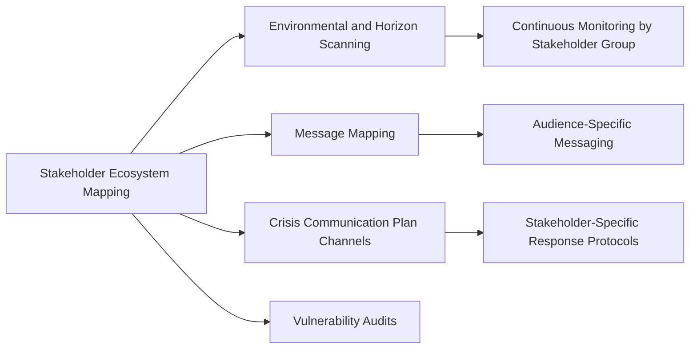
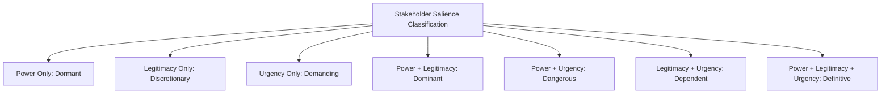
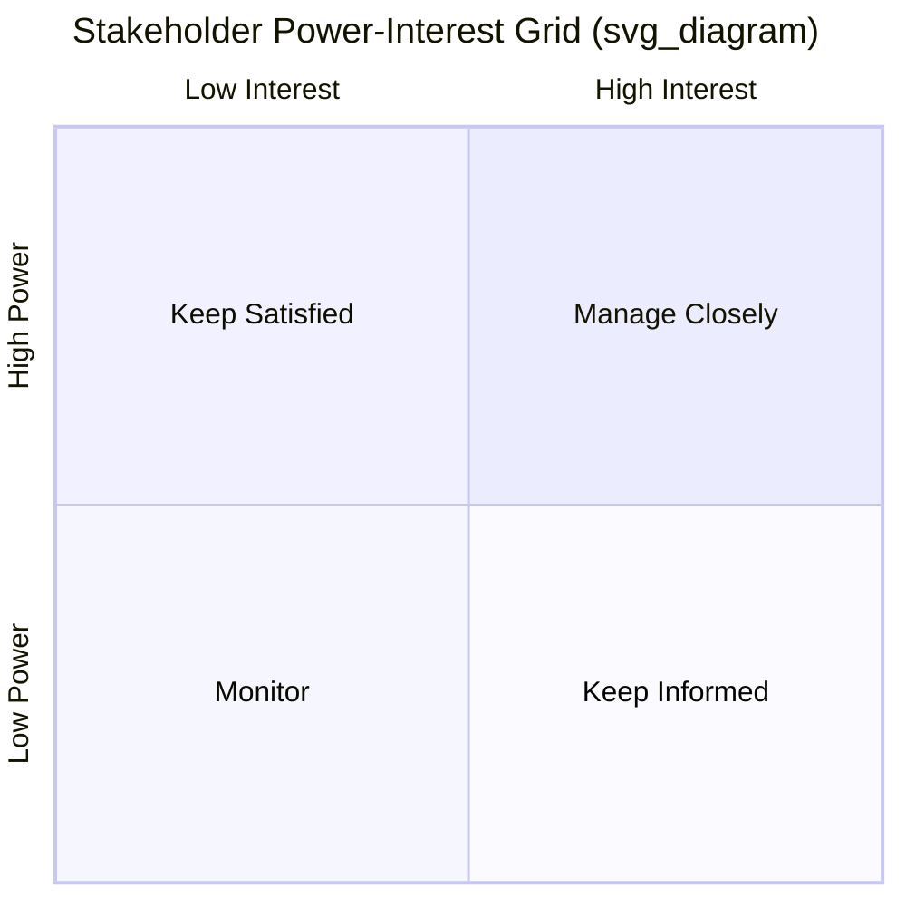
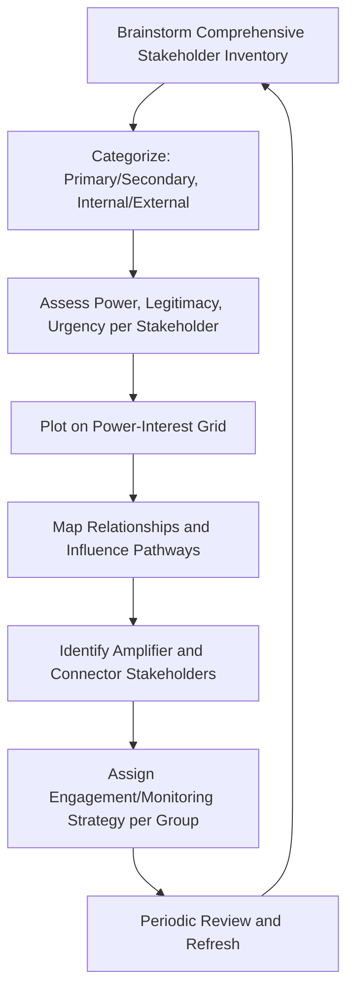

## Stakeholder Ecosystem and Network Mapping

### Definition and Scope

Stakeholder ecosystem and network mapping is the structured process of identifying all individuals, groups, and organizations that affect or are affected by an organization, and visualizing the relationships, influence pathways, and interdependencies among them. Where the crisis preparedness chapter addressed *how* an organization responds once activated, stakeholder and audience analysis addresses a foundational prerequisite question that underlies effective response: *who* the organization must communicate with, understand, and monitor — and how those parties relate to and influence one another.

This mapping exercise is not a one-time crisis-specific activity but an ongoing organizational capability that feeds directly into horizon scanning (which stakeholders to monitor), message mapping (who each message map audience represents), and crisis communication planning (the stakeholder channel matrix referenced in those materials).

### Position in the Overall Risk and Reputation Framework

### Core Distinction: Stakeholder Identification vs. Network Mapping

| Dimension | Stakeholder Identification | Network Mapping |
| --- | --- | --- |
| Focus | Who are the relevant parties | How parties relate and influence each other |
| Output | A list or categorized inventory | A visual/relational map of connections |
| Primary question | "Who matters to us?" | "How does information and influence flow between them?" |
| Analytical technique | Categorization, salience scoring | Network/graph analysis, influence pathway tracing |

[Inference] Stakeholder identification alone, without network mapping, can miss critical risk dynamics — an individually low-salience stakeholder group may still pose significant reputational risk if it holds strong influence over a higher-salience group (e.g., a niche advocacy organization that reliably shapes mainstream media coverage), which only becomes visible through relational rather than list-based analysis.

### Stakeholder Categorization Frameworks

**Key Points**

- **Primary stakeholders** — those with direct, often formal or contractual relationships to the organization (employees, customers, investors, direct suppliers)
- **Secondary stakeholders** — those without direct transactional relationships but who can significantly influence organizational reputation (media, activists, NGOs, community groups, competitors)
- **Internal vs. external** — a foundational split determining communication channel appropriateness and message sequencing considerations
- **Formal vs. informal influence** — some stakeholders hold structured, official influence (regulators, board members) while others hold informal but significant influence (social media influencers, respected community figures)

### The Salience Model (Power–Legitimacy–Urgency)

A widely referenced stakeholder analysis framework, associated with the work of Mitchell, Agle, and Wood, classifies stakeholders by three attributes:

- **Power** — the stakeholder's ability to influence organizational outcomes
- **Legitimacy** — the perceived validity or appropriateness of the stakeholder's claim or relationship to the organization
- **Urgency** — the time-sensitivity and criticality of the stakeholder's claim

Stakeholders possessing all three attributes ("definitive" stakeholders) warrant the highest organizational attention, while those possessing only one attribute generally warrant lower-priority monitoring rather than active engagement.

[Unverified] The precise labels and boundary definitions for each combination category vary slightly across adaptations of this framework in different organizational and academic contexts; the core three-attribute structure is the most consistently applied element.

### Power–Interest Grid

A complementary and widely used practical tool plots stakeholders along two axes for prioritization purposes:

- **Manage closely** (high power, high interest) — key stakeholders requiring active, ongoing engagement (e.g., major investors, primary regulators)
- **Keep satisfied** (high power, low interest) — stakeholders who could exert significant influence if sufficiently motivated, requiring monitoring to ensure they remain adequately satisfied (e.g., regulators not currently focused on the organization)
- **Keep informed** (low power, high interest) — engaged stakeholders without direct power who can nonetheless shape narrative and sentiment (e.g., dedicated customer advocacy groups)
- **Monitor** (low power, low interest) — general awareness maintained without active engagement investment

### SVG: Stakeholder Ecosystem Map

<svg xmlns="http://www.w3.org/2000/svg" viewBox="0 0 520 420">
<text x="260" y="24" text-anchor="middle" font-size="15" font-weight="bold" fill="#1a1a1a">Stakeholder Ecosystem Map (svg_diagram)</text>
<circle cx="260" cy="210" r="55" fill="#1e3a8a" />
<text x="260" y="205" text-anchor="middle" font-size="11" fill="#fff">Organization</text>
<text x="260" y="219" text-anchor="middle" font-size="9" fill="#dbeafe">(Core)</text>
<circle cx="130" cy="100" r="38" fill="#2563eb" />
<text x="130" y="104" text-anchor="middle" font-size="10" fill="#fff">Employees</text>
<circle cx="390" cy="100" r="38" fill="#2563eb" />
<text x="390" y="104" text-anchor="middle" font-size="10" fill="#fff">Customers</text>
<circle cx="90" cy="280" r="38" fill="#2563eb" />
<text x="90" y="284" text-anchor="middle" font-size="10" fill="#fff">Investors</text>
<circle cx="430" cy="280" r="38" fill="#2563eb" />
<text x="430" y="284" text-anchor="middle" font-size="10" fill="#fff">Suppliers</text>
<circle cx="60" cy="180" r="30" fill="#7e22ce" />
<text x="60" y="183" text-anchor="middle" font-size="9" fill="#fff">Media</text>
<circle cx="460" cy="180" r="30" fill="#7e22ce" />
<text x="460" y="183" text-anchor="middle" font-size="9" fill="#fff">Regulators</text>
<circle cx="180" cy="370" r="28" fill="#b45309" />
<text x="180" y="373" text-anchor="middle" font-size="9" fill="#fff">NGOs</text>
<circle cx="340" cy="370" r="28" fill="#b45309" />
<text x="340" y="373" text-anchor="middle" font-size="9" fill="#fff">Community</text>

<line x1="215" y1="230" x2="155" y2="125" stroke="#94a3b8" stroke-width="1.5" />
<line x1="305" y1="230" x2="365" y2="125" stroke="#94a3b8" stroke-width="1.5" />
<line x1="215" y1="240" x2="115" y2="270" stroke="#94a3b8" stroke-width="1.5" />
<line x1="305" y1="240" x2="405" y2="270" stroke="#94a3b8" stroke-width="1.5" />

<line x1="90" y1="195" x2="130" y2="130" stroke="#c4b5fd" stroke-width="1" stroke-dasharray="3,2" />
<line x1="440" y1="195" x2="400" y2="130" stroke="#c4b5fd" stroke-width="1" stroke-dasharray="3,2" />
<line x1="120" y1="285" x2="180" y2="345" stroke="#fde68a" stroke-width="1" stroke-dasharray="3,2" />
<line x1="400" y1="285" x2="340" y2="345" stroke="#fde68a" stroke-width="1" stroke-dasharray="3,2" />
<line x1="90" y1="205" x2="180" y2="345" stroke="#c4b5fd" stroke-width="1" stroke-dasharray="2,2" />
</svg>

### Network Analysis Techniques

- **Influence pathway mapping** — tracing how information and sentiment travel between stakeholder groups (e.g., activist claim → niche media coverage → mainstream journalist pickup → public sentiment shift), revealing which secondary stakeholders function as amplification nodes
- **Centrality analysis** — identifying which stakeholders occupy structurally important positions in the network (high connectivity to many other stakeholder groups), which may warrant elevated engagement priority regardless of their standalone power or interest score
- **Coalition and alliance identification** — recognizing when otherwise separate stakeholder groups act in coordination (e.g., multiple advocacy organizations jointly campaigning), which can amplify collective influence beyond what individual mapping would suggest
- **Sentiment flow tracking** — monitoring how sentiment or narrative shifts propagate across the mapped network over time, often integrated with the social listening and monitoring techniques used in early warning systems

[Inference] Network-level analysis is generally considered a more advanced capability layered on top of basic stakeholder identification and categorization, since it requires both the foundational stakeholder inventory and additional analytical tooling or expertise (social network analysis methods, relationship-tracking data) that not all organizations invest in equally.

### Stakeholder Mapping Process

1. **Brainstorm comprehensive inventory** — cross-functional input (not communications-only) to capture the full range of relevant stakeholders, since different functions often have visibility into different stakeholder relationships
2. **Categorize** — applying primary/secondary and internal/external classifications for initial structure
3. **Assess power, legitimacy, urgency** — scoring each stakeholder or stakeholder group against the salience framework
4. **Plot on power-interest grid** — visualizing relative priority for engagement resource allocation
5. **Map relationships and influence pathways** — identifying how stakeholder groups connect to and influence one another, not just their individual relationship to the organization
6. **Identify amplifier and connector stakeholders** — flagging stakeholders whose structural network position gives them outsized influence on narrative spread
7. **Assign engagement/monitoring strategy** — determining appropriate engagement intensity and monitoring cadence per group, feeding directly into horizon scanning source prioritization
8. **Periodic review and refresh** — stakeholder ecosystems evolve; maps require regular revisiting rather than one-time construction

### Integration with Other Risk and Communications Functions

1. **Horizon scanning prioritization** — stakeholder mapping informs which sources and channels warrant the most scanning attention, since not all potential signal sources carry equal reputational relevance
2. **Message map audience definition** — each message map's target audience section draws directly on stakeholder categorization and salience analysis
3. **Crisis communication channel matrix** — the stakeholder-to-channel mapping used in crisis communication plans is a direct application of the broader ecosystem map, scoped to crisis-relevant urgency
4. **Vulnerability audit stakeholder consultation** — vulnerability audits often draw on stakeholder mapping to determine which internal and external parties should be consulted for a comprehensive exposure assessment
5. **ERM stakeholder trust indicators** — several KRIs referenced in reputation risk integration (employee trust scores, customer sentiment) map directly to specific stakeholder groups identified through this process

### Common Failure Modes

- **Communications-only construction** — building the stakeholder map solely from the communications function's perspective, missing stakeholder relationships visible primarily to operations, legal, HR, or sales functions
- **Static, one-time mapping** — treating the stakeholder ecosystem as fixed rather than periodically revisiting it as the organization, sector, and external environment evolve
- **Power-only prioritization** — focusing engagement resources solely on high-power stakeholders while neglecting high-legitimacy or high-urgency stakeholders who, per the salience model, can still generate significant reputational consequence
- **Missing network/relational layer** — stopping at stakeholder identification and categorization without mapping the influence pathways between groups, missing amplification risk from seemingly low-priority stakeholders
- **Overlooking informal influence** — underweighting stakeholders with significant informal influence (social media figures, respected community voices) relative to those with formal, easily documented influence (regulators, major shareholders)
- **Siloed use** — a stakeholder map produced for one purpose (e.g., a specific project or campaign) but not made available as shared organizational infrastructure for scanning, message mapping, and crisis planning

### Practical Example

**Example**

An energy company undertakes a comprehensive stakeholder ecosystem mapping exercise ahead of a planned infrastructure project. Initial categorization identifies primary stakeholders (employees, direct investors, regulatory bodies) and secondary stakeholders (environmental NGOs, local community groups, national media). Salience scoring initially ranks a specific local community group as lower priority, given limited standalone power or broad public legitimacy recognition. However, network mapping reveals this group maintains a close, longstanding relationship with a well-connected environmental NGO that has a strong track record of securing national media coverage — establishing the community group as a high-centrality connector node despite its modest standalone salience score. Based on this finding, the company elevates its direct engagement strategy with the community group from "monitor" to "keep satisfied," recognizing that unaddressed local concerns could be rapidly amplified through the NGO's established media relationships into a national-level reputational issue — a risk pathway the initial power-interest grid alone, without the network mapping layer, would have significantly underweighted.

### Related Topics

- Environmental and Horizon Scanning
- Integrating Reputation Risk into Enterprise Risk Management
- Message Mapping and Key Message Architecture
- Components of a Crisis Communication Plan
- Audience Segmentation and Persona Development
- Social Network Analysis Techniques for Reputation Management
- Vulnerability Audits and Risk Mapping
- Stakeholder Engagement Strategy Design