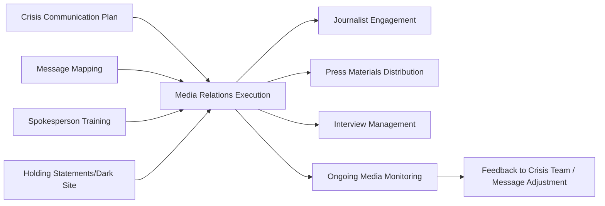
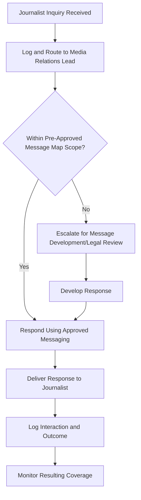

## Fundamentals of Crisis Media Relations

### Definition and Scope

Crisis media relations is the discipline of managing an organization's interactions with journalists, editors, and news outlets during an active crisis to ensure accurate, timely, and organizationally credible coverage while protecting reputation and stakeholder trust. It sits at the operational intersection of nearly every preparedness component covered previously: spokespeople trained through media training, statements built from message maps and holding statement templates, and coordination governed through CMT/ICS structures are all ultimately delivered *to* media as the primary (though not exclusive) channel through which crisis information reaches broad public audiences.

This topic addresses the practical mechanics and principles of that media interaction specifically — distinct from the planning and preparation artifacts already covered, this is the live execution discipline of working with press during an unfolding event.

### Position in the Overall Framework

### Core Principles of Crisis Media Relations

**Key Points**

- **Speed balanced against accuracy** — journalists operate on compressed timelines, but premature or inaccurate information typically causes greater reputational harm than a delayed but accurate response
- **Single source of truth** — consistent with the Public Information Officer principle from incident command practice, media relations functions best when there is one authorized source coordinating all external statements, preventing contradictory information reaching press from different parts of the organization
- **Proactive engagement over reactive silence** — organizations that engage with legitimate media inquiries, even to say "we don't yet have that information but will follow up," generally fare better than those perceived as unresponsive or evasive
- **Relationship continuity** — media relationships built and maintained during non-crisis periods generally translate into more favorable treatment, benefit of the doubt, and willingness to include organizational perspective during crisis coverage
- **Understanding journalist needs and constraints** — effective media relations requires genuine understanding of journalists' deadlines, verification requirements, and editorial processes, not just organizational messaging goals

[Inference] The relationship-continuity principle is frequently cited as a reason why crisis communication functions are generally more effective when integrated with, rather than separate from, an organization's ongoing (non-crisis) media relations program, since journalists who have an established working relationship and prior credibility assessment of an organization's communications team are more likely to engage fairly during a high-pressure crisis situation than journalists encountering the organization's spokesperson for the first time under adversarial circumstances.

### Media Landscape Considerations for Crisis Response

| Media Type | Characteristics Relevant to Crisis Response |
| --- | --- |
| Wire services (e.g., major news agencies) | Extremely fast turnaround; initial wire coverage often sets narrative frame for subsequent coverage |
| Broadcast (TV/radio) | Live format offers no correction opportunity before airing; visual/audio delivery quality matters significantly |
| Print/digital news | Generally longer lead time for verification; often more space for nuance and context |
| Trade/specialist press | Deep subject-matter expertise; may ask more technically sophisticated questions |
| Local/regional media | Particularly relevant for geographically specific incidents; often has direct community relationships |
| Social media-native outlets and influencers | Extremely fast, sometimes with lower verification standards; can significantly shape narrative before traditional media responds |

[Unverified] The relative influence of different media types on overall public narrative during a crisis varies significantly by crisis type, geography, and stakeholder demographic; no fixed hierarchy of media importance applies universally across all crisis scenarios.

### Journalist Inquiry Management Process

- **Centralized inquiry logging** — all journalist inquiries routed through a single tracking mechanism, preventing duplicate, inconsistent, or missed responses across a potentially large volume of simultaneous media contact
- **Response time standards** — organizations typically establish target response windows for journalist inquiries (often tiered by urgency and outlet significance), balancing responsiveness against the accuracy and coordination requirements of crisis response
- **Escalation for novel questions** — inquiries falling outside the pre-established message map scope require rapid internal coordination (legal, subject-matter expert, executive input) rather than improvised response
- **On-the-record vs. background distinctions** — clear internal protocols regarding what can be shared on-the-record (attributable, quotable) versus background (context without attribution) versus off-the-record (not for publication), and consistent application across all spokespeople

### Interview and Press Conference Management

**Key Points**

- **Pre-interview briefing** — spokespeople briefed on the specific journalist/outlet, known angle or prior coverage, and any anticipated difficult questions before every crisis-related interview
- **Format-appropriate preparation** — live broadcast, recorded interview, and press conference formats each carry distinct risks and preparation needs, as addressed in spokesperson media training
- **Press conference logistics** — venue, timing, format (statement plus Q&A vs. Q&A only), and duration are deliberately planned rather than improvised, particularly for high-visibility crises
- **Follow-up management** — commitments made during interviews (e.g., "we'll get back to you with that figure") are tracked and honored, since failure to follow up damages both the immediate relationship and broader credibility

### Written Press Materials

| Material Type | Purpose |
| --- | --- |
| Press release | Formal, distributable written statement, often the primary on-record source document |
| Fact sheet/backgrounder | Supplementary factual and contextual information supporting the primary statement |
| Media advisory | Logistical notification of press conferences or media availability opportunities |
| Statement updates | Sequential, dated updates as a situation develops, maintaining the dark site statement archive |
| Visual/multimedia assets | Approved images, b-roll footage, or infographics supporting broadcast and digital coverage needs |

### Balancing Transparency and Legal/Operational Constraints

A persistent tension in crisis media relations is the need for transparency and responsiveness against legitimate constraints:

- **Ongoing investigation limitations** — inability to confirm certain facts while an internal or external investigation is active, requiring careful language that acknowledges the constraint without appearing evasive
- **Legal exposure considerations** — statements reviewed for potential liability implications, consistent with the legal review gate established in crisis communication planning
- **Privacy and confidentiality obligations** — particularly relevant for incidents involving individuals (employees, customers, affected parties), requiring careful balance between transparency and privacy protection
- **Regulatory disclosure timing** — some information may be subject to specific regulatory disclosure requirements or timing restrictions that constrain what can be shared with media and when

[Inference] Effectively communicating the *reason* for a limitation (e.g., "we can't yet confirm X because an investigation is ongoing and we want to provide accurate information" rather than simply declining to answer) is generally considered more effective than an unexplained refusal, since audiences and journalists alike tend to interpret unexplained non-answers as evasion regardless of the legitimate underlying reason.

### Media Monitoring During Active Crisis

- **Real-time coverage tracking** — continuous monitoring of how the crisis is being covered across outlets, feeding directly from the early warning system and monitoring infrastructure established in risk and issues management
- **Narrative and framing analysis** — assessing not just coverage volume but how the story is being framed, since framing significantly influences audience interpretation independent of factual accuracy
- **Correction and clarification protocols** — established process for identifying factual errors in coverage and determining when and how to request correction, balancing accuracy concerns against the risk of appearing combative with media
- **Feedback loop to message strategy** — coverage analysis feeding back into the crisis team's ongoing message map and holding statement updates, ensuring messaging responds to how the story is actually developing rather than only the organization's internal view of the situation

### Common Failure Modes

- **"No comment" as default response** — declining to engage with media inquiries, which is frequently interpreted as evasion or guilt regardless of the underlying reason for withholding comment
- **Inconsistent spokesperson access** — allowing multiple, uncoordinated individuals to speak to media without central routing, producing contradictory statements
- **Overpromising on follow-up** — committing to provide information or follow-up that legal, operational, or investigative constraints ultimately prevent from being delivered, damaging credibility
- **Ignoring format-specific risk** — applying identical preparation across live broadcast, print, and social-native media without recognizing their substantially different risk profiles
- **Neglecting relationship maintenance outside crisis periods** — treating media relations purely as a crisis-activated function, missing the relationship-continuity benefits of ongoing engagement
- **Slow or absent correction of factual errors** — allowing inaccurate coverage to stand uncorrected, which can compound reputational damage as the inaccurate narrative spreads further

### Practical Example

**Example**

A retail company faces a product safety crisis generating significant media interest across wire services, broadcast, and trade press simultaneously. All incoming journalist inquiries are routed through a centralized media relations inbox monitored by the communications lead, who logs each inquiry and cross-references it against the pre-developed message map. A trade publication's technically detailed question about the specific safety mechanism involved falls outside the current message map scope, triggering rapid escalation to the subject-matter expert and legal counsel per the established protocol; a response is developed and delivered within the target window, then added to the Q&A document for consistency in future similar inquiries. When a broadcast outlet's initial coverage misstates the scope of affected products, the company's monitoring function identifies the error within an hour, and the media relations lead requests a correction through established outlet contacts, informed by the relationship-continuity the company had maintained with that outlet's business desk prior to the crisis — resulting in a same-day on-air correction that a less-established relationship might not have achieved as readily.

### Related Topics

- Spokesperson Selection and Media Training
- Message Mapping and Key Message Architecture
- Holding Statements and Dark Site Preparation
- Incident Command Systems for Communications
- Social Media Crisis Response and Platform-Specific Risk
- Correcting Misinformation and Media Inaccuracies
- Stakeholder Ecosystem and Network Mapping
- Post-Crisis Review and After-Action Reporting