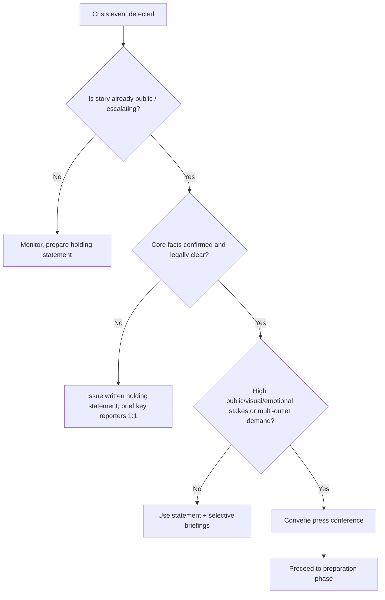
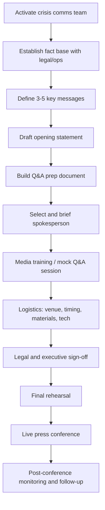
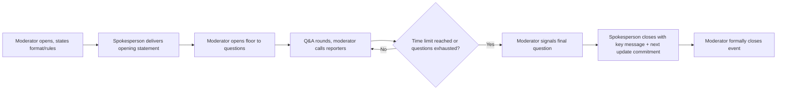

## Preparing for and Running Press Conferences

### Overview

A crisis press conference is a controlled, live, synchronous disclosure event where an organization presents facts, accountability, and next steps to assembled media under conditions of high scrutiny, incomplete information, and compressed time. Unlike a written statement, it exposes spokespeople to unscripted follow-up questioning, non-verbal evaluation (tone, composure, body language), and real-time reframing risk. It should be treated as a distinct crisis communication tool with its own decision criteria, not a default response.

### Decision: Whether to Hold a Press Conference

**Key Points**

- A press conference is not always the correct instrument; poor selection is itself a common cause of reputational damage.
- Use a press conference when: the story is already public and escalating, multiple outlets are independently seeking comment, visual/emotional stakes are high (injuries, fatalities, environmental harm), or regulatory/political pressure demands visible accountability.
- Prefer a written statement, briefing call, or one-on-one interviews when: facts are still unconfirmed, legal exposure is unresolved, only a narrow set of reporters is engaged, or the organization cannot yet answer the top three anticipated questions credibly.
- [Inference] Holding a press conference before an organization has stabilized its core facts often converts a single-day story into a multi-day story, because visible uncertainty or contradiction on camera becomes new news.

### Timing

**Key Points**

- The "golden window" for a first crisis response is typically within 1–4 hours of the story reaching media awareness (not the event itself, but its public discovery).
- A press conference does not need to answer everything; it needs to demonstrate control, empathy, and a credible process for finding answers.
- [Inference] Excessive delay to "get the message perfect" is frequently more damaging than an imperfect but timely appearance, because the information vacuum is filled by competitors, critics, speculation, or leaked internal material.
- If facts genuinely cannot be confirmed in time, a short interim written statement announcing a scheduled press conference (with time/location) is preferable to silence.

### Pre-Conference Preparation Workflow

**Key Points**

The preparation phase is where most crisis press conferences are won or lost; the live event itself is largely execution of decisions made beforehand.

#### Establishing the Fact Base

- Convene a cross-functional cell: crisis lead, legal counsel, operations/subject-matter expert, communications lead, and (for regulated industries) compliance officer.
- Separate confirmed facts from unconfirmed reports; only confirmed facts go into the public statement.
- Document what is *not yet known* explicitly — this becomes material for the "what we don't know yet" section of the statement, which preempts "why can't you answer that" hostility.
- [Inference] Legal counsel's role at this stage is typically to identify what cannot be said (admissions of fault, speculative causation) rather than to draft the substantive message, since over-lawyered statements tend to read as evasive and can independently damage credibility.

#### Defining Key Messages

- Limit to 3–5 core messages; each answer during Q&A should attempt to bridge back to one of these regardless of the specific question asked.
- A standard crisis message architecture:
  1. **Acknowledgment** — confirm what happened, without minimizing.
  2. **Concern/Empathy** — for those affected, stated early and specifically (not generic).
  3. **Action** — what is being done right now (containment, investigation, support).
  4. **Accountability** — who is responsible for resolution and follow-up.
  5. **Commitment** — process and timeline for further updates.
- **Example**
  > "We can confirm [fact]. Our first concern is [affected party] — we have [specific action taken for them]. We have launched [specific investigative/remedial action], led by [named party], and we will share updates [cadence/channel]."

#### Drafting the Opening Statement

- Length: typically 90 seconds to 3 minutes when spoken aloud (roughly 200–450 words); longer statements lose media attention and reduce time for Q&A framing.
- Structure: Acknowledgment → Facts confirmed → Actions taken → Empathy/accountability → What's next → Transition to questions.
- Avoid jargon, legal hedging language ("alleged," "purported") unless legally necessary, and passive voice that obscures agency ("mistakes were made").
- Close with an explicit transition: naming a moderator, explaining the Q&A format (time limit, one question per reporter, no follow-ups if applicable) to set behavioral expectations before questions start.

#### Building the Q&A Preparation Document

- Generate an exhaustive list of anticipated questions, typically organized into categories:
  - Factual ("What exactly happened, when, how many affected")
  - Causal/blame ("Who is responsible, was this preventable")
  - Legal/financial ("Is the company facing lawsuits/fines, what is the cost")
  - Comparative ("Has this happened before, how does this compare to [competitor incident]")
  - Hostile/hypothetical ("Isn't it true that... / What if this happens again")
  - Personal ("Will executives resign, were you aware beforehand")
- For each, draft a bridging answer: a short direct response (or honest "we don't know yet, here's how we'll find out") followed by a bridge back to a key message.
- **Example** (bridging technique)
  > Q: "Was this caused by cutting corners on safety budget?"
  >
  > A: "The investigation into root cause is underway and we'll share findings publicly. What I can tell you now is [action taken] — our priority right now is [affected party/safety]."
- Flag the 2–3 hardest questions explicitly and rehearse them last, since spokesperson composure on the hardest question disproportionately shapes coverage.

#### Selecting and Briefing the Spokesperson

- Selection criteria: authority commensurate with the crisis severity (CEO for existential/fatality-level events; department head for operational/localized events), demonstrated composure under pressure, and — critically — proximity to the facts (a spokesperson who visibly does not understand the operational detail loses credibility fast).
- [Inference] Sending a spokesperson whose seniority is mismatched to the severity of the crisis (too junior for a major crisis, or an executive for a minor one) is commonly perceived as either evasive or disproportionate, independent of message content.
- Brief the spokesperson on: legal boundaries (what cannot be said/admitted), the key message architecture, known media personalities/outlets likely to attend and their typical angle, and the moderator's role in managing time/redirecting hostile lines of questioning.

#### Media Training / Mock Q&A

- Run at least one live rehearsal with a colleague playing an aggressive reporter, ideally recorded on video for playback review.
- Core techniques to train:
  - **Bridging**: acknowledge the question, pivot to a key message ("What's important here is...").
  - **Flagging**: verbally signal importance ("The one thing I want to make sure is clear...") to help create a usable soundbite for broadcast media.
  - **Hooking**: end an answer in a way that invites the reporter to ask a follow-up on a topic the organization wants to address.
  - **Silence tolerance**: training spokespeople not to fill silence with unplanned elaboration; a pause after an answer is acceptable.
- Review body language on playback: posture, hand movement, eye contact, and vocal pace tend to be evaluated by viewers as heavily as verbal content, particularly on broadcast/video clips.

#### Logistics

**Key Points**

- Venue: choose a location that reinforces message control — often on-site (shows transparency, access) or a neutral venue (avoids symbolic association with the incident site itself). The choice is context-dependent.
- Backdrop: should carry organization branding but avoid ambiguous or unfortunate visual juxtaposition (check surroundings for anything that could be misread in still photography).
- Technical: functioning microphone/PA, adequate lighting for broadcast cameras, a visible and legible name/title placard for the spokesperson, and a lectern positioned to avoid harsh overhead shadows.
- Materials: printed press kit or digital equivalent with the opening statement, key facts, high-resolution approved images/logos, and named contact for follow-up.
- Access control: registration/check-in for credentialed media, a plan for overflow (livestream link, secondary room), and security coordination if the story involves public anger or protest risk.
- Timing announcement: give media adequate lead time (commonly a minimum of 1–2 hours where the news cycle allows) via wire services, direct outlet contacts, and the organization's own channels simultaneously.

### Running the Press Conference

#### Roles During the Event

| Role | Responsibility |
| --- | --- |
| Spokesperson | Delivers statement, answers questions, stays within legal/message boundaries |
| Moderator | Opens/closes event, calls on reporters, enforces time limits, redirects abusive questioning |
| Legal observer | Monitors for statements creating unintended liability; does not speak publicly |
| Comms support | Monitors live social/wire coverage during the event for real-time misreporting |
| Notetaker/recorder | Produces official record of exact statements made, for later reference/correction |

#### Format Structure

#### During Q&A: Behavioral Guidance

- Answer the question asked first, even briefly, before bridging — refusing to acknowledge the question at all reads as evasive on camera.
- It is acceptable and often preferable to say "I don't know, and here is how/when we will find out" rather than speculate; speculative answers that are later contradicted cause more damage than an admitted knowledge gap.
- Never argue with a reporter's premise aggressively on camera; correct factual errors calmly and once.
- Avoid "no comment" as a standalone answer — it is broadly perceived as an admission; if something genuinely cannot be discussed (active litigation, ongoing investigation, privacy), state the specific reason.
- The moderator, not the spokesperson, should be the one to end an aggressive or repetitive line of questioning, preserving the spokesperson's persona as open and cooperative.

#### Handling Hostile or Off-Topic Questions

**Key Points**

- Reframe rather than refuse: acknowledge the emotion or premise behind a hostile question, then redirect to controllable content.
- **Example**
  > Q: "Doesn't this prove your company doesn't care about safety?"
  >
  > A: "I understand why people are asking that, and I'd feel the same way. What I can tell you is [concrete safety action], and we will be transparent about what the investigation finds."
- For plainly off-topic or bait questions (unrelated past controversies, personal attacks), a short bridge back to the stated purpose of the conference ("Today we're focused on [X]; I'm happy to follow up separately on that") is standard practice, delivered without visible irritation.

### Post-Conference Actions

**Key Points**

- Distribute the exact statement text and any clarifying materials to attending and non-attending media within the hour, to reduce transcription/paraphrase drift in coverage.
- Monitor initial coverage (wire, broadcast clips, social) within the first 1–3 hours for misquotes or misleading clip selection; issue a factual correction request to the specific outlet if a material misquote occurs (not a public dispute).
- Log every question asked and how it was answered — this becomes the seed document for the next update's Q&A prep and reveals which key messages did or did not land.
- Schedule and publicly commit to the next update (even if the content of that update is "no new information, next update at [time]"), since a stated cadence reduces perceived evasiveness in the interim.
- Conduct an internal debrief comparing anticipated vs. actual questions, spokesperson performance, and any message that failed to bridge effectively, to refine the Q&A document for subsequent conferences in the same crisis.

### Common Failure Modes

- **Premature conference**: held before facts are stable, producing visible contradiction under questioning. [Inference] This is one of the more frequent causes of a press conference itself becoming a secondary news story.
- **Message overload**: spokesperson attempts to cover too many points, diluting the message that is actually retained/quoted.
- **Legal over-caution**: answers so hedged they read as an admission of guilt by omission.
- **Mismatched spokesperson authority**: seniority disproportionate (too low or unnecessarily high) to the severity of the event.
- **No empathy anchor**: statement is procedurally accurate but omits acknowledgment of affected parties, which is disproportionately what audiences and media react negatively to.
- **Poor moderator control**: allowing a single reporter or hostile line of questioning to dominate available time, crowding out message delivery.

### Illustration: Crisis Press Conference Preparation Timeline

<svg xmlns="http://www.w3.org/2000/svg" viewBox="0 0 900 320">
<text x="450" y="30" font-size="18" font-weight="bold" text-anchor="middle" fill="#1a1a1a">Crisis Press Conference Preparation Timeline (svg_diagram)</text>
<line x1="60" y1="160" x2="840" y2="160" stroke="#888" stroke-width="3" />
<circle cx="100" cy="160" r="8" fill="#c0392b" />
<text x="100" y="120" font-size="12" text-anchor="middle" fill="#1a1a1a">Story breaks</text>
<text x="100" y="200" font-size="11" text-anchor="middle" fill="#555">T+0</text>
<circle cx="230" cy="160" r="8" fill="#e67e22" />
<text x="230" y="120" font-size="12" text-anchor="middle" fill="#1a1a1a">Crisis cell</text>
<text x="230" y="135" font-size="12" text-anchor="middle" fill="#1a1a1a">activated</text>
<text x="230" y="200" font-size="11" text-anchor="middle" fill="#555">T+15-30min</text>
<circle cx="370" cy="160" r="8" fill="#e67e22" />
<text x="370" y="120" font-size="12" text-anchor="middle" fill="#1a1a1a">Facts confirmed</text>
<text x="370" y="135" font-size="12" text-anchor="middle" fill="#1a1a1a">key messages set</text>
<text x="370" y="200" font-size="11" text-anchor="middle" fill="#555">T+1hr</text>
<circle cx="510" cy="160" r="8" fill="#f1c40f" />
<text x="510" y="120" font-size="12" text-anchor="middle" fill="#1a1a1a">Q&amp;A prep +</text>
<text x="510" y="135" font-size="12" text-anchor="middle" fill="#1a1a1a">spokesperson briefed</text>
<text x="510" y="200" font-size="11" text-anchor="middle" fill="#555">T+1.5-2hr</text>
<circle cx="650" cy="160" r="8" fill="#27ae60" />
<text x="650" y="120" font-size="12" text-anchor="middle" fill="#1a1a1a">Mock Q&amp;A</text>
<text x="650" y="135" font-size="12" text-anchor="middle" fill="#1a1a1a">rehearsal</text>
<text x="650" y="200" font-size="11" text-anchor="middle" fill="#555">T+2.5hr</text>
<circle cx="790" cy="160" r="8" fill="#2980b9" />
<text x="790" y="120" font-size="12" text-anchor="middle" fill="#1a1a1a">Press conference</text>
<text x="790" y="135" font-size="12" text-anchor="middle" fill="#1a1a1a">live</text>
<text x="790" y="200" font-size="11" text-anchor="middle" fill="#555">T+3-4hr</text>

<text x="450" y="260" font-size="12" text-anchor="middle" fill="#555" font-style="italic">Illustrative sequence — actual duration scales with crisis complexity and legal review requirements [Inference]</text>

</svg>

**Related Topics**

- Bridging and message discipline techniques for spokespersons
- Drafting holding statements before facts are confirmed
- Selecting and training executive spokespersons for high-severity crises
- Managing hostile or ambush interview formats (one-on-one vs. press conference)
- Post-crisis media monitoring and correction request protocols
- Legal review workflows for crisis communications
- Social media coordination during live press conferences
- Building a standing crisis communications playbook/runbook