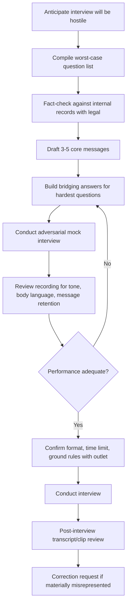
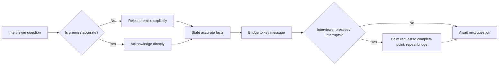

## Handling Hostile and Adversarial Interviews

### Overview

A hostile or adversarial interview is a media encounter in which the interviewer's primary objective is to extract an admission, provoke a defensive or emotional reaction, corner the subject into a binary trap, or generate a damaging soundbite — as opposed to a neutral information-gathering exchange. These occur in formats ranging from live broadcast confrontations and ambush "ambulance-chasing" doorstep interviews to written Q&A with a skeptical investigative journalist. Preparation for this format differs materially from routine media interviews because the interviewer's incentives are adversarial rather than cooperative.

### Recognizing Hostile Interview Formats

**Key Points**

- **Ambush interview**: unscheduled, often on-camera confrontation (doorstepping, cornering at an event) designed to capture an unprepared reaction.
- **Confrontational broadcast interview**: scheduled but conducted with aggressive interruption, rapid-fire questioning, and confrontational framing (common in investigative TV/radio formats).
- **Gotcha question**: a question built on a false premise, a loaded binary ("Have you stopped X"), or selectively quoted prior statements, designed so that any direct answer appears to confirm guilt.
- **Silence-as-pressure**: interviewer pauses after an answer without responding, inviting the subject to fill the silence with unplanned, often damaging elaboration.
- **Written adversarial Q&A**: investigative journalist sends detailed, fact-heavy questions with tight deadlines, often already possessing internal documents or sources, designed to test consistency against the organization's known conduct.

### Core Preparation Framework

#### Anticipating the Worst-Case Questions

- Assemble the list from three sources: known facts that are damaging, publicly available prior statements that could be used for a contradiction trap, and any rumored/leaked material the interviewer may already possess.
- [Inference] Journalists conducting adversarial interviews frequently withhold their strongest piece of evidence until late in the interview specifically to test the subject's consistency against an unprepared answer given earlier — preparation should assume the interviewer knows more than they have revealed.
- Rank questions by likely damage, and rehearse the three most damaging first, since composure on the hardest question disproportionately affects perceived credibility.

#### Legal and Factual Clearance

- Every fact-based answer should be pre-cleared with legal counsel and verified against internal records before the interview, since a hostile interviewer is more likely than a routine one to have contradictory documentation.
- Establish explicit boundaries in advance: what cannot be discussed (active litigation, personnel matters, unconfirmed investigation findings) and the standard phrasing to redirect from each, agreed with legal beforehand so it is not improvised live.

### Core Response Techniques

#### Bridging

- Structure: **Acknowledge → Answer or redirect → Bridge to key message.**
- Never skip the acknowledgment step entirely; ignoring the question outright reads as evasive even to a neutral audience.
- **Example**
  > Q: "Isn't it true your company knew about this risk for years and did nothing?"
  >
  > A: "I understand the concern behind that question. What the record shows is [factual clarification]. What matters right now is [current corrective action] — that's where our focus is."

#### Flagging

- Verbal signposting phrases ("The most important thing to understand is...", "What I want to be really clear about is...") direct which portion of the answer is most likely to be used as the broadcast clip or quoted line, functioning as a defense against selective editing.

#### Refusing the False Binary

- For loaded yes/no questions built on a false premise, reject the premise explicitly before answering rather than accepting the binary frame.
- **Example**
  > Q: "So yes or no — did you put profit over safety?"
  >
  > A: "That's not an accurate way to frame the decision that was made. Here's what actually happened: [factual account]."

#### Tolerating Silence

- Deliver the answer, then stop; do not fill an interviewer's pause with unplanned elaboration.
- [Inference] Silence used as a pressure tactic is specifically designed to provoke a defensive extension of an already-complete answer, and additional unplanned material is a common source of the most damaging quotes extracted from adversarial interviews.

#### Correcting False Premises and Misquotes in Real Time

- Correct a factual error once, calmly, without repeating the false claim verbatim (repeating a false claim, even to deny it, can inadvertently reinforce it in audience recall — sometimes referred to as the "backfire" or repetition-reinforcement effect in message testing). [Inference]
- **Example**
  > Q: "Given that you admitted fault last week..."
  >
  > A: "To clarify the record — that statement was not an admission of fault; what was said was [accurate paraphrase]."

#### Managing Interruptions

- If repeatedly interrupted before completing an answer, a calm, single request to finish the point ("Let me just complete this thought, then happy to take the next question") is standard; repeated requests without escalation in tone are preferable to visible frustration.

### Handling Ambush/Doorstep Interviews Specifically

**Key Points**

- Decide in advance the organization's standing policy for unscheduled confrontations: full engagement, brief acknowledgment plus redirect to formal channel, or polite decline plus follow-up commitment — this should be decided before a crisis, not improvised on camera.
- A commonly used minimal response for an unprepared ambush: acknowledge briefly, commit to a substantive response through a proper channel, and disengage without appearing evasive.
- **Example**
  > "I don't have the full details in front of me right now to give you an accurate answer, but I will make sure you get a complete response by [specific timeframe/channel]."
- Visibly declining to answer entirely ("no comment," turning away without acknowledgment, or physically obstructing the camera) is broadly perceived as guilt-signaling and tends to generate a worse clip than a brief, calm redirect.

### Adversarial Written Interviews (Investigative Journalism)

**Key Points**

- Written adversarial Q&A from investigative reporters often arrives with a tight deadline (sometimes intentionally short) alongside a long list of highly specific, documented questions — this is itself a pressure tactic and should be treated as such rather than a routine media inquiry.
- Response protocol:
  1. Route immediately to legal and crisis communications leads; do not allow an individual employee to respond informally.
  2. Verify every factual claim in the questions against internal records before drafting any response.
  3. Answer directly what can be answered; explicitly decline (with stated reason) what cannot.
  4. Avoid "no comment" on individual questions where possible — a short factual answer or an explained decline is preferable.
  5. Request a reasonable deadline extension if the original window is not sufficient for a fact-checked response; document the request in writing.

### Mock Interview / Media Training Protocol

**Key Points**

- Conduct at least one full adversarial mock interview using a trained role-player (internal or external) who employs the actual techniques expected (interruption, false binaries, silence, contradiction traps).
- Record on video; review specifically for:
  - Verbal fillers and hedging language under pressure
  - Physical tells (crossed arms, avoided eye contact, fidgeting) that read as defensiveness on camera
  - Whether key messages were successfully delivered despite hostile framing
  - Response time to loaded questions (excessive pause before answering can itself read as evasive)
- Iterate: repeat the hardest 2–3 questions until the bridging response becomes close to automatic.

### Post-Interview Actions

**Key Points**

- Obtain the recording or transcript as soon as possible after broadcast/publication.
- Compare final published/aired content against what was actually said, checking specifically for edited-down quotes that alter meaning through truncation.
- If a material misrepresentation occurred, submit a factual correction request directly to the outlet's editorial desk (not a public dispute), citing the specific timestamp/quote and the accurate context.
- Log the interview in the organization's crisis Q&A repository — questions asked, techniques used by the interviewer, and how effectively each bridging answer performed — to refine preparation materials for subsequent interviews on the same or related topics.
- [Inference] Publicly disputing an adversarial interviewer's conduct or framing after the fact frequently extends the news cycle rather than closing it, and is generally reserved for cases of clear, material factual misrepresentation rather than unfavorable framing alone.

### Common Failure Modes

- **Accepting a false binary**: answering "yes" or "no" to a loaded question without rejecting its premise, which is later reported as a direct admission.
- **Filling silence**: extending an already-complete answer into unplanned territory during an interviewer's pause.
- **Visible defensiveness**: crossed arms, raised voice, or interrupting back — reads poorly on camera regardless of the substantive accuracy of the response.
- **Repeating the accusation verbatim while denying it**, reinforcing the accusation in the retained soundbite/quote.
- **Under-preparing for the single worst-case question**, leading to a visibly unprepared reaction that becomes the dominant clip.
- **Treating a written adversarial Q&A as routine correspondence**, resulting in an informal, unreviewed response used against the organization later.

### Illustration: Hostile Question Response Decision Path

<svg xmlns="http://www.w3.org/2000/svg" viewBox="0 0 880 300">
<text x="440" y="28" font-size="18" font-weight="bold" text-anchor="middle" fill="#1a1a1a">Hostile Question Response Decision Path (svg_diagram)</text>
<rect x="30" y="60" width="160" height="50" rx="6" fill="#c0392b" />
<text x="110" y="90" font-size="12" text-anchor="middle" fill="#fff">Loaded / false-premise question</text>
<rect x="260" y="60" width="160" height="50" rx="6" fill="#e67e22" />
<text x="340" y="85" font-size="12" text-anchor="middle" fill="#fff">Reject premise</text>
<text x="340" y="100" font-size="12" text-anchor="middle" fill="#fff">explicitly</text>
<rect x="490" y="60" width="160" height="50" rx="6" fill="#f1c40f" />
<text x="570" y="85" font-size="12" text-anchor="middle" fill="#1a1a1a">State accurate</text>
<text x="570" y="100" font-size="12" text-anchor="middle" fill="#1a1a1a">facts briefly</text>
<rect x="720" y="60" width="140" height="50" rx="6" fill="#27ae60" />
<text x="790" y="85" font-size="12" text-anchor="middle" fill="#fff">Bridge to key</text>
<text x="790" y="100" font-size="12" text-anchor="middle" fill="#fff">message</text>
<line x1="190" y1="85" x2="255" y2="85" stroke="#333" stroke-width="2" marker-end="url(#arrow1)" />
<line x1="420" y1="85" x2="485" y2="85" stroke="#333" stroke-width="2" marker-end="url(#arrow1)" />
<line x1="650" y1="85" x2="715" y2="85" stroke="#333" stroke-width="2" marker-end="url(#arrow1)" />
<rect x="260" y="180" width="160" height="50" rx="6" fill="#2980b9" />
<text x="340" y="205" font-size="12" text-anchor="middle" fill="#fff">Interviewer presses</text>
<text x="340" y="220" font-size="12" text-anchor="middle" fill="#fff">or interrupts</text>
<rect x="490" y="180" width="160" height="50" rx="6" fill="#8e44ad" />
<text x="570" y="205" font-size="12" text-anchor="middle" fill="#fff">Calm request to</text>
<text x="570" y="220" font-size="12" text-anchor="middle" fill="#fff">finish point</text>
<line x1="790" y1="110" x2="790" y2="150" stroke="#333" stroke-width="2" />
<line x1="790" y1="150" x2="340" y2="150" stroke="#333" stroke-width="2" />
<line x1="340" y1="150" x2="340" y2="175" stroke="#333" stroke-width="2" marker-end="url(#arrow1)" />
<line x1="420" y1="205" x2="485" y2="205" stroke="#333" stroke-width="2" marker-end="url(#arrow1)" />
<line x1="570" y1="180" x2="570" y2="115" stroke="#333" stroke-width="2" stroke-dasharray="4,3" marker-end="url(#arrow1)" />
<text x="440" y="280" font-size="12" text-anchor="middle" fill="#555" font-style="italic">Loop returns to message delivery after each interruption, without escalation in tone [Inference]</text>

</svg>

**Related Topics**

- Media training and mock interview program design
- Bridging and message discipline (cross-reference: Press Conferences)
- Legal review protocols for pre-clearing spokesperson statements
- Handling ambush/doorstep confrontations and standing organizational policy
- Responding to investigative journalism and written Q&A requests
- Post-broadcast transcript monitoring and correction request procedures
- Spokesperson selection criteria by crisis severity
- Managing social media amplification of adversarial interview clips