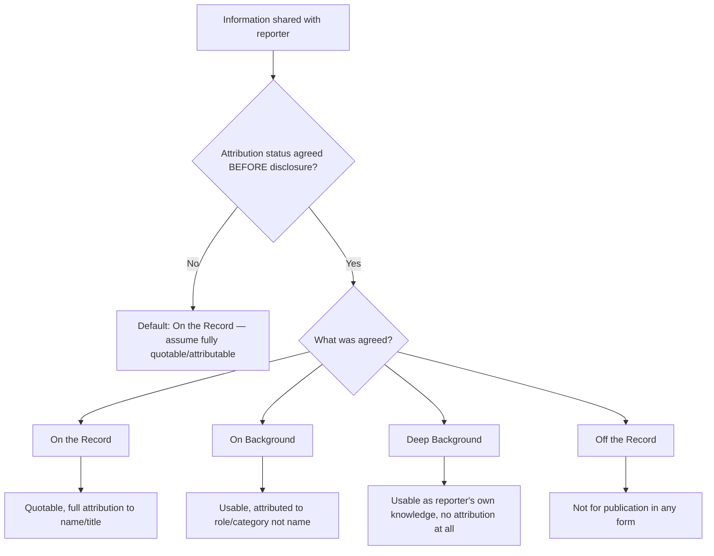
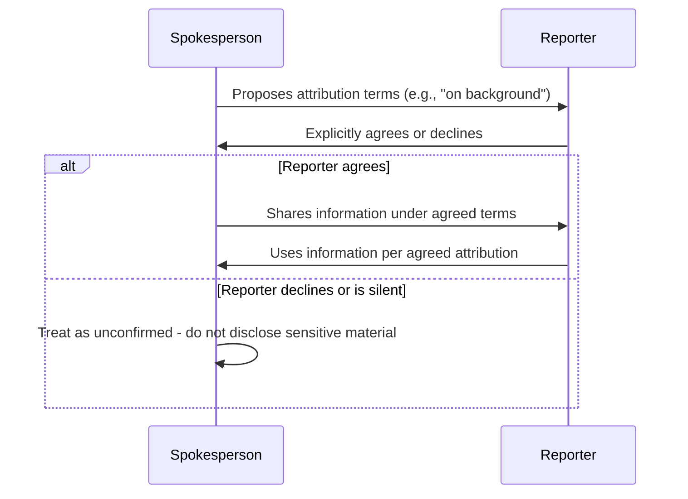

## Attribution Norms: On the Record, Off the Record, Background

### Overview

Attribution norms are the conventions governing how a source's identity and words may be used in published reporting. In crisis communications, correctly establishing and enforcing these terms before speaking is a primary control against unintended disclosure, since misunderstanding or ambiguity about attribution status is a recurring cause of damaging leaks and misquotes. There is no universal legal standard for these terms; they are journalistic convention, negotiated between source and reporter, and enforceability depends on mutual understanding established *before* the information is shared, not after.

### The Core Attribution Categories

#### On the Record

- Definition: everything said may be published, quoted verbatim, and directly attributed to the named individual and their title.
- Default assumption: unless another status is explicitly negotiated *before* speaking, a reporter is entitled to treat the conversation as on the record.
- Use case in crisis: official statements, press conference remarks, approved spokesperson quotes — anything the organization wants directly and publicly attached to a named individual.
- [Inference] Because this is the default status absent explicit agreement otherwise, most damaging "unauthorized" quotes attributed to employees in crisis coverage originate from conversations the employee assumed were casual/off-record but never explicitly negotiated as such.

#### Off the Record

- Definition: information shared is not for publication in any form — not the content, not a paraphrase, not an unattributed reference. It is understood as being for the reporter's own background understanding only.
- Common misconception: "off the record" is frequently used colloquially (including by inexperienced spokespeople) to mean "don't use my name," which is actually the definition of *background*, not off the record. This conflation is a frequent source of unintended disclosure.
- Off-the-record information, strictly applied, should not appear in the resulting story even in unattributed or paraphrased form.
- [Inference] Some reporters and outlets do not honor a unilaterally declared "this is off the record" said *after* information has already been shared; the terms are conventionally understood to require prior agreement, meaning a spokesperson cannot retroactively protect a statement already made on the record by relabeling it after the fact.

#### On Background (also "Background")

- Definition: the information may be used and even quoted, but attribution is limited to a role or category rather than a named individual — e.g., "according to a senior company official," "a person familiar with the investigation," "a spokesperson said."
- The specific attribution language (job function, seniority level, department) is typically negotiated explicitly between source and reporter, since vague background attribution ("sources say") can still be narrowed by informed readers.
- Common crisis use: providing context, technical explanation, or organizational perspective without a named individual bearing personal/public association with a sensitive statement.

#### Deep Background

- Definition: the information may inform the reporter's understanding and shape their reporting, but cannot be attributed in any form — not to a role, category, or even a generic "source." The reporter effectively presents the resulting information as their own understanding or verified through other means.
- Least common in organizational crisis communications; more typical in investigative journalism relationships built over time with high-level sources.

### Negotiating Attribution Terms

**Key Points**

- Terms must be established explicitly and affirmatively *before* the substantive conversation begins, not assumed by either party.
- A spokesperson should state the terms proactively rather than waiting for the reporter to propose them, since the reporter's default (on the record) favors the reporter's usable material.
- **Example**
  > "Before I answer that, I want to go on background — usable, but attributed only to 'a company official,' not by name. Is that agreeable?"
- If a reporter does not explicitly agree to non-standard terms (background, off the record) before the information is shared, the terms should be treated as unconfirmed and the spokesperson should not disclose sensitive material under the assumption of protection.
- Terms can shift mid-conversation but require renegotiation at the point of the shift — e.g., "Everything up to now has been on the record; what I'm about to say I'd like to go off the record" — and the reporter's acknowledgment should be explicit, not assumed from silence.

### Organizational Policy Considerations

**Key Points**

- Crisis communications teams typically designate, in advance, which individuals are authorized to speak on the record, on background, or at all — ad hoc or unauthorized attribution-term negotiation by untrained staff during a crisis is a recurring source of leaks.
- A written internal policy commonly specifies:
  - Who is authorized as the sole on-the-record spokesperson(s) for the crisis
  - Whether background briefings are authorized, and if so, by whom and under what circumstances
  - A default instruction for all other employees: refer media inquiries to the designated spokesperson/communications team, do not engage on any attribution terms independently
- [Inference] Reporters covering an active crisis frequently attempt to reach employees outside the official channel specifically because off-the-record or background conversations with rank-and-file staff are more likely to yield unguarded, newsworthy material than a controlled official statement — this is a predictable dynamic rather than an unusual occurrence, and policy should anticipate it.

### Risks and Failure Modes

**Key Points**

- **Assumed protection without agreement**: sharing sensitive information casually, assuming it is "off the record" without the reporter's explicit prior agreement.
- **Conflating background with off the record**: believing "don't use my name" (background) provides the same protection as "don't publish this at all" (off the record) — it does not; background information can still appear in print, just without a name attached.
- **Retroactive relabeling**: attempting to declare information off the record *after* it has been stated, which is not reliably honored by reporters or outlets as a matter of convention.
- **Attribution narrowing**: providing background attribution detailed enough (specific title, department, unique role) that informed readers can identify the individual despite the absence of a name.
- **Unauthorized staff engagement**: employees outside the designated spokesperson role independently negotiating attribution terms during a crisis, creating inconsistent or leaked information outside official messaging control.
- **Cross-outlet inconsistency**: granting different attribution terms to different reporters for materially similar information, which can surface as an inconsistency if reporters compare notes or if background material is later independently confirmed and published on the record elsewhere.

### Practical Application During Crisis

**Key Points**

- Default posture in an active crisis: treat all spokesperson communications with media as on the record unless a specific, limited exception is deliberately and explicitly negotiated for a defined strategic purpose (e.g., providing technical background context to help a reporter accurately understand a complex issue without attaching a name to preliminary information).
- Background briefings are sometimes used deliberately in crisis management to shape accurate technical understanding among reporters (e.g., explaining a regulatory process, technical failure mechanism) without committing the organization to a named, quotable position while facts are still developing.
- All background or off-the-record conversations conducted by authorized spokespeople during a crisis should be logged internally (who, when, what was discussed, agreed terms) to maintain consistency across multiple reporter interactions and outlets.

### Comparison Summary

| Term | May be quoted? | May be attributed to name? | May be attributed to role/title? | May inform story unattributed? |
| --- | --- | --- | --- | --- |
| On the Record | Yes | Yes | Yes | Yes |
| On Background | Yes | No | Yes | Yes |
| Deep Background | No (paraphrase only) | No | No | Yes, as reporter's own understanding |
| Off the Record | No | No | No | No (not for publication in any form) |

### Illustration: Attribution Status Spectrum

<svg xmlns="http://www.w3.org/2000/svg" viewBox="0 0 880 260">
<text x="440" y="28" font-size="18" font-weight="bold" text-anchor="middle" fill="#1a1a1a">Attribution Status Spectrum (svg_diagram)</text>
<line x1="60" y1="140" x2="820" y2="140" stroke="#888" stroke-width="3" />
<circle cx="100" cy="140" r="9" fill="#27ae60" />
<text x="100" y="100" font-size="13" font-weight="bold" text-anchor="middle" fill="#1a1a1a">On the Record</text>
<text x="100" y="170" font-size="11" text-anchor="middle" fill="#555">Named + quotable</text>
<circle cx="330" cy="140" r="9" fill="#f1c40f" />
<text x="330" y="100" font-size="13" font-weight="bold" text-anchor="middle" fill="#1a1a1a">On Background</text>
<text x="330" y="170" font-size="11" text-anchor="middle" fill="#555">Role-attributed + quotable</text>
<circle cx="560" cy="140" r="9" fill="#e67e22" />
<text x="560" y="100" font-size="13" font-weight="bold" text-anchor="middle" fill="#1a1a1a">Deep Background</text>
<text x="560" y="170" font-size="11" text-anchor="middle" fill="#555">Unattributed, informs story</text>
<circle cx="790" cy="140" r="9" fill="#c0392b" />
<text x="790" y="100" font-size="13" font-weight="bold" text-anchor="middle" fill="#1a1a1a">Off the Record</text>
<text x="790" y="170" font-size="11" text-anchor="middle" fill="#555">Not for publication</text>

<text x="440" y="220" font-size="12" text-anchor="middle" fill="#555" font-style="italic">Increasing source protection, decreasing usable specificity, left to right</text>

</svg>

**Related Topics**

- Designating and authorizing crisis spokespeople
- Preparing for and running press conferences (cross-reference)
- Internal media-inquiry escalation policy design
- Leak investigation and containment procedures
- Building reporter relationships for background briefings pre-crisis
- Legal considerations in source protection and journalist-source agreements
- Drafting employee media-contact guidance for active crises