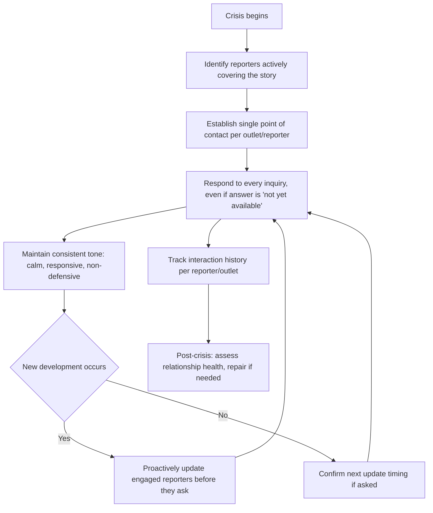
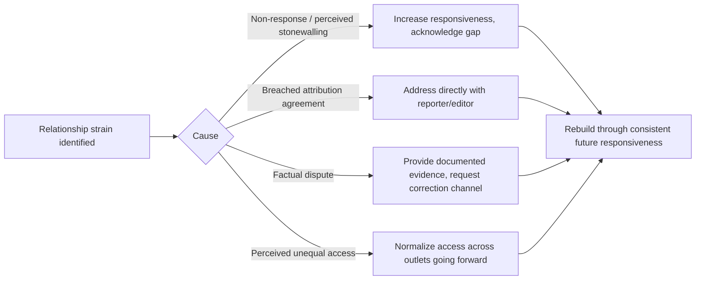

## Managing Journalist Relationships Under Pressure

### Overview

Managing journalist relationships under pressure refers to the sustained, interpersonal dimension of media relations during a crisis — distinct from any single interview or press conference. It concerns how an organization maintains (or repairs) working credibility with individual reporters and outlets across the full arc of a crisis, where trust, access, and tone set in early interactions compound over subsequent coverage cycles. Reporters covering an unfolding crisis typically continue engaging with the same organizational contacts repeatedly over days or weeks; how those individual relationships are handled materially affects tone, framing, and willingness to seek comment before publishing versus publishing without it.

### Why Relationship Management Is Distinct From Message Management

**Key Points**

- Message discipline governs *what* is said; relationship management governs *whether reporters continue to engage the organization as a source at all* rather than relying entirely on other sources, leaks, or adversarial framing.
- [Inference] A reporter who feels stonewalled, misled, or disrespected early in a crisis is more likely to rely on unofficial sources (disgruntled employees, competitors, activists) for the remainder of the story, since the official channel has demonstrated itself to be unhelpful or untrustworthy as a source of usable information.
- Relationship management operates on a longer time horizon than any individual response: reporters and outlets remember how an organization behaved in a prior crisis and calibrate skepticism accordingly in future coverage.

### Core Relationship-Management Principles During Crisis

#### Responsiveness as the Baseline Requirement

- Every media inquiry should receive a response, even when the substantive answer is "we don't have that information yet" — non-response is broadly interpreted by reporters as either evasion or organizational dysfunction, and tends to accelerate reliance on alternative sources.
- Set and communicate a realistic response-time expectation explicitly ("I'll have an answer for you within the hour") rather than leaving a reporter to guess whether a response is coming at all.
- [Inference] Consistent, even partial, responsiveness during a crisis is often what most directly determines whether a reporter grants the organization the benefit of the doubt on ambiguous facts later in the story, more so than the substantive content of any single answer.

#dedicated Point of Contact

- Designate a single, consistent point of contact per major outlet or reporter for the duration of the crisis, rather than rotating spokespeople, which forces reporters to re-establish context and rapport repeatedly and increases the risk of inconsistent messaging.
- The point of contact should have (or have fast access to) sufficient authority and information to avoid becoming a bottleneck that itself damages responsiveness.

#### Proactive Disclosure

- Where possible, provide known engaged reporters with material updates *before* they are forced to ask, rather than only responding reactively to inquiries.
- **Example**
  > "Wanted to make sure you had this before your deadline: we've confirmed [update]. Full statement attached; happy to answer follow-ups."
- Proactive disclosure to reporters already covering the story is frequently viewed as a good-faith signal and can reduce the incentive for a reporter to seek out unofficial or adversarial sources to fill informational gaps.

#### Consistency of Tone

- Maintain a calm, non-defensive tone across all interactions regardless of how adversarial or repetitive a reporter's questioning becomes; visible frustration with a specific reporter tends to affect that reporter's subsequent framing and can be referenced or described by the reporter in their own reporting or to colleagues.
- Consistency should extend across all designated spokespeople handling the same crisis, since visibly different tones or messages from different organizational contacts read as internal disorganization or deliberate inconsistency.

### Differentiating Reporter Relationships

**Key Points**

- Not all reporters warrant identical treatment; differentiation should be based on professional conduct and coverage history, not on favorability of past coverage, since favor-based differentiation (rewarding only reporters who write favorably) is a well-recognized practice that damages long-term credibility if perceived by media broadly.
- Legitimate differentiation criteria include: accuracy/fairness of past reporting, adherence to agreed attribution terms, and responsiveness to correction requests — not simply whether prior coverage was positive or negative in tone.
- **Example** of legitimate differentiation: a reporter with a track record of honoring background-attribution agreements may reasonably be offered background briefings more readily than one who has previously breached agreed terms — this is a trust-based distinction, not a favor-based one.

### Handling Difficult or Strained Individual Relationships

**Key Points**

- When a specific reporter relationship has become adversarial (due to prior negative coverage, a past dispute, or a breached agreement), the crisis communications team should still generally continue engaging that reporter through the standard process rather than excluding them, since visible exclusion of a specific outlet is commonly interpreted as retaliatory and can become a story in itself.
- If a reporter has published a factual inaccuracy, the appropriate channel is a direct, calm, evidence-based correction request to the reporter or editor — not a public dispute, and not informal retaliation such as excluding that reporter from future briefings.
- [Inference] Publicly or visibly penalizing a specific reporter or outlet for unfavorable but factually accurate coverage is frequently counterproductive, since it can unify press-corps sentiment against the organization and invite scrutiny of the retaliatory action itself.

### Repairing a Damaged Relationship

- Relationship repair is typically incremental and demonstrated through consistent future behavior rather than resolved through a single conciliatory gesture or statement.
- Acknowledging a specific past failure directly (e.g., "I know we were slow to respond to your inquiry last week — here's how we're addressing that going forward") tends to be more effective than an unspecific general assurance of improved cooperation.

### Managing Multiple Outlets Simultaneously Under Pressure

**Key Points**

- Maintain a tracking log (reporter, outlet, inquiry history, attribution terms agreed, response status, deadlines) to ensure consistent treatment and prevent one outlet from receiving materially different information than another without deliberate strategic reason.
- Coordinate timing of proactive disclosures to avoid the perception of favoring one outlet with an exclusive at the expense of others covering the same story, unless a deliberate embargo or exclusive strategy has been chosen for specific strategic reasons.
- Track outlet-specific deadlines (wire services often operate on much shorter cycles than weekly print or long-form investigative outlets) to prioritize response sequencing appropriately.

### Common Failure Modes

- **Rotating spokespeople** without context transfer, forcing reporters to repeatedly re-establish rapport and increasing risk of inconsistent statements.
- **Selective responsiveness** based on anticipated favorability of coverage, which damages credibility broadly once recognized by the press corps.
- **Silence interpreted as stonewalling**: failing to respond even with a holding answer, accelerating reliance on unofficial sources.
- **Retaliatory exclusion** of a reporter or outlet following unfavorable but accurate coverage.
- **Inconsistent tone across spokespeople** handling the same crisis, read as organizational disorganization.
- **Breaching agreed attribution terms**, which damages trust not only with the affected reporter but can become known more broadly within the press corps, elevating overall skepticism toward future organizational communications.
- **Over-promising response timing** and then repeatedly missing it, which compounds relationship damage faster than an honest, conservative timeline estimate.

### Illustration: Reporter Relationship Health Over a Crisis Timeline

<svg xmlns="http://www.w3.org/2000/svg" viewBox="0 0 880 300">
<text x="440" y="28" font-size="18" font-weight="bold" text-anchor="middle" fill="#1a1a1a">Reporter Relationship Health Over a Crisis Timeline (svg_diagram)</text>
<line x1="70" y1="250" x2="820" y2="250" stroke="#888" stroke-width="2" />
<line x1="70" y1="60" x2="70" y2="250" stroke="#888" stroke-width="2" />
<text x="40" y="60" font-size="11" text-anchor="middle" fill="#555">High</text>
<text x="40" y="250" font-size="11" text-anchor="middle" fill="#555">Low</text>
<text x="440" y="275" font-size="12" text-anchor="middle" fill="#555">Time since crisis onset</text>
<polyline points="70,120 180,200 300,190 420,140 550,110 680,95 800,90" fill="none" stroke="#2980b9" stroke-width="3" />
<circle cx="180" cy="200" r="6" fill="#c0392b" />
<text x="180" y="220" font-size="10" text-anchor="middle" fill="#1a1a1a">Slow initial</text>
<text x="180" y="233" font-size="10" text-anchor="middle" fill="#1a1a1a">response</text>
<circle cx="300" cy="190" r="6" fill="#e67e22" />
<text x="300" y="212" font-size="10" text-anchor="middle" fill="#1a1a1a">Dedicated contact</text>
<text x="300" y="225" font-size="10" text-anchor="middle" fill="#1a1a1a">assigned</text>
<circle cx="420" cy="140" r="6" fill="#f1c40f" />
<text x="420" y="120" font-size="10" text-anchor="middle" fill="#1a1a1a">Proactive update</text>
<text x="420" y="133" font-size="10" text-anchor="middle" fill="#1a1a1a">issued</text>
<circle cx="550" cy="110" r="6" fill="#27ae60" />
<text x="550" y="90" font-size="10" text-anchor="middle" fill="#1a1a1a">Correction request</text>
<text x="550" y="103" font-size="10" text-anchor="middle" fill="#1a1a1a">handled well</text>

<text x="440" y="285" font-size="11" text-anchor="middle" fill="#555" font-style="italic">Illustrative trend only — actual trajectory depends on organizational conduct and reporter-specific factors [Inference]</text>

</svg>

**Related Topics**

- Attribution norms: on the record, off the record, background (cross-reference)
- Designating and briefing a single point of contact per outlet
- Post-crisis media relationship audits and repair strategies
- Correction request protocols for factual misreporting
- Managing exclusives and embargoes without alienating other outlets
- Building durable press-corps trust outside of active crisis periods
- Internal escalation and coordination among multiple spokespeople