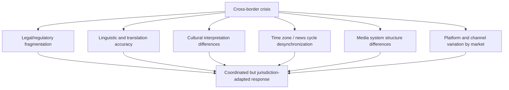
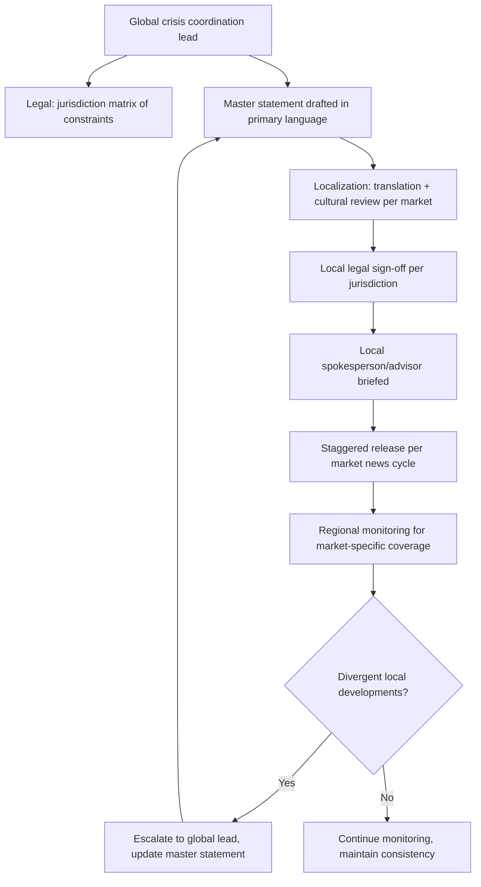

## International and Cross-Border Media Considerations

### Overview

International and cross-border media considerations concern how crisis communications strategy must adapt when a crisis spans multiple jurisdictions, media markets, languages, regulatory regimes, and cultural contexts simultaneously. A message that is legally sound, culturally appropriate, and reputationally effective in one country can be inadequate, legally risky, or actively counterproductive in another. Cross-border crises compound the standard difficulty of crisis response with coordination complexity across time zones, legal systems, and media ecosystems that do not share common norms, deadlines, or regulatory expectations.

### Core Challenge Dimensions

### Legal and Regulatory Fragmentation

**Key Points**

- Disclosure obligations, defamation standards, data-protection notification requirements, and permissible statements about ongoing investigations vary substantially by jurisdiction, and a statement legally safe in one market can create liability in another.
- Securities-related disclosure timing rules (for publicly listed companies) can differ by exchange/jurisdiction, meaning a multinational company may face conflicting pressure between rapid transparency expected by one regulator/market and mandated quiet periods in another.
- [Inference] A single global statement drafted to satisfy the most restrictive jurisdiction's legal constraints often reads as overly cautious or evasive in jurisdictions with looser disclosure norms, while a statement optimized for transparency in a looser jurisdiction can create legal exposure in a stricter one — this tension typically requires jurisdiction-specific legal review rather than a single universal statement.
- Data breach and privacy incidents in particular carry jurisdiction-specific mandatory notification timelines and regulator-specific requirements (e.g., GDPR-style regimes in the EU/UK versus differing state or sectoral regimes elsewhere), which should be confirmed with local counsel per affected jurisdiction before public statements are finalized.
- Recommended structure: establish a lead legal counsel coordinating across local counsel in each materially affected jurisdiction, producing a matrix of what can/cannot be said, and by when, per jurisdiction, before drafting the master message.

### Linguistic and Translation Accuracy

**Key Points**

- Professional, context-aware translation (not literal machine or word-for-word translation) is required for crisis statements, since idiomatic phrases, tone markers, and legal/technical terms frequently do not map directly across languages and can alter meaning, liability, or perceived sincerity.
- [Inference] A literal translation of an empathetic phrase common in one language/culture can read as flat, overly formal, or even insincere in another, independent of translation accuracy at the word level — professional localization (adapting tone and register, not just vocabulary) is generally necessary, not just translation.
- Back-translation (translating the localized version back into the source language by an independent translator) is a standard quality-control step to verify no unintended meaning shift occurred before release.
- Key terms with legal significance (admission-adjacent words, causal language, quantities/statistics) require particular translation scrutiny, since legal teams in different jurisdictions may interpret equivalent-seeming phrases with different liability implications.
- Maintain a single master statement in the primary corporate language with all localized versions traceable back to it, to prevent drift where independently edited local versions diverge in substantive meaning over successive updates.

### Cultural Interpretation Differences

**Key Points**

- Norms around appropriate emotional expression, acceptable admission of fault, expected involvement of senior leadership, and the perceived sincerity of an apology vary by culture and market, and a response calibrated for one audience can be read as inadequate or excessive in another.
- [Inference] In some media cultures, a direct, detailed public apology from the most senior available executive is expected and its absence is read as a lack of accountability; in others, extensive personal/emotional apology from a senior figure may be viewed as inappropriate or performative, with formal written statements from the responsible department considered more appropriate — the specific expectation should be assessed per market rather than assumed from the organization's home-market norms.
- Local crisis communications advisors or agency partners with market-specific experience are commonly used precisely because they can identify these expectation gaps that a headquarters-driven, single-culture message would miss.
- Religious, political, and historical sensitivities specific to a given market should be reviewed by local advisors before any statement, imagery, or symbolism is finalized for that market, since content unremarkable in the home market can carry unintended significance elsewhere.

### Time Zone and News Cycle Desynchronization

**Key Points**

- A crisis breaking in one time zone may reach peak media attention in another region's business hours many hours later (or earlier), meaning a single "golden window" response timeline does not apply uniformly across a multinational crisis.
- Coordinate a rolling response schedule mapped to each affected market's news cycle and deadline patterns, rather than issuing all communications on a single home-market schedule.
- [Inference] Issuing the master crisis statement only during the headquarters' business hours can leave other affected markets without an organizational response during their own primary news cycle, increasing the likelihood that local coverage in that market forms around unofficial sources or the story as covered secondhand from the origin market's press.
- Establish a 24-hour coverage capability (even minimally, via an on-call spokesperson or regional communications lead) for crises severe enough to draw sustained global attention.

### Media System Structural Differences

**Key Points**

- Media ownership structures, degree of state involvement, and typical journalist-source relationship norms vary significantly by country and should inform strategy market by market.
- Some markets have concentrated media ownership (a small number of conglomerates or state-linked outlets dominating coverage), which changes the practical calculus of relationship management compared to markets with a fragmented, highly competitive press.
- Local regulatory bodies (media regulators, communications authorities, financial regulators with public-disclosure functions) may have jurisdiction-specific expectations for how and when a company must engage with press or the regulator itself, separate from the substantive legal disclosure requirements noted above.
- [Unverified] The degree to which social media, versus traditional press, drives the primary news cycle for a crisis can vary substantially by market and should be assessed per region rather than assumed uniform, since platform penetration and usage patterns differ globally.

### Platform and Channel Variation

**Key Points**

- The dominant communication and social media platforms differ substantially by region (for example, platforms with limited relevance in one market may be primary channels in another), and a crisis communications channel strategy built around home-market platforms may not reach the affected audience in other markets at all.
- Owned-channel statements (company website, official social accounts) should be localized and, where platform access or usage patterns differ regionally, distributed through the specific channels actually used by each affected market's audience rather than solely the organization's default global channels.
- [Inference] Relying exclusively on a single global platform or channel for crisis updates risks under-informing markets where that platform has limited local relevance, a gap that unofficial or adversarial sources may fill with less accurate or company-approved information.

### Coordination Model for Cross-Border Crisis Response

- A centralized global coordination function is standard practice to prevent divergent, inconsistent, or contradictory statements from emerging independently across regional offices.
- Regional/local communications leads typically retain authority to adapt tone, format, and channel for their market while remaining bound to the same core confirmed facts as the master statement, to preserve substantive consistency while allowing appropriate localization.
- A shared, continuously updated fact log accessible to all regional teams helps prevent one market's statement from contradicting another's due to using outdated or locally-sourced (rather than centrally verified) information.

### Common Failure Modes

- **Single-market message applied globally without localization**, resulting in tone-deaf, legally risky, or culturally inappropriate statements in secondary markets.
- **Literal translation without cultural/legal review**, producing unintended meaning shifts or admission-adjacent phrasing in a jurisdiction with different liability exposure.
- **Uncoordinated regional statements** issued independently by local offices without central fact verification, producing contradictions that become their own secondary story.
- **Home-market-hours-only response**, leaving other time zones uninformed during their primary news cycle.
- **Ignoring local regulatory disclosure obligations** distinct from the home jurisdiction's requirements, creating compliance exposure in secondary markets.
- **Underestimating local media structure differences**, applying a relationship-management approach calibrated for a fragmented, competitive press to a market with concentrated or state-linked media ownership, where different engagement norms may apply.
- [Inference] Treating cross-border crisis response as a translation exercise applied after a single-market strategy is finalized, rather than as a parallel-track strategic process involving local legal, cultural, and media expertise from the outset, is a common structural failure that increases both legal exposure and reputational inconsistency across markets.

### Illustration: Cross-Border Crisis Coordination Flow

<svg xmlns="http://www.w3.org/2000/svg" viewBox="0 0 900 320">
<text x="450" y="28" font-size="18" font-weight="bold" text-anchor="middle" fill="#1a1a1a">Cross-Border Crisis Coordination Flow (svg_diagram)</text>
<rect x="370" y="55" width="160" height="50" rx="6" fill="#2980b9" />
<text x="450" y="85" font-size="12" text-anchor="middle" fill="#fff">Global Coordination Lead</text>
<rect x="80" y="150" width="150" height="50" rx="6" fill="#27ae60" />
<text x="155" y="172" font-size="11" text-anchor="middle" fill="#fff">Market A</text>
<text x="155" y="187" font-size="11" text-anchor="middle" fill="#fff">(local legal + language)</text>
<rect x="280" y="150" width="150" height="50" rx="6" fill="#27ae60" />
<text x="355" y="172" font-size="11" text-anchor="middle" fill="#fff">Market B</text>
<text x="355" y="187" font-size="11" text-anchor="middle" fill="#fff">(local legal + language)</text>
<rect x="480" y="150" width="150" height="50" rx="6" fill="#27ae60" />
<text x="555" y="172" font-size="11" text-anchor="middle" fill="#fff">Market C</text>
<text x="555" y="187" font-size="11" text-anchor="middle" fill="#fff">(local legal + language)</text>
<rect x="680" y="150" width="150" height="50" rx="6" fill="#27ae60" />
<text x="755" y="172" font-size="11" text-anchor="middle" fill="#fff">Market D</text>
<text x="755" y="187" font-size="11" text-anchor="middle" fill="#fff">(local legal + language)</text>
<line x1="410" y1="105" x2="155" y2="145" stroke="#333" stroke-width="1.5" />
<line x1="430" y1="105" x2="355" y2="145" stroke="#333" stroke-width="1.5" />
<line x1="470" y1="105" x2="555" y2="145" stroke="#333" stroke-width="1.5" />
<line x1="490" y1="105" x2="755" y2="145" stroke="#333" stroke-width="1.5" />
<rect x="80" y="240" width="150" height="45" rx="6" fill="#e67e22" />
<text x="155" y="267" font-size="11" text-anchor="middle" fill="#fff">Localized release</text>
<rect x="280" y="240" width="150" height="45" rx="6" fill="#e67e22" />
<text x="355" y="267" font-size="11" text-anchor="middle" fill="#fff">Localized release</text>
<rect x="480" y="240" width="150" height="45" rx="6" fill="#e67e22" />
<text x="555" y="267" font-size="11" text-anchor="middle" fill="#fff">Localized release</text>
<rect x="680" y="240" width="150" height="45" rx="6" fill="#e67e22" />
<text x="755" y="267" font-size="11" text-anchor="middle" fill="#fff">Localized release</text>
<line x1="155" y1="200" x2="155" y2="235" stroke="#333" stroke-width="1.5" />
<line x1="355" y1="200" x2="355" y2="235" stroke="#333" stroke-width="1.5" />
<line x1="555" y1="200" x2="555" y2="235" stroke="#333" stroke-width="1.5" />
<line x1="755" y1="200" x2="755" y2="235" stroke="#333" stroke-width="1.5" />

<text x="450" y="310" font-size="11" text-anchor="middle" fill="#555" font-style="italic">All markets share a common verified fact base; format, tone, and timing adapt per jurisdiction</text>

</svg>

**Related Topics**

- Jurisdiction-specific disclosure obligations (securities, data protection) in crisis response
- Localization and back-translation quality control for crisis statements
- Building a network of local crisis communications advisors pre-crisis
- Coordinating spokesperson authority across regional offices
- Cross-border data breach notification timelines and regulator engagement
- Cultural competency training for global crisis communications teams
- Managing state-linked or concentrated media markets during a multinational crisis